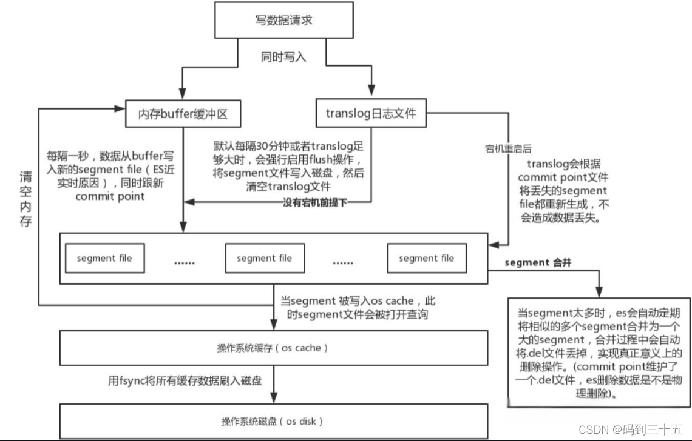

## elasticsearch的特点
最大优势：建立索引快，实时查询快。

## 分片

## 倒排索引

## es 写入的过程

1. 先写入到内存
    * 此时不能被搜索到，但是可以通过文档id获取到文档
    * 如果需要立即被搜索到，需要强制refresh
2. 内存写入到segment，此时可以用来搜索
    * 索引设置的refresh_interval周期性的去refresh
    * 写入文档时强制refresh
    * memory buffer满了，会自动触发refresh

* 缓冲区（Buffer）和事务日志（Translog）

* > 当文档被写入Elasticsearch时，它们首先被放置在内存中的一个缓冲区中。这个缓冲区是临时的，用于快速接收并处理写入请求。
同时，为了确保数据的持久性和可靠性，每一个写入操作也会被记录到事务日志（Translog）中。Translog是一个追加写入的日志文件，它记录了所有对索引的更改。这种机制类似于数据库中的写前日志（WAL）或重做日志（redo log），用于在系统崩溃后恢复数据。

* 刷新（Refresh）操作

* >随着时间的推移，缓冲区中的数据会积累到一定量，此时需要将这些数据刷新（refresh）到Lucene的索引中。刷新操作会创建一个新的Lucene段（segment），并将缓冲区中的数据写入这个段中。
Lucene段是不可变的，一旦被写入就不能被修改，这保证了数据的一致性和搜索的高效性。新的段会被添加到索引中，使得新写入的数据可以被搜索到。
刷新操作是周期性的，可以通过配置来控制刷新的频率。频繁的刷新会提高数据的实时性，但也会增加I/O负担和CPU使用率；而较少的刷新则会减少I/O操作，但可能会降低数据的实时性。

* Flush操作
* >与刷新不同，flush操作会将内存中的数据以及Translog中的更改持久化到磁盘上。这意味着数据被真正写入到了物理存储中，而不仅仅是保存在操作系统的文件系统缓存中。
Flush操作会调用操作系统的fsync函数来确保数据被写入磁盘，并且会清空相关的缓存和文件（如Translog）。这样做可以释放内存空间，并为后续的写入操作做好准备。
Flush操作的频率通常比刷新操作要低得多，因为它涉及到磁盘I/O操作，相对较慢。但是，在Elasticsearch中，flush操作是自动管理的，会根据索引的大小、写入速率和磁盘I/O能力等因素来动态调整。
通过这个底层写入机制，Elasticsearch能够在保证数据可靠性的同时提供高效的搜索和分析功能。缓冲区、事务日志、刷新和flush操作共同协作，确保数据被正确、快速地写入到索引中，并可以被用户查询到。
  
# ES refresh time 设置

# es 深分页

* 传统方式（from&size）

顶部查询，查询10000以内的文档
场景：需要实时获取顶部的部分文档。

eg: 例如查询最新的订单。

    * from&size分页为何会OOM

    协调节点或者客户端节点，需要讲请求发送到所有的分片

    每个分片把from + size个结果，返回给协调节点或者客户端节点‘

    协调节点或者客户端节点进行结果合并，如果有n个分片，则查询数据是 n * (from+size) , 如果from很大的话，会造成oom或者网络资源的浪费。

* Scroll 滚动游标 方式

深度分页，用于非实时查询场景
eg：需要全部文档，例如导出全部数据

* Search After
深度分页，用于实时查询场景

