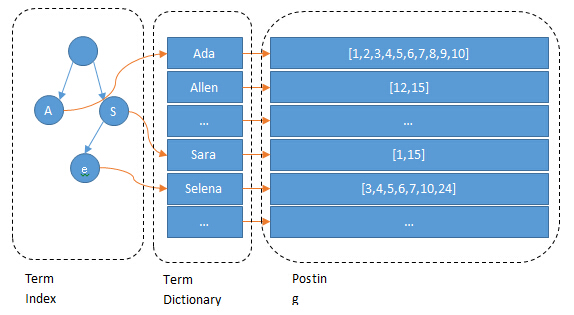

## elasticsearch的特点
最大优势：建立索引快，实时查询快。

## 分片

## 倒排索引

### term index
lucene 的倒排索引，增加了一层字典树 term index，它不存储所有的单词，只存储单词前缀，通过字典书找到单词所在的块，也就是单词的大概位置，再在块里二分查找，找到对应的单词，再找到单词对应的文档列表。

### 对 Posting List 的改进
原生的 Posting List 有两个可以改进的地方：

* 如何压缩以节省磁盘空间
  * 增量编码 

假设有这样一个数组：

> [73, 300, 302, 332, 343, 372]

如何进行压缩呢？

在Lucene里，数据是按照 Segment 存储的，每个 Segment 最多存 65536 个文档 ID， 所以文档 ID 的范围，从 0 到 2^16-1，所以如果不进行任何处理，那么每个元素都会占用 2 bytes ，对应上面的数组，就是 6 * 2 = 12 bytes。

压缩，就是尽可能降低每个数据占用的空间，同时又能让信息不失真，能够还原回来。

增量编码
数据只记录元素与元素之间的增量，于是数组变成了：
> [73, 227, 2, 30, 11, 29]

* 如何快速求并交集
  * 数据量少的时候，用有序的int数组
  * 数据量大了，用bitmap
  * 计算一下临界值，很简单，无论文档数量多少，bitmap 都需要 8192 bytes，而 Integer 数组则和文档数量成线性相关，每个文档 ID 占 2 bytes，所以： 8192 / 2 = 4096 当文档数量少于 4096 时，用 Integer 数组，否则，用 bitmap。

### 为什么 Elasticsearch/Lucene 检索可以比 mysql 快

Mysql 只有 term dictionary 这一层，是以 b-tree 排序的方式存储在磁盘上的。检索一个 term 需要若干次随机 IO 的磁盘操作。而 Lucene 在 term dictionary 的基础上添加了term index来加速检索，term index 以树的形式缓存在内存中。从 term index 查到对应的 term dictionary 的 block 位置之后，再去磁盘上找 term，大大减少了磁盘的 random access （随机IO）次数。

## es 写入的过程

1. 先写入到内存
    * 此时不能被搜索到，但是可以通过文档id获取到文档
    * 如果需要立即被搜索到，需要强制refresh
2. 内存写入到segment，此时可以用来搜索
    * 索引设置的refresh_interval周期性的去refresh
    * 写入文档时强制refresh
    * memory buffer满了，会自动触发refresh

* 缓冲区（Buffer）和事务日志（Translog）

* > 当文档被写入Elasticsearch时，它们首先被放置在内存中的一个缓冲区中。这个缓冲区是临时的，用于快速接收并处理写入请求。
同时，为了确保数据的持久性和可靠性，每一个写入操作也会被记录到事务日志（Translog）中。Translog是一个追加写入的日志文件，它记录了所有对索引的更改。这种机制类似于数据库中的写前日志（WAL）或重做日志（redo log），用于在系统崩溃后恢复数据。

* 刷新（Refresh）操作

* >随着时间的推移，缓冲区中的数据会积累到一定量，此时需要将这些数据刷新（refresh）到Lucene的索引中。刷新操作会创建一个新的Lucene段（segment），并将缓冲区中的数据写入这个段中。
Lucene段是不可变的，一旦被写入就不能被修改，这保证了数据的一致性和搜索的高效性。新的段会被添加到索引中，使得新写入的数据可以被搜索到。
刷新操作是周期性的，可以通过配置来控制刷新的频率。频繁的刷新会提高数据的实时性，但也会增加I/O负担和CPU使用率；而较少的刷新则会减少I/O操作，但可能会降低数据的实时性。

* Flush操作
* >与刷新不同，flush操作会将内存中的数据以及Translog中的更改持久化到磁盘上。这意味着数据被真正写入到了物理存储中，而不仅仅是保存在操作系统的文件系统缓存中。
Flush操作会调用操作系统的fsync函数来确保数据被写入磁盘，并且会清空相关的缓存和文件（如Translog）。这样做可以释放内存空间，并为后续的写入操作做好准备。
Flush操作的频率通常比刷新操作要低得多，因为它涉及到磁盘I/O操作，相对较慢。但是，在Elasticsearch中，flush操作是自动管理的，会根据索引的大小、写入速率和磁盘I/O能力等因素来动态调整。
通过这个底层写入机制，Elasticsearch能够在保证数据可靠性的同时提供高效的搜索和分析功能。缓冲区、事务日志、刷新和flush操作共同协作，确保数据被正确、快速地写入到索引中，并可以被用户查询到。
  
# ES refresh time 设置

# es 深分页

* 传统方式（from&size）

顶部查询，查询10000以内的文档
场景：需要实时获取顶部的部分文档。

eg: 例如查询最新的订单。

    * from&size分页为何会OOM

    协调节点或者客户端节点，需要讲请求发送到所有的分片

    每个分片把from + size个结果，返回给协调节点或者客户端节点‘

    协调节点或者客户端节点进行结果合并，如果有n个分片，则查询数据是 n * (from+size) , 如果from很大的话，会造成oom或者网络资源的浪费。

* Scroll 滚动游标 方式

深度分页，用于非实时查询场景
eg：需要全部文档，例如导出全部数据

* Search After
深度分页，用于实时查询场景

## 数据如何写入es

* 同步双写是最简单的同步方式，能最大程度保证数据同步写入的实时性，最大的问题是代码侵入性太强。

* 异步双写引入了消息中间件，由于MQ都是异步消费模型，所以可能出现数据同步延迟的问题。好处是在大规模消息同步时吞吐量更、高性能更好，便于接入更多的数据源，且各个数据源数据消费写入相互隔离互不影响。
* 基于Mysql表定时扫描同步 ，原理是通过定时器定时扫描表中的增量数据进行数据同步，不会产生代码侵入，但由于是定时扫描同步，所以也会存在数据同步延迟问题，典型实现是采用 Logstash 实现增量同步。
* 基于Binlog实时同步 ，原理是通过监听Mysql的binlog日志进行增量同步数据。不会产生代码侵入，数据同步的实时也能得到保障，弊端是Binlog系统都较为复杂。典型实现是采用 canal 实现数据同步。

## es 查询优化

* 数据预热

> 假如说，哪怕是你就按照上述的方案去做了，es 集群中每个机器写入的数据量还是超过了 filesystem cache 一倍，比如说你写入一台机器 60G 数据，结果 filesystem cache 就 30G，还是有 30G 数据留在了磁盘上。

>其实可以做数据预热。
举个例子，拿微博来说，你可以把一些大V，平时看的人很多的数据，你自己提前后台搞个系统，每隔一会儿，自己的后台系统去搜索一下热数据，刷到 filesystem cache 里去，后面用户实际上来看这个热数据的时候，他们就是直接从内存里搜索了，很快。
或者是电商，你可以将平时查看最多的一些商品，比如说 iphone 8，热数据提前后台搞个程序，每隔 1 分钟自己主动访问一次，刷到 filesystem cache 里去。

> 对于那些你觉得比较热的、经常会有人访问的数据，最好做一个专门的缓存预热子系统，就是对热数据每隔一段时间，就提前访问一下，让数据进入 filesystem cache 里面去。这样下次别人访问的时候，性能一定会好很多。

* 冷热分离

> es 可以做类似于 mysql 的水平拆分，就是说将大量的访问很少、频率很低的数据，单独写一个索引，然后将访问很频繁的热数据单独写一个索引。最好是将冷数据写入一个索引中，然后热数据写入另外一个索引中，这样可以确保热数据在被预热之后，尽量都让他们留在 filesystem os cache 里，别让冷数据给冲刷掉。

> 你看，假设你有 6 台机器，2 个索引，一个放冷数据，一个放热数据，每个索引 3 个 shard。3 台机器放热数据 index，另外 3 台机器放冷数据 index。然后这样的话，你大量的时间是在访问热数据 index，热数据可能就占总数据量的 10%，此时数据量很少，几乎全都保留在 filesystem cache 里面了，就可以确保热数据的访问性能是很高的。但是对于冷数据而言，是在别的 index 里的，跟热数据 index 不在相同的机器上，大家互相之间都没什么联系了。如果有人访问冷数据，可能大量数据是在磁盘上的，此时性能差点，就 10% 的人去访问冷数据，90% 的人在访问热数据，也无所谓了。

* document 模型设计

> 对于 MySQL，我们经常有一些复杂的关联查询。在 es 里该怎么玩儿，es 里面的复杂的关联查询尽量别用，一旦用了性能一般都不太好。

> 最好是先在 Java 系统里就完成关联，将关联好的数据直接写入 es 中。搜索的时候，就不需要利用 es 的搜索语法来完成 join 之类的关联搜索了。

> document 模型设计是非常重要的，很多操作，不要在搜索的时候才想去执行各种复杂的乱七八糟的操作。es 能支持的操作就那么多，不要考虑用 es 做一些它不好操作的事情。如果真的有那种操作，尽量在 document 模型设计的时候，写入的时候就完成。另外对于一些太复杂的操作，比如 join/nested/parent-child 搜索都要尽量避免，性能都很差的。

* 分页性能优化

> es 的分页是较坑的，为啥呢？举个例子吧，假如你每页是 10 条数据，你现在要查询第 100 页，实际上是会把每个 shard 上存储的前 1000 条数据都查到一个协调节点上，如果你有个 5 个 shard，那么就有 5000 条数据，接着协调节点对这 5000 条数据进行一些合并、处理，再获取到最终第 100 页的 10 条数据。  
> 分布式的，你要查第 100 页的 10 条数据，不可能说从 5 个 shard，每个 shard 就查 2 条数据，最后到协调节点合并成 10 条数据吧？你必须得从每个 shard 都查 1000 条数据过来，然后根据你的需求进行排序、筛选等等操作，最后再次分页，拿到里面第 100 页的数据。你翻页的时候，翻的越深，每个 shard 返回的数据就越多，而且协调节点处理的时间越长，非常坑爹。所以用 es 做分页的时候，你会发现越翻到后面，就越是慢。  
> 我们之前也是遇到过这个问题，用 es 作分页，前几页就几十毫秒，翻到 10 页或者几十页的时候，基本上就要 5~10 秒才能查出来一页数据了。

> 不允许深度分页（默认深度分页性能很差）
跟产品经理说，你系统不允许翻那么深的页，默认翻的越深，性能就越差。

> 类似于 app 里的推荐商品不断下拉出来一页一页的
类似于微博中，下拉刷微博，刷出来一页一页的，你可以用 scroll api。  
> scroll 会一次性给你生成所有数据的一个快照，然后每次滑动向后翻页就是通过游标 scroll_id移动，获取下一页下一页这样子，性能会比上面说的那种分页性能要高很多很多，基本上都是毫秒级的。
但是，唯一的一点就是，这个适合于那种类似微博下拉翻页的，不能随意跳到任何一页的场景。也就是说，你不能先进入第 10 页，然后去第 120 页，然后又回到第 58 页，不能随意乱跳页。所以现在很多产品，都是不允许你随意翻页的，app，也有一些网站，做的就是你只能往下拉，一页一页的翻。
初始化时必须指定 scroll 参数，告诉 es 要保存此次搜索的上下文多长时间。你需要确保用户不会持续不断翻页翻几个小时，否则可能因为超时而失败。
除了用 scroll api，你也可以用 search_after 来做，search_after 的思想是使用前一页的结果来帮助检索下一页的数据，显然，这种方式也不允许你随意翻页，你只能一页页往后翻。初始化时，需要使用一个唯一值的字段作为 sort 字段。

 

