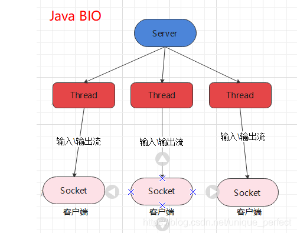

# JAVA I/O模型

## BIO

BIO： 同步并阻塞(传统阻塞型)，服务器实现模式为一个连接一个线程，即客户端有连接请求时服务器端就需要启动一个线程进行处理，如果这个连接不做任何事情会造成不必要的线程开销

## NIO

NIO ： 同步非阻塞，服务器实现模式为一个线程处理多个请求(连接)，即客户端发送的连接请求都会注册到多路复用器上，多路复用器轮询到连接有 I/O 请求就进行处理 

## AIO

ava AIO(NIO.2) ： 异步 异步非阻塞，服务器实现模式为一个有效请求一个线程，客户端的I/O请求都是由OS先完成了再通知服务器应用去启动线程进行处理，一般适用于连接数较多且连接时间较长的应用

# NIO

* NIO 有三大核心部分：Channel( 通道) ，Buffer( 缓冲区), Selector( 选择器)
* Java NIO 的非阻塞模式，使一个线程从某通道发送请求或者读取数据，但是它仅能得到目前可用的数据，如果目前没有数据可用时，就什么都不会获取，而不是保持线程阻塞，所以直至数据变的可以读取之前，该线程可以继续做其他的事情。 非阻塞写也是如此，一个线程请求写入一些数据到某通道，但不需要等待它完全写入，这个线程同时可以去做别的事情。

NIO与BIO比较：
* BIO 以流的方式处理数据,而 NIO 以块的方式处理数据,块 I/O 的效率比流 I/O 高很多
* BIO 是阻塞的，NIO 则是非阻塞的
* BIO 基于字节流和字符流进行操作，而 NIO 基于 Channel(通道)和 Buffer(缓冲区)进行操作，数据总是从通道
读取到缓冲区中，或者从缓冲区写入到通道中。Selector(选择器)用于监听多个通道的事件（比如：连接请求，数据到达等），因此使用单个线程就可以监听多个客户端通道
  
## 三大部件：
1. Buffer缓冲区

缓冲区本质上是一块可以写入数据，然后可以从中读取数据的内存。这块内存被包装成NIO Buffer对象，并提供了一组方法，用来方便的访问该块内存。相比较直接对数组的操作，Buffer API更加容易操作和管理。

2. Channel（通道）

Java NIO的通道类似流，但又有些不同：既可以从通道中读取数据，又可以写数据到通道。但流的（input或output)读写通常是单向的。 通道可以非阻塞读取和写入通道，通道可以支持读取或写入缓冲区，也支持异步地读写。

3. Selector选择器

Selector是 一个Java NIO组件，可以能够检查一个或多个 NIO 通道，并确定哪些通道已经准备好进行读取或写入。这样，一个单独的线程可以管理多个channel，从而管理多个网络连接，提高效率

* 每个 channel 都会对应一个 Buffer
* 一个线程对应Selector ， 一个Selector对应多个 channel(连接)
* 程序切换到哪个 channel 是由事件决定的
* Selector 会根据不同的事件，在各个通道上切换
* Buffer 就是一个内存块 ， 底层是一个数组
* 数据的读取写入是通过 Buffer完成的 , BIO 中要么是输入流，或者是输出流, 不能双向，但是 NIO 的 Buffer 是可以读也可以写。
* Java NIO系统的核心在于：通道(Channel)和缓冲区 (Buffer)。通道表示打开到 IO 设备(例如：文件、 套接字)的连接。若需要使用 NIO 系统，需要获取 用于连接 IO 设备的通道以及用于容纳数据的缓冲 区。然后操作缓冲区，对数据进行处理。简而言之，Channel 负责传输， Buffer 负责存取数据

