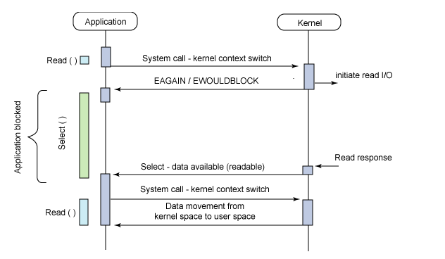
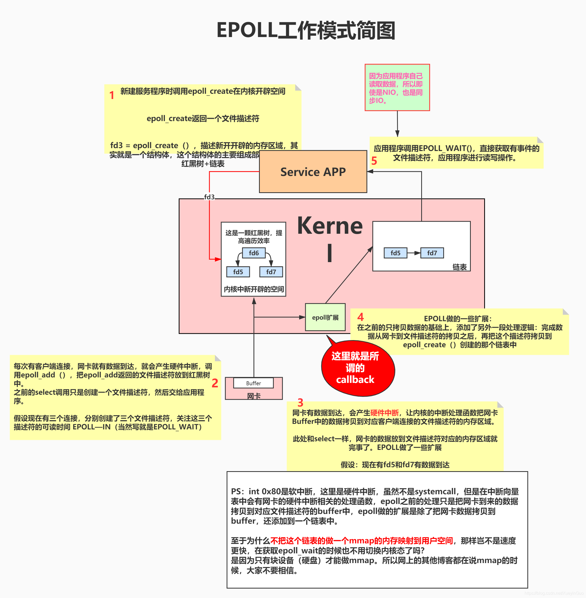

## 阻塞式I/O
应用进程被阻塞，直到数据从内核缓冲区复制到应用进程缓冲区中才返回。

应该注意到，在阻塞的过程中，其它应用进程还可以执行，因此阻塞**不意味着整个操作系统都被阻塞**。因为其它应用进程还可以执行，所以不消耗 CPU 时间，这种模型的 CPU 利用率会比较高。

## 非阻塞式I/O
当用户线程发起一个read操作后，并不需要等待，而是马上就得到了一个结果。如果结果是一个error时，它就知道数据还没有准备好，于是它可以再次发送read操作。一旦内核中的数据准备好了，并且又再次收到了用户线程的请求，那么它马上就将数据拷贝到了用户线程，然后返回。

所以事实上，在非阻塞IO模型中，用户线程需要不断地询问内核数据是否就绪，也就说非阻塞IO不会交出CPU，而会一直占用CPU。

## I/O 复用
I/O 多路复用相当于将「遍历所有文件描述符、通过非阻塞 I/O 查看其是否就绪」的过程从用户线程移到了内核中，由内核来负责轮询。

进程可以通过 select、poll、epoll 发起 I/O 多路复用的系统调用，这些系统调用都是同步阻塞的：如果传入的多个文件描述符中，有描述符就绪，则返回就绪的描述符；否则如果所有文件描述符都未就绪，就阻塞调用进程，直到某个描述符就绪，或者阻塞时长超过设置的 timeout 后，再返回。使用非阻塞 I/O 检查每个描述符的就绪状态。

[I/O多路复用](#1)用的非常的多。Linux下，redis(单线程为什么快)中使用了，Nginx中也用了。（都是epoll模型，没有epoll使用select）

## 信号驱动 I/O
应用进程使用 sigaction 系统调用，内核立即返回，应用进程可以继续执行，也就是说等待数据阶段应用进程是非阻塞的。内核在数据到达时向应用进程发送 SIGIO 信号，应用进程收到之后在信号处理程序中调用 recvfrom 将数据从内核复制到应用进程中。

也就是准备好了通知，而不是轮寻找哪个好了。

## 异步 I/O
应用进程执行 aio_read 系统调用会立即返回，应用进程可以继续执行，不会被阻塞，内核会在所有操作完成之后向应用进程发送信号。

**异步 I/O 与信号驱动 I/O 的区别在于，异步 I/O 的信号是通知应用进程 I/O 完成，而信号驱动 I/O 的信号是通知应用进程可以开始 I/O。**

## 五大IO比较
* 同步 I/O：将数据从内核缓冲区复制到应用进程缓冲区的阶段（第二阶段），应用进程会阻塞。
* 异步 I/O：第二阶段应用进程不会阻塞。

<h1 id="1">I/O复用技术</h1>

select/poll/epoll 都是 I/O 多路复用的具体实现，select 出现的最早，之后是 poll，再是 epoll。

## Select 实现

select函数：
```
int select(int maxnfds,
fd_set *readfds,
fd_set *writefds,
fd_set *errorfds,
struct timeval *timeout);
```

* maxnfds表示读取到第几位，也就是文件描述符的范围
* readfds、writefds、errorfds 是三个文件描述符集合。使用了bitmap的数据结构存储，最大为1024
* timeout 参数表示调用 select 时的阻塞时长。如果所有文件描述符都未就绪，就阻塞调用进程，直到某个描述符就绪，或者阻塞超过设置的 timeout 后，返回。如果 timeout 参数设为 NULL，会无限阻塞直到某个描述符就绪；如果 timeout 参数设为 0，会立即返回，不阻塞。



1. 创建TCP连接，并将 fd 添加到 fd_set 集合中;
2. 将 fd_set 集合从用户态拷贝到内核态;
3. 等待相应事件发生，内核会修改事件集合;
4. 将内核态的 fd_set 集合拷贝到用户态；
5. 应用程序根据发生的事件完成相应的操作。

用户进程通过调用select()函数委托内核监听指定的多个文件描述符，若没有文件描述符有数据，则阻塞。
若有数据，则会调用read()函数读取文件描述符中都缓冲区的数据。

## epoll
epoll相比于select的特点：
* 使用红黑树存储文件描述符集合
* 使用队列存储就绪的文件描述符
* 每个文件描述符只需在添加时传入一次；通过事件更改文件描述符状态

epoll 模型使用三个函数：epoll_create、epoll_ctl 和 epoll_wait。

### epoll_create
```
int epoll_create(int size);
```
epoll_create 会创建一个 epoll 实例，同时返回一个引用该实例的文件描述符。

epoll 实例内部存储：
* 监听列表：所有要监听的文件描述符，使用红黑树
* 就绪列表：所有就绪的文件描述符，使用链表

### epoll_ctl
```
int epoll_ctl(int epfd, int op, int fd, struct epoll_event *event);
```
* epfd 即 epoll_create 返回的文件描述符，指向一个 epoll 实例
* fd 表示要监听的目标文件描述符
* event 表示要监听的事件（可读、可写、发送错误…）
* op 表示要对 fd 执行的操作，

epoll_ctl 会监听文件描述符 fd 上发生的 event 事件。

epoll_ctl 会将文件描述符 fd 添加到 epoll 实例的监听列表里，同时为 fd 设置一个回调函数，并监听事件 event。当 fd 上发生相应事件时，会调用回调函数，将 fd 添加到 epoll 实例的就绪队列上。



在调用epoll_create的时候，在内核会创建一个红黑树来存储epoll_ctl()传来的文件描述符，并建立一个双向链表存储时间发生的文件描述符。
当调用epoll_wait的时候，只需要观察双向链表中有没有数据，有数据就返回，没数据就阻塞。

## epoll优点
对于“文件描述符数量少”，select 使用整型数组存储文件描述符集合，而 epoll 使用红黑树存储，数量较大。

对于“性能开销大”，epoll_ctl 中为每个文件描述符指定了回调函数，并在就绪时将其加入到就绪列表，因此 epoll 不需要像 select 那样遍历检测每个文件描述符，只需要判断就绪列表是否为空即可。这样，在没有描述符就绪时，epoll 能更早地让出系统资源。

此外，每次调用 select 时都需要向内核拷贝所有要监听的描述符集合，而 epoll 对于每个描述符，只需要在 epoll_ctl 传递一次，之后 epoll_wait 不需要再次传递。这也大大提高了效率。

## 水平触发边缘触发
select 只支持水平触发，epoll 支持水平触发和边缘触发。

* 水平触发（LT，Level Trigger）：当文件描述符就绪时，会触发通知，如果用户程序没有一次性把数据读/写完，下次还会发出可读/可写信号进行通知。

* 边缘触发（ET，Edge Trigger）：仅当描述符从未就绪变为就绪时，通知一次，之后不会再通知。

区别：边缘触发效率更高，减少了事件被重复触发的次数，函数不会返回大量用户程序可能不需要的文件描述符。

PS：为什么边缘触发必须使用非阻塞 I/O？
* 在 epoll 的边缘触发模式下，只会在文件描述符的可读/可写状态发生切换时，才会收到操作系统的通知
* 边缘触发模式需要循环读/写一个文件描述符的所有数据。如果使用阻塞 I/O，那么一定会在最后一次调用（没有数据可读/写）时阻塞，导致无法正常结束


