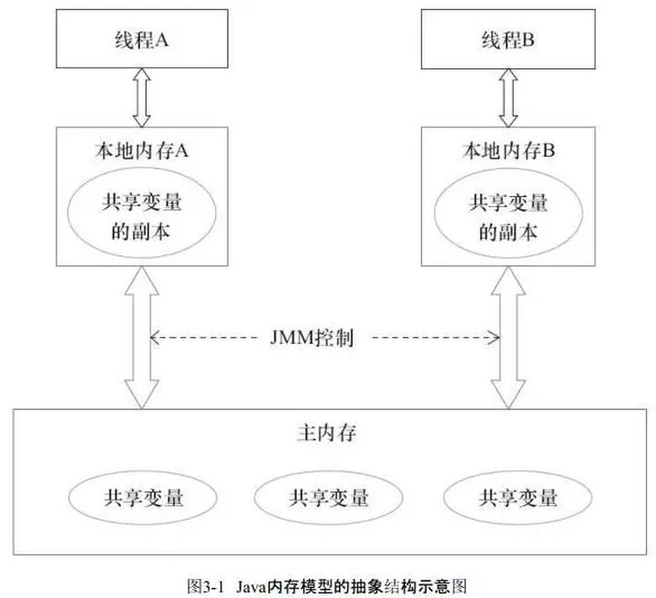
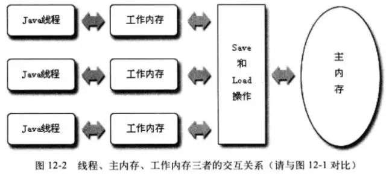
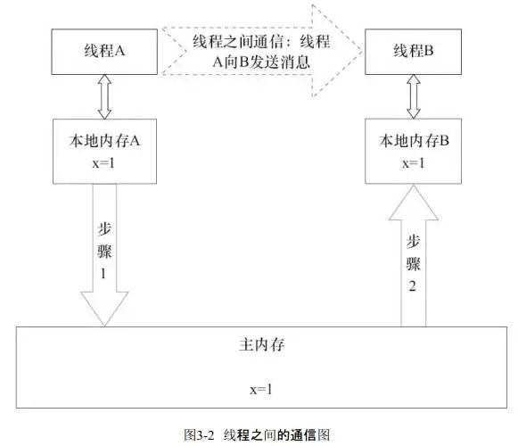

## JMM内存模型

从抽象的角度来看，JMM定义了线程和主内存之间的抽象关系：

* 线程之间的共享变量存储在主内存（Main Memory）中
  
* 每个线程都有一个私有的本地内存（Local Memory），本地内存是JMM的一个抽象概念，并不真实存在，它涵盖了缓存、写缓冲区、寄存器以及其他的硬件和编译器优化。本地内存中存储了该线程以读/写共享变量的拷贝副本。

* 从更低的层次来说，主内存就是硬件的内存，而为了获取更好的运行速度，虚拟机及硬件系统可能会让工作内存优先存储于寄存器和高速缓存中。

* Java内存模型中的线程的工作内存（working memory）是cpu的寄存器和高速缓存的抽象描述。而JVM的静态内存储模型（JVM内存模型）只是一种对内存的物理划分而已，它只局限在内存，而且只局限在JVM的内存。

### JMM模型下的线程间通信：
线程间通信必须要经过主内存。

如下，如果线程A与线程B之间要通信的话，必须要经历下面2个步骤：

1. 线程A把本地内存A中更新过的共享变量刷新到主内存中去。

2. 线程B到主内存中去读取线程A之前已更新过的共享变量。

