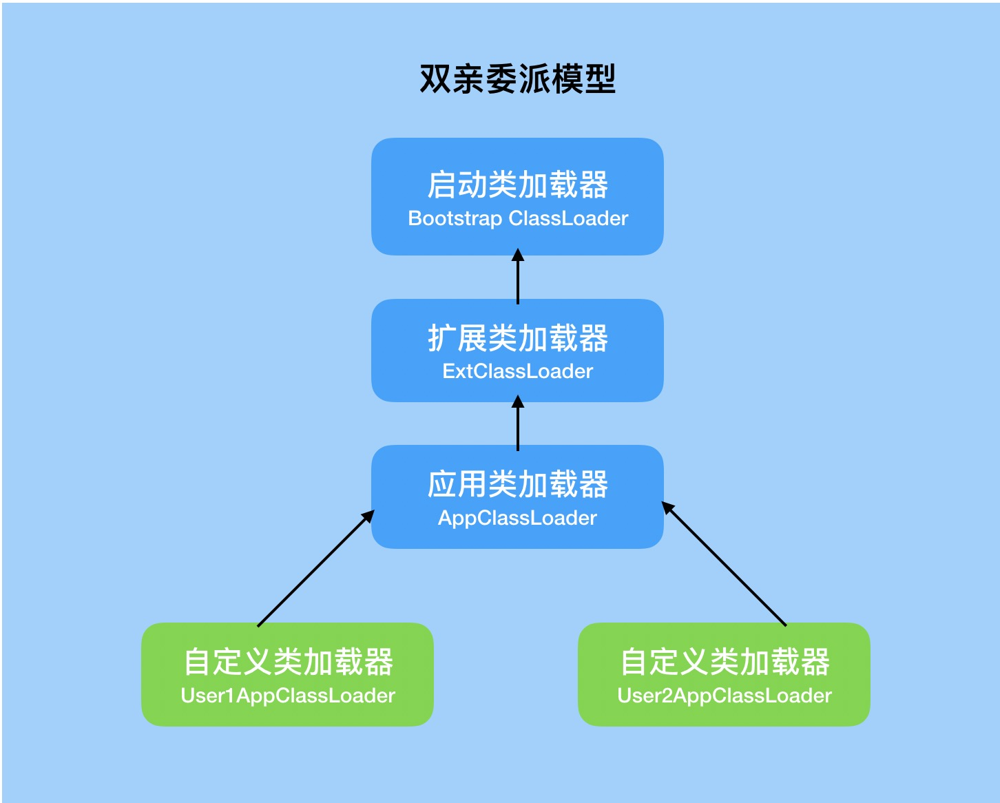
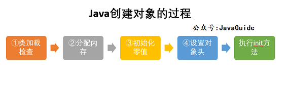

# 类加载器
在JVM中有三类ClassLoader构成：
* 启动类（或根类）加载器（Bootstrap ClassLoader）
* 扩展类加载器（ExtClassLoader）
* 应用类加载器（AppClassLoader）

不同的类加载器负责不同区域的类的加载。

## 双亲委派机制

双亲委派机制的目的是为了保证Java核心库的类型安全。     
所有Java应用都至少需要引用java.lang.Object类，在运行时这个类需要被加载到Java虚拟机中。如果该加载过程由自定义类加载器来完成，可能就会存在多个版本的java.lang.Object类，而且这些类之间是不兼容的。
通过双亲委派模型，对于Java核心库的类的加载工作由启动类加载器来统一完成，保证了Java应用所使用的都是同一个版本的Java核心库的类，是互相兼容的。

**一个类加载器首先将类加载请求转发到父类加载器，只有当父类加载器无法完成时才尝试自己加载。**

具体步骤：        
1.类加载器收到类加载的请求。     
2.将这个请求向上委托给父类加载器去完成，一直向上委托直到**启动类加载器**     
3.启动加载器检查是否可以加载当前类，能就加载，使用当前加载器。不能，抛出异常，交给子类加载器去实现。

面试问题:
- 为什么需要双亲委派机制?（也就是双亲委派的优点）
    * 双亲委派机制使得类加载出现层级，父类加载器加载过的类，子类加载器不会重复加载，可以**防止类重复加载**；
    * 使得类的加载出现优先级，**防止了核心API被篡改**，提升了安全，所以越基础的类就会越上层进行加载，反而一般自己的写的类，就会在应用程序加载器（Application）直接加载。
- 如何打破双亲委派？
    * 自定义类加载器，重写loadClass方法
        * java.lang.ClassLoader 的 loadClass() 实现了双亲委派模型的逻辑，自定义类加载器一般不去重写它，但是需要重写 findClass() 方法。
    * 使用线程上下文类加载器
        * 当高层提供了统一接口让低层去实现，同时又要是在高层加载（或实例化）低层的类时，必须通过线程上下文类加载器来帮助高层的ClassLoader找到并加载该类。
        * 当使用本类托管类加载，然而加载本类的ClassLoader未知时，为了隔离不同的调用者，可以取调用者各自的线程上下文类加载器代为托管。

## 为什么要打破双亲委派机制
举个例子 有个类 Artisan

我们希望通过自定义加载器 直接从某个路径下读取Artisan.class . 而不是说 通过自定义加载器 委托给 AppClassLoader ------> ExtClassLoader ----> BootClassLoader 这么走一遍，都没有的话，才让自定义加载器去加载 Artisan.class . 这么一来 还是 双亲委派。

我们期望的是 Artisan.class 及时在 AppClassLoader 中存在，也不要从AppClassLoader 去加载。

说白了，就是 直接让自定义加载器去直接加载Artisan.class 而不让它取委托父加载器去加载，不要去走双亲委派那一套。提高加载效率。

## tomcat的类加载及他如何打破双亲委派机制

# 沙箱安全机制
不做重点。       
Java安全模型的核心就是Java沙箱（sandbox）
* 沙箱是一个限制程序运行的环境。沙箱机制就是将 Java 代码限定在虚拟机(JVM)特定的运行范围中，并且严格限制代码对本地系统资源访问，通过这样的措施来保证对代码的有效隔离，防止对本地系统造成破坏。沙箱主要限制系统资源访问，那系统资源包括什么？——CPU、内存、文件系统、网络。不同级别的沙箱对这些资源访问的限制也可以不一样。

所有的Java程序运行都可以指定沙箱，可以定制安全策略。

组成沙箱的基本组件：

* 字节检验码
* 类加载器 ：**使用双亲委派机制**。
* 存取控制器（access controller）
* 安全管理器（security manager）
* 安全软件包（security package）

# Native关键字
Java在内存区域中专门开辟了一块标记区域——本地方法栈，用来登记native方法，凡是带了native关键字的，会进入到本地方法栈中，调用本地方法接口（JNI），在最终执行的时候，加载本地方法库中的方法通过JNI
* 凡是带了native关键字的，就说明Java的作用范围达不到了，会去调用底层C语言的库
* JNI的作用：扩展Java的使用，融合不同的编程语言为Java所用，不过最初是想融合C，C++的，因为Java诞生的时候，C，C++横行，想要立足的话就要有能调用C的程序
* 本地方法栈：具体做法是，在Native Method Stack中登记native方法，在执行引擎执行的时候加载Native Libraies【本地库】

# 三种jvm
* Sun公司 HotSpot
* BEA JRockit 最快的JVM
* IBM J9VM 出色的垃圾回收机制，可以运行在小平台（嵌入式）

我们学习和使用的都是**HotSpot**

HotSpot对象创建的流程：

