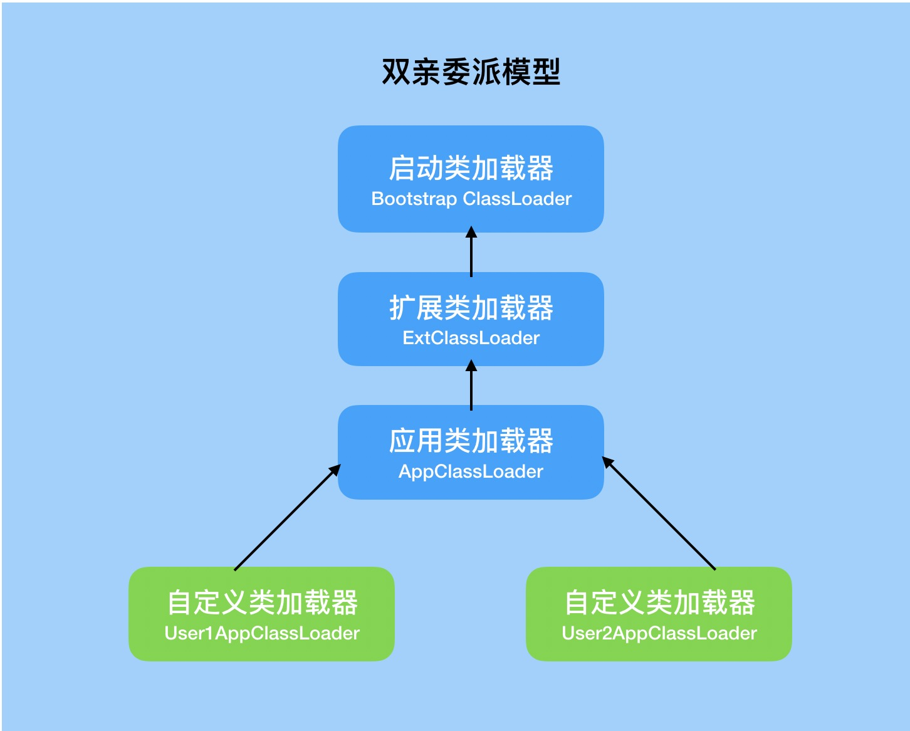
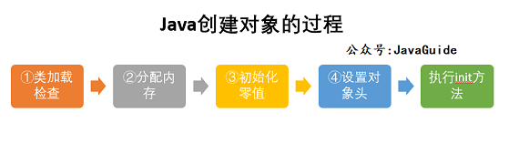
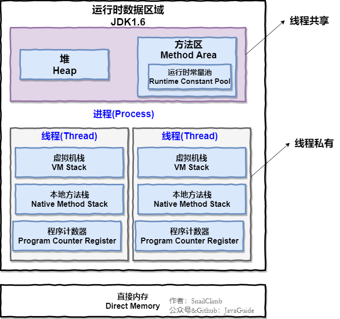
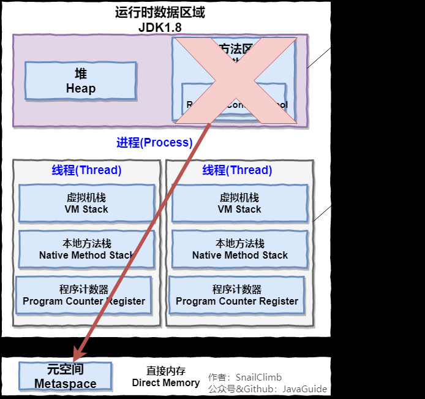
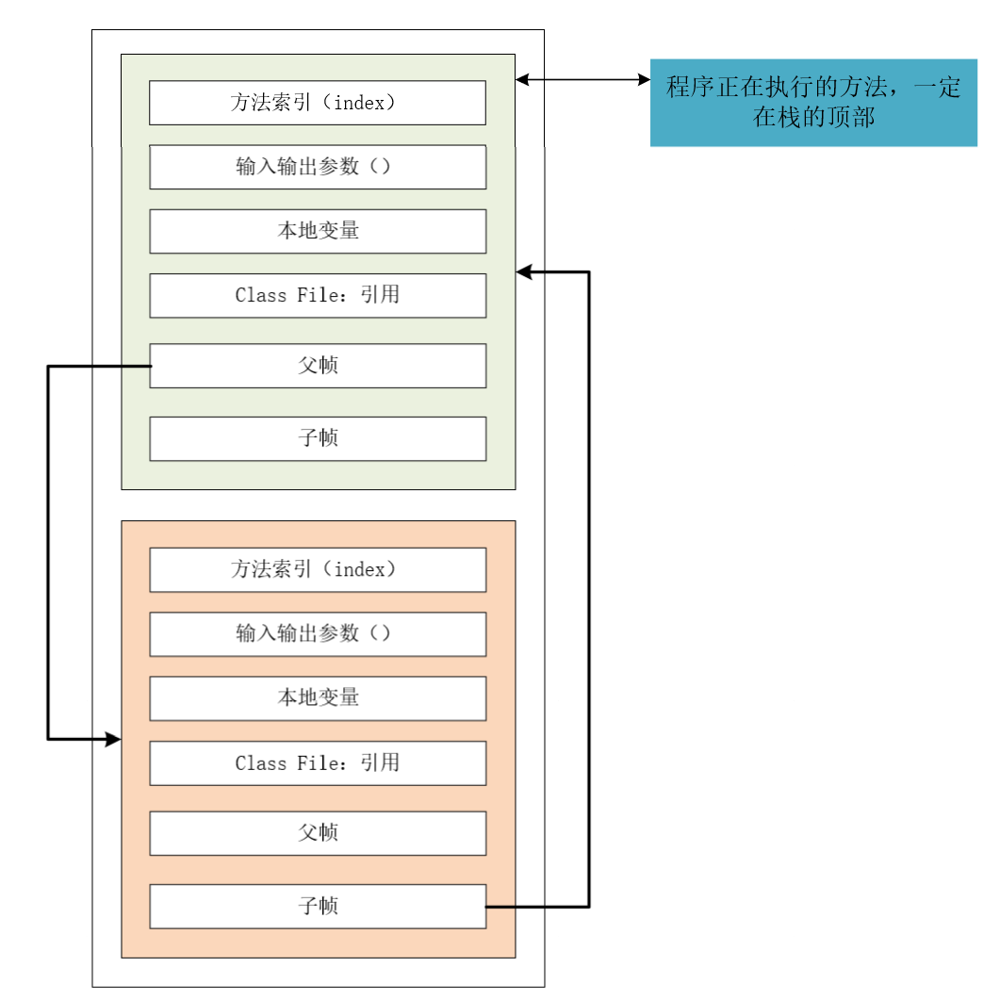
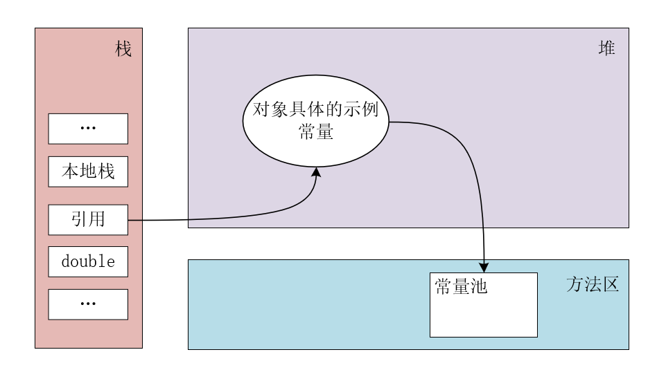
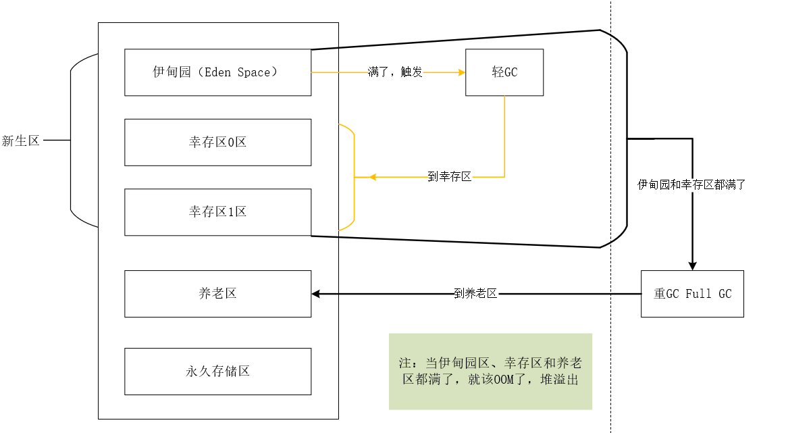
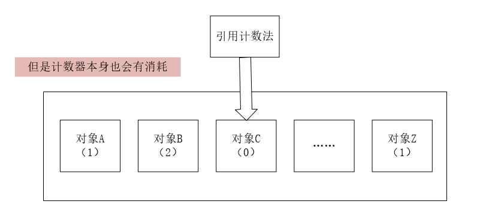

# 类加载器
在JVM中有三类ClassLoader构成：
* 启动类（或根类）加载器（Bootstrap ClassLoader）
* 扩展类加载器（ExtClassLoader） 
* 应用类加载器（AppClassLoader）       

不同的类加载器负责不同区域的类的加载。

## 双亲委派机制

双亲委派机制的目的是为了保证Java核心库的类型安全。     
所有Java应用都至少需要引用java.lang.Object类，在运行时这个类需要被加载到Java虚拟机中。如果该加载过程由自定义类加载器来完成，可能就会存在多个版本的java.lang.Object类，而且这些类之间是不兼容的。
通过双亲委派模型，对于Java核心库的类的加载工作由启动类加载器来统一完成，保证了Java应用所使用的都是同一个版本的Java核心库的类，是互相兼容的。        
具体步骤：        
1.类加载器收到类加载的请求。     
2.将这个请求向上委托给父类加载器去完成，一直向上委托直到**启动类加载器**     
3.启动加载器检查是否可以加载当前类，能就加载，使用当前加载器。不能，抛出异常，交给子类加载器去实现。     

面试问题:
- 为什么需要双亲委派机制?（也就是双亲委派的优点）
  * 双亲委派机制使得类加载出现层级，父类加载器加载过的类，子类加载器不会重复加载，可以**防止类重复加载**；
  * 使得类的加载出现优先级，**防止了核心API被篡改**，提升了安全，所以越基础的类就会越上层进行加载，反而一般自己的写的类，就会在应用程序加载器（Application）直接加载。
- 如何打破双亲委派？
  * 自定义类加载器，重写loadClass方法
  * 使用线程上下文类加载器

# 沙箱安全机制
不做重点。       
Java安全模型的核心就是Java沙箱（sandbox）        
* 沙箱是一个限制程序运行的环境。沙箱机制就是将 Java 代码限定在虚拟机(JVM)特定的运行范围中，并且严格限制代码对本地系统资源访问，通过这样的措施来保证对代码的有效隔离，防止对本地系统造成破坏。沙箱主要限制系统资源访问，那系统资源包括什么？——CPU、内存、文件系统、网络。不同级别的沙箱对这些资源访问的限制也可以不一样。

所有的Java程序运行都可以指定沙箱，可以定制安全策略。

组成沙箱的基本组件：      

* 字节检验码
* 类加载器 ：**使用双亲委派机制**。
* 存取控制器（access controller）
* 安全管理器（security manager）
* 安全软件包（security package）

# Native关键字
Java在内存区域中专门开辟了一块标记区域——本地方法栈，用来登记native方法，凡是带了native关键字的，会进入到本地方法栈中，调用本地方法接口（JNI），在最终执行的时候，加载本地方法库中的方法通过JNI     
* 凡是带了native关键字的，就说明Java的作用范围达不到了，会去调用底层C语言的库
* JNI的作用：扩展Java的使用，融合不同的编程语言为Java所用，不过最初是想融合C，C++的，因为Java诞生的时候，C，C++横行，想要立足的话就要有能调用C的程序
* 本地方法栈：具体做法是，在Native Method Stack中登记native方法，在执行引擎执行的时候加载Native Libraies【本地库】

# 三种jvm
* Sun公司 HotSpot
* BEA JRockit 最快的JVM
* IBM J9VM 出色的垃圾回收机制，可以运行在小平台（嵌入式）

我们学习和使用的都是**HotSpot**

HotSpot对象创建的流程：

# java内存

## PC寄存器
每个线程都有一个程序计数器， 是线程私有的，就是一个指针， 指向方法区中的方法字节码(用来存储指向像一条指令的地址， 也即将要执行的指令代码)，在执行引擎读取下一条指令, 是一个非常小的内存空间，几乎可以忽略不计      

## 方法区
* 方法区是被所有线程共享，所有字段和方法字节码，以及一些特殊方法，如构造函数，接口代码也在此定义，简单说，所有定义的方法的信息都保存在该区域，此区域属于共享区间；
* **静态变量、常量、类信息(构造方法、接口定义)、运行时的常量池**存在方法区中，但是实例变量存在堆内存中，和方法区无关。
* 常量池jdk1.7之前在方法区，1.8移动到了堆中

## 栈 
栈中存放 ： 8大基本类型 + 对象的引用 + 实例的方法
* 栈内存，主管程序的运行，生命周期和线程同步；
* 线程结束，栈内存也就释放了，对于栈来说**不存在垃圾回收问题**，一旦线程结束，栈就Over了
* 程序开始时，main函数先进栈，最后出栈。所以执行的时候main方法先执行最后结束。

栈帧运行图：

java中没执行的一个方法都会产生栈帧。        
每个入栈的方法会保存一些地址，包括子帧父帧。先入栈的就会去找子帧，子帧结束会回到父帧。         

栈到堆得关系：

* jdk1.7之后，常量池从方法区移到了堆中
创建一个class类，先压入栈中，从栈中依着地址找到堆中的位置，实例化在堆中。     

## 堆
类加载器读取了类文件后，一般把 **类，方法，常量，变量**，保存我们所有引用类型的真实对象放在堆中。

堆内存中还要细分为三个区域：
* 新生区（伊甸园区）young/new
  * 类诞生和成长的地方，甚至死亡  
  * 包含伊甸园区，两个幸存者区（from区 和 to区 ， 谁空谁是 to区）  
* 养老区 old
  * 新生区没干掉，没杀死的来到了养老区
* 永久区 perm
  * 这个区域是常驻内存的。用来存放JDK自身携带的Class对象，Interface元数据，存储的是Java运行时的一些环境或类信息，这个区域不存在垃圾回收！当关闭VM虚拟机就会释放这个区域的内存。
  * jdk1.6 之前：永久代，常量池是在方法区中；
  * jdk1.7 ：永久代，但是慢慢退化了，去永久代，**常量池在堆中**
  * jdk1.8 之后：**无永久代**，常量池在**元空间**。
  * 一个启动类加载了大量的第三方jar包；Tomcat部署了太多的应用；大量动态生成的反射类等 不断的被加载，直到内存满，就会出现OOM(堆溢出)。

    
## Q：为什么要将永久代 (PermGen) 替换为元空间 (MetaSpace) 呢?

* 整个永久代有一个 JVM 本身设置固定大小上限，无法进行调整，而元空间使用的是直接内存，受本机可用内存的限制，虽然元空间仍旧可能溢出，但是比原来出现的几率会更小。     

* 元空间里面存放的是类的元数据，这样加载多少类的元数据就不由 MaxPermSize 控制了, 而由系统的实际可用空间来控制，这样能加载的类就更多了。

OOM（堆溢出）之后的处理方法：
* 尝试扩大堆内存去查看内存结果
* 若不行，分析内存，看一下是哪个地方出现了问题（专业工具）（一行行dubug分析不现实）
  * 能够看到代码第几行出错：**内存快照**分析工具，MAT（eclipse），Jprofiler 
    
MAT，Jprofiler作用：    
* 分析Dump内存文件，快速定位内存泄漏
* 获得堆中的数据
* 获得大的对象

## 补充    
* 方法区和堆**线程共享**！
* 栈和PC寄存器**线程不共享**！ 
  
-Xms 设置初始化内存分配大小，默认1/64

-Xmx 设置最大分配内存，默认1/4

-XX:+PrintGCDetails 打印GC垃圾回收信息

-XX:+HeapDumpOnOutOfMemoryError 生成oomDump文件

-Xms1m -Xmx8m -XX:+HeapDumpOnOutOfMemoryError

-Xms1024m -Xmx1024m -XX:+PrintGCDetails

# GC（垃圾回收）

GC作用于方法区与堆

## 引用计数法

* 谁引用次数为0就清除。
* 低效，且计数器本身消耗内存，jvm中基本不使用。

## 复制算法
* 每次GC都会将伊甸园区活的对象移到幸存者区。伊甸园区gc后是空的
* 幸存者区会将活的对象从from区复制到to区，此时from区变空，变为to区，to区变为from区。保证一个空的to区。
* 一个对象经历了多次gc（默认为15次）仍然没有死，就会进入养老区。（-XX -MaxTenuringThreshold = 5 通过这个参数设置多少次进人老年区）
* 好处：没有内存的碎片
* 坏处：浪费了内存空间，多了一半空间永远是空to

## 标记清除算法

* **标记清除算法**：图片中前两步，找到没有标记的对象，清除。
* 如何标记 : **可达性分析算法**  
  * 缺点：两次扫描，严重浪费时间，会产生内存碎片
  * 优点：不需要额外的空间
    
* **标记清除压缩** ：标记清除后再加压缩的步骤。
  * 防止了内存碎片，但是又加了时间成本。