# jVM内存模型
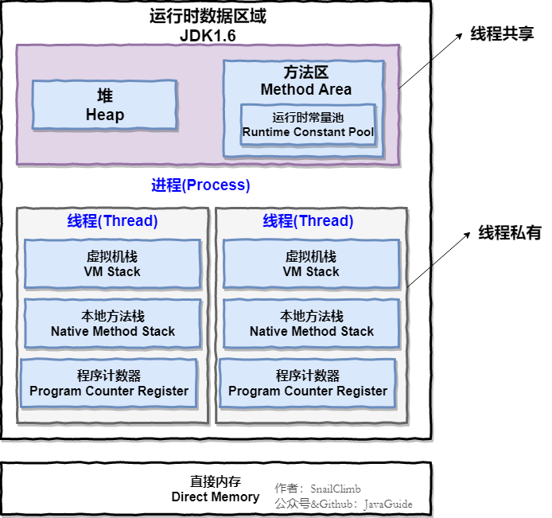

JVM 内存共分为
1. 虚拟机栈
2. 本地方法栈
3. 堆
4. 方法区
5. 程序计数器

JVM1.8的模型

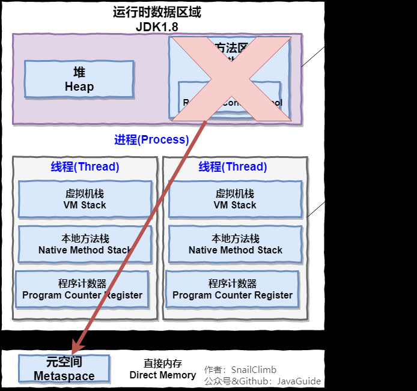

## PC寄存器
每个线程都有一个程序计数器， 是线程私有的，就是一个指针， 指向方法区中的方法字节码(用来存储指向像一条指令的地址， 也即将要执行的指令代码)，在执行引擎读取下一条指令, 是一个非常小的内存空间，几乎可以忽略不计      

### Q：程序计数器为什么是私有的?
程序计数器私有主要是为了线程切换后能恢复到正确的执行位置。

### Q：虚拟机栈和本地方法栈为什么是私有的?
为了保证线程中的局部变量不被别的线程访问到，虚拟机栈和本地方法栈是线程私有的。

## 方法区
用于存放已被加载的类信息、常量、静态变量、即时编译器编译后的代码等数据。

和堆一样不需要连续的内存，并且可以动态扩展，动态扩展失败一样会抛出 OutOfMemoryError 异常。

对这块区域进行垃圾回收的主要目标是对常量池的回收和对类的卸载，但是一般比较难实现。

HotSpot 虚拟机把它当成永久代来进行垃圾回收。但很难确定永久代的大小，因为它受到很多因素影响，并且每次 Full GC 之后永久代的大小都会改变，所以经常会抛出 OutOfMemoryError 异常。为了更容易管理方法区，从 JDK 1.8 开始，移除永久代，并把方法区移至元空间，它位于本地内存中，而不是虚拟机内存中。

方法区是一个 JVM 规范，永久代与元空间都是其一种实现方式。在 JDK 1.8 之后，原来永久代的数据被分到了堆和元空间中。元空间存储类的元信息，静态变量和常量池等放入堆中。

## JAVA虚拟机栈 
栈中存放 ： 8大基本类型 + 对象的引用 + 实例的方法
* 栈内存，主管程序的运行，生命周期和线程同步；
* 线程结束，栈内存也就释放了，对于栈来说**不存在垃圾回收问题**，一旦线程结束，栈就Over了
* 程序开始时，main函数先进栈，最后出栈。所以执行的时候main方法先执行最后结束。

栈帧运行图：

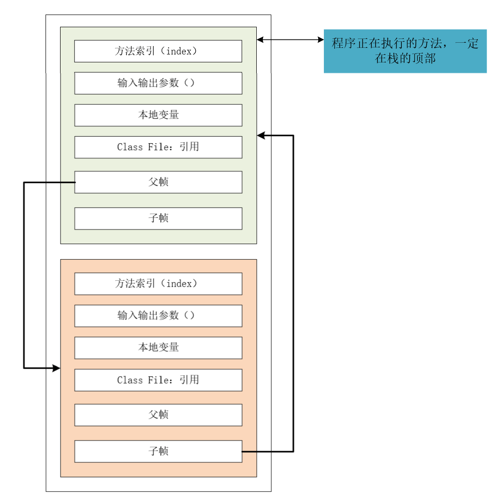

java中每执行的一个方法都会产生栈帧。        
每个入栈的方法会保存一些地址，包括子帧父帧。先入栈的就会去找子帧，子帧结束会回到父帧。

栈到堆得关系：
栈中的引用找到堆中的位置，实例化在堆中。

创建一个class类，先压入栈中，从栈中依着地址找到堆中的位置，实例化在堆中。     

## 堆
类加载器读取了类文件后，一般把 **类，方法，常量，变量**，保存我们所有引用类型的真实对象放在堆中。

堆内存中还要细分为三个区域：
* 新生代young/new
  * 类诞生和成长的地方，甚至死亡  
  * 包含伊甸园区，两个幸存者区（from区 和 to区 ， 谁空谁是 to区）  
* 老年代 old
  * 新生区没干掉，没杀死的来到了养老区
* 永久区 perm
  * 这个区域是常驻内存的。用来存放JDK自身携带的Class对象，Interface元数据，存储的是Java运行时的一些环境或类信息，这个区域不存在垃圾回收！当关闭VM虚拟机就会释放这个区域的内存。
  * jdk1.6 之前：永久代，常量池是在方法区中；
  * jdk1.7 ：永久代，但是慢慢退化了，去永久代，**常量池在堆中**
  * jdk1.8 之后：**无永久代**，常量池在堆中
  * 一个启动类加载了大量的第三方jar包；Tomcat部署了太多的应用；大量动态生成的反射类等 不断的被加载，直到内存满，就会出现OOM(堆溢出)。
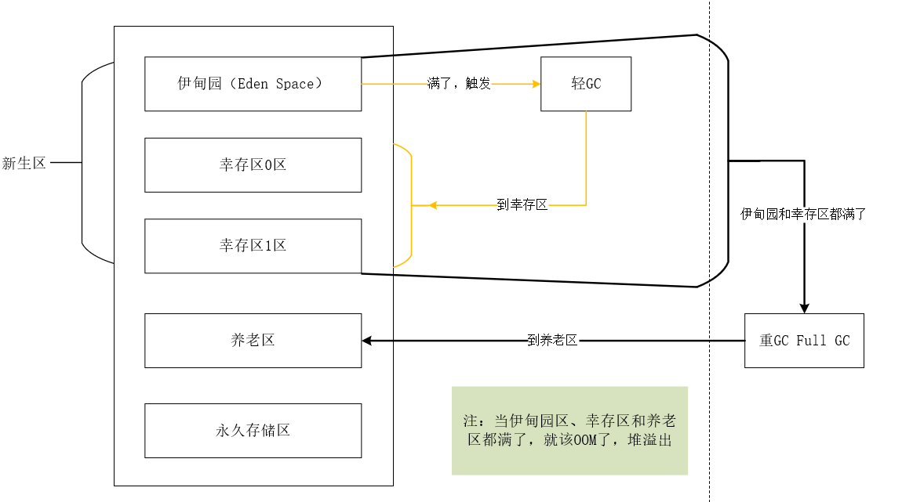
    
## Q：为什么要将永久代 (PermGen) 替换为元空间 (MetaSpace) 呢?

* 整个永久代有一个 JVM 本身设置固定大小上限，无法进行调整，而元空间使用的是直接内存，受本机可用内存的限制，虽然元空间仍旧可能溢出，但是比原来出现的几率会更小。     

* 元空间里面存放的是类的元数据，这样加载多少类的元数据就不由 MaxPermSize 控制了, 而由系统的实际可用空间来控制，这样能加载的类就更多了。

OOM（堆溢出）之后的处理方法：
* 尝试扩大堆内存去查看内存结果
* 若不行，分析内存，看一下是哪个地方出现了问题（专业工具）（一行行dubug分析不现实）
  * 能够看到代码第几行出错：**内存快照**分析工具，MAT（eclipse），Jprofiler 
    
MAT，Jprofiler作用：    
* 分析Dump内存文件，快速定位内存泄漏
* 获得堆中的数据
* 获得大的对象

## 补充    
* 方法区和堆**线程共享**！
* 栈和PC寄存器**线程不共享**！ 

## JVM优化
1. 监控安全点看看JVM到底发生了什么？
在JVM启动参数的GC参数里，多加一句:
> -XX:+PrintGCApplicationStoppedTime

它就会把全部的JVM停顿时间（不只是GC），打印在GC日志里。

2. 将新对象预留在新生代

由于 Full GC 的成本要远远高于 Minor GC ，因此尽可能将对象分配在新生代，在JVM 调优中，可以为应用程序分配一个合理的新生代空间，以最大限度避免新对象直接进去老年代。

| 空间                          | 命令行选项                      |占用倍数                     |
| ---------------------------- | -------------------------------|-----------------------------|
| java堆                        | -Xms和-Xmn 设置堆的最大和初始值       |3~4倍FULL GC后老年代空间占用量 |
| 元空间                        | -XX:MaxMetaspaceSize=10M       |元空间大小 |
| 新生代                        | -Xmn                            |1~1.5倍Full GC后老年代空间占用 |
| 老年代                       | JAVA堆减去新生代大小             |2~3倍FULL GC后老年代空间占用量 |

3. 调整垃圾回收策略 
   
> -XX：+UseParallelGC（新生代使用并行回收收集器）

> -XX：ParallelGCThreads=20（垃圾回收的线程数）

> -XX：+UseParallelOldGC （老年代使用并行回收收集器）

# GC（垃圾回收）

GC作用于方法区与堆

## 标记-清除算法

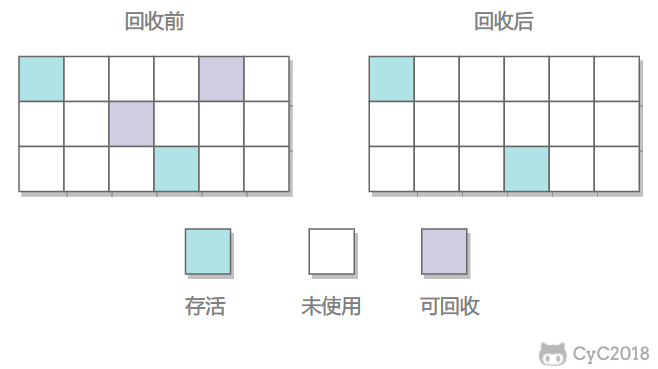

在标记阶段，程序会检查每个对象是否为活动对象，如果是活动对象，则程序会在对象头部打上标记。

在清除阶段，会进行对象回收并取消标志位，另外，还会判断回收后的分块与前一个空闲分块是否连续，若连续，会合并这两个分块。

回收对象就是把对象作为分块，连接到被称为 “空闲链表” 的单向链表，之后进行分配时只需要遍历这个空闲链表，就可以找到分块。

在分配时，程序会搜索空闲链表寻找空间大于等于新对象大小 size 的块 block。如果它找到的块等于 size，会直接返回这个分块；如果找到的块大于 size，会将块分割成大小为 size 与 (block - size) 的两部分，返回大小为 size 的分块，并把大小为 (block - size) 的块返回给空闲链表。

不足：

* 标记和清除过程效率都不高；
* 会产生大量不连续的内存碎片，导致无法给大对象分配内存

## 标记-整理算法
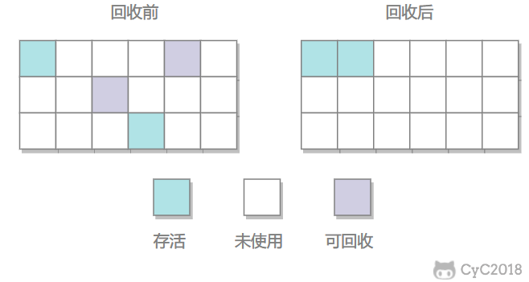

让所有存活的对象都向一端移动，然后直接清理掉端边界以外的内存。

优点:
* 不会产生内存碎片

不足:
* 需要移动大量对象，处理效率比较低
    
## 复制算法
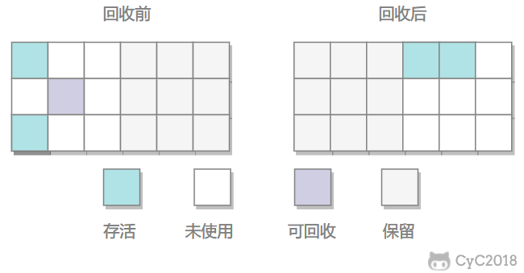

* 每次GC都会将伊甸园区活的对象移到幸存者区。伊甸园区gc后是空的
* 幸存者区会将活的对象从from区复制到to区，此时from区变空，变为to区，to区变为from区。保证一个空的to区。
* 一个对象经历了多次gc（默认为15次）仍然没有死，就会进入养老区。（-XX -MaxTenuringThreshold = 5 通过这个参数设置多少次进人老年区）
* 好处：没有内存的碎片
* 坏处：浪费了内存空间，多了一半空间永远是空.

现在的商业虚拟机都采用这种收集算法回收新生代，但是并不是划分为大小相等的两块，而是一块较大的 Eden 空间和两块较小的 Survivor 空间，每次使用 Eden 和其中一块 Survivor。在回收时，将 Eden 和 Survivor 中还存活着的对象全部复制到另一块 Survivor 上，最后清理 Eden 和使用过的那一块 Survivor。

HotSpot 虚拟机的 Eden 和 Survivor(from和to) 大小比例默认为 8:1，保证了内存的利用率达到 90%。如果每次回收有多于 10% 的对象存活，那么一块 Survivor 就不够用了，此时需要依赖于老年代进行空间分配担保，也就是借用老年代的空间存储放不下的对象。

## 如何判断是不是垃圾需要回收
1. 引用计数法

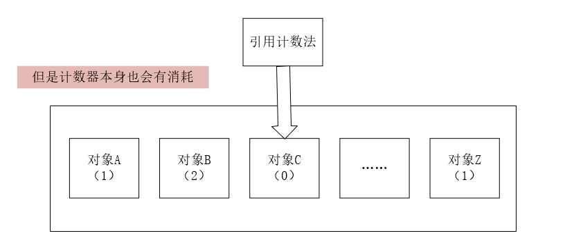

* 谁引用次数为0就清除
* 会出现相互引用不清楚的问题
* 低效，且计数器本身消耗内存，jvm中基本不使用。

2. 可达性分析算法 
   
通过一系列的‘’GC Roots‘’对象作为起点进行搜索，如果在‘’GC Roots‘’和对象之间没有可达的路径(引用链)，则称该对象是不可达的，被判定不可达的对象不一定会成为可回收对象。被判定不可达的对象至少要经历两次标记过程，如果在这两次标记过程中扔没有逃脱成为可回收对象的可能性，则基本就成为可回收的对象了。

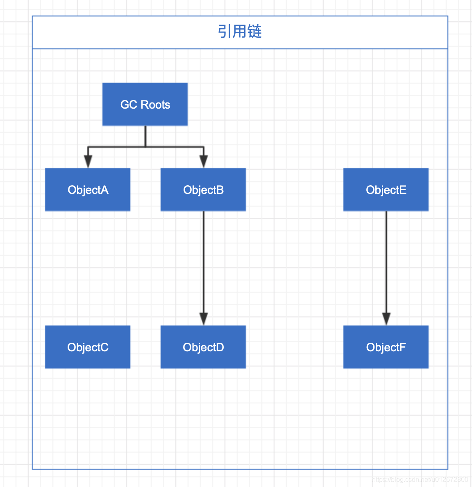

GC Roots 对象（4个）：
* 虚拟机栈（栈帧中的本地变量）中引用的对象。虚拟机栈中的引用的对象，我们在程序中正常创建一个对象会在堆上开辟一块空间，同时会将这块空间的地址作为引用保存在虚拟机的栈中，如果对象的生命周期结束了，那么引用就回从虚拟机栈中出栈，因此如果在虚拟机占中存在引用，就说明这个对象还在被使用。
* 方法区中类静态属性引用的对象。由于在虚拟机栈是线程私有的，全局静态对象会保存在方法区中。
* 方法区中常量引用的对象。**final关键字修饰**
* 本地方法栈中（Native方法）引用的对象。Java调用C++或C代码，会使用native方法，JVM中会有一块本地方法栈，用于保存这些对象的引用。

即使在可达性分析算法中对象到GC Roots 的应用链不可达，也并非是”非死不可“，这些对象暂时处于”缓刑“阶段，要真正的宣告一个对象死亡，至少要要经历再次标记过程。

* 第一次标记并进行筛选。条件：此对象是否有必要执行finalize()方法，当对象没有覆盖finalize()方法，或者finalize(）方法被虚拟机调用过，虚拟机将这两种情况都视为”没有必要执行“，对象被虚拟机回收。
* 第二次标记。如果该对象被判定为有必要执行finalize()方法，那么这个对象会被放置到一个名为F-Queue的队列中，并在稍后由虚拟机自行建立的优先级比较低的线程Finalizer去执行。这里的‘执行’是虚拟机会触发finalize()方法。finalize()方法是对象逃离死亡的最后一次自救，稍后GC将对F-Queue进行小规模的标记，如果对象重新与应用链上的对象建立联系，第二次标记会将他移除“即将回收”的集合。

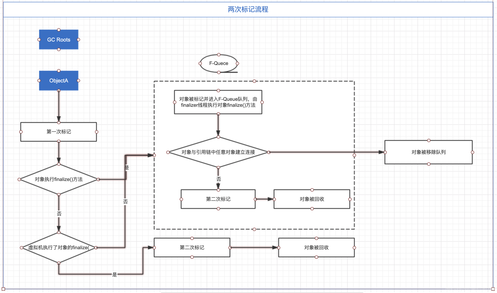

* finalize()是Object里面的一个方法，当一个堆空间中的对象没有被栈空间变量指向的时候，这个对象会等待被java回收

如果对象的finalize()方法自己执行了，那么就丢入队列。如果对象的finalize()方法时虚拟机执行的，那么第二次标记就回收。

## 什么是FullGC，一般什么情况下触发
Full GC 是清理整个堆空间—包括年轻代和永久代。

触发条件：
1. System.gc()方法的调用。
2. 老年代空间不足。老年代空间只有在新生代对象转入及创建为大对象、大数组时才会出现不足的现象，当执行Full GC后空间仍然不足，则抛出错误：java.lang.OutOfMemoryError: Java heap space 。为避免以上两种状况引起的FullGC，调优时应尽量做到让对象在Minor GC阶段被回收、让对象在新生代多存活一段时间及不要创建过大的对象及数组。
3. Permanet Generation空间满了。Permanet Generation中存放的为一些class的信息等，当系统中要加载的类、反射的类和调用的方法较多时，Permanet Generation可能会被占满，在未配置为采用CMS GC的情况下会执行Full GC。
4. 由Eden区、From区向To 区复制时，对象大小大于To 可用内存，则把该对象转存到老年代，且老年代的可用内存小于该对象大小

## 触发了FULLGC但是老年代没有减少可能是什么原因？

1. 不恰当的使用分页（未分页/浅分页），比如一次不分页查出1000w结果集，堆影响较大
2. 查询结果集过大（类似于上条）
3. 元空间太小触发的fullgc

## metaspace占用空间异常，堆占用异常怎么排查

# 垃圾收集器

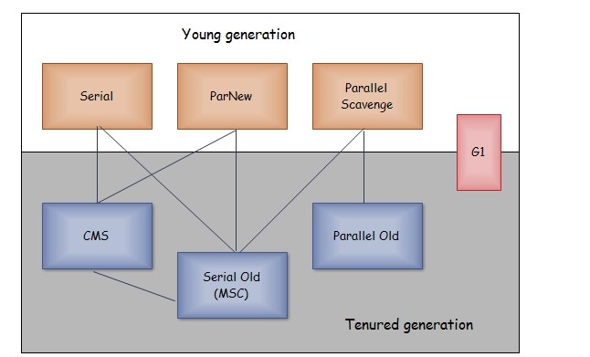

以上是 HotSpot 虚拟机中的 7 个垃圾收集器，连线表示垃圾收集器可以配合使用。

* 单线程与多线程：单线程指的是垃圾收集器只使用一个线程，而多线程使用多个线程；
* 串行与并行：串行指的是垃圾收集器与用户程序交替执行，这意味着在执行垃圾收集的时候需要停顿用户程序；并行指的是垃圾收集器和用户程序同时执行。除了 CMS 和 G1 之外，其它垃圾收集器都是以串行的方式执行。

### Serial（串行）收集器

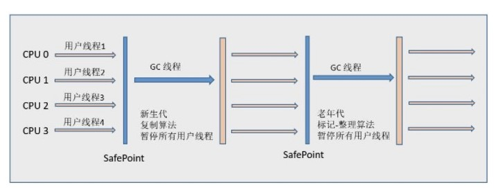

是单线程收集器。仅使用一条垃圾收集线程去完成垃圾收集，在垃圾收集工作的时候必须暂停其他所有工作线程。

新生代采用复制算法，老年代采用标记-整理算法。

它的优点是简单高效，在单个 CPU 环境下，由于没有线程交互的开销，因此拥有最高的单线程收集效率。

它是 Client 场景下的默认新生代收集器，因为在该场景下内存一般来说不会很大。它收集一两百兆垃圾的停顿时间可以控制在一百多毫秒以内，只要不是太频繁，这点停顿时间是可以接受的。

### ParNew收集器
Serial收集器的多线程版本。他与Serial收集器可以与CMS收集器共同工作。

### Parallel Scavenge收集器
类似ParNew收集器。但是他的关注点是吞吐量（这里的吞吐量指 CPU 用于运行用户程序的时间占总时间的比值），即尽快的垃圾回收。
Parallel Scavege收集器提供了非常多的参数去调整停顿时间与吞吐量。
* -xx:+UseParallelGC:使用Parallel收集器 + 老年代串行
* -xx:+UseParallelOldGC:使用Parallel收集器+老年代并行

停顿时间越短就越适合需要与用户交互的程序，良好的响应速度能提升用户体验。而高吞吐量则可以高效率地利用 CPU 时间，尽快完成程序的运算任务，适合在后台运算而不需要太多交互的任务。

缩短停顿时间是以牺牲吞吐量和新生代空间来换取的：新生代空间变小，垃圾回收变得频繁，导致吞吐量下降。

新生代采用复制算法，老年代采用标记-整理算法。

### CMS收集器
CMS收集器是一种以获取最短停顿时间为目标的收集器。也是第一款真正意义上的并发收集器，第一次实现了垃圾收集线程与用户线程同时工作。

CMS是用的是标记-清除 算法。

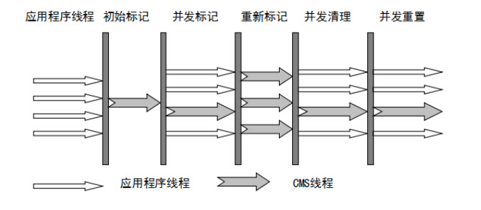

* 初始标记：暂停其他所有线程，标记所有与root相连的对象，速度很快。
* 并发标记：同时开启GC和⽤户线程，⽤⼀个闭包结构去记录可达对象。
    * 这个阶段结束，这个闭包结构并不能保证包含当前所有的可达对象。 因为⽤户线程可能会不断的更新引⽤域，所以 GC线程⽆法保证可达性分析的实时性。
    * 这个算法⾥会跟踪记录这些发⽣引⽤更新的地⽅。
* 重新标记： 重新标记阶段就是为了修正并发标记期间因为⽤户程序继续运⾏⽽导致标记产⽣变动的那⼀部分对象的标记记录
    * 这个阶段的停顿时间⼀般会⽐初始标记阶段的时间稍⻓，远远⽐并发标记阶段时间短
* 并发清理
    * 开启⽤户线程，同时GC线程开始对为标记的区域做清扫

缺点：
1. 吞吐量低：低停顿时间是以牺牲吞吐量为代价的，导致 CPU 利用率不够高。
2. 无法处理浮动垃圾，可能出现 Concurrent Mode Failure。
    * 浮动垃圾是指并发清除阶段由于用户线程继续运行而产生的垃圾，这部分垃圾只能到下一次 GC 时才能进行回收。由于浮动垃圾的存在，因此需要预留出一部分内存，意味着 CMS 收集不能像其它收集器那样等待老年代快满的时候再回收。如果预留的内存不够存放浮动垃圾，就会出现 Concurrent Mode Failure，这时虚拟机将临时启用 Serial Old 来替代 CMS。
3. 标记 - 清除算法导致的空间碎片，往往出现老年代空间剩余，但无法找到足够大连续空间来分配当前对象，不得不提前触发一次 Full GC。

### G1收集器
G1 (Garbage-First)是⼀款⾯向服务器的垃圾收集器,主要针对配备多颗处理器及⼤容量内存的机器. 以极⾼概率满⾜GC停顿时间要求的同时,还具备⾼吞吐量性能特征.

G1 把堆划分成多个大小相等的独立区域（Region），新生代和老年代不再物理隔离。

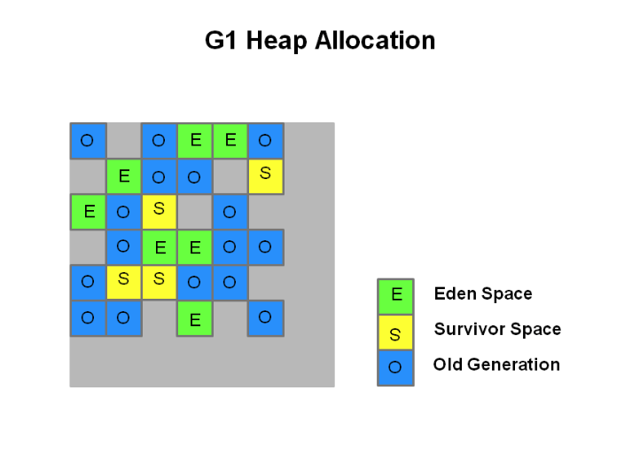

通过引入 Region 的概念，从而将原来的一整块内存空间划分成多个的小空间，使得每个小空间可以单独进行垃圾回收。这种划分方法带来了很大的灵活性，使得可预测的停顿时间模型成为可能。

通过记录每个 Region 垃圾回收时间以及回收所获得的空间（这两个值是通过过去回收的经验获得），并维护一个优先列表，每次根据允许的收集时间，优先回收价值最大的 Region。

每个 Region 都有一个 Remembered Set，用来记录该 Region 对象的引用对象所在的 Region。通过使用 Remembered Set，在做可达性分析的时候就可以避免全堆扫描。

G1收集器有以下特征：
* 并发与并行
    * 原本停顿java线程执行的GC操作，G1收集器可以以并发的方式让java程序继续执行。
* 分代收集
    * G1不需要其他收集器配合就能独立管理整个GC堆，但是还是保留了分代的概念
* 空间整合
    * 从整体来看是“标记整理”，从局部来看是“复制”算法。
* 可预测的停顿
    * 能让使用者明确指定在一个长度为M毫秒的时间片段内停顿。
    
G1收集器步骤：

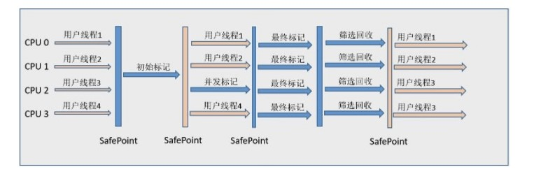

1. 初始标记
2. 并发标记
3. 最终标记
4. 筛选回收

## JVM中的Stop-The-World
Stop一the一World，简称STW，指的是Gc事件发生过程中，会产生应用程序的停顿。停顿产生时整个应用程序线程都会被暂停，没有任何响应，有点像卡死的感觉，这个停顿称为STW。

可达性分析算法中枚举根节点（GC Roots）会导致所有Java执行线程停顿。

停顿的原因: 
* 分析工作必须在一个能确保一致性的快照中进行
* 一致性指整个分析期间整个执行系统看起来像被冻结在某个时间点上
* 如果出现分析过程中对象引用关系还在不断变化，则分析结果的准确性无法保证

## JVM安全点SafePoint
在JVM里面引入了一个叫安全点（Safe Point）的东西来避免STW。GC的目的是帮助我们回收不再使用的内存，在多线程环境下这种回收将会变得非常复杂，要安全地回收需要满足一下两个条件：

1. 堆内存的变化是受控制的，最好所有的线程全部停止。
2. 堆中的对象是已知的，不存在不再使用的对象很难找到或者找不到即堆中的对象状态都是可知的。

为了准确安全地回收内存，JVM是在Safe Point点时才进行回收，所谓Safe Point就是Java线程执行到某个位置这时候JVM能够安全、可控的回收对象，这样就不会导致回收正在使用的对象。

安全点是什么：
1. 从线程的角度，安全点是代码执行中的一些特殊位置，当线程执行到这些特殊的位置，如果此时在GC，那么在这个地方线程会暂停，直到GC结束。
2. GC的时候要挂起所有活动的线程，因此线程挂起，会选择在到达安全点的时候挂起。
3. 安全点这个特殊的位置保存了线程上下文的全部信息。说白了，在进入安全点的时候打印日志信息能看出线程此刻都在干嘛。

使线程中断一般有两种方式：主动式和被动式。

* 主动式JVM设置一个全局变量，线程去按照某种策略检查这个变量一旦发现是Safe Point就主动挂起。
    * HostSop虚拟机采用的是主动式使线程中断。
* 被动式就是发个信号，例如关机、Control+C，带来的问题就是不可控，发信号的时候不知道线程处于什么状态。

安全点主要在以下位置设置：
1. 循环的末尾
2. 方法返回前
3. 调用方法的call之后
4. 抛出异常的位置

安全区域： 

安全点完美的解决了如何进入GC问题，实际情况可能比这个更复杂，但是如果程序长时间不执行，比如线程调用的sleep方法，这时候程序无法响应JVM中断请求这时候线程无法到达安全点，显然JVM也不可能等待程序唤醒，这时候就需要安全区域了。

安全区域是指一段代码片中，引用关系不会发生变化，在这个区域任何地方GC都是安全的，安全区域可以看做是安全点的一个扩展。线程执行到安全区域的代码时，首先标识自己进入了安全区域，这样GC时就不用管进入安全区域的线程了，线程要离开安全区域时就检查JVM是否完成了GC Roots枚举，如果完成就继续执行，如果没有完成就等待直到收到可以安全离开的信号。

## JVM内存分配
JVM分配内存机制有三大原则和担保机制：
* 优先分配到eden区
* 大对象，直接进入到老年代
* 长期存活的对象分配到老年代
* 空间分配担保

内存分配担保机制：当在新生代无法分配内存的时候，会先minor gc，发现仍然无法分配。把新生代的对象转移到老生代，然后把新对象放入腾空的新生代。

在不同的GC机制下，也就是不同垃圾回收器组合下，担保机制也略有不同。在Serial+Serial Old的情况下，发现放不下就直接启动担保机制；在Parallel Scavenge+Serial Old的情况下，却是先要去判断一下要分配的内存是不是>=Eden区大小的一半，如果是那么直接不gc把该对象放入老年代，否则才会启动担保机制。

