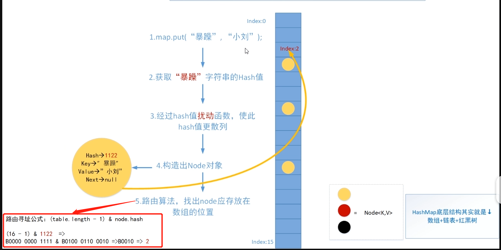

# JAVA容器

java容器主要为：

* List ： 存储的元素是有序的、可重复的。
* set ： 存储的元素是无序的、不可重复的。
* Map ： 使用键值对（kye-value）存储。

# HashMap底层数据结构分析

HashMap默认的加载因子是0.75，初始容量是16，因此可以得出HashMap的默认容量是：0.75*16=12。

**HashMap的加载因子是可以自定义的。**

### Q: 为什么加载因子选0.75

加载因子是表示Hash表中元素的填满的程度。 加载因子越大,填满的元素越多,空间利用率越高，但冲突的机会加大了。 反之,加载因子越小,填满的元素越少,冲突的机会减小,但空间浪费多了。

冲突的机会越大,则查找的成本越高。反之,查找的成本越小。

因此,必须在 "冲突的机会"与"空间利用率"之间寻找一种平衡与折衷。

## 解决hash冲突的方法
1. 开放地址方法
    * 线性探测 ： 按顺序决定值时，如果某数据的值已经存在，则在原来值的基础上往后加一个单位，直至不发生哈希冲突。
    * 再平方探测 ：按顺序决定值时，如果某数据的值已经存在，则在原来值的基础上先加1的平方个单位，若仍然存在则减1的平方个单位。随之是2的平方，3的平方等等。直至不发生哈希冲突。
    * 伪随机探测 ：按顺序决定值时，如果某数据已经存在，通过随机函数随机生成一个数，在原来值的基础上加上随机数，直至不发生哈希冲突。
2. 链式地址法（HashMap的哈希冲突解决方法）
    * 对于相同的值，使用链表进行连接。使用数组存储每一个链表。
3. 建立公共溢出区
    * 建立公共溢出区存储所有哈希冲突的数据。
4. 再哈希法
    * 对于冲突的哈希值再次进行哈希处理（另一个hash函数），直至没有哈希冲突。    

## Hashmap中Node类
```java
    static class Node<K,V> implements Map.Entry<K,V> {
        final int hash;
        final K key;
        V value;
        Node<K,V> next;

        Node(int hash, K key, V value, Node<K,V> next) {
            this.hash = hash;
            this.key = key;
            this.value = value;
            this.next = next;
        }

        public final K getKey()        { return key; }
        public final V getValue()      { return value; }
        public final String toString() { return key + "=" + value; }

        public final int hashCode() {
            return Objects.hashCode(key) ^ Objects.hashCode(value);
        }

        public final V setValue(V newValue) {
            V oldValue = value;
            value = newValue;
            return oldValue;
        }

        public final boolean equals(Object o) {
            if (o == this)
                return true;
            if (o instanceof Map.Entry) {
                Map.Entry<?,?> e = (Map.Entry<?,?>)o;
                if (Objects.equals(key, e.getKey()) &&
                    Objects.equals(value, e.getValue()))
                    return true;
            }
            return false;
        }
    }
```

## 什么是Hash

基本原理就是将**任意长度的输入**，转换成**固定长度的输出**。映射的规则就是hash算法，输出就是对应的hash值。       
hash的特点 :

1. 从hash值不可以反推出原始的数据。
2. 输入数据的微小变化会得到不同的hash值，同一个输入的hash值一定相同。
3. 算法效率要高，长文本也要快速得到hash值。
4. 冲突的概率要小。

hash的原理是从输入空间映射到hash空间，hash空间较小，一定会出现hash冲突。

## JDK1.8之前

JDK1.8 之前 HashMap 由 数组+链表 组成的，数组是 HashMap 的主体，链表则是主要为了解决哈希冲突而存在的（“拉链法”解决冲突）。

* 拉链法 ：将链表和数组相结合。也就是说创建一个链表数组，数组中每一格就是一个链表。若遇到哈希冲突，则将冲突的值加到链表中即可。

HashMap 通过 key 的 hashCode 经过扰动函数处理过后得到 hash 值，然后通过 (n - 1) & hash 判断当前元素存放的位置（这里的 n
指的是数组的长度），如果当前位置存在元素的话，就判断该元素与要存入的元素的 hash 值以及 key 是否相同，如果相同的话，直接覆盖，不相同就通过拉链法解决冲突。

所谓扰动函数指的就是 HashMap 的 hash 方法。使用扰动函数（hash方法）是为了防止一些实现比较差的 hashCode() 方法 换句话说使用扰动函数之后可以减少碰撞。

## JDK1.8

JDK1.8 之后 HashMap 的组成多了红黑树，在满足下面两个条件之后，会执行链表转红黑树操作，以此来加快搜索速度。

* 链表长度大于阈值（默认为 8）
* HashMap 数组长度超过 64

当链表长度大于阈值（默认为 8）时，会首先调用 treeifyBin()方法。这个方法会根据 HashMap 数组来决定是否转换为红黑树。只有当数组长度大于或者等于 64 的情况下，才会执行转换红黑树操作，以减少搜索时间。否则，就是只是执行
resize() 方法对数组扩容。

当红黑树删除节点时，删至只剩下6个节点时，变回链表。

### 为什么引入红黑树

极端情况下，链化的长度很长。此时链表的查询效率就是O(n)。红黑树是平衡查找树，可以加快查找。

# PUT方法



## Object中的hashcode

理想的哈希函数应当具有均匀性，即不相等的对象应当均匀分布到所有可能的哈希值上。这就要求了哈希函数要把所有域的值都考虑进来。可以将每个域都当成 R 进制的某一位，然后组成一个 R 进制的整数。

```java
public int hashCode() {
    int h = hash;
    if (h == 0 && value.length > 0) {
        char val[] = value;
        for (int i = 0; i < value.length; i++) {
            h = 31 * h + val[i];
        }
        hash = h;
    }
    return h;
}
```
R 一般取 31，因为它是一个奇素数，如果是偶数的话，当出现乘法溢出，信息就会丢失，因为与 2 相乘相当于向左移一位，最左边的位丢失。并且一个数与 31 相乘可以转换成移位和减法：31*x == (x<<5)-x，编译器会自动进行这个优化。

## 扰动函数

```java
static final int hash(Object key) {
    int h;
    return (key == null) ? 0 : (h = key.hashCode()) ^ (h >>> 16);
}
```
hashMap源码这里不只是直接获取哈希值，还进行了一次扰动计算，(h = key.hashCode()) ^ (h >>> 16)。把哈希值右移16位，也就正好是自己长度的一半，之后与原哈希值做异或运算，这样就混合了原哈希值中的高位和低位，增大了随机性。

使用扰动函数就是为了增加随机性，让数据元素更加均衡的散列，减少碰撞。

## Q 为什么Entry（table）的长度一定是2的次幂

如图中的路由算法。源于一个数学规律，就是如果length是2的N次方，那么数h对length的模运算结果等价于a和(length-1)的按位与运算，也就是 h%length <=> h&(length-1)。
位运算效率远远高于取余，所以必须是2的次幂。

## JDK1.8

HashMap 只提供了 put 用于添加元素，putVal 方法只是给 put 方法调用的一个方法，并没有提供给用户使用。

对 putVal 方法添加元素的分析如下：

1. 如果定位到的数组位置没有元素 就直接插入。
2. 如果定位到的数组位置有元素就和要插入的 key 比较，如果 key 相同就直接覆盖，如果 key 不相同，就判断 p 是否是一个树节点，如果是就调用e = ((TreeNode<K,V>)p).putTreeVal(this,
   tab, hash, key, value)将元素添加进入。如果不是就遍历链表插入(插入的是链表尾部)。

补充 ：

* 当链表长度大于阈值（默认为 8）并且 HashMap 数组长度超过 64 的时候才会执行链表转红黑树的操作，**否则就只是对数组扩容**。参考 HashMap 的 treeifyBin() 方法。
* 直接覆盖之后应该就会 return，不会有后续操作。

## JDK1.7

对于 put 方法的分析如下：

1. 如果定位到的数组位置没有元素 就直接插入。
2. 如果定位到的数组位置有元素，遍历以这个元素为头结点的链表，依次和插入的 key 比较，如果 key 相同就直接覆盖，不同就采用头插法插入元素。

## Resize方法

为了解决哈希冲突导致链化严重，查询效率低的问题，扩容可以缓解该问题。

扩容运算 定义 HashMap 中扩容之前的旧数组容量为 oldCap，其中 oldCap = 2^n，扩容之后的新数组容量为 2oldCap。

在扩容的时候，对于节点 e，计算 e.hash & oldCap。


* 当 e.hash & oldCap = 0，则节点在新数组中的索引值与旧索引值相同。

* 当 e.hash & oldCap = 1，则节点在新数组中的索引值为旧索引值+旧数组容量。

设：扩容前，节点 e 在旧数组索引值为 x；扩容后，节点 e 在新数组的索引值为 y.

1. 推导 e.hash & oldCap = 0 时，y = x

在旧数组中，取模公式为 e.hash & (oldCap - 1) = x ，由于 oldCap = 2^n，可知 oldCap - 1 的二进制形式为 n 个 1。 根据对按位与(&)操作的理解，e.hash & (oldCap - 1)
相当于取 e.hash 的低 n 位的值，该值为 x。

在新数组中，取模公式为 e.hash & (2oldCap - 1) = y，由于 oldCap = 2^n，可知 2oldCap - 1 的二进制形式为 n + 1 个 1。 根据对按位与(&)操作的理解，e.hash & (
2oldCap - 1) 相当于取 e.hash 的低 n + 1 位的值，该值为 y。

同理当 e.hash & oldCap = e.hash & 2^n = 0 时，说明 e.hash 的第 n + 1 位为 0， 此时低 n + 1 位的值与低 n 位的值是相等的，即 y = x，命题得证。

2. 推导 e.hash & oldCap = 1 时，y = x + oldCap

当 e.hash & oldCap = e.hash & 2^n = 1 时，说明 e.hash 的第 n + 1 位为 1。 对于一个二进制数，其第 n + 1 位为 1，其余 n 位为 0，该二进制数的值为 2^n，也就是
oldCap。

当 e.hash 的第 n + 1 位为 1，而低 n + 1 位的值为 y，低 n 位的值为 x，此时 y = x + oldCap，命题得证。

总结

* 推导可知，当 HashMap 容量 capacity 大小是 2 的 n 次幂时，取模公式和扩容公式都可以用按位与运算来替换取模运算，极大地提升了运算效率。

* 但是，按位与运算实际是取 hash 值的低位，舍弃了高位会使得 hash 运算结果不均匀。HashMap 通过引入扰动运算，让高位充分参与 hash 运算来避免这个问题。

HashMap 扩容在1.8中由头插改为尾插。避免了死循环问题

## 并发时hashmap的resize会发生什么情况

http://coolshell.cn/articles/9606.html

Hashmap的Resize包含扩容和ReHash两个步骤，ReHash在并发的情况下可能会形成链表环。

然后在后续的get一个不存在的值时会出现死循环。

另外，在put方法时，考虑在多线程下put操作时，执行addEntry(hash, key, value, i)，如果有产生哈希碰撞，导致两个线程得到同样的bucketIndex去存储，就可能会出现覆盖丢失的情况：

## hashmap遍历时删除会怎么样

```java
    public static void main(String[]args){
        Map<Integer, Integer> map=new HashMap<>();
        for(int i=0;i< 10;i++){
            map.put(i,i);
        }
        for(int i:map.keySet()){
            if(i%2==0){
                map.remove(i);
            }
        }
    }
```

会报java.util.ConcurrentModificationException错误

可以看出迭代器初始化的时候就对modCount和expectedModCount进行同步。 到此，可以看出报错的原因：

* hashmap里维护了一个modCount变量，迭代器里维护了一个expectedModCount变量，一开始两者是一样的。
* 每次进行hashmap.remove操作的时候就会对modCount+1，此时迭代器里的expectedModCount还是之前的值。 
* 在下一次对迭代器进行next()调用时，判断是否HashMap.this.modCount !=this.expectedModCount，如果是则抛出异常。

解决：
* 用迭代器的remove方法。
* 用currentHashMap替代HashMap


