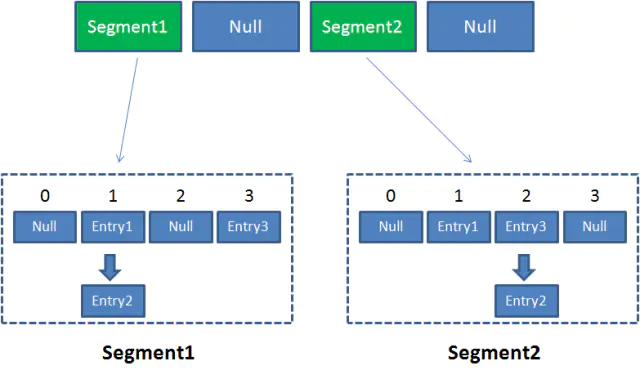

# Concurrenthashmap底层原理分析

## JDK1.7
ConcurrentHashMap 中有一个 Segment 的概念。Segment 本身就相当于一个 HashMap 对象。同 HashMap 一样，Segment 包含一个 HashEntry 数组，数组中的每一个 HashEntry 既是一个键值对，也是一个链表的头节点。

ConcurrentHashMap 集合中有 2 的N次方个 Segment 对象，共同保存在一个名为 segments 的数组当中。因此整个 ConcurrentHashMap 的结构如下：

可以说，ConcurrentHashMap 是一个二级哈希表。在一个总的哈希表下面，有若干个子哈希表。这样的二级结构，和数据库的水平拆分有些相似。

采取了锁分段技术，每一个 Segment 就好比一个自治区，读写操作高度自治，Segment 之间互不影响。

* 不同 Segment 的并发写入【可以并发执行】
* 同一 Segment 的一写一读【可以并发执行】
* 同一 Segment 的并发写入【需要上锁】

由此可见，ConcurrentHashMap 当中每个 Segment 各自持有一把锁。在保证线程安全的同时降低了锁的粒度，让并发操作效率更高。

### Concurrent 的读写过程
Get方法：

1. 为输入的 Key 做 Hash 运算，得到 hash 值。(为了实现Segment均匀分布，进行了两次Hash)
2. 通过 hash 值，定位到对应的 Segment 对象
3. 再次通过 hash 值，定位到 Segment 当中数组的具体位置。

Put方法：
1. 为输入的 Key 做 Hash 运算，得到 hash 值。
2. 通过 hash 值，定位到对应的 Segment 对象
3. 获取可重入锁
4. 再次通过 hash 值，定位到 Segment 当中数组的具体位置。
5. 插入或覆盖 HashEntry 对象。
6. 释放锁。

从步骤可以看出，ConcurrentHashMap 在读写时均需要二次定位。首先定位到 Segment，之后定位到 Segment 内的具体数组下标。

### 调用 size() 时，解决一致性的问题

ConcurrentHashMap 的 Size() 是一个嵌套循环，大体逻辑如下：

1. 遍历所有的 Segment。
2. 把 Segment 的元素数量累加起来。
3. 把 Segment 的修改次数累加起来。
4. 判断所有 Segment 的总修改次数是否大于上一次的总修改次数。如果大于，说明统计过程中有修改，重新统计，尝试次数+1；如果不是。说明没有修改，统计结束。
5. 如果尝试次数超过阈值，则对每一个 Segment 加锁，再重新统计。
6. 再次判断所有 Segment 的总修改次数是否大于上一次的总修改次数。由于已经加锁，次数一定和上次相等。 释放锁，统计结束。

为什么这样设计呢？这种思想和乐观锁悲观锁的思想如出一辙。为了尽量不锁住所有的 Segment，首先乐观地假设 Size 过程中不会有修改。当尝试一定次数，才无奈转为悲观锁，锁住所有 Segment 保证强一致性。

## JDK1.8
移除 Segment，使锁的粒度更小，Synchronized + CAS + Node + Unsafe

加入了sizeCtl，作用类似为符号位 ：
* 默认为0，用来控制table的初始化和扩容操作，具体应用在后续会体现出来。
* -1 代表table正在初始化
* -N 表示有N-1个线程正在进行扩容操作

其余情况：

1. 如果table未初始化，表示table需要初始化的大小。
2. 如果table初始化完成，表示table的容量，默认是table大小的0.75倍，居然用这个公式算0.75（n - (n >>> 2)）。

### put,get方法
value 声明为 volatile，保证了修改的可见性。

put方法： 由于移除了 Segment，类似 HashMap，可以直接定位到桶，拿到 first 节点后进行判断：①为空则 CAS 插入；②为 -1 则说明在扩容，则跟着一起扩容；③ else 则加锁 put(类似1.7)

get方法： 不需要加锁

### resize()方法

支持并发扩容，HashMap 扩容在1.8中由头插改为尾插(为了避免死循环问题)，ConcurrentHashmap 也是，迁移也是从尾部开始，扩容前在桶的头部放置一个 hash 值为 -1 的节点，这样别的线程访问时就能判断是否该桶已经被其他线程处理过了。

### size()方法
用 baseCount 来存储当前的节点个数，这就设计到 baseCount 并发环境下修改的问题。