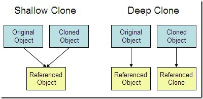
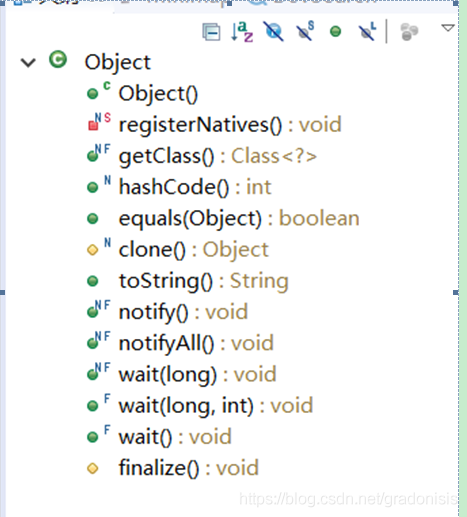

# javaSE整理

## java和c++比较
* 都面向对象
* java在多线程（c++没有内置多线程支持）与网络编程方面更有优势
* Java 不提供指针来直接访问内存，程序内存更加安全 
* Java 的类是单继承的，C++ 支持多重继承；虽然 Java 的类不可以多继承，但是接口可以多继承。
* Java 有自动内存管理垃圾回收机制(GC)，不需要程序员手动释放无用内存

## JDK8的新特性
1. lambda表达式
    * Lambda 表达式也可称为闭包。lambda表达式本质上是一个匿名方法。Lambda允许把函数作为一个方法的参数。
2. 新的日期API
    * 在java.time包下，可以定制时区，且线程安全
3. Stream类
    * Arrays.stream(array, from, to)可以生成流
    
Stream中的常用函数：    
* max(Comparator)：返回流中最大值
* count()：返回流中元素个数
* filter(Predicate) ：将结果为false的元素过滤掉
* distinct() ：剔除重复元素
* sorted() ：将Comparable元素的流排序
    
##  Java 泛型了解么？什么是类型擦除？介绍一下常用的通配符？
Java 泛型（generics）是 JDK 5 中引入的一个新特性, 泛型提供了编译时类型安全检测机制，该机制允许程序员在编译时检测到非法的类型。泛型的本质是参数化类型，也就是说所操作的数据类型被指定为一个参数。

Java 的泛型是伪泛型，泛型信息只存在于代码编译阶段，在进入 JVM 之前，与泛型相关的信息会被擦除掉，专业术语叫做类型擦除。

```java
List<String> l1 = new ArrayList<String>();
List<Integer> l2 = new ArrayList<Integer>();
		
System.out.println(l1.getClass() == l2.getClass());
```

打印的结果为 true 是因为 List<String>和 List<Integer>在 jvm 中的 Class 都是 List.class。 泛型信息被擦除了。

泛型一般有三种使用方式:泛型类、泛型接口、泛型方法。

常用的通配符为： T，E，K，V，？

* ？ 表示不确定的 java 类型
* T (type) 表示具体的一个 java 类型
* K V (key value) 分别代表 java 键值中的 Key Value
* E (element) 代表 Element

## static和final关键字的区别
1. static：static表示“全局”或者“静态”的意思，用来修饰成员变量和成员方法，
    * static变量：对于静态变量在内存中只有一个拷贝（节省内存），JVM只为静态分配一次内存，在加载类的过程中完成静态变量的内存分配，可用类名直接访问，
    * static方法：静态方法可以直接通过类名调用，任何的实例也都可以调用。因为static方法独立于任何实例，因此static方法必须被实现，而不能是抽象的abstract。
    
2. final：无论属性是基本类型还是对象类，final所起的作用都是变量里面存放的“值”不能变。
    * final修饰变量，声明变量时可以不赋值，而且一旦赋值就不能被修改了。
    * final修饰方法。可以被继承，但继承后不能被重写。
    * final修饰类。类不可以被继承，也就是不能有子类。

* 对于一个final变量，如果是基本数据类型的变量，则其数值一旦在初始化之后便不能更改； 如果是引用类型的变量，则在对其初始化之后便不能再让其指向另一个对象。

```java
final int[] value={1,2,3};
value[2]=100;

int[] another={4,5,6};
value=another;    
```

第一种情况value[2]是会变成100的。
第二种则会报错，不能直接改引用的对象。

static和final一起使用 ，static final用来修饰成员变量和成员方法，可简单理解为“全局常量”

## transient关键字
* 一旦变量被transient修饰，变量将不再是对象持久化的一部分，该变量内容在序列化后无法获得访问。
* transient关键字只能修饰变量，而不能修饰方法和类。注意，本地变量是不能被transient关键字修饰的。变量如果是用户自定义类变量，则该类需要实现Serializable接口。
* 被transient关键字修饰的变量不再能被序列化，一个静态变量不管是否被transient修饰，均不能被序列化。

transient修饰的变量可以手动序列化

## ==与equals()的区别
* 对于基本类型，== 判断两个值是否相等，基本类型没有 equals() 方法。
* 对于引用类型，== 判断两个变量是否引用同一个对象，而 equals() 判断引用的对象是否等价。
```java
Integer x = new Integer(1);
Integer y = new Integer(1);
System.out.println(x.equals(y)); // true
System.out.println(x == y);      // false
```

equals() : 它的作用也是判断两个对象是否相等，它不能用于比较基本数据类型的变量。equals()方法存在于Object类中，而Object类是所有类的直接或间接父类。
* 类覆盖了 equals()方法。一般，我们都覆盖 equals()方法来两个对象的内容相等；若它们的内容相等，则返回 true(即，认为这两个对象相等)。
* 类没有覆盖 equals()方法。则通过equals()比较该类的两个对象时，等价于通过“==”比较这两个对象。使用的默认是 Object类equals()方法。

### 为什么重写 equals 时必须重写 hashCode 方法？

因为不重写的话，那么当你创建这个类的HashMap（key）、HashSet等不允许元素重复的散列表并塞入数据时，可能会出现重复的元素。

这是因为散列表中判断元素重复时，会先判断hashcode是否相等，相等后才会比较equals。如果hashcode不相同的就直接判断为不同元素。

equals() 方法和 hashcode() 方法间的关系是这样的：

1. 如果两个对象相同（即：用 equals比较返回true），那么它们的 hashCode 值一定要相同;
2. 如果两个对象的 hashCode 相同，它们并不一定相同（即：用 equals比较返回 false）;

##  基本数据类型
### Java 中的几种基本数据类型是什么？对应的包装类型是什么？各自占用多少字节呢？
| 基本类型 | 位数 | 字节 | 默认值  |
| :------- | :--- | :--- | ------- |
| int      | 32   | 4    | 0       |
| short    | 16   | 2    | 0       |
| long     | 64   | 8    | 0L      |
| byte     | 8    | 1    | 0       |
| char     | 16   | 2    | 'u0000' |
| float    | 32   | 4    | 0f      |
| double   | 64   | 8    | 0d      |
| boolean  | 1    |      | false   |

### 8 种基本类型的包装类和常量池
Java 基本类型的包装类的大部分都实现了常量池技术，即 Byte,Short,Integer,Long,Character,Boolean；前面 4 种包装类默认创建了数值[-128，127] 的相应类型的缓存数据，Character 创建了数值在[0,127]范围的缓存数据，Boolean 直接返回 True Or False。如果超出对应范围仍然会去创建新的对象。
为啥把缓存设置为[-128，127]区间？性能和资源之间的权衡。

## 深拷贝 vs 浅拷贝
* 浅拷贝：对基本数据类型进行值传递，对引用数据类型进行引用传递般的拷贝，此为浅拷贝。
* 深拷贝：对基本数据类型进行值传递，对引用数据类型，创建一个新的对象，并复制其内容，此为深拷贝。



## String StringBuffer 和 StringBuilder 的区别是什么? String 为什么是不可变的?
简单的来说：String 类中使用 final 关键字修饰字符数组来保存字符串，private final char value[]，所以String 对象是不可变的。

而 StringBuilder 与 StringBuffer 都继承自 AbstractStringBuilder 类，在 AbstractStringBuilder 中也是使用字符数组保存字符串char[]value 但是没有用 final 关键字修饰，所以这两种对象都是可变的。

线程安全性:
* String 中的对象是不可变的，也就可以理解为常量，线程安全。
* StringBuffer 对方法加了同步锁或者对调用的方法加了同步锁，所以是线程安全的。
* StringBuilder 并没有对方法进行加同步锁，所以是非线程安全的。

# 面向对象的三大特性
## 封装
封装是指把一个对象的状态信息（也就是属性）隐藏在对象内部，不允许外部对象直接访问对象的内部信息。但是可以提供一些可以被外界访问的方法来操作属性。

## 继承
通过使用继承，可以快速地创建新的类，可以提高代码的重用，程序的可维护性，节省大量创建新类的时间 ，提高我们的开发效率。

* 子类拥有父类对象所有的属性和方法（包括私有属性和私有方法），但是父类中的私有属性和方法子类是无法访问，只是拥有。
* 子类可以拥有自己属性和方法，即子类可以对父类进行扩展。
* 子类可以用自己的方式实现父类的方法。
## 多态
多态是同一个行为具有多个不同表现形式或形态的能力。 多态就是同一个接口，使用不同的实例而执行不同操作 ，具体表现为父类的引用指向子类的实例。

* 对象类型和引用类型之间具有继承（类）/实现（接口）的关系；
* 引用类型变量发出的方法调用的到底是哪个类中的方法，必须在程序运行期间才能确定；
* 多态不能调用“只在子类存在但在父类不存在”的方法；
* 如果子类重写了父类的方法，真正执行的是子类覆盖的方法，如果子类没有覆盖父类的方法，执行的是父类的方法。

## java如何抛出异常，异常都有哪些？
一、异常的抛出

1. 定义 ： 一个方法不处理这个异常，而是调用层次向上传递，谁调用这个方法，这个异常就由谁来处理。java中抛出Exception类的异常

2. throw : 将产生的异常抛出(强调的是动作)，抛出的既可以是异常的引用，也可以是异常对象。（位置: 方法体内）

3. throws : 如果一个方法可能会出现异常，但没有能力处理这种异常，可以在方法声明处用throws子句来声明抛出异常。用它修饰的方法向调用者表明该方法可能会抛出异常（可以是一种类型，也可以是多种类型，用逗号隔开）（位置: 写在方法名 或方法名列表之后 ，在方法体之前。）

注意 ： 调用可能会抛出异常的方法，必须添加try-catch代码块尝试去捕获异常 或者 添加throws 声明 来将异常 抛出给更上一层的调用者进行处理,这里需要注意一个细节:新的异常包含原始异常的所有信息，根据这个我们可以去追溯最初异常发生的位置.

异常的分类
Throwable 可以用来表示任何可以作为异常抛出的类，分为两种： Error 和 Exception。其中 Error 用来表示 JVM 无法处理的错误，Exception 分为两种：

* 受检异常 ：需要用 try...catch... 语句捕获并进行处理，并且可以从异常中恢复；
* 非受检异常 ：是程序运行时错误，例如除 0 会引发 Arithmetic Exception，此时程序崩溃并且无法恢复。


常见异常：
* 空指针异常类：NullPointerException
* 类型强制转换异常：ClassCastException
* 数组负下标异常：NegativeArrayException
* 数组下标越界异常：ArrayIndexOutOfBoundsException
* ConcurrentModificationException（并发修改异常）（多线程操作ArrayList等容器）

## Java中抽象类与接口有什么区别
在abstract class方式中，可以有自己的数据成员，也可以有非abstract的成员方法，
而在interface方式实现中，Demo只能有静态的不能被修改的数据成员（也就是必须是static final的，不过在interface中一般不定义数据成员），所有的成员方法都是抽象的。

总结：
* 抽象类和接口都不能直接实例化，如果要实例化，抽象类变量必须指向实现所有抽象方法的子类对象，接口变量必须指向实现所有接口方法的类对象。
* 抽象类要被子类继承，接口要被类实现。
* 接口里定义的变量只能是公共的静态的常量，抽象类中的变量是普通变量。
* 接口可以被类多实现（被其他接口多继承），抽象类只能被单继承。
* 接口中没有 this 指针，没有构造函数，不能拥有实例字段（实例变量）或实例方法。

## java中Object类中有哪些常用方法以及作用!



1. getClass()：获取类的class对象。
2. hashCode:获取对象的hashCode值
   * 见[HashMap](Hashmap/hashmap.md)
3. equals():比较对象是否相等，比较的是值和地址，子类可重写以自定义。
4. clone()：克隆方法。
   * 浅拷贝 ：拷贝对象和原始对象的引用类型引用同一个对象。
   * 深拷贝 ：拷贝对象和原始对象的引用类型引用不同对象。
5. toString():如果没有重写，应用对象将打印的是地址值。
6. notify():随机选择一个在该对象上调用wait方法的线程，解除其阻塞状态。该方法只能在同步方法或同步块内部调用。如果当前线程不是锁的持有者，该方法抛出一个IllegalMonitorStateException异常。
7. notifyall():解除所有那些在该对象上调用wait方法的线程的阻塞状态。该方法只能在同步方法或同步块内部调用。如果当前线程不是锁的持有者，该方法抛出一个IllegalMonitorStateException异常。
8. wait():导致线程进入等待状态，直到它被其他线程通过notify()或者notifyAll唤醒。该方法只能在同步方法中调用。如果当前线程不是锁的持有者，该方法抛出一个IllegalMonitorStateException异常。
9. finalize()：对象回收时调用

## hashcode怎么做的？
对于String类，jdk的hash算法：

```java
String s;
int hash = 0;
for(int i = 0; i < s.length(); i ++){
    hash = 31 * hash + s.charAt(i);
        }
```

一般对象的hashcode是在他的对象头中。

## 为什么java要封装基本类型
1. 便于统一管理，传递参数方便
2. 需要用到Object中的方法。比如int 是没有hashcode 方法的。
3. 实际业务中需要用到null。基本类型没有null。


## java四种字符串拼接方式性能分析
1. 直接用“+”号
   * 加号拼接字符串jvm底层其实是调用StringBuilder来实现的
   * 不是说直接用“+”号拼接就可以达到StringBuilder的效率了，因为用“+”号每拼接一次都会新建一个StringBuilder对象，并且最后toString()方法还会生成一个String对象。在循环拼接十万次的时候，就会生成十万个StringBuilder对象，十万个String对象。
2. 使用String的方法concat
   * concat其实就是申请一个char类型的buf数组，将需要拼接的字符串都放在这个数组里，最后再转换成String对象。
3. 使用StringBuilder的append
4. 使用StringBuffer的append
   * StringBuffer是的append方法加了sychronized关键字，因此是线程安全的。
    
## java的四种引用
### 强引用
java中默认使用的就是强引用

只要强引用存在，垃圾回收器将永远不会回收被引用的对象，哪怕内存不足时，JVM也会直接抛出OutOfMemoryError，不会去回收。如果想中断强引用与对象之间的联系，可以显示的将强引用赋值为null，这样一来，JVM就可以适时的回收对象了

### 软引用
在内存足够的时候，软引用对象不会被回收，只有在内存不足时，系统则会回收软引用对象，如果回收了软引用对象之后仍然没有足够的内存，才会抛出内存溢出异常。
```java
Object obj = new Object();
SoftReference<Object> sf = new SoftReference<Object>(obj);
obj = null;  // 使对象只被软引用关联
```
如果一个对象惟一剩下的引用是软引用，那么该对象是软可及的（softly reachable）。垃圾收集器并不像其收集弱可及的对象一样尽量地收集软可及的对象，相反，它只在真正 “需要” 内存时才收集软可及的对象。

可以用来设计缓存
### 弱引用
无论内存是否足够，只要 JVM 开始进行垃圾回收，那些被弱引用关联的对象都会被回收。
```java
Object obj = new Object();
WeakReference<Object> wf = new WeakReference<Object>(obj);
obj = null;
```

### 虚引用
虚引用是最弱的一种引用关系，如果一个对象仅持有虚引用，那么它就和没有任何引用一样，它随时可能会被回收，在 JDK1.2 之后，用 PhantomReference 类来表示，通过查看这个类的源码，发现它只有一个构造函数和一个 get() 方法，而且它的 get() 方法仅仅是返回一个null，也就是说将永远无法通过虚引用来获取对象，虚引用必须要和 ReferenceQueue 引用队列一起使用。

为一个对象设置虚引用的唯一目的是能在这个对象被回收时收到一个系统通知。

```java
Object obj = new Object();
PhantomReference<Object> pf = new PhantomReference<Object>(obj, null);
obj = null;
```

## java .class的文件头

每一个Java Class文件都是以0x CAFEBABE开头的。Java这么做的原因就是为了快速判断一个文件是不是有可能为class文件，以及这个class文件有没有受损（文件受损，文件开头受损的可能性最大）。


