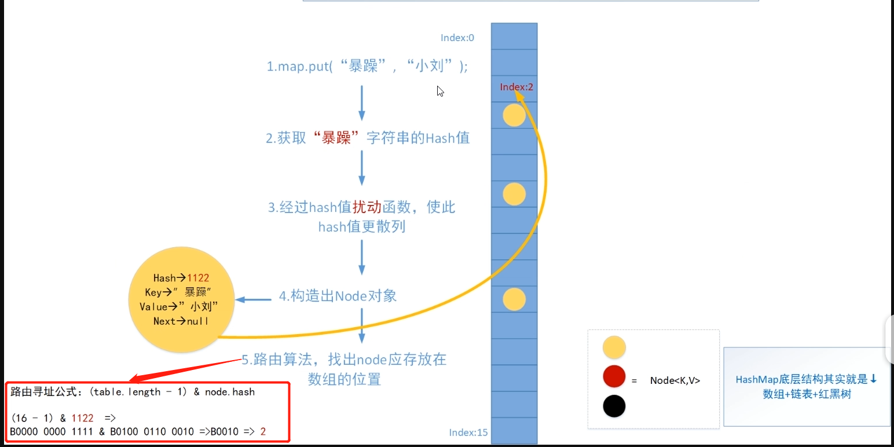

# JAVA容器
java容器主要为：
* List ：  存储的元素是有序的、可重复的。
* set ： 存储的元素是无序的、不可重复的。
* Map ：  使用键值对（kye-value）存储。

# HashMap底层数据结构分析

HashMap默认的加载因子是0.75，初始容量是16，因此可以得出HashMap的默认容量是：0.75*16=12。

**HashMap的加载因子是可以自定义的。**

## 什么是Hash
基本原理就是将**任意长度的输入**，转换成**固定长度的输出**。映射的规则就是hash算法，输出就是对应的hash值。       
hash的特点 : 
1. 从hash值不可以反推出原始的数据。
2. 输入数据的微小变化会得到不同的hash值，同一个输入的hash值一定相同。
3. 算法效率要高，长文本也要快速得到hash值。
4. 冲突的概率要小。

hash的原理是从输入空间映射到hash空间，hash空间较小，一定会出现hash冲突。

## JDK1.8之前

JDK1.8 之前 HashMap 由 数组+链表 组成的，数组是 HashMap 的主体，链表则是主要为了解决哈希冲突而存在的（“拉链法”解决冲突）。
* 拉链法 ：将链表和数组相结合。也就是说创建一个链表数组，数组中每一格就是一个链表。若遇到哈希冲突，则将冲突的值加到链表中即可。

HashMap 通过 key 的 hashCode 经过扰动函数处理过后得到 hash 值，然后通过 (n - 1) & hash 判断当前元素存放的位置（这里的 n 指的是数组的长度），如果当前位置存在元素的话，就判断该元素与要存入的元素的 hash 值以及 key 是否相同，如果相同的话，直接覆盖，不相同就通过拉链法解决冲突。

所谓扰动函数指的就是 HashMap 的 hash 方法。使用扰动函数（hash方法）是为了防止一些实现比较差的 hashCode() 方法 换句话说使用扰动函数之后可以减少碰撞。

## JDK1.8
JDK1.8 之后 HashMap 的组成多了红黑树，在满足下面两个条件之后，会执行链表转红黑树操作，以此来加快搜索速度。
* 链表长度大于阈值（默认为 8）
* HashMap 数组长度超过 64 

当链表长度大于阈值（默认为 8）时，会首先调用 treeifyBin()方法。这个方法会根据 HashMap 数组来决定是否转换为红黑树。只有当数组长度大于或者等于 64 的情况下，才会执行转换红黑树操作，以减少搜索时间。否则，就是只是执行 resize() 方法对数组扩容。

### 为什么引入红黑树
极端情况下，链化的长度很长。此时链表的查询效率就是O(n)。红黑树是平衡查找树，可以加快查找。

# PUT方法

## Q 为什么Entry（table）的长度一定是2的次幂
如图中的路由算法。源于一个数学规律，就是如果length是2的N次方，那么数h对length的模运算结果等价于a和(length-1)的按位与运算，也就是 h%length <=> h&(length-1)。
位运算效率远远高于取余，所以必须是2的次幂。

## JDK1.8
HashMap 只提供了 put 用于添加元素，putVal 方法只是给 put 方法调用的一个方法，并没有提供给用户使用。

对 putVal 方法添加元素的分析如下：
1. 如果定位到的数组位置没有元素 就直接插入。
2. 如果定位到的数组位置有元素就和要插入的 key 比较，如果 key 相同就直接覆盖，如果 key 不相同，就判断 p 是否是一个树节点，如果是就调用e = ((TreeNode<K,V>)p).putTreeVal(this, tab, hash, key, value)将元素添加进入。如果不是就遍历链表插入(插入的是链表尾部)。

补充 ： 
* 当链表长度大于阈值（默认为 8）并且 HashMap 数组长度超过 64 的时候才会执行链表转红黑树的操作，**否则就只是对数组扩容**。参考 HashMap 的 treeifyBin() 方法。
* 直接覆盖之后应该就会 return，不会有后续操作。
## JDK1.7
对于 put 方法的分析如下：
1. 如果定位到的数组位置没有元素 就直接插入。
2. 如果定位到的数组位置有元素，遍历以这个元素为头结点的链表，依次和插入的 key 比较，如果 key 相同就直接覆盖，不同就采用头插法插入元素。

## Resize方法
为了解决哈希冲突导致链化严重，查询效率低的问题，扩容可以缓解该问题。

# Concurrenthashmap

Concurrenthashmap默认的加载因子是0.75，由于有final关键字修饰，不可改变。