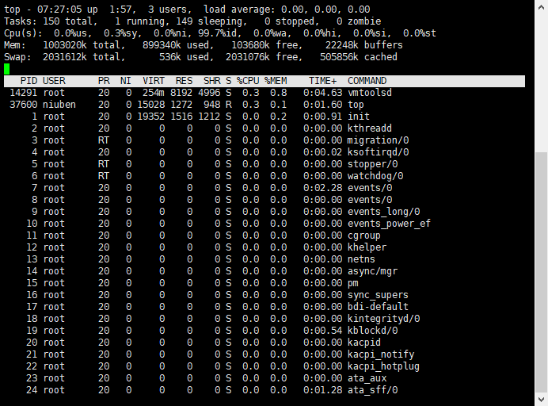
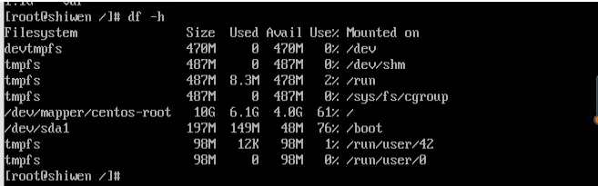
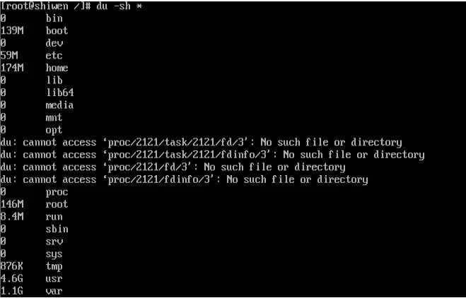

## Linux常用指令

修改权限：chmod

查看端口： lsof -i:端口号 ，netstat -npl 查看端口    

nc ：设置路由器的相关参数。

### 搜索指令
1. find
2. locate
   * 这里和 find 命令是有区别的，find是全盘检索，而locate 是在文件资料库中进行搜索。所以locate命令的执行要比find命令执行速度快很多。
3. which
   * 搜索命令所在的目录及别名信息
4. grep ： 在文件中搜寻字符串匹配的行并输出
    * 语法：grep -iv 【指定字符串】【文件】   -i 不区分大小写  -v 排除指定字符串

    * 范例：查找 /root/install.log 文件中包含 mysql 字符串的行，并输出。 指令：grep mysql /root/install.log
5. ag ：比grep更快的搜索

### top指令详解

load average: 3个值，分别记录了1min，5min,15min的系统平均负载。
* 是在一段时间内CPU正在处理以及等待CPU处理的进程数之和的统计信息，也就是CPU使用队列的长度的统计信息。
* 有时候也会遇到一种情况，Load很高，但系统的CPU使用率却比较低。可能的原因是频繁的上下文切换导致耗费了大量的CPU时间，以至于用在运算的CPU时间片比较少.

cpu上下文切换：
1. 挂起当前任务（线程/进程），将这个任务在 CPU 中的状态（上下文）存储于内存中的某处
2. 恢复一个任务（线程/进程），在内存中检索下一个任务的上下文并将其在 CPU 的寄存器中恢复
3. 跳转到程序计数器所指向的位置（即跳转到任务被中断时的代码行），以恢复该进程在程序中

cpu:
* ni%: 是低优先级进程占cpu的比例
* us%: 用户态比例
* sy%: 内核态比例
    * 频繁的cpu切换

* PID — 进程id
* USER — 进程所有者
* PR — 进程优先级
* NI — nice值。数值越小、优先级越高。负值表示高优先级，正值表示低优先级
* VIRT — 进程使用的虚拟内存总量，单位kb。VIRT=SWAP+RES
* RES — 进程使用的、未被换出的物理内存大小，单位kb。RES=CODE+DATA
* SHR — 共享内存大小，单位kb
* S —进程状态。D=不可中断的睡眠状态 R=运行 S=睡眠 T=跟踪/停止 Z=僵尸进程
* %CPU — 上次更新到现在的CPU时间占用百分比
* %MEM — 进程使用的物理内存百分比
* TIME+ — 进程使用的CPU时间总计，单位1/100秒
* COMMAND — 进程名称（命令名/命令行）

## 除了top外查看linux内存指令
free -m:
* total 表示总共有 7822MB 的物理内存(RAM)，即7.6G。
* used 表示物理内存的使用量，大约是 322M。
* free 表示空闲内存;
* shared 表示共享内存?;
* buff/cache 表示缓存和缓冲内存量; Linux 系统会将很多东西缓存起来以提高性能，这部分内存可以在必要时进行释放，给其他程序使用。
* available 表示可用内存;

### 查看指定端口、某个服务占用情况

一，指定端口，例8080
1. netstat -tunlp |grep  8080
2. lsof  -i:8080

二、查看服务器所有端口
1. netstat -ntlp

三、查看某进程端口占用，例Tomcat
1. ps -ef |grep tomcat

## 查看磁盘空间
Linux磁盘管理常用三个命令为df、du和fdisk。
* df：列出文件系统的整体磁盘使用量
* du：检查磁盘空间使用量
* fdisk：用于磁盘分区

查看系统剩余空间： df -h

* tmpfs 是一个不存在于实体硬盘上、而是驻在记忆里的特殊文件系统。其中一个副作用就是当你失去电源（或重就开机）时，tmpfs 上的一切内容都会消失。tmpfs 驻守在内存里，它的速度极快。它的寻觅时间与驻守在硬盘上的一般文件系统根本不能相比。

查看每个文件夹的占用情况：du -sh*

## 孤儿进程
一个父进程退出，而它的一个或多个子进程还在运行，那么这些子进程将成为孤儿进程。

孤儿进程将被 init 进程（进程号为 1）所收养，并由 init 进程对它们完成状态收集工作。

由于孤儿进程会被 init 进程收养，所以孤儿进程不会对系统造成危害。

## 僵尸进程
一个子进程的进程描述符在子进程退出时不会释放，只有当父进程通过 wait() 或 waitpid() 获取了子进程信息后才会释放。如果子进程退出，而父进程并没有调用 wait() 或 waitpid()，那么子进程的进程描述符仍然保存在系统中，这种进程称之为僵尸进程。

僵尸进程通过 ps 命令显示出来的状态为 Z（zombie）。

系统所能使用的进程号是有限的，如果产生大量僵尸进程，将因为没有可用的进程号而导致系统不能产生新的进程。

要消灭系统中大量的僵尸进程，只需要将其父进程杀死，此时僵尸进程就会变成孤儿进程，从而被 init 进程所收养，这样 init 进程就会释放所有的僵尸进程所占有的资源，从而结束僵尸进程。