# 内存管理
1. 内存空间的分配和回收。
2. 操作系统需要提供某种技术从逻辑上对内存空间进行扩充（虚拟存储）。
3. 操作系统需要提供地址转换功能，负责程序的逻辑地址与物理地址的转换。
4. 操作系统需要提供内存保护功能。保证各进程在各自存储空间内运行，互不干扰。

## 内存保护
方法一： 在CPU中设置一对上、下限寄存器， 存放进程的上、下限地址。进程的指令要访问某个地址时，CPU检查是否越界。

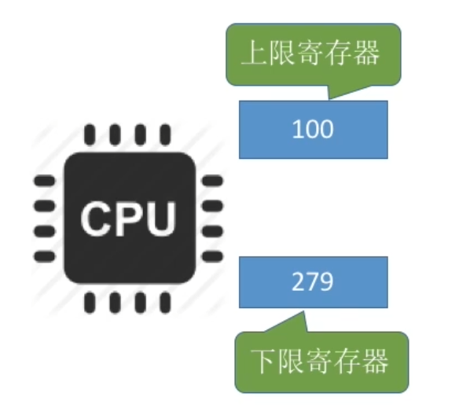

方法二： 采用重定位寄存器(又称基址寄存器)和界地址寄存器(又称限长寄存器)进行越界检查。重定位寄存器中存放的是进程的起始物理地址。界地址寄存器中存放的是进程的最大逻辑地址。

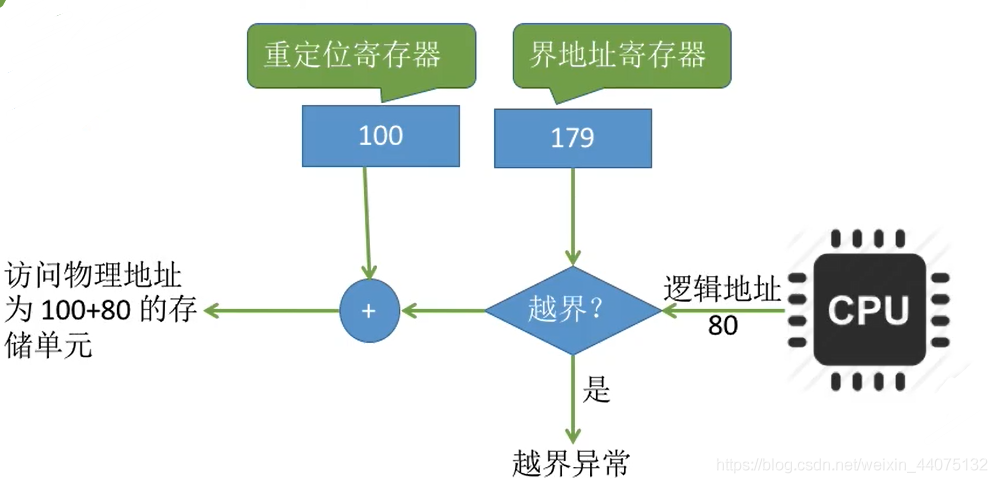

## 内存空间的分配与回收
* 连续分配
    * 系统为用户进程分配的必须是一个连续的内存空间（不重要）
* 非连续分配
    * 如果允许将一个进程分散地装入到许多不相邻的分区中，便可充分地利用内存，而无需再进行紧凑.

* 内部碎片，分配给某进程的内存区域中，如果有些部分没有用上。
* 外部碎片，是指内存中的某些空闲分区由于太小而难以利用。

### 单一连续分配
在单一连续分配方式中,内存被分为系统区和用户区。系统区通常位于内存的低地址部分，用于存放操作系统相关数据;用户区用于存放用户进程相关数据。内存中只能有一道用户程序，用户程序独占整个用户区空间。

* 优点:实现简单;无外部碎片;可以采用覆盖技术扩充内存;不一定需要采取内存保护(eg: 早期的PC操作系统MS-DOS)。

* 缺点:只能用于单用户、单任务的操作系统中;有内部碎片;存储器利用率极低。

### 固定分区分配

20世纪60年代出现了支持多道程序的系统，为了能在内存中装入多道程序，且这些程序之间又不会相互干扰，于是将整个用户空间划分为若千个固定大小的分区，
在每个分区中只装入一道作业，这样就形成了最早的、最简单的一种可运行多道程序的内存管理方式。

* 可以分为大小相等和大小不相等的分区，重点是提前分好

### 动态分区分配
动态分区分配又称为可变分区分配。这种分配方式不会预先划分内存分区，而是在进程装入内存时，根据进程的大小动态地建立分区，并使分区的大小正好适合进程的需要。因此系统分区的大小和数目是可变的。

## 基本分页存储管理（非连续）

基本思想 ：把内存分为一个个相等的小分区，再按照分区大小把进程拆分成一个个小部分。

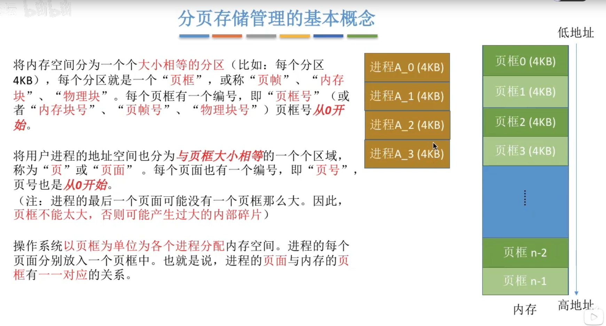

* 叶框是内存中每一个小分区。
* 页面是用户进程分成的与叶框大小相等的一个个区域。

### 地址转换

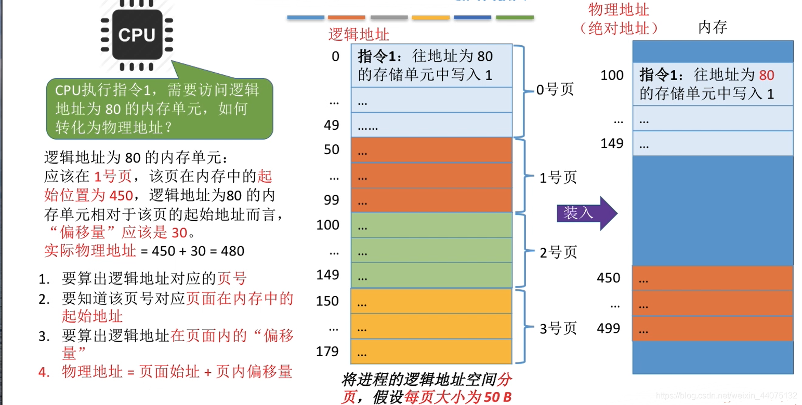

* 页号 = 逻辑地址/页面长度(取除法的整数部分)
* 页内偏移 = 逻辑地址%页面长度(取除法的余数部分)
* 为了方便计算，页面大小一般为2的整数幂

页面在内存中的起始位置:操作系统需要用页表记录进程各个页面的起始位置.
1. 一个进程对应一张页表
2. 进程的每一页对应一个页表项
3. 每个页表项由“页号”“块号”组成
    * 页号是隐含的。只要知道页表错放的起始地址和页表项长度，就可以找到各个页号对应的页表项的位置。
4. 页表记录进程页面和实际存放的内存块之间的关系

页表起始地址和长度放在进程块PCB中，进程被调度时，转入页表寄存器(PTR)。

### 快表
快表，又称联想寄存器(TLB) ，是一种访问速度比内存快很多的高速缓冲存储器，用来存放当前访问的若干页表项，以加速地址变换的过程。与此对应，内存中的页表常称为慢表。

* 时间局部性:如果执行了程序中的某条指令，那么不久后这条指令很有可能再次执行;如果某个数据被访问过，不久之后该数据很可能再次被访问。(因为程序中存在大量的循环)
* 空间局部性:一旦程序访问了某个存储单元，在不久之后，其附近的存储单元也很有可能被访问。(因为很多数据在内存中都是连续存放的)

简单理解：最近使用过的页表放入快表，查内存地址先查快表。

### 两级页表
单级页表的问题：
1. 需要专门给进程分配大量连续的页框来存放它的页表
2. 根据局部性原理可知，很多时候，进程在一段时间内只需要访问某几个页面就可以正常运行了。因此没有必要让整个页表都常驻内存。

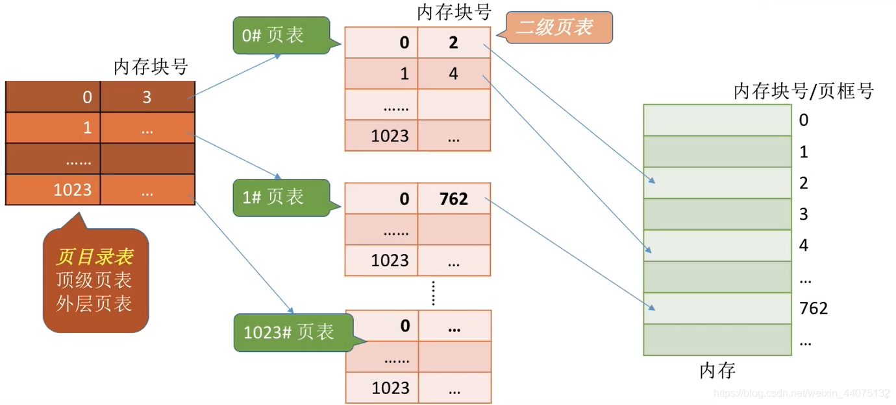

可将长长的页表进行分组，使每个内存块刚好可以放入一个分组(比如页面大小4KB,每个页表项4B，每个页面可存放1K个页表项，因此每1K个连续的页表项为一组，每组刚好占一个存块，再讲各组离散地放到各个内存块中)

另外，要为离散分配的页表再建立一张页表，称为页目录表，或称外层页表，或称顶层页表

两级页表的访存次数分析(假设没有快表机构)：
1. 第一次访存:访问内存中的页目录表
2. 第二次访存:访问内存中的二级页表
3. 第三次访存:访问目标内存单元

## 基本分段存储管理（非连续）
进程的地址空间:按照程序自身的逻辑关系划分为若干个段，每个段都有-一个段名(在低级语言中，程序员使用段名来编程)，每段从0开始编址

内存分配规则:以段为单位进行分配，每个段在内存中占据连续空间，但各段之间可以不相邻。

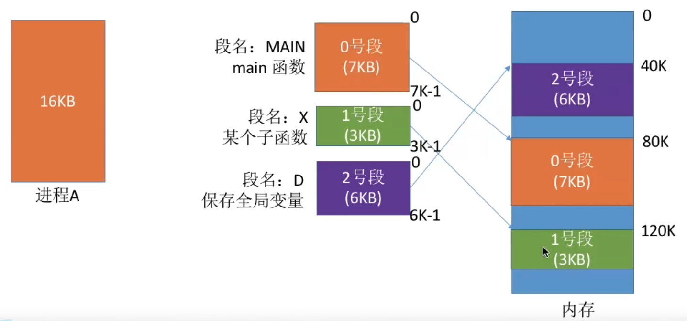

分段系统的逻辑地址结构由段号(段名)和段内地址(段内偏移量)所组成。

### 段表

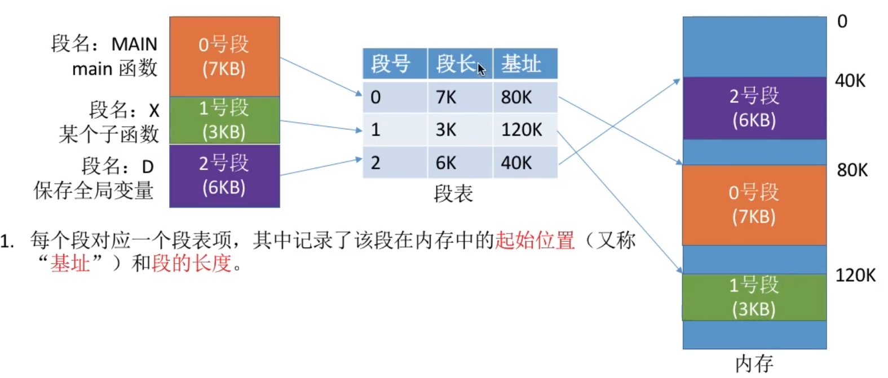

1. 每个段对应一个段表项，其中记录了该段在内存中的起始位置(又称基址”)和段的长度。

2. 各个段表项的长度是相同的。同页号，**段号可以是隐含的**

访问流程：

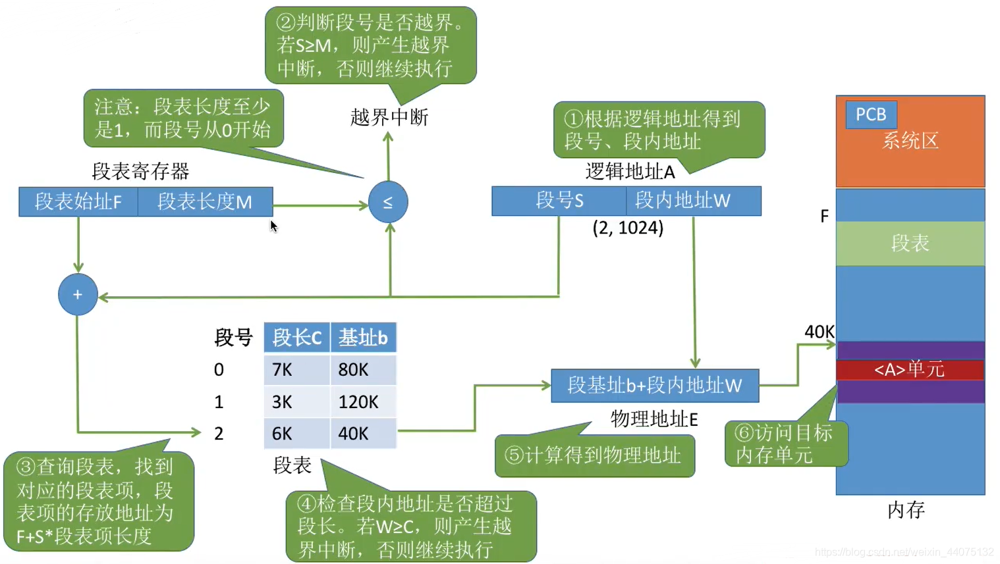

* 页是信息的物理单位。分页的主要目的是为了实现离散分配，提高内存利用率。分页仅仅是系统管理上的需要，完全是系统行为，对用户是不可见的。
* 段是信息的逻辑单位。分段的主要目的是更好地满足用户需求。一个段通常包含着一组属于一个逻辑模块的信息。分段对用户是可见的，用户编程时需要显式地给出段名。
* 页的大小固定且由系统决定。段的长度却不固定，决定于用户编写的程序。
* 分段比分页更容易实现信息的共享和保护

## 段页式存储管理（非连续）
分页管理：	
* 内存空间利用率高，不会产生外部碎片，只会有少量的页内碎片	
* 不方便按照逻辑模块实现信息的共享和保护

分段管理：	
* 很方便按照逻辑模块实现信息的共享和保护	
* 如果段长过大，为其分配很大的连续空间会很不方便。另外，段式管理会产生外部碎片

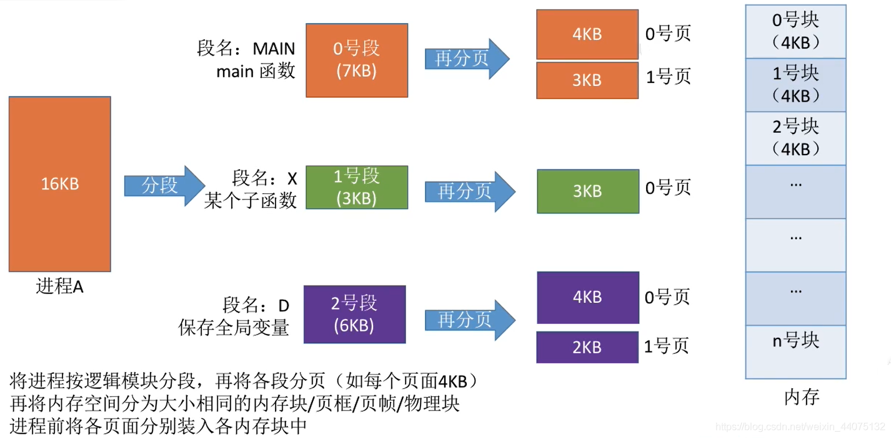

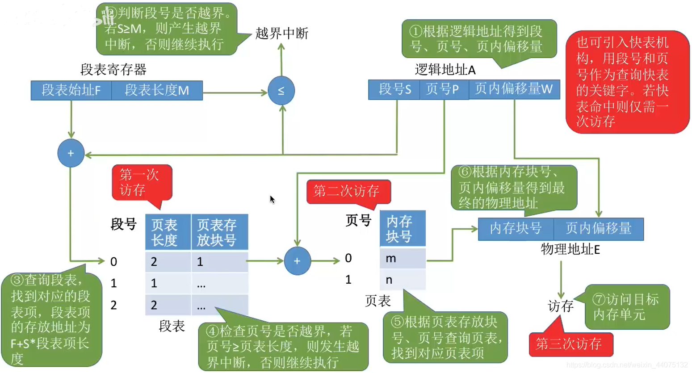

1. 由逻辑地址得到段号S、页号P、页内偏移量W
2. 段号与段表寄存器中的段长度比较，检查是否越界
3. 由段表始址、段号找到对应段表项
4. 根据段表中记录的页表长度，检查页号是否越界
5. 由段表中的页表地址、页号得到查询页表，找到相应页表项
6. 由页面存放的内存块号、页内偏移量得到最终的物理地址
7. 访问目标单元

## 内存扩充
内存扩充有覆盖技术，交换技术，虚拟内存技术。
## 覆盖技术
覆盖是在同一个程序或进程中的。

覆盖技术的思想:将程序分为多个段(多个模块)。常用的段常驻内存，不常用的段在需要时调入内存。

内存中分为一个“固定区”和若干个“覆盖区” 。需要常驻内存的段放在“固定区”中，调入后就不再调出(除非运行结束)

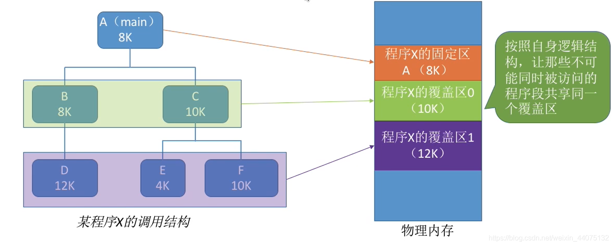

必须由程序员声明覆盖结构，操作系统完成自动覆盖。

缺点:对用户不透明，增加了用户编程负担。

覆盖技术只用于早期的操作系统中，现在已成为历史。

## 交换技术

交换(对换)技术的设计思想:内存空间紧张时，系统将内存中某些进程暂时换出外存，把外存中某些已具备运行条件的进程换入内存(进程在内存与磁盘间动态调度)

* 交换是在不同进程(或作业)之间的
* PCB常驻内存

### 应该在外存(磁盘)的什么位置保存被换出的进程?？

具有对换功能的操作系统中，通常把磁盘空间分为文件区和对换区两部分。

文件区主要用于存放文件，主要追求存储空间的利用率，因此对文件区空间的管理采用离散分配方式;

对换区空间的管理主要追求换入换出速度，因此通常对换区采用连续分配方式。I/O速度快于文件区。

### 什么时候应该交换?
交换通常在许多进程运行且内存吃紧时进行，而系统负荷降低就暂停。

例如:在发现许多进程运行时经常发生缺页，就说明内存紧张，此时可以换出一些进程;如果缺页率明显下降，就可以暂停换出。

### 应该换出哪些进程?

可优先换出阻塞进程;可换出优先级低的进程;为了防止优先级低的进程在被调入内存后很快又被换出，有的系统还会考虑进程在内存的驻留时间…

## 虚拟内存
传统内存管理的两个缺点：
1. 一次性：作业必须一次性全部装入内存后才能开始运行
    * 作业很大时，不能全部装入内存，导致大作业无法运行
    * 大量作业运行时，内存无法容纳所有作业，只有少量作业能运行，并发度下降。
2. 驻留性 ：一旦作业装入内存，就会一直驻留在内存
    * 事实上，一个时间段内，只需要访问作业的一小部分数据即可作业。这就导致内存驻存大量用不到的数据，浪费资源
    
虚拟内存的目的是为了让物理内存扩充成更大的逻辑内存，从而让程序获得更多的可用内存。

虚拟内存的主要特征：
1. 多次性： 无需在作业运行时一次性全部装入内存，而是允许被分成多次调入内存。
2. 兑换性： 在作业运行时无需一直常驻内存，而是允许在作业运行中换入换出
3. 虚拟性： 从逻辑上扩充了内存的容量，使用户看到的内存容量远大于实际容量。

虚拟内存的实现需要建立在离散分配的内存管理方式上。相比于之前的段页，需要增加功能：
* 请求调页：访问的信息不在内存时，将所需要的的内存从外存调入内存。
* 页置换： 内存空间不够时，将内存中用不到的信息换出到外存。

## 页面置换

在程序运行过程中，如果要访问的页面不在内存中，就发生缺页中断.然后将该页调入内存中。此时如果内存已无空闲空间，系统必须从内存中调出一个页面到磁盘对换区中来腾出空间。

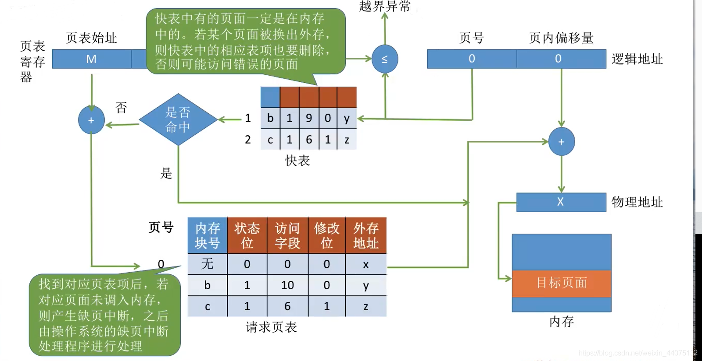

页面置换算法和缓存淘汰策略类似，可以将内存看成磁盘的缓存。在缓存系统中，缓存的大小有限，当有新的缓存到达时，需要淘汰一部分已经存在的缓存，这样才有空间存放新的缓存数据。

页面置换算法的主要目标是使页面置换频率最低（也可以说缺页率最低）。

## 常见页面置换算法

1. 最佳 （OPT, Optimal replacement algorithm）

**所选择的被换出的页面将是最长时间内不再被访问**，通常可以保证获得最低的缺页率。

是一种**理论上的算法**，因为无法知道一个页面多长时间不再被访问。

2. 最近最久未使用 （LRU, Least Recently Used）

虽然无法知道将来要使用的页面情况，但是可以知道过去使用页面的情况。LRU 将最近最久未使用的页面换出。

为了实现 LRU，需要在内存中维护一个所有页面的链表。当一个页面被访问时，将这个页面移到链表表头。这样就能保证链表表尾的页面是最近最久未访问的。

3. 最近未使用 （NRU, Not Recently Used）

每个页面都有两个状态位：R 与 M，当页面被访问时设置页面的 R=1，当页面被修改时设置 M=1。其中 R 位会定时被清零。可以将页面分成以下四类：

R=0，M=0

R=0，M=1

R=1，M=0

R=1，M=1

当发生缺页中断时，NRU 算法随机地从类编号最小的非空类中挑选一个页面将它换出。

**NRU 优先换出已经被修改的脏页面（R=0，M=1），而不是被频繁使用的干净页面（R=1，M=0）。**

4. 先进先出（FIFO, First In First Out）

选择换出的页面是最先进入的页面。

该算法会将那些经常被访问的页面换出，导致缺页率升高。

5. 第二次机会算法
   
FIFO 算法可能会把经常使用的页面置换出去，为了避免这一问题，对该算法做一个简单的修改：

当页面被访问 (读或写) 时设置该页面的 R 位为 1。需要替换的时候，检查最老页面的 R 位。如果 R 位是 0，那么这个页面既老又没有被使用，可以立刻置换掉；如果是 1，就将 R 位清 0，并把该页面放到链表的尾端，修改它的装入时间使它就像刚装入的一样，然后继续从链表的头部开始搜索。

6. 时钟

第二次机会算法需要在链表中移动页面，降低了效率。时钟算法使用环形链表将页面连接起来，再使用一个指针指向最老的页面。

## 抖动(颠簸)现象
刚刚换出的页面马上又要换入内存，刚刚换入的页面马上又要换出外存，这种频繁的页面调度行为称为抖动，或颠簸。

产生抖动的主要原因是进程频繁访问的页面数目高于可用的物理块数(分配给进程的物理块不够)

为进程分配的物理块太少，会使进程发生抖动现象。为进程分配的物理块太多，又会降低系统整体的并发度，降低某些资源的利用率

