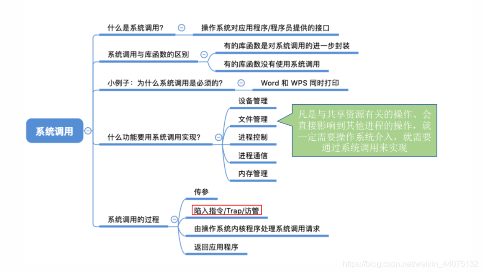

## 操作系统的四大特征

1. 并发
   
发性依然是必不可少的，因此并发性是操作系统一个最基本的特性

* 并发：指两个或多个事件在同一时间间隔内发生。这些事件宏观上是同时发生的，但微观上是交替发生的。

* 并行：指两个或多个事件在同一时刻同时发生。

操作系统的并发性指计算机系统中同时运行着多个程序，这些程序宏观上看是同时运行着的，而微观上看是交替运行的。

单核CPU同一时刻只能执行一个程序，各个程序只能并发地执行

多核CPU同一时刻可以同时执行多个程序，多个程序可以并行地执行

2. 共享

共享即资源共享，是指系统中的资源可供内存中多个并发执行的进程共同使用。

* 互斥共享方式：一段时间内只允许一个进程访问该资源
* 同时共享方式：允许多个进程“同时”进行访问

并发和共享的关系：
* 并发性指计算机系统中同时存在着多个运行着的程序。
* 共享性是指系统中的资源可供内存中多个并发执行的进程共同使用。

3. 虚拟

虚拟是指把一个物理上的实体变为若干个逻辑上的对应物。物理实体（前者）是实际存在的，而逻辑上对应物（后者）是用户感受到的。

* 空分复用技术
    * 虚拟内存
* 时分复用技术
    * 虚拟处理器
    
4. 异步

异步是指，在多道程序环境下，允许多个程序并发执行，但由于资源有限，进程的执行不是一贯到底的，而是走走停停，以不可预知的速度向前推进，这就是进程的异步性。

由于并发运行的程序会争抢着使用系统资源，而系统中的资源有限，因此进程的执行不是一贯到底的，而是走走停停的，以不可预知的速度向前推进。

如果失去了并发性，即系统只能串行地运行各个程序，那么每个程序的执行会一贯到底。只有系统拥有并发性，才有可能导致异步性。

## 0S的运行机制与体系结构

两种指令：

有的指令“人畜无害”。比如:加、减、乘、除这些普通的运算指令。

有的指令有很高的权限。比如:内存清零指令。如果用户程序可以使用这个指令，就意味着一个用户可以将其他用户的内存数据随意清零，这样做显然是很危险的

两种处理器状态：

也就是用户态和内核态。

两种程序：

### 中断和异常

中断的作用：

CPU 上会运行两种程序，一种是操作系统内核程序，一种是应用程序 。“中断”会使CPU由用户态变为内核态，使操作系统重新夺回对CPU的控制权

“中断”是让操作系统内核夺回CPU使用权的唯一途径

如果没有“中断”机制，那么一旦应用程序上CPU运行，CPU就会一直运行这个应用程序

* 内核态 → 用户态：执行一条特权指令——修改PSW的标志位为“用户态”，这个动作意味着操作系统将主动让出CPU使用权

* 用户态 → 内核态：由“中断”引发，硬件自动完成变态过程，触发中断信号意味着操作系统将强行夺回CPU的使用权

中断的类型： 
1. 内中断
    * 与当前执行的指令有关，中断信号来源于CPU内部。CPU在执行指令时会检查是否有异常发生
    * 试图在用户态下执行特权指令 
    * 执行除法指令时发现除数为 0 若当前执行的指令是非法的，则会引发一个中断信号
    * 有时候应用程序想请求操作系统内核的服务，此时会执行一条特殊的指令——陷入指令，该指令会引发一个内部中断信号
2. 外中断
    * 每一条指令执行结束时，CPU都会例行检查是否有外中断信号 。与当前执行的指令无关，中断信号来源于CPU外部
    * 时钟中断——由时钟部件发来的中断信号
    * I/O中断——由输入 / 输出设备发来的中断信号

不同的中断信号，需要用不同的中断处理程序来处理。当CPU检测到中断信号后，会根据中断信号的类型去查询“中断向量表”，以此来找到相应的中断处理程序在内存中的存放位置。

## 系统调用

操作系统作为用户和计算机硬件之间的接口，需要向上提供一些简单易用的服务。主要包括命令接口和程序接口。其中程序接口由一组系统调用组成。

“系统调用”是操作系统提供给应用程序（程序员 / 编程人员）使用的接口，可以理解为一种可供应用程序调用的特殊函数，应用程序可以通过系统调用来请求获得操作系统内核的服务

什么功能要用到系统调用？

应用程序通过系统调用请求操作系统的服务。而系统中的各种共享资源都由操作系统内核统一掌管，因此凡是与共享资源有关的操作（如存储分配、I/O操作、文件管理等），都必须通过系统调用的方式向操作系统内核提出服务请求，由操作系统内核代为完成。这样可以保证系统的稳定性和安全性，防止用户进行非法操作。

传递系统调用参数—>执行陷入指令（用户态）—> 执行相应的内请求核程序处理系统调用（核心态）—>返回

注意:
1. 陷入指令是在用户态执行的，执行陷入指令之后立即引发一个内中断，使CPU进入核心态
2. 发出系统调用请求是在用户态，而对系统调用的相应处理在核心态下进行
3. 陷入指令是唯一一个不能再核心态下执行的指令

