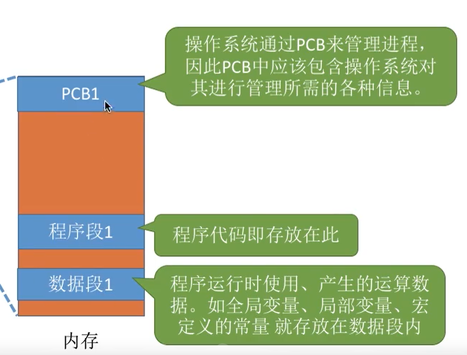
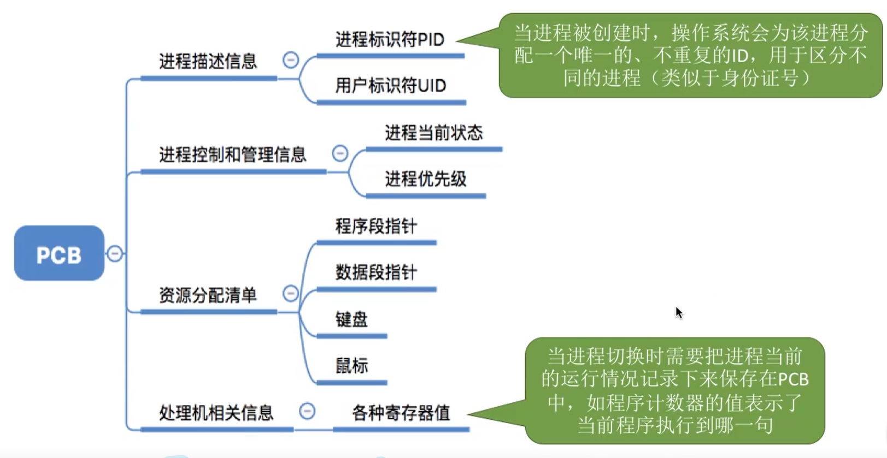
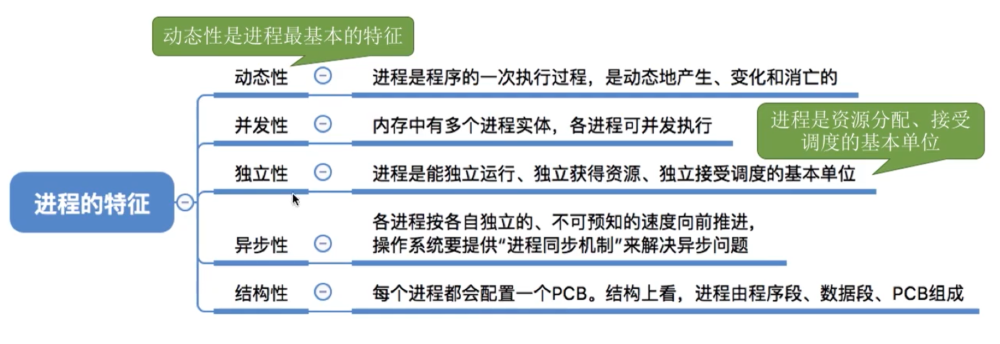
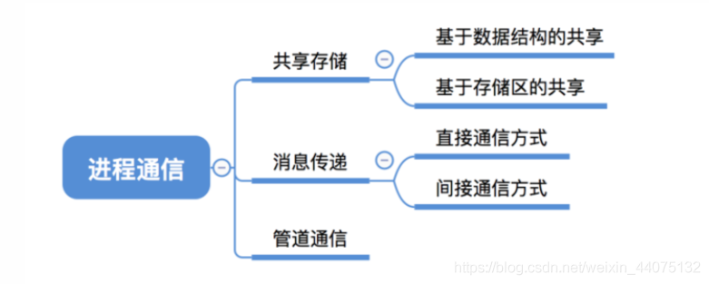
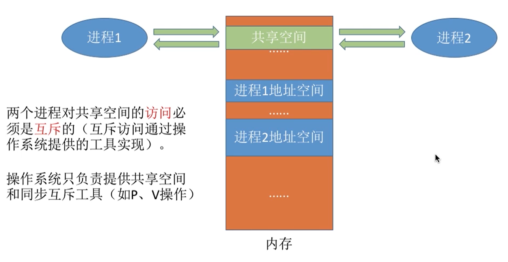
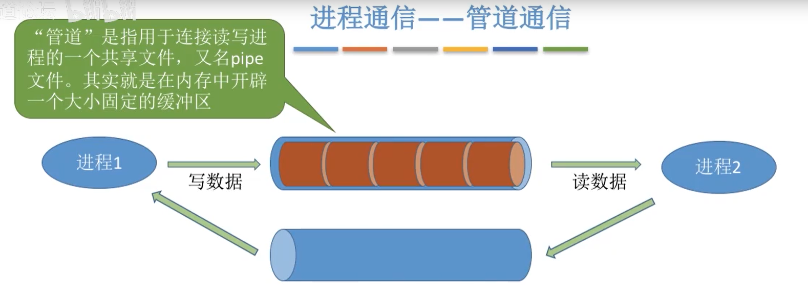

## 进程的定义

程序段，数据段，PCB三部分组成了进程实体。

进程是进程实体的运行过程，是系统进行资源分配和调度的一个独立单位

* 操作系统所需要的的数据都在PCB中
* 程序本身的运行所需的数据在程序段与数据段中

进程的三种基本状态：
* 运行态 ： 占有CPU，并在CPU上运行
* 就绪态 : 已具备运行条件，但由于没有空闲的CPU而暂时无法运行
* 阻塞态（等待态） ： 因等待某一事件而暂时不能运行

另外两种状态：
* 创建态： 进程正在被创建，操作系统为进程分配资源，初始化PCB
* 终止态： 进程正在从系统中撤销，操作系统会回收进程的所有资源，撤销PCB

## 进程线程区别
1. 拥有资源

进程是资源分配的基本单位，但是线程不拥有资源，线程可以访问隶属进程的资源。

2. 调度

线程是独立调度的基本单位，在同一进程中，线程的切换不会引起进程切换，从一个进程中的线程切换到另一个进程中的线程时，会引起进程切换。

3. 系统开销

由于创建或撤销进程时，系统都要为之分配或回收资源，如内存空间、I/O 设备等，所付出的开销远大于创建或撤销线程时的开销。

类似地，在进行进程切换时，涉及当前执行进程 CPU 环境的保存及新调度进程 CPU 环境的设置，而线程切换时只需保存和设置少量寄存器内容，开销很小。

4. 通信方面

线程间可以通过直接读写同一进程中的数据进行通信，但是进程通信需要借助 IPC。

## 限制进程：内核态和用户态
进程可分为两种类型。 一是操作系统自身运行时的内核类进程，也称为操作系统进程。

另一种即非内核类进程，不是操作系统自身的进程，而是想要实现某些功能，用户自己去启动的程序产生的进程，也称为用户类进程或用户进程。

操作系统自身也是一个程序，它启动之后也有很多内核进程在后台工作，而且这些内核进程都非常重要，是操作系统正常运行并提供服务的必要进程，比如负责调度类的进程、内存管理类进程等。

* 操作系统必须掌握最高控制权限，其他用户进程都不能具备这些权限
* 操作系统必须在任何有需要的时候暂停某个进程并切换到操作系统内核，拿到cpu的控制权

对此，cpu提供了两种运行模式：内核模式和用户模式

* 内核模式和用户模式这两种进程状态是CPU提供的控制，而不是操作系统提供的。在CPU中一个称为PSW（program status word，程序状态字）的寄存器中保存了和进程有关的一些控制位，例如内核模式和用户模式的进程状态。

这两种模式描述了进程的工作状态，是工作在内核模式下还是工作在用户模式下。在内核模式下，表示具备了最高权限，操作系统自身进程都是工作在内核模式下；

在用户模式下，执行的代码将受到一些限制，用户进程都是工作在用户模式下，该模式下的进程不能执行一些关键性的操作，

## 系统调用

系统调用（system call）就是操作系统提供给用户进程请求操作系统做一些特权操作的接口，即为用户进程提供服务的窗口。在Linux下可以通过man syscalls命令查看Linux提供的所有系统调用。

理解系统调用：
* 比如有一个程序想要读取a.log文件（例如head -n 1 a.log），读取之前必须先打开文件，但是用户进程是没有权限打开文件的，所以用户进程只能发送一个open()的系统调用请求操作系统去帮忙打开这个文件，操作系统打开这个文件后会将打开的结果——文件描述符交给用户进程，用户进程通过这个文件描述符就能去操作这个文件。

* 再进一步，用户进程想要从这个打开的文件中读取一行数据，用户进程是没有权限读取文件的，只能发送一个read()系统调用请求操作系统去读取这一行数据，操作系统读取这行数据后就能交给用户进程。

Q：系统打开读取一个文件怎么操作？

就是上面说的系统调用。用户进程调用操作系统的接口去完成的。

## 进程控制
用原语实现进程控制 。原语是一种特殊的程序，它的执行具有原子性。也就是说，这段程序的运行必须一气呵成，不可中断

### 如何实现原语的“原子性”？

可以用“关中断指令”和“开中断指令”这两个特权指令实现原子性

CPU执行了关中断指令之后，就不再例行检查中断信号，直到执行开中断指令之后才会恢复检查。这样，关中断、开中断之间的这些指令序列就是不可被中断的，这就实现了“原子性”

## 进程通讯

### 共享存储

1. 基于数据结构的共享：比如共享空间里只能放一个长度为10的数组。这种共享方式速度慢、限制多，是一种低级通信方式。
2. 基于存储区的共享：在内存中画出一块共享存储区，数据的形式、存放位置都由进程控制，而不是操作系统。相比之下，这种共享方式速度更快，是一种高级通信方式。

### 管道通信

1. 管道只能采用半双工通信，某一时间段内只能实现单向的传输。如果要实现双向同时通信，则需要设置两个管道。
2. 各进程要互斥地访问管道。
3. 数据以字符流的形式写入管道，当管道写满时，写进程的write() 系统调用将被阻塞，等待读进程将数据取走。当读进程将数据全部取走后，管道变空，此时读进程的read() 系统调用将被阻塞。（缓冲区的特性）
4. 如果没写满，就不允许读。如果没读空，就不允许写。（缓冲区的特性）
5. 数据一旦被读出，就从管道中被抛弃，这就意味着读进程最多只能有一个，否则可能会有读错数据的情况。

### 消息传递

进程间的数据交换以格式化的消息（Message）为单位。进程通过操作系统提供的“发送消息 / 接收消息”两个原语进行数据交换。

* 例如消息队列，socket

## 进程调度算法
### 批处理系统
   
批处理系统没有太多的用户操作，在该系统中，调度算法目标是保证吞吐量和周转时间（从提交到终止的时间）。

1. 先来先服务 first-come first-serverd（FCFS）

非抢占式的调度算法，按照请求的顺序进行调度。

有利于长作业，但不利于短作业，因为短作业必须一直等待前面的长作业执行完毕才能执行，而长作业又需要执行很长时间，造成了短作业等待时间过长。

2. 短作业优先 shortest job first（SJF）

非抢占式的调度算法，按估计运行时间最短的顺序进行调度。

长作业有可能会饿死，处于一直等待短作业执行完毕的状态。因为如果一直有短作业到来，那么长作业永远得不到调度。

3. 最短剩余时间优先 shortest remaining time next（SRTN）

最短作业优先的抢占式版本，按剩余运行时间的顺序进行调度。 当一个新的作业到达时，其整个运行时间与当前进程的剩余时间作比较。如果新的进程需要的时间更少，则挂起当前进程，运行新的进程。否则新的进程等待。

### 交互式系统
   
交互式系统有大量的用户交互操作，在该系统中调度算法的目标是快速地进行响应。

1. 时间片轮转

将所有就绪进程按 FCFS 的原则排成一个队列，每次调度时，把 CPU 时间分配给队首进程，该进程可以执行一个时间片。当时间片用完时，由计时器发出时钟中断，调度程序便停止该进程的执行，并将它送往就绪队列的末尾，同时继续把 CPU 时间分配给队首的进程。

时间片轮转算法的效率和时间片的大小有很大关系：

因为进程切换都要保存进程的信息并且载入新进程的信息，如果时间片太小，会导致进程切换得太频繁，在进程切换上就会花过多时间。
而如果时间片过长，那么实时性就不能得到保证。

2. 优先级调度

为每个进程分配一个优先级，按优先级进行调度。

为了防止低优先级的进程永远等不到调度，可以随着时间的推移增加等待进程的优先级。

3. 多级反馈队列

一个进程需要执行 100 个时间片，如果采用时间片轮转调度算法，那么需要交换 100 次。

多级队列是为这种需要连续执行多个时间片的进程考虑，它设置了多个队列，每个队列时间片大小都不同，例如 1,2,4,8,..。进程在第一个队列没执行完，就会被移到下一个队列。这种方式下，之前的进程只需要交换 7 次。

每个队列优先权也不同，最上面的优先权最高。因此只有上一个队列没有进程在排队，才能调度当前队列上的进程。

可以将这种调度算法看成是时间片轮转调度算法和优先级调度算法的结合。

### 实时系统
实时系统要求一个请求在一个确定时间内得到响应。

分为硬实时和软实时，前者必须满足绝对的截止时间，后者可以容忍一定的超时。

## 进程通讯
### 管道
管道是操作系统提供的一种最基本的进程间通信方式。每创建一个管道，就有两个文件描述符，一个是负责读管道的，一个是负责写管道的。所以，使用管道通信时，可以看作是两个文件描述符加一段内核空间中的内存，

* 只支持半双工通信（单向交替传输）；
* 只能在父子进程或者兄弟进程中使用。

### 套接字（Socket）
套接字（Socket）用于协调不同计算机上的进程间通信，也就是基于网络的通信。当然，也可以在本机上使用套接字进行进程间的通信。

套接字通信的方式非常多，有Unix域套接字、TCP套接字、UDP套接字、链路层套接字等等。

* socket可以做到不同机器进程间的通讯

### 文件映射和内存共享

* 文件映射（Memory-mapped file）是将磁盘上文件的某段数据映射到内核的一段物理内存上，然后将此物理内存映射到一个或多个进程的虚拟内存中。映射了文件的进程可以直接读、写这段内存来达到读、写磁盘文件的功能

    * 文件映射进行了两次映射，一次映射是将属于磁盘文件的部分或全部数据块映射到物理内存页中，另一次映射是将物理内存页映射到进程的虚拟页上。

    * 这段物理内存分配在进程虚拟内存布局中间那片未分配的地址空间，并且为堆和栈都预留一段未分配空间。
    
* 共享内存（Shared Memory）是直接从内核维护的内存中划分一片内存，并将该内存映射到一个或多个进程中。

    * 因为可能多个进程映射到同一共享内存，所以某进程对此内存数据的修改会直接影响其它进程，这样就能在进程之间传递消息。但也正因为如此，在使用共享内存时，应当保证没有两个或以上的进程同时修改共享内存数据。

    * 共享内存是效率最高的进程间通信方式，它完全内存化操作，且没有任何内存拷贝行为，此外，内存映射到不同进程之后，操作系统就不再参与该片内存的操作，用户进程可以有权访问这段内存。

内存共享和文件映射非常像，不同之处就在于共享内存没有对具体的磁盘文件进行映射，而是直接映射物理内存到进程中。所以，它也映射在进程堆栈中间的那片未分配内存上。

### 消息队列
消息队列（Message Queue）用于在进程之间传递较小的数据，进程可以向一个或多个消息队列中放入数据（消息），其它进程可以从消息队列中按照各种方式（例如最典型的先进先出FIFO方式）取出消息，从而实现进程间通信。

消息队列是一种生产者消费者模型，生产者生产消息放入队列，等待被消费者消费走。如果消息队列已满，生产者被阻塞，如果队列已空，消费者被阻塞。当然，按照不同设计方式，可能会以通知的方式替代阻塞行为。

在分布式系统中，也常使用消息队列模型（如RabbitMQ、Kafka）在多个服务程序之间异步地传递消息。

### 信号量
信号量（Semaphore）是一个整型变量，可以对其执行 down 和 up 操作，也就是常见的 P 和 V 操作。

* down : 如果信号量大于 0 ，执行 -1 操作；如果信号量等于 0，进程睡眠，等待信号量大于 0；
* up ：对信号量执行 +1 操作，唤醒睡眠的进程让其完成 down 操作。

down 和 up 操作需要被设计成原语，不可分割，通常的做法是在执行这些操作的时候屏蔽中断。

如果信号量的取值只能为 0 或者 1，那么就成为了 互斥量（Mutex） ，0 表示临界区已经加锁，1 表示临界区解锁。

