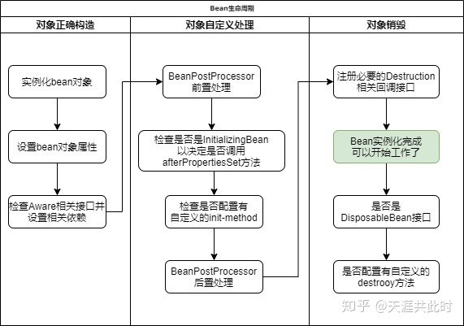

官方文档（中文）：       
https://www.docs4dev.com/docs/zh/spring-framework/5.1.3.RELEASE/reference

# IOC(控制反转)
ioc本质上是一种编程思想，不是具体的实现方式。常用的实现方式 有DI(依赖注入)，set注入。   

ioc的核心在于不再使用程序主动去创建对象，而是使用一个容器去创建这些 对象。**由IOC容器去控制对象**。用户通过接口去控制实现功能，而不再是程序。
**获取依赖对象的方式从程序到第三方（用户）**。

# AOP(面向切面编程)
代理模式：
* 静态代理
* 动态代理

## 静态代理：
角色分析：
* 抽象角色：一般使用接口或抽象方法来解决问题
* 真实角色：被代理的角色
* 代理角色：代理真实角色
* 客户：访问代理对象的人

代理模式的好处：
* 可以使真实角色的操作更加纯粹，不关注公共的业务
* 公共部分交给了代理角色，实现了业务的分工
* 公共业务发生拓展时，方便集中管理

缺点：
* 一个真实角色就会产生一个代理角色，代码量增加，开发效率低。

## 动态代理：
* 动态代理和静态代理角色相同
* 动态代理的代理类时动态生成的，不是我们直接写好的

动态代理分类
* 基于接口的动态代理 ： JDK动态代理
* 基于类的动态代理 ：cglib

AOC的本质：不影响原有类的功能的基础下，横向实现类功能的增强。

# Bean的生命周期
Bean可以借鉴Servlet的生命周期，实例化、初始init、接收请求service、销毁destroy。

简单理解一下：
1. 实例化bean对象
    * 设置对象属性
    * BeanPostProcessor后置处理工作
2. 实例化完成，就可以开始工作    
3. 销毁