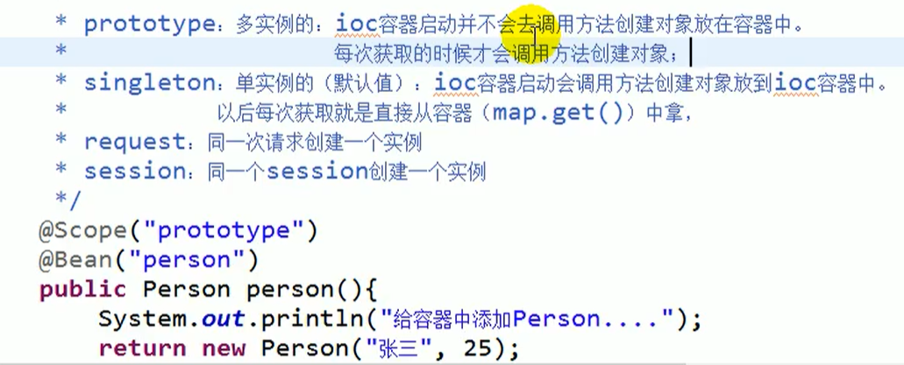

官方文档（中文）：       
https://www.docs4dev.com/docs/zh/spring-framework/5.1.3.RELEASE/reference

# IOC(控制反转)
IoC（Inverse of Control:控制反转）是一种设计思想，就是 将原本在程序中手动创建对象的控制权，交由Spring框架来管理。 IoC 在其他语言中也有应用，并非 Spring 特有。 
IoC 容器是 Spring 用来实现 IoC 的载体， IoC 容器实际上就是个Map（key，value）,Map 中存放的是各种对象。
* 依赖注入： 我们可以通过写java代码或者xml文件配置的方式，把我们想要注入对象所依赖的Bean注入进去。通过type类型的方式注入。
* 有了依赖注入，我们做到了解耦。
* Spring容器初始化时，会把Bean都创建好，就不需要再创建，速度变快。

IoC 容器就像是一个工厂一样，当我们需要创建一个对象的时候，只需要配置好配置文件/注解即可，完全不用考虑对象是如何被创建出来的。

## 理解IOC


不使用spring时，我们需要全部自己手动创建对象。

把对象创建和对象之间的调用过程，交给Spring管理。


利用工厂模式创建与使用分离。

使用spring后，不再主动创建这个对象，而是去spring容器中取这个对象。

所有的类都会在spring容器中登记，告诉spring你是个什么东西，你需要什么东西，然后spring会在系统运行到适当的时候，把你要的东西主动给你，同时也把你交给其他需要你的东西。所有的类的创建、销毁都由 spring来控制，也就是说控制对象生存周期的不再是引用它的对象，而是spring。对于某个具体的对象而言，以前是它控制其他对象，现在是所有对象都被spring控制，所以这叫控制反转。

## spring常用注解：


懒加载：
* 单例的bean默认在容器启动的时候创建对象。
* 懒加载则实现启动时不创建对象，第一次获取时再创建
* 实现方式@Lazy

@Conditional
* 按照条件获取bean

@Autowired
* 按照优先类型去容器（applicationContext）中找到对应的组件
* 如果找到多个相同类型的组件，再将属性的名称作为id去容器里面找

## IOC的初始化过程


**获取依赖对象的方式从程序到第三方（用户）**。

## IOC接口
Spring提供了两种方式：
1. BeanFactory
    * 是Spring内部使用的接口，不提供开发人员使用
    * 加载配置文件不创建对象，使用时才创建

2. ApplicationContext
    * BeanFactory接口的子接口，提供了更多的功能。
    * 加载配置文件时，对象就创建。

## Spring依赖注入的方式有几种?
1. setter方法注入: 通过构造器或工厂方法(静态工厂方法或实例bean工厂方法)构造bean所需要的依赖后， 使用setter方法设置bean的依赖。

```java
public class UserService {
	//set注入的注解做法
	//注解注入（autowire注解默认使用类型注入）
	@Autowired
	private UserDao userDao;
	
	public void login() {
		userDao.login();
	}
}
```

2. 构造器注入: 构造器的每个参数都可以代表对其他bean的依赖。

```java
public class UserService {
    
	private UserDao userDao;
	
	//注解到构造方法处
	@Autowired
	public UserService(UserDao userDao) {
		this.userDao = userDao;
	}
	
	public void login() {
		userDao.login();
	}
}

```

## Spring如何解决循环依赖?
循环依赖是指:A依赖B，并且B依赖A的情况。或者 A依赖B，B依赖C，C依赖A的情况。

* 构造器注入的循环依赖无法解决，直接抛出BeanCurrentlyInCreationException异常。

    * 容器在创建Bean的时候，会将Bean添加到正在创建的Bean池中，如果在创建Bean的时候， 发现自己已经在创建的Bean池中，就说明Bean陷入循环依赖了， 直接抛出BeanCurrentlyInCreationException异常。

    * 为什么构造器注入不能像Setter方法注入一样解决循环依赖问题? 因为构造器方法注入的前提是首先需要实例化这个对象，而构造器注入的参数正是bean， 怎么实例化，所以无法解决这个问题。

* Setter方法注入的循环依赖可以通过缓存解决。 三级缓存：

    1. 初始化完成的Bean池。

    2. 实例化完成，但是没有填充属性的Bean池。

    3. 刚刚实例化完成的Bean的工厂缓存，用于提前曝光Bean


    
* Setter方法注入时，如果Bean A发现自己依赖于Bean B， 那么将自己实例化后并添加到第三级缓存(Bean 工厂)。 然后再初始化B,检查到B又依赖于A，于是到三级缓存里查询A,那么查询肯定是成功的, 于是将A设置为B的属性。当A初始化时， 发现B已经初始化完成,就可以直接将B设置为A的属性了。
    
* 非单例bean不能缓存，无法解决循环依赖: IOC容器是不会缓存非单例bean的，所以无法解决循环依赖问题。

# AOP(面向切面编程)
AOP(Aspect-Oriented Programming:面向切面编程)能够将那些与业务无关，却为业务模块所共同调用的逻辑或责任（例如事务处理、日志管理、权限控制等）封装起来，便于减少系统的重复代码，降低模块间的耦合度，并有利于未来的可拓展性和可维护性。

Spring AOP就是基于动态代理的，如果要代理的对象，实现了某个接口，那么Spring AOP会使用JDK Proxy，去创建代理对象，而对于没有实现接口的对象，就无法使用 JDK Proxy 去进行代理了，这时候Spring AOP会使用Cglib ，这时候Spring AOP会使用 Cglib 生成一个被代理对象的子类来作为代理，如下图所示


AOC的本质：不影响原有类的功能的基础下，横向实现类功能的增强。

代理模式的好处：
* 可以使真实角色的操作更加纯粹，不关注公共的业务
* 公共部分交给了代理角色，实现了业务的分工
* 公共业务发生拓展时，方便集中管理

## AOP原理
Spring AOP的原理大致如下：

配置一个实现了InstantiationAwareBeanPostProcessor接口的bean。在每次bean初始化的时候找到所有advisor，根据pointcut 判断是不是需要为将实例化的bean生成代理，如果需要，就把advice编制在代理对象里面。

* advice:如拦截到对应的某个方法后，我们要做写什么？advice就是拦截后要执行的动作。
* Pointcut：决定advice应该作用于哪个方法。
* advisor，pointcut和advice的结合

## Spring是如何实现单例Bean的
Spring是通过单例注册表实现单例的，Ioc容器维护了一个bean表格，当需要一个单例bean时，从表格中获取，没有获取到的，向表格注册一个新的bean。

定义一个final的ConcurrentHashMap对象，从而该域是线程安全的

## Spring 中的 bean 的作用域有哪些?
* singleton : 唯一 bean 实例，Spring 中的 bean 默认都是单例的。
* prototype : 每次请求都会创建一个新的 bean 实例。
* request : 每一次HTTP请求都会产生一个新的bean，该bean仅在当前HTTP request内有效。
* session : 每一次HTTP请求都会产生一个新的 bean，该bean仅在当前 HTTP session 内有效。
* global-session： 全局session作用域，仅仅在基于portlet的web应用中才有意义，Spring5已经没有了。Portlet是能够生成语义代码(例如：HTML)片段的小型Java Web插件。它们基于portlet容器，可以像servlet一样处理HTTP请求。但是，与 servlet 不同，每个 portlet 都有不同的会话

# Bean的生命周期
Bean可以借鉴Servlet的生命周期，实例化、初始init、接收请求service、销毁destroy。


* Bean 容器找到配置文件中 Spring Bean 的定义。
* Bean 容器利用 Java Reflection API 创建一个Bean的实例。
* 如果涉及到一些属性值 利用 set()方法设置一些属性值。
* 如果 Bean 实现了 BeanNameAware 接口，调用 setBeanName()方法，传入Bean的名字。
* 如果 Bean 实现了 BeanClassLoaderAware 接口，调用 setBeanClassLoader()方法，传入 ClassLoader对象的实例。
* 与上面的类似，如果实现了其他 *.Aware接口，就调用相应的方法。
* 如果有和加载这个 Bean 的 Spring 容器相关的 BeanPostProcessor 对象，执行postProcessBeforeInitialization() 方法
* 如果Bean实现了InitializingBean接口，执行afterPropertiesSet()方法。
* 如果 Bean 在配置文件中的定义包含 init-method 属性，执行指定的方法。
* 如果有和加载这个 Bean的 Spring 容器相关的 BeanPostProcessor 对象，执行postProcessAfterInitialization() 方法
* 当要销毁 Bean 的时候，如果 Bean 实现了 DisposableBean 接口，执行 destroy() 方法。
* 当要销毁 Bean 的时候，如果 Bean 在配置文件中的定义包含 destroy-method 属性，执行指定的方法。

简单理解一下：
1. 实例化bean对象
    * 设置对象属性
    * BeanPostProcessor后置处理工作
2. 实例化完成，就可以开始工作    
3. 销毁

## Spring 中的单例 bean 的线程安全问题了解吗？
的确是存在安全问题的。因为，当多个线程操作同一个对象的时候，对这个对象的成员变量的写操作会存在线程安全问题。

但是，一般情况下，我们常用的 Controller、Service、Dao 这些 Bean 是无状态的。无状态的 Bean 不能保存数据，因此是线程安全的。

常见的有 2 种解决办法：

* 在类中定义一个 ThreadLocal 成员变量，将需要的可变成员变量保存在 [ThreadLocal]() 中（推荐的一种方式）。
* 改变 Bean 的作用域为 “prototype”：每次请求都会创建一个新的 bean 实例，自然不会存在线程安全问题

