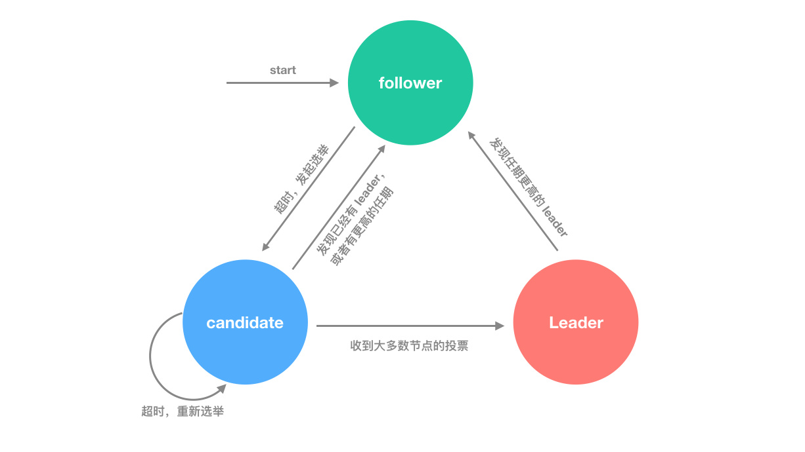
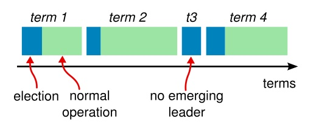

## CAP理论

分布式系统不可能同时满足CAP，最多只能同时满足其中两项。
* 一致性（C：Consistency）
    * 一致性指的是多个数据副本是否能保持一致的特性，在一致性的条件下，系统在执行数据更新操作之后能够从一致性状态转移到另一个一致性状态。
    * 对系统的一个数据更新成功之后，如果所有用户都能够读取到最新的值，该系统就被认为具有强一致性。
* 可用性（A：Availability）
    * 可用性指分布式系统在面对各种异常时可以提供正常服务的能力，可以用系统可用时间占总时间的比值来衡量，4 个 9 的可用性表示系统 99.99% 的时间是可用的。
    * 在可用性条件下，要求系统提供的服务一直处于可用的状态，对于用户的每一个操作请求总是能够在有限的时间内返回结果。
* 分区容忍性（P：Partition Tolerance）
    * 网络分区指分布式系统中的节点被划分为多个区域，每个区域内部可以通信，但是区域之间无法通信。
    * 在分区容忍性条件下，分布式系统在遇到任何网络分区故障的时候，仍然需要能对外提供一致性和可用性的服务，除非是整个网络环境都发生了故障。

常用两种策略：
* 保证一致性（CP），不能访问未同步完成的节点，也就失去了部分可用性；
* 保证可用性（AP），允许读取所有节点的数据，但是数据可能不一致。

微服务主要追求可用性和分区容忍性，轻一致性。

## BASE理论
强一致性： 
* 当用户完成更新数据后，任何后续线程或者其他节点都能访问到最新值。这种实现需要对性能做出较大牺牲。

弱一致性：
* 当用户完成更新数据后，并不能保证后续线程或者其他节点都能访问到最新值。它只能通过某种方式来保证最后的一致性。

基本可用（BA）：
* 指分布式系统在出现故障的时候，保证核心可用，允许损失部分可用性。
* 例如，电商在做促销时，为了保证购物系统的稳定性，部分消费者可能会被引导到一个降级的页面。

软状态（S）
* 指允许系统中的数据存在中间状态，并认为该中间状态不会影响系统整体可用性，即允许系统不同节点的数据副本之间进行同步的过程存在时延。

最终一致性(E)
* 最终一致性强调的是系统中所有的数据副本，在经过一段时间的同步后，最终能达到一致的状态。
* ACID 要求强一致性，通常运用在传统的数据库系统上。而 BASE 要求最终一致性，通过牺牲强一致性来达到可用性，通常运用在大型分布式系统中。
* 在实际的分布式场景中，不同业务单元和组件对一致性的要求是不同的，因此 ACID 和 BASE 往往会结合在一起使用。

# 一致性算法（Paxos，Raft，ZAB）
最基本的一致性算法： 主从同步
1. Master接收写请求
2. Master复制日志到slave
3. Master等待，知道所有从库返回

问题： 一个节点失败，,Master阻塞，导致整个集群不可用。保持了一致性，可用性大大降低

## Paxos
* 提议者（Proposer）：提议一个值；
* 接受者（Acceptor）：对每个提议进行投票；
* 告知者（Learner）：被告知投票的结果，不参与投票过程。

提议阶段：
1. Prepare
    * proposer提出一个议案，编号为N，此时N大于这个proposer之前提出的提案编号。请求acceptors的quorum接收
2. Promise
    * 如果N大于此acceptor之前接收的任何提案编号则接收，否则拒绝。
3. Accept
    * 如果达到了多数派，proposer会发出accept请求，此请求包含提案编号N，以及提案内容。
4. Accepted
    * 如果此acceptor在此期间没有收到任何标号大于N的天，则接收这个提案内容，否则忽略。

## Raft
Raft的三种状态：
* Follower（群众）：被动接收Leader发送的请求。所有的节点刚开始的时候是处于Follower状态。
* Candidate（候选人）：由Follower向Leader转换的中间状态
* Leader（领导）：负责和客户端交互以及日志复制（日志复制是单向的，即Leader发送给Follower），同一时刻最多只有1个Leader存在。

### 任期

在分布式系统中，“时间同步”是一个很大的难题，因为每个机器可能由于所处的地理位置、机器环境等因素会不同程度造成时钟不一致，但是为了识别“过期信息”，时间信息必不可少。

Raft算法中就采用任期（Term）的概念，将时间切分为一个个的Term（同时每个节点自身也会本地维护currentTerm），可以认为是逻辑上的时间

每一任期的开始都是一次领导人选举，一个或多个候选人（Candidate）会尝试成为领导（Leader）。如果一个人赢得选举，就会在该任期（Term）内剩余的时间担任领导人。
在某些情况下，选票可能会被评分，有可能没有选出领导人（如t3），那么，将会开始另一任期，并且理科开始下一次选举。Raft 算法保证在给定的一个任期最少要有一个领导人。

### 心跳（heartbeats）和超时机制（timeout）
在Raft算法中，有两个timeout机制来控制领导人选举：

* 一个是选举定时器：即Follower等待成为Candidate状态的等待时间，这个时间被随机设定为150ms~300ms之间

* 另一个是headrbeat timeout：在某个节点成为Leader以后，它会发送Append Entries消息给其他节点，这些消息就是通过heartbeat timeout来传送，Follower接收到Leader的心跳包的同时也重置选举定时器。

### Raft工作机制：
领导人选举：
1. 一开始，所有节点都是以Follower角色启动，同时启动选举定时器（时间随机，降低冲突概率）
2. 如果一个节点发现在超过选举定时器的时间以后一直没有收到Leader发送的心跳请求，则该节点就会成为候选人，并且一直处于该状态，直到下：
    * 该节点（Candidate）赢得选举
    * 其他节点赢得选举
    * 一段时间后没有任何一台服务器赢得选举（进入下一轮Term的选举，并随机设置选举定时器时间）
3. 然后这个候选人就会向其他节点发送投票请求，如果得到半数以上节点的同意，就成为Leader。如果选举超时，还没有Leader选出，则进入下一任期，重新选举。
4. 完成Leader选举后，Leader就会定时给其他节点发送心跳包（Heartbeat），告诉其他节点Leader还在运行，同时重置这些节点的选举定时器。

日志复制：
1. Client向Leader提交指令（如：SET 5），Leader收到命令后，将命令追加到本地日志中。此时，这个命令处于“uncomitted”状态，复制状态机不会执行该命令。
2. 然后，Leader将命令（SET 5）并发复制给其他节点，并等待其他其他节点将命令写入到日志中，如果此时有些节点失败或者比较慢，Leader节点会一直重试，知道所有节点都保存了命令到日志中。
   之后Leader节点就提交命令（即被状态机执行命令，这里是：SET 5），并将结果返回给Client节点。
3. Leader节点在提交命令后，下一次的心跳包中就带有通知其他节点提交命令的消息，其他节点收到Leader的消息后，就将命令应用到状态机中（State Machine），最终每个节点的日志都保持了一致性。

                                                                                                                                                               

