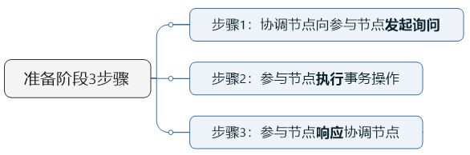
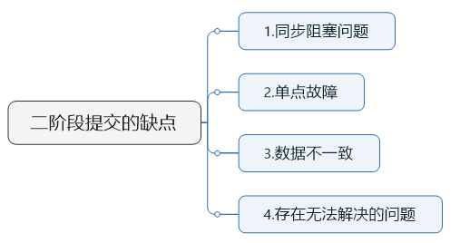
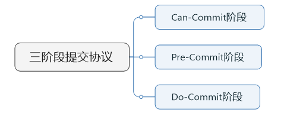

## 两阶段提交协议
在分布式系统中，每个节点虽然可以知晓自己的操作时成功或者失败，却无法知道其他节点的操作的成功或失败。

当一个事务跨越多个节点时，为了保持事务的ACID特性，需要引入一个作为协调者的组件来统一掌控所有节点(称作参与者)的操作结果并最终指示这些节点是否要把操作结果进行真正的提交

两阶段： 
* 第一阶段：voting phase 投票阶段
* 第二阶段：commit phase 提交阶段

投票（准备）阶段：

事务协调者给每个参与者发送Prepare消息，每个参与者要么直接返回失败(如权限验证失败)，要么在本地执行事务，写本地的redo和undo日志，但不提交，到达一种“万事俱备，只欠东风”的状态。

1. 协调者节点向所有参与者节点询问是否可以执行提交操作(vote)，并开始等待各参与者节点的响应。

2. 参与者节点检查事务权限，执行询问发起为止的所有事务操作，并将Undo信息和Redo信息写入日志。

注:为什么在执行任务前需要先写本地日志，主要是为了故障后恢复用，本地日志起到现实生活中凭证 的效果，如果没有本地日志（凭证），出问题容易死无对证；】

3. 各参与者节点响应协调者节点发起的询问。如果参与者节点的事务操作实际执行成功，则它返回一个”同意”消息；如果参与者节点的事务操作实际执行失败，则它返回一个”中止”消息。

提交阶段：

如果协调者收到了参与者的失败消息或者超时，直接给每个参与者发送回滚(Rollback)消息；否则，发送提交(Commit)消息；参与者根据协调者的指令执行提交或者回滚操作，释放所有事务处理过程中使用的锁资源。(注意:必须在最后阶段释放锁资源)

当协调者节点从所有参与者节点获得的响应消息都为”同意”时：

1. 协调者节点向所有参与者节点发出”正式提交(commit)”的请求。
2. 参与者节点正式完成操作，并释放在整个事务期间内占用的资源。
3. 参与者节点向协调者节点发送”完成”消息。
4. 协调者节点受到所有参与者节点反馈的”完成”消息后，完成事务。

如果任一参与者节点在第一阶段返回的响应消息为”中止”，或者 协调者节点在第一阶段的询问超时之前无法获取所有参与者节点的响应消息时：

1. 协调者节点向所有参与者节点发出”回滚操作(rollback)”的请求。
2. 参与者节点利用之前写入的Undo信息执行回滚，并释放在整个事务期间内占用的资源。
3. 参与者节点向协调者节点发送”回滚完成”消息。
4. 协调者节点受到所有参与者节点反馈的”回滚完成”消息后，取消事务。

两阶段提交的缺点：

## 三阶段提交

与两阶段提交不同的是，三阶段提交有两个改动点。

1. 引入超时机制。同时在协调者和参与者中都引入超时机制。
2. 在第一阶段和第二阶段中插入一个准备阶段，保证了在最后提交阶段之前各参与节点状态的一致。

'

CanCommit阶段:

3PC的CanCommit阶段其实和2PC的准备阶段很像。协调者向参与者发送commit请求，参与者如果可以提交就返回Yes响应，否则返回No响应。

1. 事务询问 协调者向参与者发送CanCommit请求。询问是否可以执行事务提交操作。然后开始等待参与者的响应。
2. 响应反馈 参与者接到CanCommit请求之后，正常情况下，如果其自身认为可以顺利执行事务，则返回Yes响应，并进入预备状态。否则反馈No

PreCommit阶段:

本阶段协调者会根据第一阶段的询盘结果采取相应操作，询盘结果主要有两种：
1. 假如协调者从所有的参与者获得的反馈都是Yes响应，那么就会执行事务的预执行
2. 假如有任何一个参与者向协调者发送了No响应，或者等待超时之后，协调者都没有接到参与者的响应，那么就执行事务的中断。

doCommit阶段

该阶段进行真正的事务提交，也可以分为以下两种情况。

情况1-执行提交:
1. 协调者向所有参与者发送事务commit通知
2. 所有参与者在收到通知之后执行commit操作，并释放占有的资源
3. 参与者向协调者反馈事务提交结果

情况2-中断事务

协调者没有接收到参与者发送的ACK响应（可能是接受者发送的不是ACK响应，也可能响应超时），那么就会执行中断事务。具体步骤如下：
1. 发送中断请求 协调者向所有参与者发送事务rollback通知。
2. 事务回滚 所有参与者在收到通知之后执行rollback操作，并释放占有的资源。
3. 反馈结果 参与者向协调者反馈事务提交结果。
4. 中断事务 协调者接收到参与者反馈的ACK消息之后，执行事务的中断。

