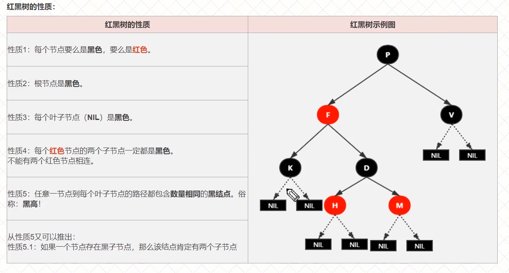
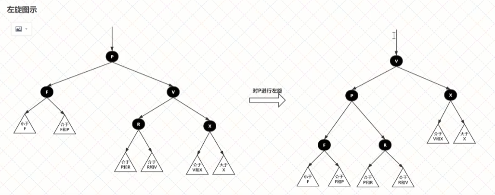
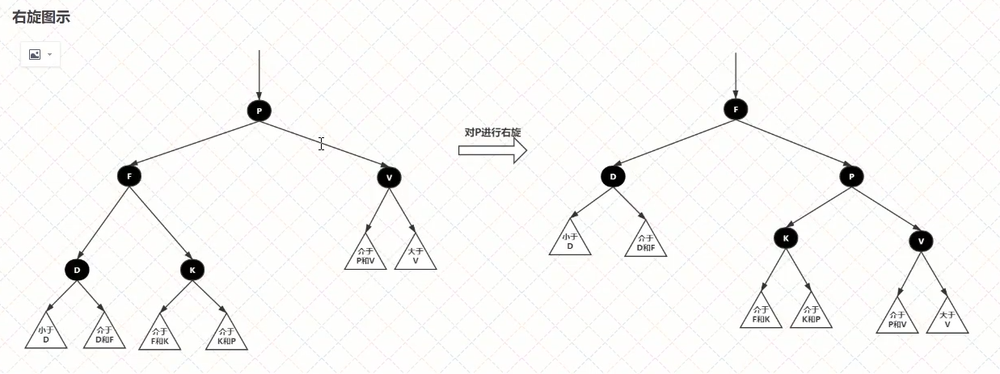

## 红黑树的性质

红黑树的自平衡：
1. 变色： 节点颜色由红变黑或是由黑变红
2. 右旋： 以某个节点作为支点，其右子节点变为旋转节点的父节点，右子节点的左子节点变为旋转节点的右子节点，左子节点保持不变
3. 左旋： 以某个节点作为支点，其左子节点变为旋转节点的父节点，左子节点的右子节点变为旋转节点的左子节点，右子节点保持不变

## 红黑树的插入
1. 找到插入的位置
2. 自平衡

注意： 插入的节点必须是红节点。

红节点在父节点为黑色时，插入不影响平衡。而黑节点插入一定要自平衡。

当插入的节点父节点为红色时：

