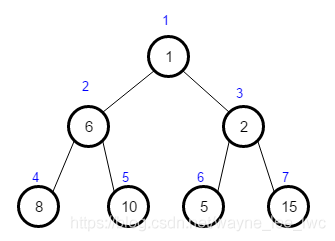
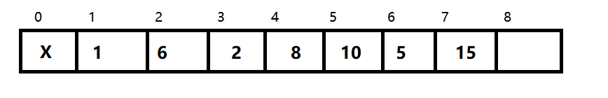
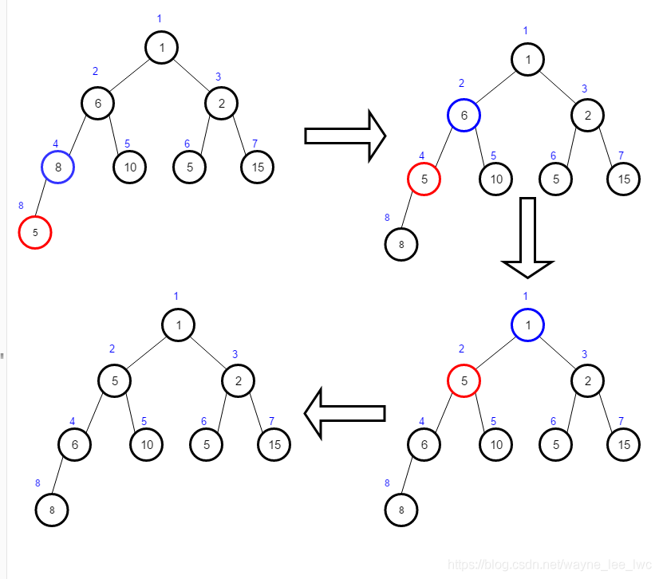
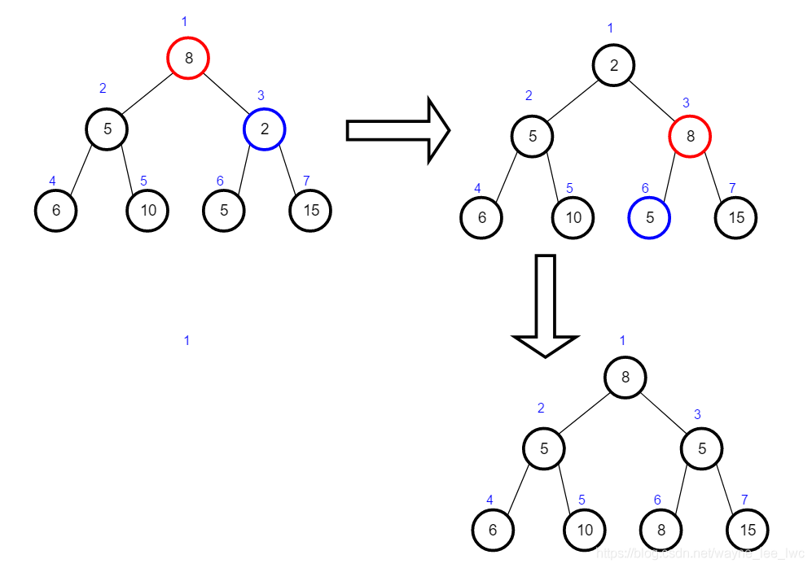

# PriorityQueue
优先队列PriorityQueue是Queue接口的实现，可以对其中元素进行排序。通过自定义的比较器，可以实现取最值的功能。
核心是通过堆来排序，相比于数组链表，可以做到一变插入或是取出元素，依然保持有序。
**但是对于优先级相同的元素时，它并不能保证先进先出。**


java中的优先队列是通过二叉堆实现的。

## 什么是二叉堆？
* 完全二叉树
* 堆的根节点的优先级最大（即最大或最小）
* 父节点的优先级必定大于子节点，兄弟节点的优先级不确定谁大谁小
* java中默认的是小根堆。即peek元素为最小值

## 存储二叉堆


将上面的二叉树存储在数组中就是：



于是根据这些规则就会产生一些不得了的性质：

* 根节点的编号为1
* 结点k的父节点为k/2
* 结点k的左儿子为k ∗ 2 
* 结点k的右儿子为k ∗ 2 + 1

## 二叉堆的维护
1. 插入 ： 上浮算法
   * 往堆插入元素，插入到最后一个位置开始，通过上浮操作不断调整位置，直到满足父节点的优先级必定大于子节点这个条件。
    


```java
private void up(int k) {
	int fa = k >> 1;
	while(fa >= 1) {
		if(heap[k] <= heap[fa]) {
			break;
		}
		int temp = heap[k];
		heap[k] = heap[fa];
		heap[fa] = temp;
		
		k = fa;
		fa >>= 1;
	}
}
```
2. 删除： 下沉算法
    * 删除顶部元素，先与最后一个元素交换（在最后一个位置删除），再对现在顶部元素下沉算法，保持堆的有序。
    * 删除指定位置的元素，其基本思想是从指定位置开始，把最后一个元素放到被删除元素的位置，通过下沉或者上浮操作，使得堆满足父元素优先级大于子元素的条件。



```java
private void down(int k) {
	int son = k << 1;
	while(son <= size) {
		if(son + 1 <= size && heap[son + 1] < heap[son]) {
			son++;
		}
		if(heap[k] <= heap[son]) {
			break;
		}
		
		int temp = heap[k];
		heap[k] = heap[son];
		heap[son] = temp;
		
		k = son;
		son <<= 1;
	}
}
```
## 复杂度分析
|   | 时间复杂度|
| --- | ------ | 
|插入|	O(log n)|
|删除|	O(log n)|
|构造|	O(n)|

## 堆排序的实现
无序数组建立堆最直接的方法是从左到右遍历数组进行上浮操作。一个更高效的方法是从右至左进行下沉操作，
如果一个节点的两个节点都已经是堆有序，那么进行下沉操作可以使得这个节点为根节点的堆有序。
叶子节点不需要进行下沉操作，可以忽略叶子节点的元素，因此只需要遍历一半的元素即可。

这里数组下标从0开始.k的左节点2*k+1，右节点2*k+2。

```java
    public void heapsort(int[] nums){
        int N = nums.length - 1;
        for(int k = N/2;k >= 0;k--){
            sink(nums,k,N);
        }
        while(N > 0){
            swap(nums,0,N--);
            sink(nums,0,N);
        }
    }

    public void sink(int[] nums, int k , int N){
        while(2 * k + 1 <= N){
            int j = 2 * k + 1;
            if(j < N && nums[j] < nums[j + 1]){
                j ++;
            }
            if(nums[k] >= nums[j]){
                break;
            }
            swap(nums,k,j);
            k = j;
        }
    }

    private void swap(int[] nums, int k, int j) {
        int temp = nums[k];
        nums[k] = nums[j];
        nums[j] = temp;
    }

    public static void main(String[] args) {
        solution a = new solution();
        int[] nums = new int[]{1,4,5,2,3,6,7,2,4,8,3};
        a.heapsort(nums);
        for(int num :nums){
            System.out.print(num + " ");
        }
    }
```