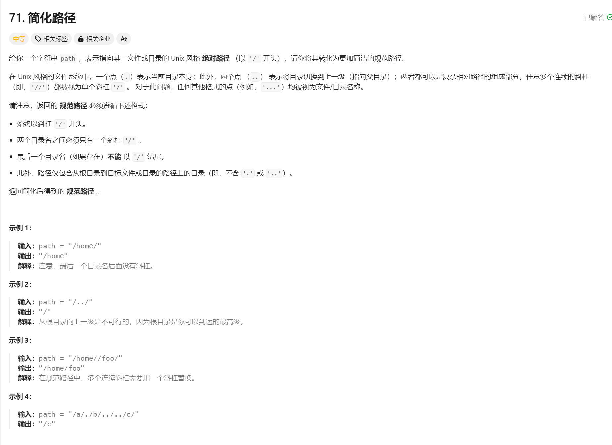

# 简化文件路径



建立一个栈，按照路径依次向里面push。这时候栈底的元素是根路径。当遇到向上一层时，只需要pop一个元素。

最后，从栈底的元素开始取出，依次拼接构成路径

```java
class Solution {
    public String simplifyPath(String path) {
        // 双端队列
        Deque<String> queue = new LinkedList<>();
        // 分割字符
        String[] res = path.split("/");
        for(int i = 0; i < res.length; i++){
            String s = res[i];
            if(s.equals(".") || s.equals("")) continue;
            else if (s.equals("..")){
                if(!queue.isEmpty()){
                    queue.pop();
                }
            }else{
                queue.push(s);
            }
        }
        // 拼接
        StringBuilder sb = new StringBuilder("/");
        while(!queue.isEmpty()){
            sb.append(queue.pollLast());
            if(!queue.isEmpty()){
                sb.append("/");
            }
        }
        // 判空
        return sb.toString();
    }
}
```