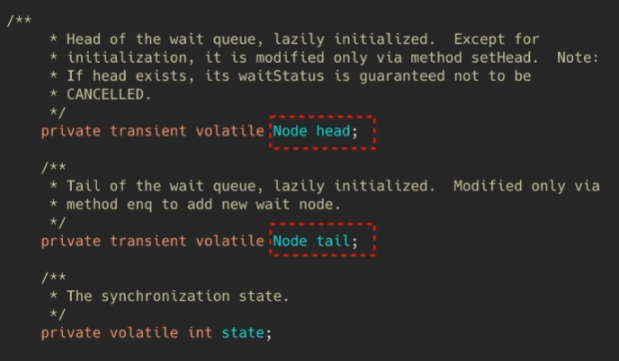
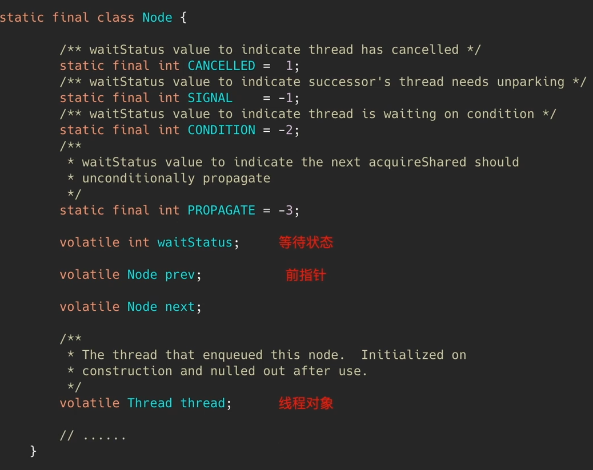
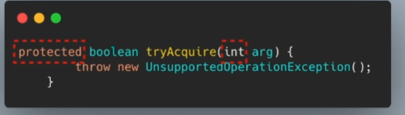
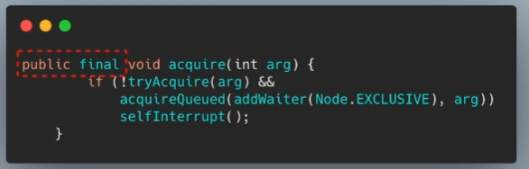
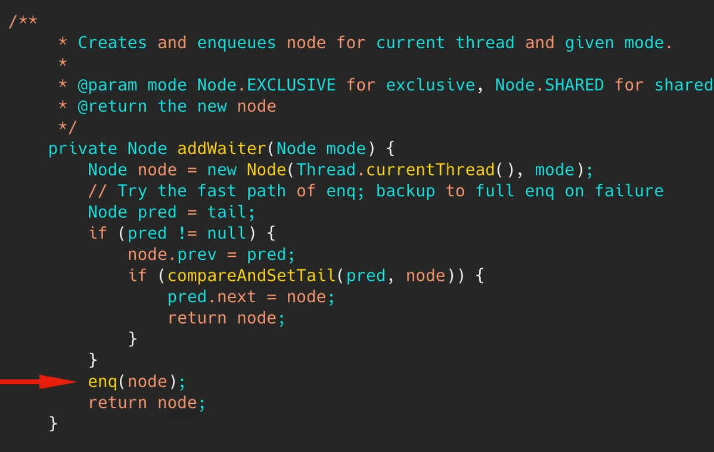
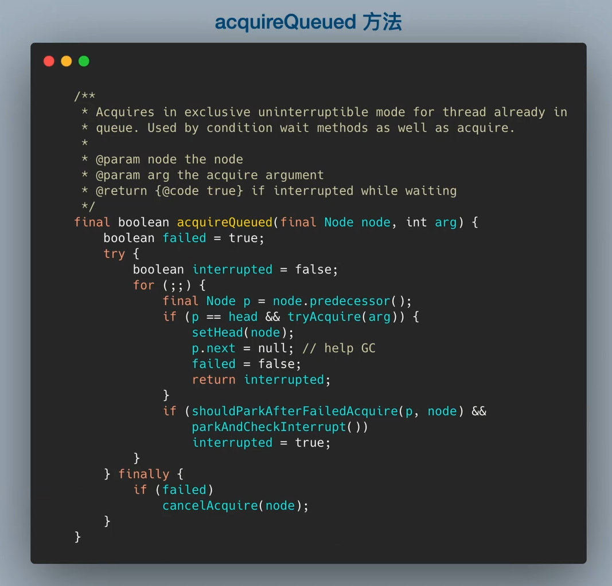

## AQS的思路
如何利用原子类（AtomicInteger）设计一个同步管理框架：
1. 通用性，下层实现透明的同步机制，与上层业务解耦
2. 利用CAS，原子地去修改共享标志位
3. 等待队列：这里不使用轮询是可以节省计算机资源.

AQS：AbstractQueuedSynchronizer。

JUC和许多同步中间件都使用了AQS。

## AQS源码分析



同步状态为什么要用int：
* 线程有独占模式（其他线程都不能占用）和共享模式（其他线程可以一起占用），所以不能使用布尔类型，可以用int表示当前线程数。

* 队列是一个FIFO（先进先出）的双向链表，tail和head分别表示头尾节点.



队列节点包括：线程对象，前后指针，等待状态等信息。

AQS中的两个核心方法：
1. 尝试获取锁（修改标志位），立即返回。 -> tryAcquire
    
    

    * 让上层自定义tryAcquire方法
2. 获取锁（修改标志位），愿意进入等待队列，直到获取 -> acquire
   
    
    * public final说明让所有继承类都可以直接调用这个方法
    * 如果返回false没有获取到锁，就需要addWaiter加等待队列

addWaiter（加入等待队列）:



* enq方法是完整的入队方法，比原来的方法多了一个判空。

acquireQueued(node）（获取队列中的节点）：



利用interrupted标志位来确定是否获取。


## CountDownLatch
用来控制一个或者多个线程等待多个线程。

维护了一个计数器 cnt，每次调用 countDown() 方法会让计数器的值减 1，减到 0 的时候，那些因为调用 await() 方法而在等待的线程就会被唤醒。

```java
public class CountDownLatchDemo {
    public static void main(String[] args) throws InterruptedException {
        //设定初始值
        CountDownLatch countDownLatch = new  CountDownLatch(6);
        for (int i = 1; i <= 6 ; i++) {
            new Thread(() ->{
                System.out.println(Thread.currentThread().getName() + "go out");
                //减一
                countDownLatch.countDown();
            },String.valueOf(i)).start();
        }

        //唤醒
        countDownLatch.await();

        System.out.println("Close door");
    }
}
```
## CyclicBarrier
用来控制多个线程互相等待，只有当多个线程都到达时，这些线程才会继续执行。

和 CountdownLatch 相似，都是通过维护计数器来实现的。线程执行 await() 方法之后计数器会减 1，并进行等待，直到计数器为 0，所有调用 await() 方法而在等待的线程才能继续执行。

CyclicBarrier 和 CountdownLatch 的一个区别是，CyclicBarrier 的计数器通过调用 reset() 方法可以循环使用，所以它才叫做循环屏障。

CyclicBarrier 有两个构造函数，其中 parties 指示计数器的初始值，barrierAction 在所有线程都到达屏障的时候会执行一次。

```java
public class CyclicBarrierDemo {
    public static void main(String[] args) {
        CyclicBarrier cyclicBarrier = new CyclicBarrier(7,()->{
            System.out.println("召唤神龙");
        });

        for(int i = 1; i <= 7; i ++){
            final int temp = i;
            new Thread(()->{
                System.out.println(Thread.currentThread().getName() + "收集到"+ temp + "号龙珠");

                try {
                    cyclicBarrier.await();
                } catch (InterruptedException e) {
                    e.printStackTrace();
                } catch (BrokenBarrierException e) {
                    e.printStackTrace();
                }

                System.out.println(temp);
            }).start();
        }
    }
}
```
在await后面的代码要等await执行结束之后再执行。

## Semaphore
Semaphore 类似于操作系统中的信号量，可以控制对互斥资源的访问线程数。

示例用信号量实现3个线程交替打印123
```java
public class semaphoreDemo {
    private static Semaphore A =  new Semaphore(1);
    private static Semaphore B =  new Semaphore(0);
    private static Semaphore C =  new Semaphore(0);

    public static void main(String[] args) {
        new Thread(() ->{
            for(int i = 0;  i < 10 ; i ++){
                try {
                    A.acquire();
                    System.out.println("1");
                    B.release();
                } catch (InterruptedException e) {
                    e.printStackTrace();
                }
            }
        },"threada").start();

        new Thread(() ->{
            for(int i = 0;  i < 10 ; i ++){
                try {
                    B.acquire();
                    System.out.println("2");
                    C.release();
                } catch (InterruptedException e) {
                    e.printStackTrace();
                }
            }
        },"threadb").start();

        new Thread(() ->{
            for(int i = 0;  i < 10 ; i ++){
                try {
                    C.acquire();
                    System.out.println("3");
                    A.release();
                } catch (InterruptedException e) {
                    e.printStackTrace();
                }
            }
        },"threadc").start();
    }
}
```


