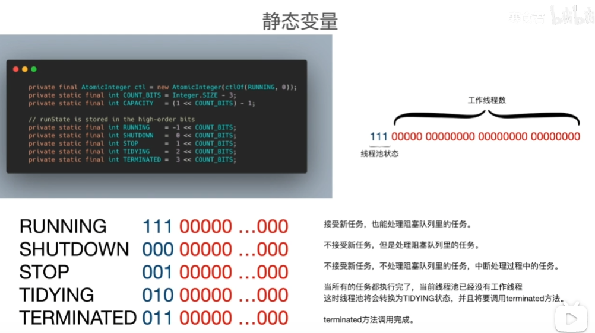
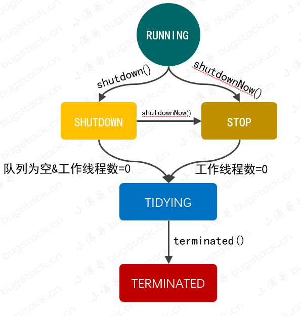
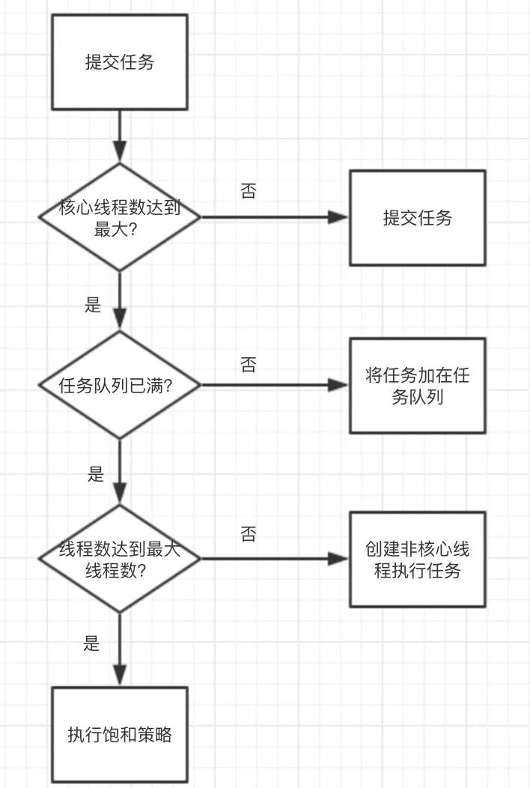

## 线程池
线程池为AQS包下的ThreadPolExecutor

池化思想：线程池，字符串常量池，数据库连接池

目的 ： 提高资源的利用率

不使用线程池：
1. 手动创建线程对象
2. 执行任务
3. 执行完毕，释放线程对象

线程池的优点：
* 减少开销
    * jvm中创建和回收线程都要内核调用，开销大
    * 重复使用线程资源，减少创建和回收的评率
* 便于管理 
    * 维护线程状态  
    * 维护任务执行状态

## ThreadPolExecutor自身有哪些状态？如何维护自身状态

线程池自身有5个状态，用一个int的高三位记录。后29位记录线程的数量。

由于对int的修改是原子的，可以省去加锁，所以不使用两个int记录。

## ThreadPolExecutor如何维护内部线程

## ThreadPolExecutor如何处理提交任务

* 提交任务后，线程池先判断线程数是否达到了核心线程数（corePoolSize）。如果未达到线程数，则创建核心线程处理任务；否则，就执行下一步；
* 接着线程池判断任务队列是否满了。如果没满，则将任务添加到任务队列中；否则，执行下一步；
* 接着因为任务队列满了，线程池就判断线程数是否达到了最大线程数。如果未达到，则创建非核心线程处理任务；否则，就执行饱和策略，默认会抛出RejectedExecutionException异常。

## ThreadPoolExecutor参数

3个最重要的参数：
* corePoolSize : 核心线程数线程数定义了最小可以同时运行的线程数量。
* maximumPoolSize : 当队列中存放的任务达到队列容量的时候，当前可以同时运行的线程数量变为最大线程数。
* workQueue: 当新任务来的时候会先判断当前运行的线程数量是否达到核心线程数，如果达到的话，新任务就会被存放在队列中。

其他参数：
* keepAliveTime:当线程池中的线程数量大于 corePoolSize 的时候，如果这时没有新的任务提交，核心线程外的线程不会立即销毁，而是会等待，直到等待的时间超过了 keepAliveTime才会被回收销毁；
* unit : keepAliveTime 参数的时间单位。
* threadFactory :executor 创建新线程的时候会用到。
* handler :饱和策略。
    * ThreadPoolExecutor.AbortPolicy：抛出 RejectedExecutionException来拒绝新任务的处理。
    * ThreadPoolExecutor.CallerRunsPolicy：调用执行自己的线程运行任务，也就是直接在调用execute方法的线程中运行(run)被拒绝的任务，如果执行程序已关闭，则会丢弃该任务。因此这种策略会降低对于新任务提交速度，影响程序的整体性能。如果您的应用程序可以承受此延迟并且你要求任何一个任务请求都要被执行的话，你可以选择这个策略。
    * ThreadPoolExecutor.DiscardPolicy： 不处理新任务，直接丢弃掉。
    * ThreadPoolExecutor.DiscardOldestPolicy： 此策略将丢弃最早的未处理的任务请求。

## 线程池大小的确定

有一个简单并且适用面比较广的公式：

* CPU 密集型任务(N+1)
* I/O 密集型任务(2N)
* 核心是任务阻塞的概率。CPU负载的任务几乎不受IO限制可以用满cpu,比如数据全在内存的复杂数学运算，此时每个cpu都可以满负荷，线程数大于cpu核心数也不可能超过这个物理极限，反而是频繁的进程调度降低了cpu效率。
* IO密集的任务经常会因为等待IO而挂起，在不使用多路复用的场景下，挂起的时间就浪费了。如果不多开些线程就会出现任务等待运行却没有可用进程，运行中的线程都挂起浪费cpu的情况。
* redis是IO密集但是几乎不需要运算。所以配合多路复用的技术可以只使用单线程。

如何判断是 CPU 密集任务还是 IO 密集任务？

CPU 密集型简单理解就是利用 CPU 计算能力的任务比如你在内存中对大量数据进行排序。单凡涉及到网络读取，文件读取这类都是 IO 密集型，这类任务的特点是 CPU 计算耗费时间相比于等待 IO 操作完成的时间来说很少，大部分时间都花在了等待 IO 操作完成上。

## 常用的线程池
* newSingleThreadExecutor：创建一个单线程的线程池。这个线程池只有一个线程在工作，也就是相当于单线程串行执行所有任务。如果这个唯一的线程因为异常结束，那么会有一个新的线程来替代它。此线程池保证所有任务的执行顺序按照任务的提交顺序执行。
* newFixedThreadPool：创建固定大小的线程池。每次提交一个任务就创建一个线程，直到线程达到线程池的最大大小。线程池的大小一旦达到最大值就会保持不变，如果某个线程因为执行异常而结束，那么线程池会补充一个新线程。
* newCachedThreadPool：创建一个可缓存的线程池。如果线程池的大小超过了处理任务所需要的线程，那么就会回收部分空闲（60秒不执行任务）的线程，当任务数增加时，此线程池又可以智能的添加新线程来处理任务。此线程池不会对线程池大小做限制，线程池大小完全依赖于操作系统（或者说JVM）能够创建的最大线程大小。
* newScheduledThreadPool：创建一个大小无限的线程池。此线程池支持定时以及周期性执行任务的需求。
* newSingleThreadExecutor：创建一个单线程的线程池。此线程池支持定时以及周期性执行任务的需求。

