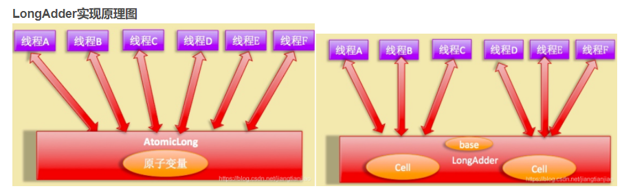

# CAS
CAS全称“CompareAndSwap”，称为比较并替换

定义：
cas操作包含三个操作数：内存位置（V),期望值（A），新值（B）。如果内存位置的值与期望值匹配，那么处理器会自动将该位置值更新为新值。
否则，处理器不作任何操作。无论哪种情况，它都在CAS指令之前返回该位置的值。
“认为位置V因该包含值A； 如果包含该值，则将B放到这个位置； 否则，不更改该位置的值，只告诉这个位置现在的值”

## AtomicInteger原子类

AtomicInteger通过CAS机制来实现原子性。

incrementAndGet()方法使用了Unsafe包下的cas函数。AtomicInteger获取不到时不会一直自旋，默认尝试10次就会切换为互斥锁。

* 多线程打印0-1000，使用AtomicInteger会输出1001和1002是正常的，代码里在num.get()<1000这行代码并不受同步控制，当num为999的瞬间，
  多条线程都可以通过这个判断，**而incr这个操作是同步的，也就是说每个数字只会输出一次（不同的线程不会输出相同的数字）锁体现在这个方面**
## CAS的ABA问题
如果只比较值，那么如有一个线程，对A进行操作变成B，再操作变回A，那么这个值不变。但是A已经被操作线程不安全。

为了解决ABA问题，**CAS引入了版本号。**

乐观锁每次在执行数据修改操作时，都会带上一个版本号，一旦版本号和数据的版本号一致就可以执行修改操作并对版本号执行 +1 操作，否则就执行失败。因为每次操作的版本号都会随之增加，所以不会出现 ABA 问题。除了 version 以外，还可以使用时间戳，因为时间戳天然具有顺序递增性。

版本号的CAS使用在很多地方，也就是常见的**乐观锁**。

## CAS 性能优化
大量的线程同时并发修改一个 AtomicInteger，可能有很多线程会不停的自旋，进入一个无限重复的循环中。这些线程不停地获取值，然后发起 CAS 操作，但是发现这个值被别人改过了，于是再次进入下一个循环，获取值，发起 CAS 操作又失败了，再次进入下一个循环。在大量线程高并发更新 AtomicInteger 的时候，这种问题可能会比较明显，导致大量线程空循环，自旋转，性能和效率都不是特别好。

Java8 有一个新的类，LongAdder，它就是尝试使用分段 CAS 以及自动分段迁移的方式来大幅度提升多线程高并发执行 CAS 操作的性能.

LongAdder 核心思想就是热点分离，这一点和 ConcurrentHashMap 的设计思想相似。就是将 value 值分离成一个数组，当多线程访问时，通过 hash 算法映射到其中的一个数字进行计数。而最终的结果，就是这些数组的求和累加。这样一来，就减小了锁的粒度。

