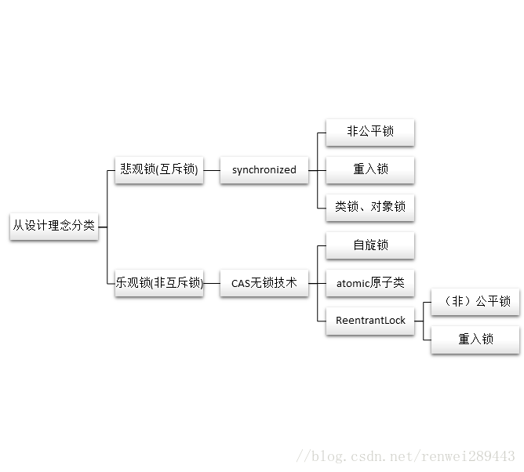

# 公平锁与非公平锁
从其它等待中的线程是否按顺序获取锁的角度划分可以分为公平锁与非公平锁。公平锁顺序获取，非公平锁不需要顺序获取。
* 公平锁的好处是等待锁的线程不会饿死，但是整体效率相对低一些；非公平锁的好处是整体效率相对高一些，但是有些线程可能会饿死或者说很早就在等待锁，但要等很久才会获得锁。
* 在java中，公平锁可以通过new ReentrantLock(true)来实现；非公平锁可以通过new ReentrantLock(false)或者默认构造函数new ReentrantLock()实现。
* synchronized是非公平锁，并且它无法实现公平锁。
 
# 从能否有多个线程持有同一把锁的角度划分--互斥锁
互斥锁的概念非常简单，也就是我们常说的同步，**即一次最多只能有一个线程持有的锁**，当一个线程持有该锁的时候其它线程无法进入上锁的区域。

在Java中synchronized就是互斥锁。

从宏观概念来讲，互斥锁就是通过悲观锁的理念引出来的，而非互斥锁则是通过乐观锁的概念引申的。

# 从一个线程能否递归获取自己的锁的角度划分--重入锁（递归锁）
* 可重入锁：可以再次进入方法A，就是说在释放锁前此线程可以再次进入方法A（方法A递归）。
* 不可重入锁（自旋锁）：不可以再次进入方法A，也就是说获得锁进入方法A是此线程在释放锁钱唯一的一次进入方法A。

ReentrantLock，synchronized都是可重入锁

# 从锁的设计理念来分类--悲观锁、乐观锁

## 悲观锁
当要对数据库中的一条数据进行修改的时候，为了避免同时被其他人修改，最好的办法就是直接对该数据进行加锁以防止并发。
这种借助数据库锁机制，在修改数据之前先锁定，再修改的方式被称之为悲观并发控制（Pessimistic Concurrency Control）

之所以叫做悲观锁，是因为这是一种对数据的修改持有悲观态度的并发控制方式。总是假设最坏的情况，每次读取数据的时候都默认其他线程会更改数据，因此需要进行加锁操作，当其他线程想要访问数据时，都需要阻塞挂起。

悲观锁的实现：

* 传统的关系型数据库使用这种锁机制，比如行锁，表锁等，读锁，写锁等，都是在做操作之前先上锁。
* Java 里面的同步 synchronized 关键字的实现。

sql中的锁：

* 共享锁（shared locks）又称为读锁，简称S锁。
  * 共享锁就是多个事务对于同一数据可以共享一把锁，都能访问到数据，**但是只能读不能修改。**
* 排他锁（exclusive locks）又称为写锁，简称X锁。
  * 排他锁就是不能与其他锁并存，如果一个事务获取了一个数据行的排他锁，其他事务就不能再获取该行的其他锁，包括共享锁和排他锁，但是获取排他锁的事务是可以对数据行读取和修改。
    
##  乐观锁

乐观锁是相对悲观锁而言的，乐观锁假设数据一般情况下不会造成冲突，所以在数据进行提交更新的时候，才会正式对数据的冲突与否进行检测，如果发现冲突了，则返回给用户错误的信息，让用户决定如何去做。乐观锁适用于读操作多的场景，这样可以提高程序的吞吐量。

乐观锁的实现：
* [CAS](cas.md) 实现：Java 中java.util.concurrent.atomic包下面的原子变量使用了乐观锁的一种 CAS 实现方式。
* 版本号控制：一般是在数据表中加上一个数据版本号 version 字段，表示数据被修改的次数。当数据被修改时，version 值会+1。当线程A要更新数据值时，在读取数据的同时也会读取 version 值，在提交更新时，若刚才读取到的 version 值与当前数据库中的 version 值相等时才更新，否则重试更新操作，直到更新成功。

## 从编译器优化的角度划分--锁消除和锁粗化
* 锁消除是编译器对于锁的优化措施，在JIT编译器可以在动态编译同步代码时，使用一种逃逸分析的技术，来通过该技术判别程序中所使用的锁对象是否只被一个线程所使用，而没有散布到其他线程中；如果这种情况的话，那么JIT在编译这个同步代码时就不会生成synchronized关键字所标识的锁的申请与释放机器码，从而消除了锁的使用流程。
  
* JIT编译器在执行动态编译时，若发现前后相邻的synchronized块使用的是同一个锁对象，那么他就会把这几个synchronized块合并成为一个较大的同步块，这样做的好处在于线程在执行这些代码时，就无需频繁的申请与释放锁了，从而达到申请与释放锁一次，就可以执行完全不的同步代码快，从而提升了性能。
