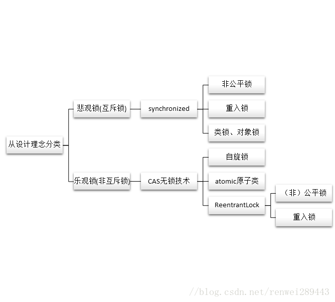

# java中锁的实现

java中，每个object对象都拥有一把锁，这把锁存放在对象头中，锁中记录当前对象被哪个线程占用

object分成三个部分，最后的填充保证每个java对象都是8比特的倍数

对象头由32bit的markword（存放了许多当前运行相关的数据，比如锁状态，是否偏向锁，锁标志位等）和一个指向方法区的指针构成。

锁的状态从低到高：无锁，偏向锁，轻量级锁，重量级锁。锁只能升级不能降级。
1. 无锁： 不使用锁控制线程的访问，使用其他方式使得同时只有一个线程访问成功，其他失败的线程不断重试，典型：CAS
2. 偏向锁：偏向锁就是在运行过程中，对象的锁偏向某个线程。即在开启偏向锁机制的情况下，某个线程获得锁，当该线程下次再想要获得锁时，不需要再获得锁，直接就可以执行同步代码，比较适合竞争较少的情况。
    * 通过对象头中的markword实现
    * 如果对象发现有多个线程在竞争，就会升级为轻量级锁
3. 轻量级锁： 
    * 线程通过在自己的jvm空间中新建Lock Record来存放Mark Word的拷贝，实现线程和对象的绑定。
    * 此时有多个线程竞争锁，那么它就会自旋等待锁，一定次数后仍未获得锁对象，说明发生了竞争，需要膨胀为重量级锁。
4. 重量级锁：利用monitor进行控制资源的访问（syn）

适应性自旋（Adaptive Spinning）：

从轻量级锁获取的流程中我们知道，当线程在获取轻量级锁的过程中执行CAS操作失败时，是要通过自旋来获取重量级锁的。问题在于，自旋是需要消耗CPU的，如果一直获取不到锁的话，那该线程就一直处在自旋状态，白白浪费CPU资源。
解决这个问题最简单的办法就是指定自旋的次数，例如让其循环10次，如果还没获取到锁就进入阻塞状态。但是JDK采用了更聪明的方式——适应性自旋，简单来说就是线程如果自旋成功了，则下次自旋的次数会更多，如果自旋失败了，则自旋的次数就会减少。

# 公平锁与非公平锁
从其它等待中的线程是否按顺序获取锁的角度划分可以分为公平锁与非公平锁。公平锁顺序获取，非公平锁不需要顺序获取。
* 公平锁的好处是等待锁的线程不会饿死，但是整体效率相对低一些；非公平锁的好处是整体效率相对高一些，但是有些线程可能会饿死或者说很早就在等待锁，但要等很久才会获得锁。
* 在java中，公平锁可以通过new ReentrantLock(true)来实现；非公平锁可以通过new ReentrantLock(false)或者默认构造函数new ReentrantLock()实现。
* synchronized是非公平锁，并且它无法实现公平锁。
 
# 从能否有多个线程持有同一把锁的角度划分--互斥锁
互斥锁的概念非常简单，也就是我们常说的同步，**即一次最多只能有一个线程持有的锁**，当一个线程持有该锁的时候其它线程无法进入上锁的区域。

在Java中synchronized就是互斥锁。

从宏观概念来讲，互斥锁就是通过悲观锁的理念引出来的，而非互斥锁则是通过乐观锁的概念引申的。

# 从一个线程能否递归获取自己的锁的角度划分--重入锁（递归锁）
* 可重入锁：可以再次进入方法A，就是说在释放锁前此线程可以再次进入方法A（方法A递归）。
* 不可重入锁（自旋锁）：不可以再次进入方法A，也就是说获得锁进入方法A是此线程在释放锁钱唯一的一次进入方法A。

ReentrantLock，synchronized都是可重入锁

# 从锁的设计理念来分类--悲观锁、乐观锁

## 悲观锁
当要对数据库中的一条数据进行修改的时候，为了避免同时被其他人修改，最好的办法就是直接对该数据进行加锁以防止并发。
这种借助数据库锁机制，在修改数据之前先锁定，再修改的方式被称之为悲观并发控制（Pessimistic Concurrency Control）

之所以叫做悲观锁，是因为这是一种对数据的修改持有悲观态度的并发控制方式。总是假设最坏的情况，每次读取数据的时候都默认其他线程会更改数据，因此需要进行加锁操作，当其他线程想要访问数据时，都需要阻塞挂起。

悲观锁的实现：

* 传统的关系型数据库使用这种锁机制，比如行锁，表锁等，读锁，写锁等，都是在做操作之前先上锁。
* Java 里面的同步 synchronized 关键字的实现。

sql中的锁：

* 共享锁（shared locks）又称为读锁，简称S锁。
  * 共享锁就是多个事务对于同一数据可以共享一把锁，都能访问到数据，**但是只能读不能修改。**
* 排他锁（exclusive locks）又称为写锁，简称X锁。
  * 排他锁就是不能与其他锁并存，如果一个事务获取了一个数据行的排他锁，其他事务就不能再获取该行的其他锁，包括共享锁和排他锁，但是获取排他锁的事务是可以对数据行读取和修改。
    
##  乐观锁

乐观锁是相对悲观锁而言的，乐观锁假设数据一般情况下不会造成冲突，所以在数据进行提交更新的时候，才会正式对数据的冲突与否进行检测，如果发现冲突了，则返回给用户错误的信息，让用户决定如何去做。乐观锁适用于读操作多的场景，这样可以提高程序的吞吐量。

乐观锁的实现：
* [CAS](../CAS/cas.md) 实现：Java 中java.util.concurrent.atomic包下面的原子变量使用了乐观锁的一种 CAS 实现方式。
* 版本号控制：一般是在数据表中加上一个数据版本号 version 字段，表示数据被修改的次数。当数据被修改时，version 值会+1。当线程A要更新数据值时，在读取数据的同时也会读取 version 值，在提交更新时，若刚才读取到的 version 值与当前数据库中的 version 值相等时才更新，否则重试更新操作，直到更新成功。

## 从编译器优化的角度划分--锁消除和锁粗化
* 锁消除是编译器对于锁的优化措施，在JIT编译器可以在动态编译同步代码时，使用一种逃逸分析的技术，来通过该技术判别程序中所使用的锁对象是否只被一个线程所使用，而没有散布到其他线程中；如果这种情况的话，那么JIT在编译这个同步代码时就不会生成synchronized关键字所标识的锁的申请与释放机器码，从而消除了锁的使用流程。
  
* JIT编译器在执行动态编译时，若发现前后相邻的synchronized块使用的是同一个锁对象，那么他就会把这几个synchronized块合并成为一个较大的同步块，这样做的好处在于线程在执行这些代码时，就无需频繁的申请与释放锁了，从而达到申请与释放锁一次，就可以执行完全不的同步代码快，从而提升了性能。
