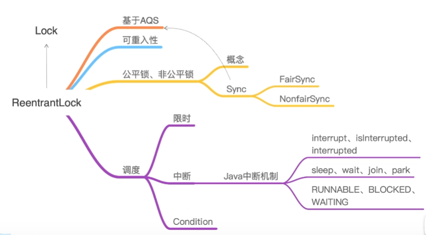
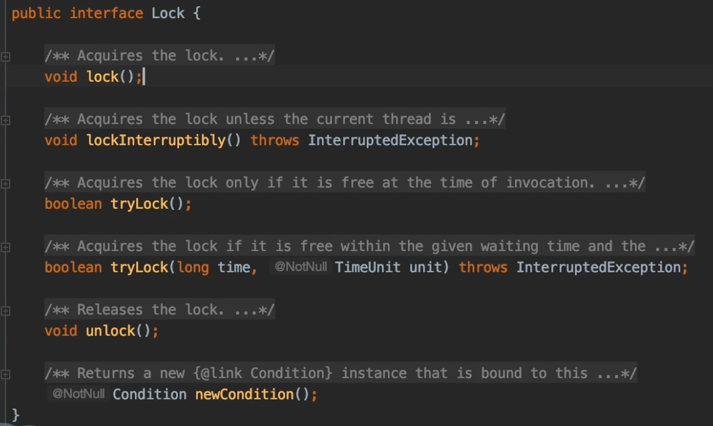
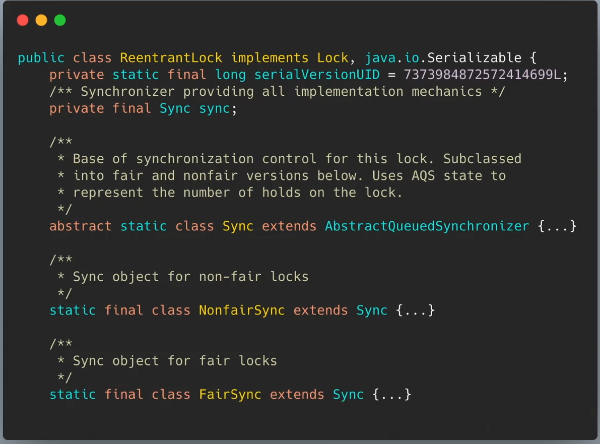
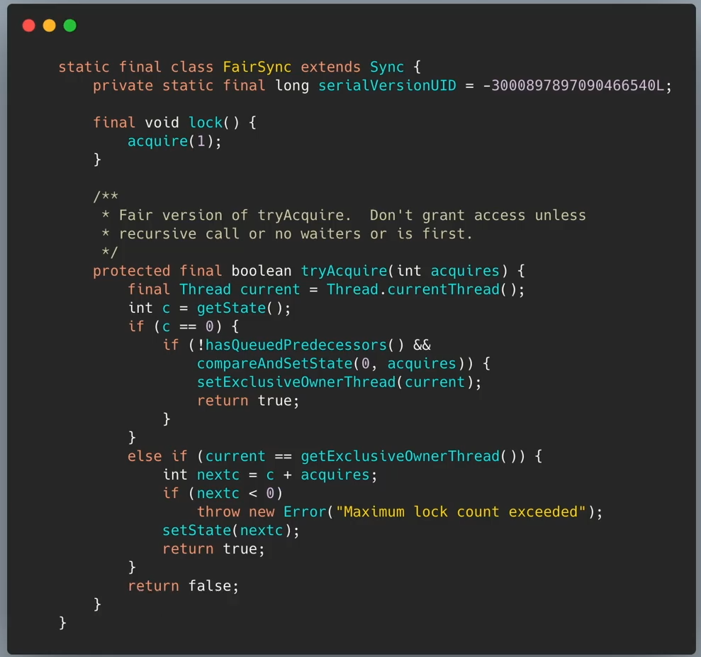
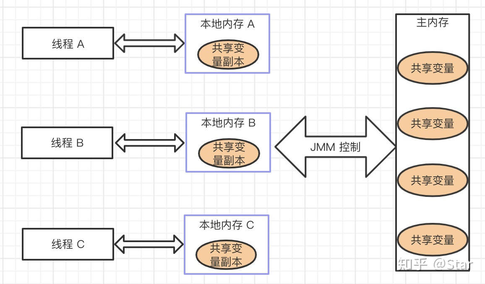
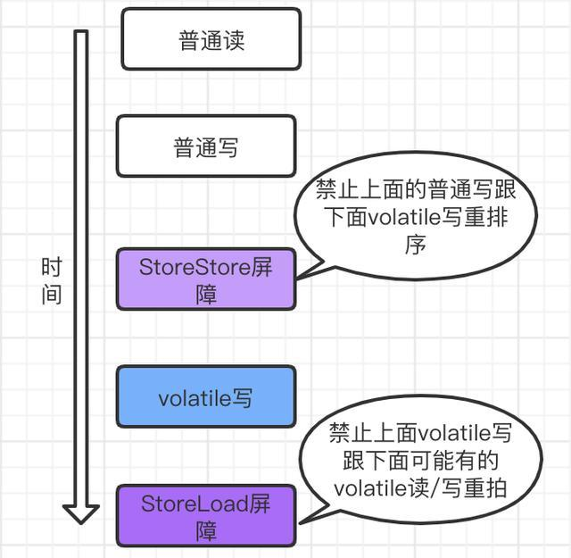
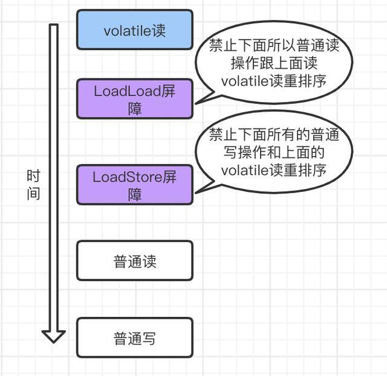

# Synchronized到底锁的是啥
实现线程同步，让多个线程排队依次获取某个资源，保证数据不会出错。

* 修饰方法
    * 静态方法类： 锁定的是类
    * 非静态方法 ： 锁定的是方法的调用者
    
* 修饰代码块 ： 锁定的是传入的对象。

# synchronized工作原理

syn在代码前后分别加上monitorenter和monitorexit这两个字节码指令。

每个对象有一个监视器锁（monitor）。当monitor被占用时就会处于锁定状态，线程执行monitorenter指令时尝试获取monitor的所有权，过程如下：

1. 如果monitor的进入数为0，则该线程进入monitor，然后将进入数设置为1，该线程即为monitor的所有者。

2. 如果线程已经占有该monitor，只是重新进入，则进入monitor的进入数加1.

3. 如果其他线程已经占用了monitor，则该线程进入阻塞状态，直到monitor的进入数为0，再重新尝试获取monitor的所有权。

java线程本身是操作系统线程的映射，所以挂起唤醒线程都需要操作系统内核态工作，资源消耗很大。

# ReentranLock

ReentranLock是基于AQS实现的。在并发编程中可以实现公平锁与非公平锁对共享资源进行同步。

与Synchronized一样，ReentranLock支持可重入，除此，在调度上更灵活，支持更多的功能。

ReentranLock实现了lock接口的方法。lock接口有：
1. lock():获取锁，如果已被占用，就等待获取
2. lockInterruptibly():同lock获取锁，如果当前线程在等待锁的过程中被中断，就会抛出中断异常。
3. trylock()：尝试获取锁并返回布尔
4. trylock(time):一段时间内尝试获取锁，如果期间被中断，将抛出中断异常。
5. unlock(): 释放锁
6. newCondition():新建一个绑定在当前lock上的condition对象。
    * condition对象表示一个等待的状态。 获得锁的线程可能在某些时刻需要等待一些条件的完成才能继续执行。他就会通过await方法注册在condition对象上进行等待，再通过condition对象的signao方法唤醒
    * 类似Object方法的wait和notify方法。不同的是一个lock对象可以关联多个condition，多个线程可以被绑定在不同的condition。这样可以实现分组唤醒。
    * 此外，condition还听了限时、中断等功能。丰富了线程的调度策略

ReentranLock实现了lock之外，还继承了AQS

NonfairSync：非公平锁的实现
* 通常情况下，去唤醒一个挂起的线程，线程切换之间会产生短暂的延迟，非公平锁就利用这段时间完成操作。

* lock方法进行了两次非公平的锁获取，两次失败就直接排队（公平）
* tryAcquire就进行插队尝试

FairSync：公平锁的实现

* 直接调用了AQS中的tryAcquire方法
* 如果锁空闲且队列之前没有排在之前的线程，就尝试获取锁

    
# volatile如何工作
synchronized是阻塞式同步，在线程竞争激烈的情况下会升级为重量级锁。 而volatile就可以说是java虚拟机提供的最轻量级的同步机制。

volatile 的主要作用有两点：
- 保证变量的内存可见性
- 禁止指令重排序

## volatile实现原理

在生成汇编代码时会在volatile修饰的共享变量进行写操作的时候会多出Lock前缀的指令
而这个lock关键字，使得：
1. Lock前缀的指令会引起处理器缓存写回内存；
2. 一个处理器的缓存回写到内存会导致其他处理器的缓存失效；
3. 当处理器发现本地缓存失效后，就会从内存中重读该变量数据，即可以获取当前最新值。

## 保证内存的可见性

JMM 定义了线程和主内存之间的抽象关系：线程之间的共享变量存储在主内存中，每个线程都有一个私有的本地内存，本地内存中存储了该线程以读/写共享变量的副本。

JMM 的规定：
* 所有的共享变量都存储于主内存。这里所说的变量指的是实例变量和类变量，不包含局部变量，因为局部变量是线程私有的，因此不存在竞争问题。
* 每一个线程还存在自己的工作内存，线程的工作内存，保留了被线程使用的变量的工作副本。
* 线程对变量的所有的操作（读，取）都必须在工作内存中完成，而不能直接读写主内存中的变量。
* 不同线程之间也不能直接访问对方工作内存中的变量，线程间变量的值的传递需要通过主内存中转来完成。
  

这样针对volatile变量通过这样的机制就使得每个线程都能获得该变量的最新值。

* 使用 volatile 修饰共享变量后，每个线程要操作变量时会从主内存中将变量拷贝到本地内存作为副本，当线程操作变量副本并写回主内存后，会通过 CPU 总线嗅探机制告知其他线程该变量副本已经失效，需要重新从主内存中读取。

* volatile 保证了不同线程对共享变量操作的可见性
  * 一个线程修改了 volatile 修饰的变量，当修改后的变量写回主内存时，其他线程能立即看到最新值。
    
## 禁止指令重排序
禁止了指令的重排序，即保证了 volatile 修饰的变量编译后的顺序与程序的执行顺序一样。
volatile通过内存屏障指令实现禁止指令重排序。

### 内存屏障

使用 volatile 修饰变量时，根据 volatile 重排序规则表，Java 编译器在生成字节码时，会在指令序列中插入内存屏障指令来禁止特定类型的处理器重排序。

* 在每个 volatile 写操作的前后分别插入一个 StoreStore 屏障和一个 StoreLoad 屏障。

* 在每个 volatile 读操作的后面插入 LoadLoad 屏障和 LoadStore 屏障。

也就是说，编译器不会对 volatile 读与 volatile 读后面的任意内存操作重排序；编译器不会对 volatile 写与 volatile 写前面的任意内存操作重排序。

内存屏障和volatile什么关系？

如果你的字段是volatile，Java内存模型将在写操作后插入一个写屏障 指令，在读操作前插入一个读屏障指令。这意味着如果你对一个volatile字段进行写操作，你必须知道：1、一旦你完成写入，任何访问这个字段的线程将 会得到最新的值。2、在你写入前，会保证所有之前发生的事已经发生，并且任何更新过的数据值也是可见的，因为内存屏障会把之前的写入值都刷新到缓存。

为了提高效率，有happens-before 原则。
* volatile 提供了 happens-before 保证，对 volatile 变量 V 的写入 happens-before 所有其他线程后续对 V 的读操作。

## volatile总结
* volatile 修饰符适用于以下场景：单个线程写，多个线程读的情况
* volatile 属性的**读写操作都是无锁**的，它不能替代 synchronized，因为它没有提供原子性和互斥性。因为无锁，不需要花费时间在获取锁和释放锁上，所以说它是低成本的。
* volatile 只能作用于属性，我们用 volatile 修饰属性，这样编译器就不会对这个属性做指令重排序。
* volatile 提供了可见性，任何一个线程对其的修改将立马对其他线程可见。volatile 属性**不会被线程缓存，始终从主存中读取。**
* volatile 提供了 happens-before 保证，对 volatile 变量 V 的写入 happens-before 所有其他线程后续对 V 的读操作。
* volatile 可以使纯赋值操作是原子的，如 boolean flag = true; falg = false。