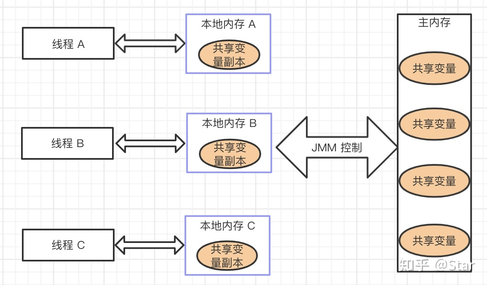
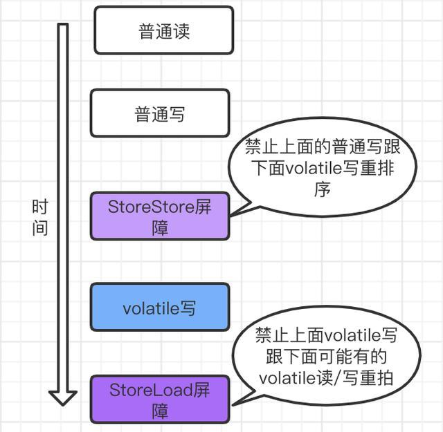
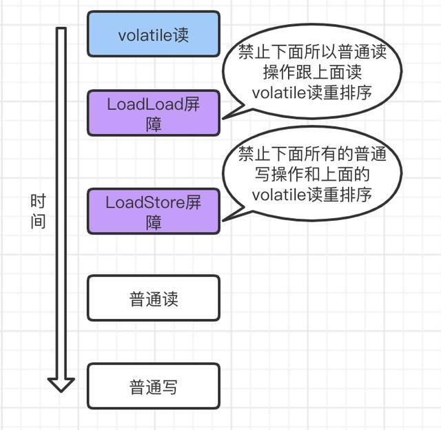

# Synchronized到底锁的是啥
实现线程同步，让多个线程排队依次获取某个资源，保证数据不会出错。

* 修饰方法
    * 静态方法类： 锁定的是类
    * 非静态方法 ： 锁定的是方法的调用者
    
* 修饰代码块 ： 锁定的是传入的对象。

# volatile如何工作
synchronized是阻塞式同步，在线程竞争激烈的情况下会升级为重量级锁。 而volatile就可以说是java虚拟机提供的最轻量级的同步机制。

volatile 的主要作用有两点：
- 保证变量的内存可见性
- 禁止指令重排序

## volatile实现原理

在生成汇编代码时会在volatile修饰的共享变量进行写操作的时候会多出Lock前缀的指令
而这个lock关键字，使得：
1. Lock前缀的指令会引起处理器缓存写回内存；
2. 一个处理器的缓存回写到内存会导致其他处理器的缓存失效；
3. 当处理器发现本地缓存失效后，就会从内存中重读该变量数据，即可以获取当前最新值。

## 保证内存的可见性

JMM 定义了线程和主内存之间的抽象关系：线程之间的共享变量存储在主内存中，每个线程都有一个私有的本地内存，本地内存中存储了该线程以读/写共享变量的副本。

JMM 的规定：
* 所有的共享变量都存储于主内存。这里所说的变量指的是实例变量和类变量，不包含局部变量，因为局部变量是线程私有的，因此不存在竞争问题。
* 每一个线程还存在自己的工作内存，线程的工作内存，保留了被线程使用的变量的工作副本。
* 线程对变量的所有的操作（读，取）都必须在工作内存中完成，而不能直接读写主内存中的变量。
* 不同线程之间也不能直接访问对方工作内存中的变量，线程间变量的值的传递需要通过主内存中转来完成。
  

这样针对volatile变量通过这样的机制就使得每个线程都能获得该变量的最新值。

* 使用 volatile 修饰共享变量后，每个线程要操作变量时会从主内存中将变量拷贝到本地内存作为副本，当线程操作变量副本并写回主内存后，会通过 CPU 总线嗅探机制告知其他线程该变量副本已经失效，需要重新从主内存中读取。

* volatile 保证了不同线程对共享变量操作的可见性
  * 一个线程修改了 volatile 修饰的变量，当修改后的变量写回主内存时，其他线程能立即看到最新值。
    
## 禁止指令重排序
禁止了指令的重排序，即保证了 volatile 修饰的变量编译后的顺序与程序的执行顺序一样。
volatile通过内存屏障指令实现禁止指令重排序。

### 内存屏障

使用 volatile 修饰变量时，根据 volatile 重排序规则表，Java 编译器在生成字节码时，会在指令序列中插入内存屏障指令来禁止特定类型的处理器重排序。

* 在每个 volatile 读操作的后面插入 LoadLoad 屏障和 LoadStore 屏障。

* 在每个 volatile 写操作的前后分别插入一个 StoreStore 屏障和一个 StoreLoad 屏障。

也就是说，编译器不会对 volatile 读与 volatile 读后面的任意内存操作重排序；编译器不会对 volatile 写与 volatile 写前面的任意内存操作重排序。

为了提高效率，有happens-before 原则。
* volatile 提供了 happens-before 保证，对 volatile 变量 V 的写入 happens-before 所有其他线程后续对 V 的读操作。

## volatile总结
* volatile 修饰符适用于以下场景：某个属性被多个线程共享，其中有一个线程修改了此属性，其他线程可以立即得到修改后的值；或者作为状态变量，实现轻量级同步。
* volatile 属性的**读写操作都是无锁**的，它不能替代 synchronized，因为它没有提供原子性和互斥性。因为无锁，不需要花费时间在获取锁和释放锁上，所以说它是低成本的。
* volatile 只能作用于属性，我们用 volatile 修饰属性，这样编译器就不会对这个属性做指令重排序。
* volatile 提供了可见性，任何一个线程对其的修改将立马对其他线程可见。volatile 属性**不会被线程缓存，始终从主存中读取。**
* volatile 提供了 happens-before 保证，对 volatile 变量 V 的写入 happens-before 所有其他线程后续对 V 的读操作。
* volatile 可以使纯赋值操作是原子的，如 boolean flag = true; falg = false。