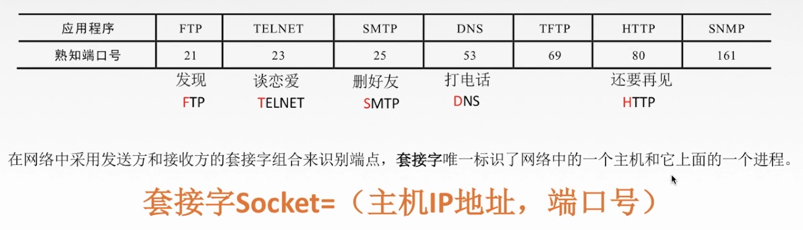
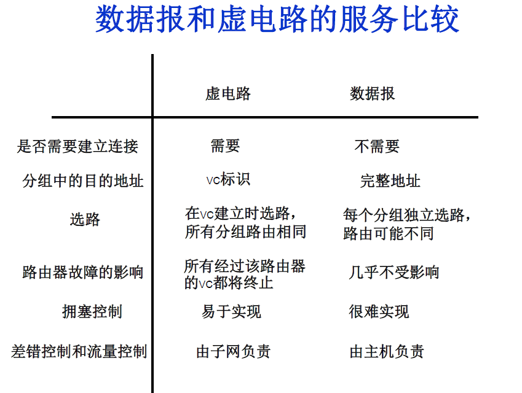
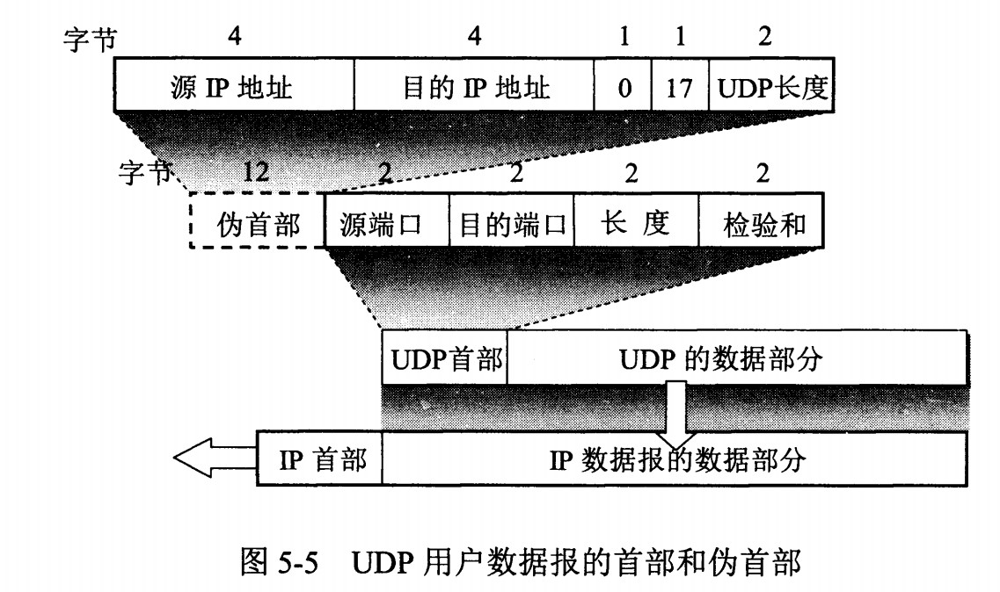
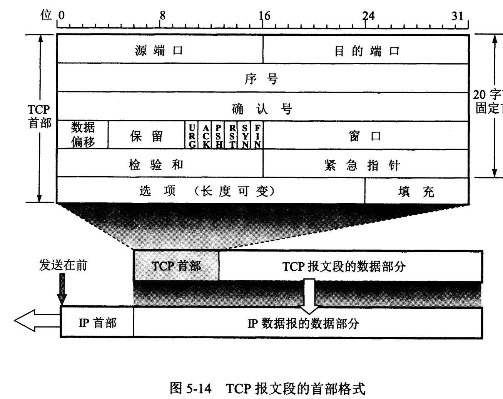
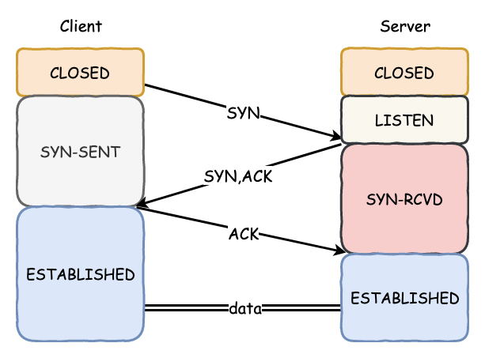
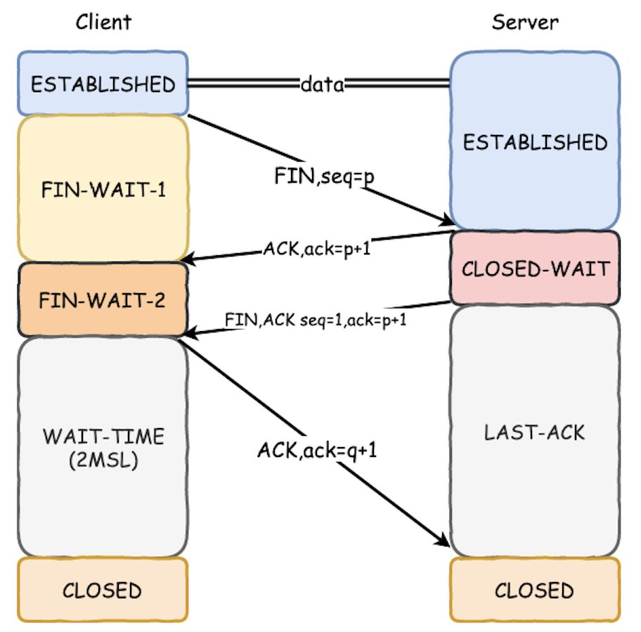
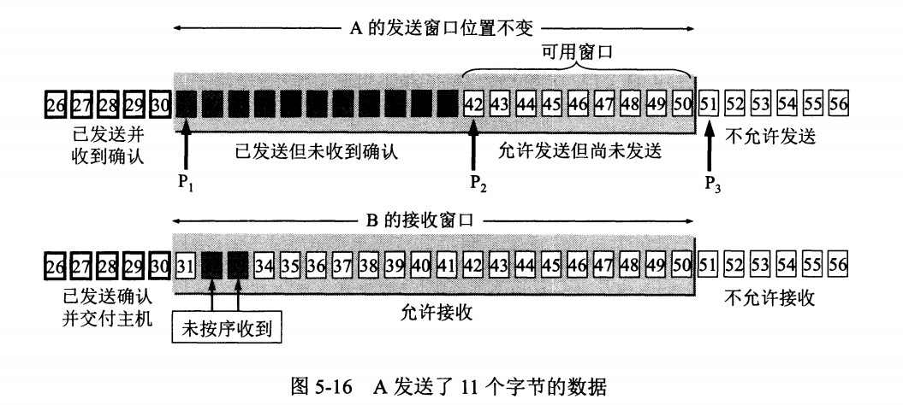
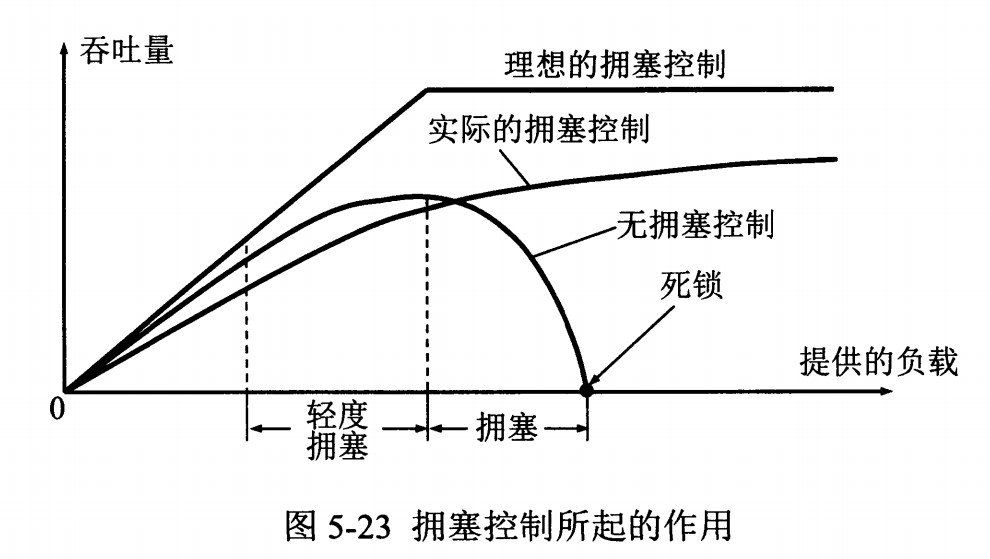

## 传输层

## 传输层的功能
1. 传输层提供进程与进程之间的逻辑通讯。
2. 复用与分用
    * 复用： 不同进程都使用这个协议
    * 分用： 收到消息再分发给对应进程
3. 对数据进行差错检测

## 传输层的寻址与端口号
端口是传输层中标识主机的应用进程。

端口号只有本地有意义。在英特网中不同计算机的相同端口没有联系。

端口号长度16bit，能表示65536个不同的端口号。

进程间使用socket通讯。

## UDP和TCP的区别
TCP 和 UDP 都位于计算机网络模型中的运输层，它们负责传输应用层产生的数据。

用户数据报协议 UDP（User Datagram Protocol）是无连接的，尽最大可能交付，没有拥塞控制，面向报文（对于应用程序传下来的报文不合并也不拆分，只是添加 UDP 首部），支持一对一、一对多、多对一和多对多的交互通信。

传输控制协议 TCP（Transmission Control Protocol）是面向连接的，提供可靠交付，有流量控制，拥塞控制，提供全双工通信，面向字节流（把应用层传下来的报文看成字节流，把字节流组织成大小不等的数据块），每一条 TCP 连接只能是点对点的（一对一）。

| TCP                                                          | UDP                                          |
| ------------------------------------------------------------ | -------------------------------------------- |
| TCP 是面向连接的协议                                         | UDP 是无连接的协议                    |
| TCP 在发送数据前先需要建立连接，然后再发送数据               | UDP 无需建立连接就可以直接发送大量数据         |
| TCP 会按照特定顺序重新排列数据包                             | UDP 数据包没有固定顺序，所有数据包都相互独立 |
| TCP 传输的速度比较慢                                         | UDP 的传输会更快                      |
| TCP 的头部字节有 20 字节                                     | UDP 的头部字节只需要 8 个字节           |
| TCP 是重量级的，在发送任何用户数据之前，TCP需要三次握手建立连接。 | UDP 是轻量级的。没有跟踪连接，消息排序等。    |
| TCP 会进行错误校验，并能够进行错误恢复                       | UDP 也会错误检查，但会丢弃错误的数据包。      |
| TCP 有发送确认                                               | UDP 没有发送确认                      |
| TCP 会使用握手协议，例如 SYN，SYN-ACK，ACK                   | 无握手协议                              |
| TCP 是可靠的，因为它可以确保将数据传送到路由器。             | 在 UDP 中不能保证将数据传送到目标。            |

补充：

1. 什么是无连接
    * 发送数据前不需要建立连接
2. 什么是不可靠
    * 接收报文后，不需要给出确认

无连接的网络服务（数据报服务）-- 面向连接的网络服务（虚电路服务）

## TCP与UDP的首部格式

UDP首部字段只有 8 个字节，包括**源端口、目的端口、长度、检验和**。

12 字节的伪首部是为了计算检验和临时添加的。

UDP 发送的报文长度是应用进程给出的

* 序号 ：用于对字节流进行编号，例如序号为 301，表示第一个字节的编号为 301，如果携带的数据长度为 100 字节，那么下一个报文段的序号应为 401。

* 确认号 ：期望收到的下一个报文段的序号。例如 B 正确收到 A 发送来的一个报文段，序号为 501，携带的数据长度为 200 字节，因此 B 期望下一个报文段的序号为 701，B 发送给 A 的确认报文段中确认号就为 701。

* 数据偏移 ：指的是数据部分距离报文段起始处的偏移量，**实际上指的是首部的长度。**

* 保留位：
    * 紧急位 URG：URG=1时，说明有紧急数据
    * 确认 ACK ：当 ACK=1 时确认号字段有效，否则无效。TCP 规定，在连接建立后所有传送的报文段都必须把 ACK 置 1。
    * 同步 SYN ：在连接建立时用来同步序号。当 SYN=1，ACK=0 时表示这是一个连接请求报文段。若对方同意建立连接，则响应报文中 SYN=1，ACK=1。
    * 终止 FIN ：用来释放一个连接，当 FIN=1 时，表示此报文段的发送方的数据已发送完毕，并要求释放连接。

* 窗口 ：窗口值作为接收方让发送方设置其发送窗口的依据。之所以要有这个限制，是因为接收方的数据缓存空间是有限的。

* 校验和：检验首部+数据部，检验加上12B伪首部
    * UDP也有检验和。校验和可以保证不传错，但是不会解决丢包和乱序问题。
    

## TCP的三次握手

1. 客户端向服务端发起连接，发送（SYN = 1，seq（随机生成） = 10000）
2. 服务端响应客户端。发送（SYN = 1，seq（随机） = 20000， ACK = 1， ack = 10001）
    * ACK用来确认收到对方的SYN，返回的ack为seq+1。至此，两次握手完成，此时客户端已经可以确定服务端可以收到自己的消息，但是服务端还不确定客户端是否 可以收到自己的消息。
3. 客户端响应服务端的SYN，返回（ACK = 1, ack = 20001（服务端发来的的seq + 1））.

到此三次握手完成，服务端与客户端都确认对方可以收到自己的消息。（双工）

### 三次握手的原因

第三次握手是为了防止失效的连接请求到达服务器，让服务器错误打开连接。

客户端发送的连接请求如果在网络中滞留，那么就会隔很长一段时间才能收到服务器端发回的连接确认。客户端等待一个超时重传时间之后，就会重新请求连接。但是这个滞留的连接请求最后还是会到达服务器，如果不进行三次握手，那么服务器就会打开两个连接。如果有第三次握手，客户端会忽略服务器之后发送的对滞留连接请求的连接确认，不进行第三次握手，因此就不会再次打开连接。

### 第三次没有收到ACK包会怎样？
由于Server没有收到ACK确认，因此会重发之前的SYN+ACK（默认重发五次，之后自动关闭连接），Client收到后会重新传ACK给Server。如果 Client向服务器发送数据，服务器会以RST包响应。

* RST是客户端或服务器异常关闭tcp连接发的包，通常都是主机收到不存在的tcp通道的tcp报文，主机“被迫”回复RST告知对方tcp连接异常，收到RST的一方就会关闭这个socket，释放所有socket信息，且不会回复ACK

### 如果已经建立了连接，但客户端出现了故障怎么办？
服务器每收到一次客户端的请求后都会重新复位一个计时器，时间通常是设置为2小时，若两小时还没有收到客户端的任何数据，服务器就会发送一个探测报文段，以后每隔75秒钟发送一次。若一连发送10个探测报文仍然没反应，服务器就认为客户端出了故障，接着就关闭连接

## TCP的四次挥手

1. 客户端向服务端发起结束请求，发送（FIN = 1 , seq = 25222），此时的seq由之前的tcp报文决定
2. 服务端回应客户端的请求，发送（ACK = 1, ack = 25223（客户端发送的seq + 1）),此时表示服务端收到了客户端的结束通话的请求。
   此时的服务端收到客户端的结束通知并回应，但是服务端端还没有结束，依然可以向客户端发送数据。
   服务端数据发送完毕后，再向客户端发送结束通知，即挥手3.
3. 服务端发送完消息后，向客户端发起结束，发送（FIN = 1 , seq = 10522），seq也是由之前的tcp报文决定。
4. 客户端收到 服务端的结束通知后，发送（FIN = 1， ack = 10523（服务端发送的seq + 1）），服务端收到，则最终结束。

### 四次挥手的原因

客户端发送了 FIN 连接释放报文之后，服务器收到了这个报文，就进入了 CLOSE-WAIT 状态。这个状态是为了让服务器端发送还未传送完毕的数据，传送完毕之后，服务器会发送 FIN 连接释放报文。

### TIME_WAIT状态

客户端接收到服务器端的 FIN 报文后进入此状态，此时并不是直接进入 CLOSED 状态，还需要等待一个时间计时器设置的时间 2MSL。这么做有两个理由：

1. 确保最后一个确认报文能够到达。如果 B 没收到 A 发送来的确认报文，那么就会重新发送连接释放请求报文，A 等待一段时间就是为了处理这种情况的发生。

2. 等待一段时间是为了让本连接持续时间内所产生的所有报文都从网络中消失，使得下一个新的连接不会出现旧的连接请求报文。

* MSL：一个片段在网络中最大的存活时间。2MSL就是最大的往返时间了

## TCP的可靠性
保证可靠性的4点：
1. 检验
    * 与UDP相同，校验和保证不错
2. 序号
3. 确认
4. 重传
    * TCP 使用超时重传来实现可靠传输：如果一个已经发送的报文段在超时时间内没有收到确认，那么就重传这个报文段。

## TCP流量控制（滑动窗口）

TCP使用滑动窗口实现流量控制

* 窗口是缓存的一部分，用来暂时存放字节流。发送方和接收方各有一个窗口，**接收方通过 TCP 报文段中的窗口字段**告诉发送方自己的窗口大小，发送方根据这个值和其它信息设置自己的窗口大小。
    * 流量控制是为了控制发送方发送速率，保证接收方来得及接收。

    * 接收方发送的确认报文中的窗口字段可以用来控制发送方窗口大小，从而影响发送方的发送速率。将窗口字段设置为 0，则发送方不能发送数据。
* 发送窗口内的字节都允许被发送，接收窗口内的字节都允许被接收。
* 如果发送窗口**左部的字节**已经发送并且收到了确认，那么就将发送窗口向右滑动一定距离，直到左部第一个字节不是已发送并且已确认的状态；接收窗口的滑动类似，接收窗口左部字节已经发送确认并交付主机，就向右滑动接收窗口。

* 接收窗口只会对窗口内**最后一个按序到达的字节**进行确认，例如接收窗口已经收到的字节为 {31, 34, 35}，其中 {31} 按序到达，而 {34, 35} 就不是，因此只对字节 31 进行确认。发送方得到一个字节的确认之后，就知道这个字节之前的所有字节都已经被接收。

### 什么是零窗口（接收窗口为0时会怎样）？

如果接收方没有能力接收数据，就会将接收窗口设置为0，这时发送方必须暂停发送数据，但是会启动一个持续计时器(persistence timer)，到期后发送一个大小为1字节的探测数据包，以查看接收窗口状态。如果接收方能够接收数据，就会在返回的报文中更新接收窗口大小，恢复数据传送。

## TCP拥塞控制
拥塞控制主要由四个算法组成：**慢启动（Slow Start）、拥塞避免（Congestion voidance）、快重传 （Fast Retransmit）、快恢复（Fast Recovery）**

发送方需要维护一个叫做拥塞窗口（cwnd）的状态变量，注意拥塞窗口与发送方窗口的区别：拥塞窗口只是一个状态变量，实际决定发送方能发送多少数据的是发送方窗口。

## 慢开始与拥塞避免 
   
发送的最初执行慢开始，令 cwnd = 1，发送方只能发送 1 个报文段；当收到确认后，将 cwnd 加倍，因此之后发送方能够发送的报文段数量为：2、4、8 ...

注意到慢开始每个轮次都将 cwnd 加倍，这样会让 cwnd 增长速度非常快，从而使得发送方发送的速度增长速度过快，网络拥塞的可能性也就更高。

设置一个慢开始门限 ssthresh，当 cwnd >= ssthresh 时，进入拥塞避免，每个轮次只将 cwnd 加 1。

如果出现了超时，则令 ssthresh = cwnd / 2，然后重新执行慢开始。

## 快重传与快恢复
在接收方，要求每次接收到报文段都应该对最后一个已收到的有序报文段进行确认。 在发送方，如果收到三个重复确认，那么可以知道下一个报文段丢失，此时执行快重传，立即重传下一个报文段。例如收到三个 M2，则 M3 丢失，立即重传 M3。

在这种情况下，只是丢失个别报文段，而不是网络拥塞。

因此执行快恢复，令 ssthresh = cwnd / 2 ，cwnd = ssthresh，注意到此时直接进入拥塞避免。

                                                                                                                                                            
慢开始和快恢复的快慢指的是 cwnd 的设定值，而不是 cwnd 的增长速率。慢开始 cwnd 设定为 1，而快恢复 cwnd 设定为 ssthresh。

## 什么是TCP粘包？

TCP粘包就是指发送方发送的若干包数据到达接收方时粘成了一包，从接收端缓冲区来看，后一包数据的头紧接着前一包数据的尾。

如果发送方发送的多组数据本来就是同一块数据的不同部分，比如说一个文件被分成多个部分发送，这时当然不需要处理粘包现象；如果多个分组毫不相干，甚至是并列关系，那么这个时候就一定要处理粘包现象了

出现粘包的原因：

- 发送方：默认使用**Nagle算法**（主要作用：减少网络中报文段的数量），将多次间隔较小、数据量较小的数据，合并成一个数据量大的数据块，进行发送；
    * Nagle算法主要是避免发送小的数据包，要求TCP连接上最多只能有一个未被确认的小分组，在该分组的确认到达之前不能发送其他的小分组。相反，TCP收集这些少量的小分组，并在确认到来时以一个分组的方式发出去。
    * Nagle核心就是将大量小包组合发，所以容易造成粘包
- 接收方：TCP将接收到的数据包保存在**接收缓存**里，然后应用程序主动从缓存读取收到的分组。如果TCP接收数据包到缓存的速度大于应用程序从缓存中读取数据包的速度，多个包就会被缓存，应用程序就有可能读取到多个首尾相接粘到一起的包。

### 如何解决粘包问题？

- 发送方：关闭Nagle算法；
- 接收方：在应用层进行处理。将所有数据全部读完之后，再进行分组。分组的方法可以通过规定开始符和结束符的方法；也可以在每组数据前加上数据长度。

