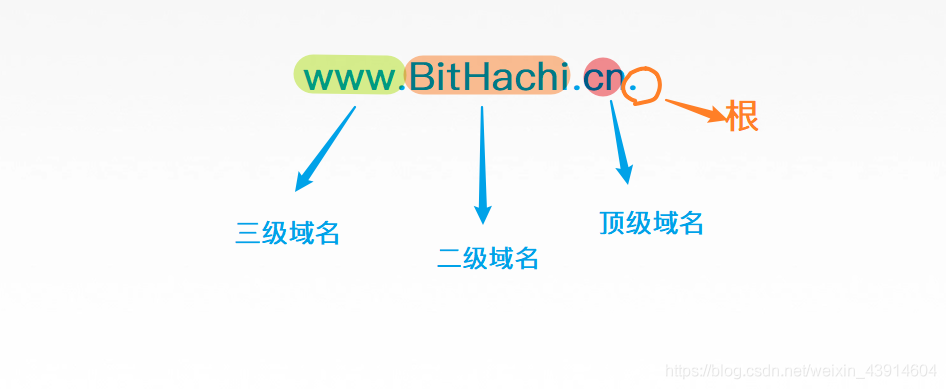
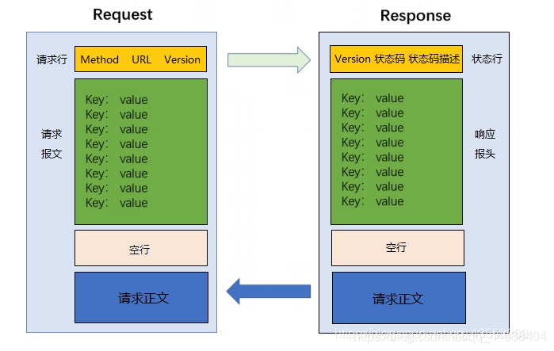
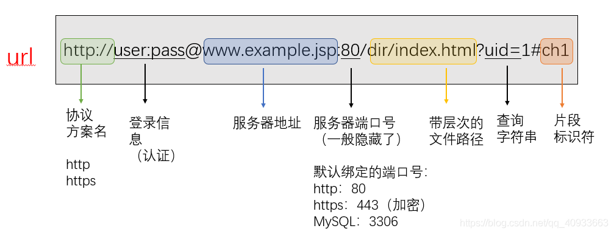

r## 应用层
不同的网络应用之间需要有一个确定的通信规则

两种应用模型：
1. 客户/服务器模型（Client/Server）
    * 服务器永久提供服务，客户偶尔接入
2. P2P模型（Peer-to-Peer）
    * 每个主机即提供服务，又可以请求服务
    * 任意节点间可以通讯

## 域名解析系统（DNS）
DNS服务器：将域名转换为ip地址

dns的递归查询与迭代查询（都不够快，所以又引入了高速缓存）

### DNS劫持
那DNS服务器会告诉你A网站的IP是A，B网站的IP是B，那假如你输入的A网站域名，但是他给你B的IP，你是不是就访问到别的网站去了？

## 输入URL后

## HTTP的连接方式
持久连接（非流水线，流水线）与非持久连接

* 非持久连接：每次传输前都要发起tcp连接。
* 持久连接（非流水）：图示为非流水线式。发一个请求等到响应再发下一个请求。
* 流水线式：一次发送多个请求，服务器再依次返回响应

## HTTP报文

http请求的构成：
1. 请求方法 + URI + 协议/版本
    * GET/sample.jspHTTP/1.1 
2. 请求头(Request Header)
    * Accept 可接受的内容类型
    * Accept-Language 语言
    * Connection连接状态
    * Host 请求的域名（这里我设置的是请求本地，当然，关于域名，就是所谓的URL）
    * User-Agent 浏览器端浏览器型号和版本
    * Accept-Encoding 可接受的压缩类型 gzip,deflate
3. 请求正文
    * username=jinqiao&password=1234，像restful后面加的，实际就是一个kv键值对

http响应的构成：
1. 状态行
    *  例如HTTP/1.1 200 OK，协议+状态码+状态描述
2. 响应头
3. 响应正文

## URL格式

## HTTP 和 HTTPS 的区别
HTTP 是一种 超文本传输协议(Hypertext Transfer Protocol)，HTTP 是一个在计算机世界里专门在两点之间传输文字、图片、音频、视频等超文本数据的约定和规范.      
HTTPS 的全称是 Hypertext Transfer Protocol Secure，从名称我们可以看出 HTTPS 要比 HTTPS 多了 secure 安全性这个概念，实际上， HTTPS 并不是一个新的应用层协议，它其实就是 HTTP + TLS/SSL 协议组合而成，而安全性的保证正是 TLS/SSL 所做的工作。    
也就是说，HTTPS 就是身披了一层 SSL 的 HTTP.     

* HTTP 在地址栏上的协议是以 http:// 开头，而 HTTPS 在地址栏上的协议是以 https:// 开头.       *
* HTTP 的默认端口是 80，而 HTTPS 的默认端口是 443

## https是怎么保证安全的
下面就是https的整个架构，现在的https基本都使用TSL了，因为更加安全，所以下图中的SSL应该换为SSL/TSL。

PS：由于HTTPS的推出受到了很多人的欢迎，在SSL更新到3.0时，IETF对SSL3.0进行了标准化，并添加了少数机制(但是几乎和SSL3.0无差异)，标准化后的IETF更名为TLS1.0(Transport Layer Security 安全传输层协议)，可以说TLS就是SSL的新版本3.1

### 加密
1. 对称密钥加密

对称密钥加密（Symmetric-Key Encryption），加密和解密使用同一密钥。

2. 非对称密钥加密

**非对称密钥加密，又称公开密钥加密（Public-Key Encryption）**，加密和解密使用不同的密钥。

**公开密钥所有人都可以获得，通信发送方获得接收方的公开密钥之后，就可以使用公开密钥进行加密，接收方收到通信内容后使用私有密钥解密。**

非对称密钥除了用来加密，还可以用来进行签名。因为私有密钥无法被其他人获取，因此通信发送方使用其私有密钥进行签名，通信接收方使用发送方的公开密钥对签名进行解密，就能判断这个签名是否正确。

* 优点：可以更安全地将公开密钥传输给通信发送方；
* 缺点：运算速度慢。

HTTPS 采用混合的加密机制，正是利用了上面提到的方案：

* 使用非对称密钥加密方式，传输对称密钥加密方式所需要的 Secret Key，从而保证安全性;
* 获取到 Secret Key 后，再使用对称密钥加密方式进行通信，从而保证效率。（下图中的 Session Key 就是 Secret Key）

## https连接的过程
1. 客户端发起 HTTPS 请求

    * 用户在浏览器里输入一个 https 网址，然后连接到 server 的 443 端口。

2. 服务端的配置
    * 采用 HTTPS 协议的服务器必须要有一套数字证书，可以自己制作，也可以向组织申请，区别就是自己颁发的证书需要客户端验证通过，才可以继续访问，而使用受信任的公司申请的证书则不会弹出提示页面(startssl 就是个不错的选择，有 1 年的免费服务)。
    * 这套证书其实就是一对公钥和私钥，如果对公钥和私钥不太理解，可以想象成一把钥匙和一个锁头，只是全世界只有你一个人有这把钥匙，你可以把锁头给别人，别人可以用这个锁把重要的东西锁起来，然后发给你，因为只有你一个人有这把钥匙，所以只有你才能看到被这把锁锁起来的东西。

3. 传送证书
    * 这个证书其实就是公钥，只是包含了很多信息，如证书的颁发机构，过期时间等等。

4. 客户端解析证书

    * 这部分工作是有客户端的TLS来完成的，首先会验证公钥是否有效，比如颁发机构，过期时间等等，如果发现异常，则会弹出一个警告框，提示证书存在问题。
    * 如果证书没有问题，那么就生成一个随机值，然后用证书对该随机值进行加密，就好像上面说的，把随机值用锁头锁起来，这样除非有钥匙，不然看不到被锁住的内容。

5. 传送加密信息
    * 这部分传送的是用证书加密后的随机值，目的就是让服务端得到这个随机值，以后客户端和服务端的通信就可以通过这个随机值来进行加密解密了。

6. 服务端解密信息
    * 服务端用私钥解密后，得到了客户端传过来的随机值(私钥)，然后把内容通过该值进行对称加密，所谓对称加密就是，将信息和私钥通过某种算法混合在一起，这样除非知道私钥，不然无法获取内容，而正好客户端和服务端都知道这个私钥，所以只要加密算法够彪悍，私钥够复杂，数据就够安全。

7. 传输加密后的信息
    * 这部分信息是服务段用私钥加密后的信息，可以在客户端被还原。

8. 客户端解密信息
    * 客户端用之前生成的私钥解密服务段传过来的信息，于是获取了解密后的内容，整个过程第三方即使监听到了数据，也束手无策。

## Http请求与幂等性
什么是幂等性？指一次或多次请求一个资源应该有同样的副作用。简单来说就是对一个URL的多次请求应该返回同样的结果。

* get 获取数据 幂等
* post 在服务器新建数据 非幂等
* put 修改服务器中数据 --- 发送的完整数据 幂等
* delete 删除服务器的数据 幂等

POST与PUT幂等性的理解：
* POST所对应的URI并非创建的资源本身，而是资源的接收者。比如：POST http://www.forum.com/articles 的语义是在 http://www.forum.com/articles 下创建一篇帖子，HTTP响应中应包含帖子的创建状态以及帖子的URI。两次相同的POST请求会在服务器端创建两份资源，它们具有不同的URI；所以，POST方法不具备幂等性。而PUT所对应的URI是要创建或更新的资源本身。
  比如：PUT http://www.forum/articles/4231 的语义是创建或更新ID为4231的帖子。对同一URI进行多次PUT的副作用和一次PUT是相同的；因此，PUT方法具有幂等性。

## HTTP Get 和 Post 区别
get 方法一般用于**请求**，比如你输入 www.baidu.com 就是发送了一个 get 请求，它的主要特征是请求服务器返回资源.           
而 post 方法一般用于表单的**提交**，相当于是把信息提交给服务器，等待服务器作出响应， get 相当于一个是 pull/拉的操作，而 post 相当于是一个 push/推的操作。       
get 方法是不安全的，因为你在发送请求的过程中，你的请求参数会拼在 URL 后面，从而导致容易被攻击者窃取，对你的信息造成破坏和伪造；
* get 请求的 URL 有长度限制，而 post 请求会把参数和值放在消息体中，对数据长度没有要求。
* get 请求会被浏览器主动 cache，而 post 不会，除非手动设置。
* get 请求在浏览器反复的 回退/前进 操作是无害的，而 post 操作会再次提交表单请求。
* get 请求在发送过程中会产生一个 TCP 数据包；post 在发送过程中会产生两个 TCP 数据包。对于 get 方式的请求，浏览器会把 http header 和 data 一并发送出去，服务器响应 200（返回数据）；而对于 post，浏览器先发送 header，服务器响应 100 continue，浏览器再发送 data，服务器响应 200 ok（返回数据）。

## HTTP 状态码
服务器返回的 响应报文 中第一行为状态行，包含了状态码以及原因短语，用来告知客户端请求的结果。
* 1XX ： Informational（信息性状态码）
* 2XX ： Success（成功状态码）
* 3XX ： Redirection（重定向状态码）
* 4XX ： Client Error（客户端错误状态码）
* 5XX ： Server Error（服务器错误状态码）

## 什么是无状态协议，HTTP 是无状态协议吗，怎么解决
无状态协议(Stateless Protocol) 就是指浏览器对于事务的处理没有记忆能力。      
举个例子来说就是比如客户请求获得网页之后关闭浏览器，然后再次启动浏览器，登录该网站，但是服务器并不知道客户关闭了一次浏览器。        
HTTP 就是一种无状态的协议，他对用户的操作没有记忆能力。HTTP使用(Cookie) 的机制。它能够让浏览器具有记忆能力。

## Cookie的作用是什么?和Session有什么区别？
Cookie 一般用来保存用户信息 比如在 Cookie 中保存已经登录过得用户信息，下次访问网站的时候页面可以自动帮你登录的一些基本信息给填了；

Session 的主要作用就是通过服务端记录用户的状态。 典型的场景是购物车，当你要添加商品到购物车的时候，系统不知道是哪个用户操作的，因为 HTTP 协议是无状态的。服务端给特定的用户创建特定的 Session 之后就可以标识这个用户并且跟踪这个用户了。

总结 ：Cookie 数据保存在客户端(浏览器端)，Session 数据保存在服务器端。

## HTTP 1.0和HTTP 1.1,HTTP2.0的主要区别是什么?
HTTP1.0最早在网页中使用是在1996年，那个时候只是使用一些较为简单的网页上和网络请求上，而HTTP1.1则在1999年才开始广泛应用于现在的各大浏览器网络请求中，同时HTTP1.1也是当前使用最为广泛的HTTP协议。

1. **长连接** : 在HTTP1.0中，默认使用的是短连接
2. 错误状态响应码 :在HTTP1.1中新增了24个错误状态响应码，
3. 缓存处理 : HTTP1.1提供了更多可供选择的缓存头来控制缓存策略。
4. 带宽优化及网络连接的使用

SPDY：HTTP1.x的优化:

2012年google如一声惊雷提出了SPDY的方案，优化了HTTP1.X的请求延迟，解决了HTTP1.X的安全性，具体如下：

1. 降低延迟，针对HTTP高延迟的问题，SPDY优雅的采取了多路复用（multiplexing）。多路复用通过多个请求stream共享一个tcp连接的方式，解决了HOL blocking的问题，降低了延迟同时提高了带宽的利用率。
2. 请求优先级（request prioritization）。多路复用带来一个新的问题是，在连接共享的基础之上有可能会导致关键请求被阻塞。SPDY允许给每个request设置优先级，这样重要的请求就会优先得到响应。比如浏览器加载首页，首页的html内容应该优先展示，之后才是各种静态资源文件，脚本文件等加载，这样可以保证用户能第一时间看到网页内容。
3. header压缩。HTTP1.x的header很多时候都是重复多余的。选择合适的压缩算法可以减小包的大小和数量。
4. 基于HTTPS的加密协议传输，大大提高了传输数据的可靠性。
5. 服务端推送（server push），采用了SPDY的网页，例如我的网页有一个sytle.css的请求，在客户端收到sytle.css数据的同时，服务端会将sytle.js的文件推送给客户端，当客户端再次尝试获取sytle.js时就可以直接从缓存中获取到，不用再发请求了。

HTTP2.0可以说是SPDY的升级版

HTTP2.0和HTTP1.X相比的新特性:

* 新的二进制格式（Binary Format），HTTP1.x的解析是基于文本。基于文本协议的格式解析存在天然缺陷，文本的表现形式有多样性，要做到健壮性考虑的场景必然很多，二进制则不同，只认0和1的组合。基于这种考虑HTTP2.0的协议解析决定采用二进制格式，实现方便且健壮。
* 多路复用（MultiPlexing），即连接共享，即每一个request都是是用作连接共享机制的。一个request对应一个id，这样一个连接上可以有多个request，每个连接的request可以随机的混杂在一起，接收方可以根据request的 id将request再归属到各自不同的服务端请求里面。
* header压缩，如上文中所言，对前面提到过HTTP1.x的header带有大量信息，而且每次都要重复发送，HTTP2.0使用encoder来减少需要传输的header大小，通讯双方各自cache一份header fields表，既避免了重复header的传输，又减小了需要传输的大小。
* 服务端推送（server push），同SPDY一样，HTTP2.0也具有server push功能

## http长连接与短连接的区别以及使用场景
短连接： 
* 连接->传输数据->关闭连
* 比如HTTP是无状态的的短链接，浏览器和服务器每进行一次HTTP操作，就建立一次连接，但任务结束就中断连接。
* 因为连接后接收了数据就断开了，所以每次数据接受处理不会有联系。 这也是HTTP协议无状态的原因之一。

长连接：
* 长连接是指的TCP连接，而不是HTTP连接。
* 连接->传输数据->保持连接 -> 传输数据-> ...........->直到一方关闭连接，多是客户端关闭连接。
* 长连接指建立SOCKET连接后不管是否使用都保持连接，但安全性较差。

长连接多用于操作频繁，点对点的通讯，而且连接数不能太多情况。每个TCP连接都需要三步握手，
这需要时间，如果每个操作都是先连接，再操作的话那么处理速度会降低很多，所以每个操作完后都
不断开，次处理时直接发送数据包就OK了，不用建立TCP连接。例如：数据库的连接用长连接， 如果
用短连接频繁的通信会造成socket错误，而且频繁的socket 创建也是对资源的浪费。

而像WEB网站的http服务一般都用短链接，因为长连接对于服务端来说会耗费一定的资源，而像WEB网
站这么频繁的成千上万甚至上亿客户端的连接用短连接会更省一些资源，如果用长连接，而且同时有成
千上万的用户，如果每个用户都占用一个连接的话，那可想而知吧。所以并发量大，但每个用户无需频
繁操作情况下需用短连好。

## HTTP Keep-Alive与TCP keepalive
* HTTP Keep-Alive 是一项允许 HTTP 客户端（通常是浏览器）和服务器（网络服务器）通过同一个 TCP 连接发送多个请求/响应对的功能。这减少了第二个、第三个、... HTTP 请求的延迟，减少了网络流量等。

* TCP keepalive 是一个完全不同的概念。它通过发送小数据包来保持 TCP 连接打开。此外，当数据包被发送时，这作为一个检查，所以一旦连接断开，发送者就会得到通知（注意，情况并非如此——除非我们尝试通过 TCP 连接进行通信，否则我们不知道它是否正常）。
