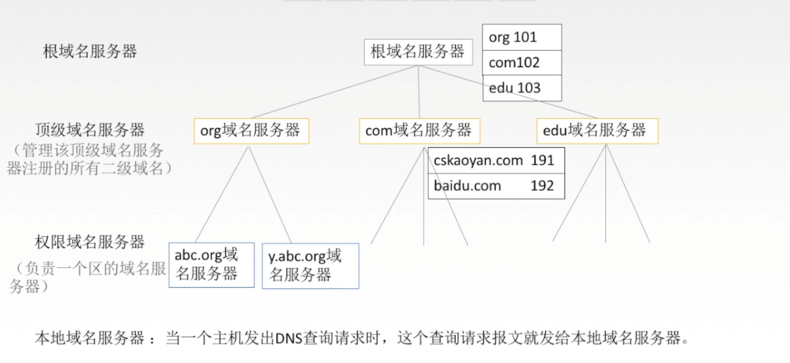
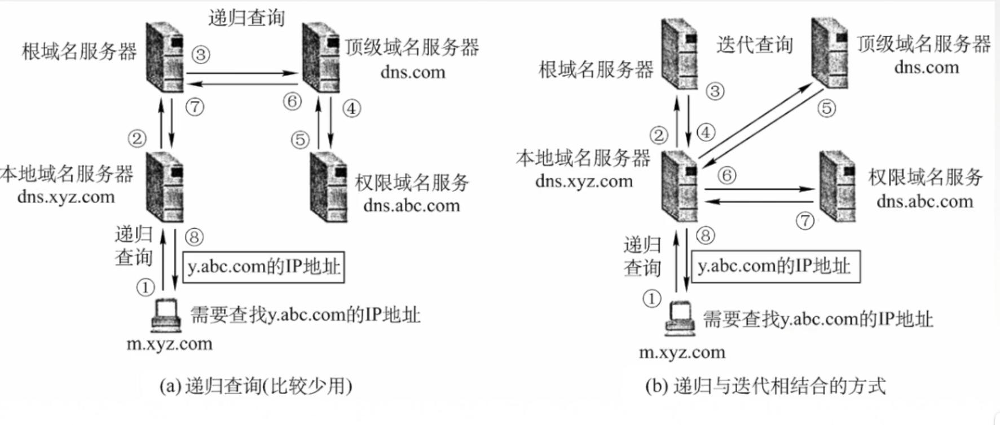
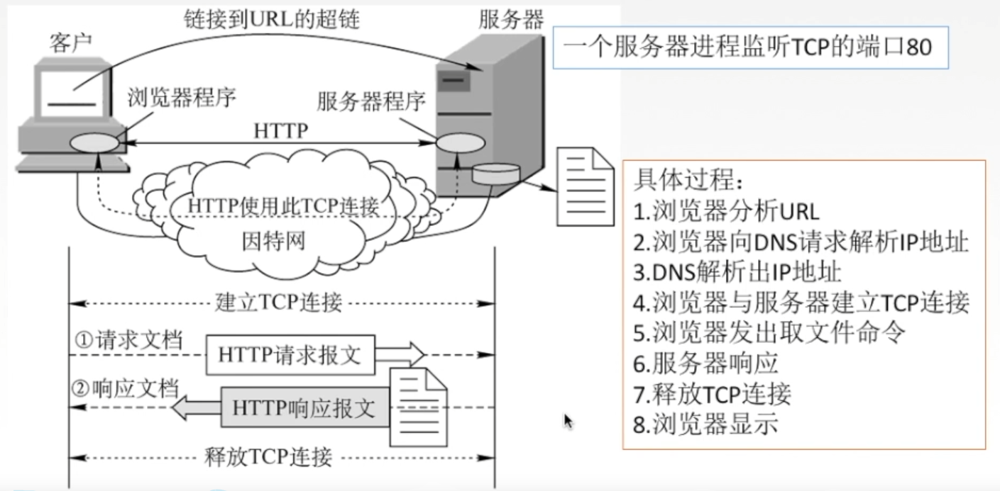
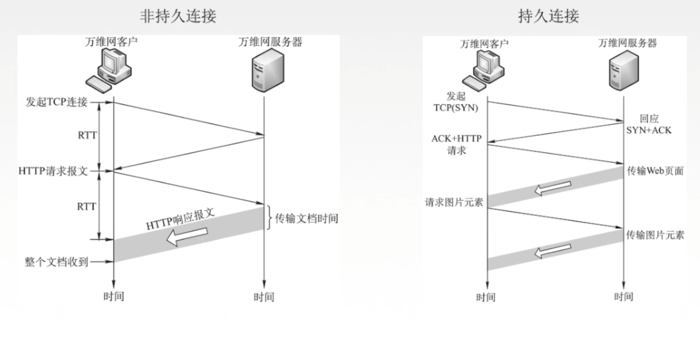
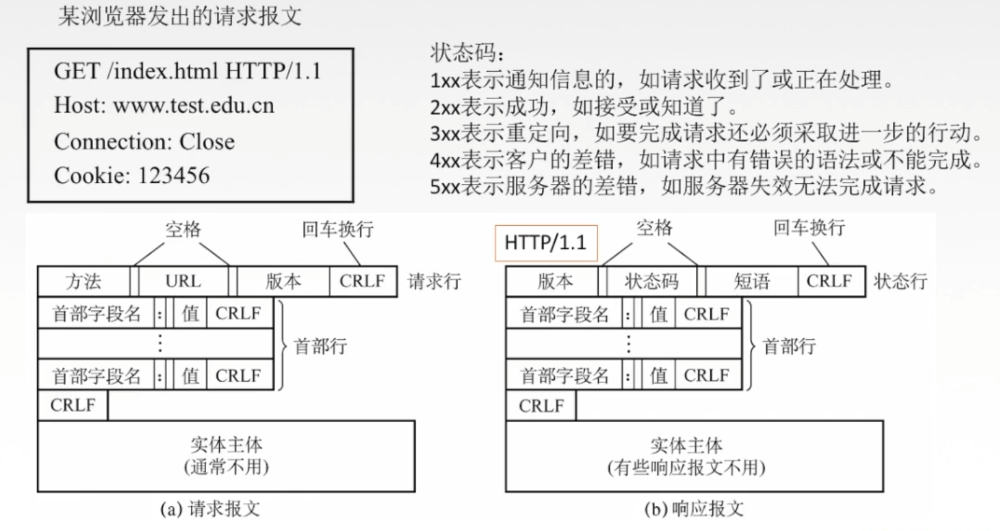
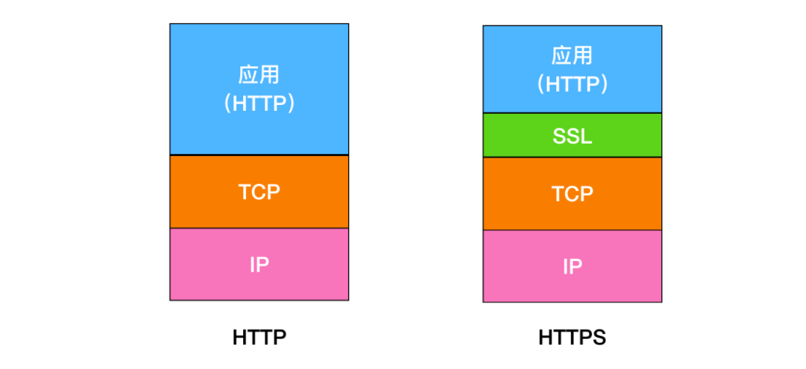
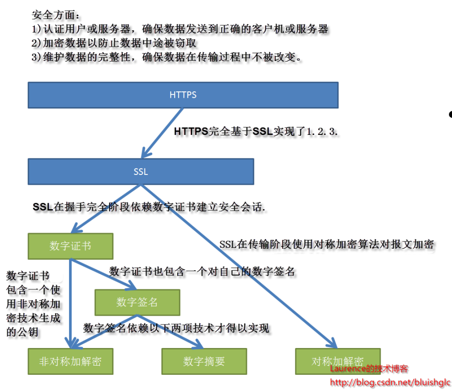
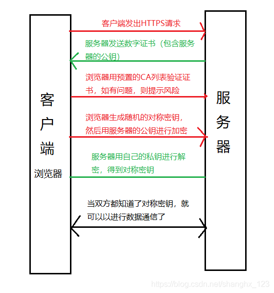

## 应用层
不同的网络应用之间需要有一个确定的通信规则

两种应用模型：
1. 客户/服务器模型（Client/Server）
    * 服务器永久提供服务，客户偶尔接入
2. P2P模型（Peer-to-Peer）
    * 每个主机即提供服务，又可以请求服务
    * 任意节点间可以通讯

## 域名解析系统（DNS）
DNS服务器：将域名转换为ip地址

dns的递归查询与迭代查询（都不够快，所以又引入了高速缓存）

## 输入URL后

## HTTP的连接方式
持久连接（非流水线，流水线）与非持久连接

* 非持久连接：每次传输前都要发起tcp连接。
* 持久连接（非流水）：图示为非流水线式。发一个请求等到响应再发下一个请求。
* 流水线式：一次发送多个请求，服务器再依次返回响应

## HTTP报文

## HTTP 和 HTTPS 的区别
HTTP 是一种 超文本传输协议(Hypertext Transfer Protocol)，HTTP 是一个在计算机世界里专门在两点之间传输文字、图片、音频、视频等超文本数据的约定和规范.      
HTTPS 的全称是 Hypertext Transfer Protocol Secure，从名称我们可以看出 HTTPS 要比 HTTPS 多了 secure 安全性这个概念，实际上， HTTPS 并不是一个新的应用层协议，它其实就是 HTTP + TLS/SSL 协议组合而成，而安全性的保证正是 TLS/SSL 所做的工作。    
也就是说，HTTPS 就是身披了一层 SSL 的 HTTP.     

* HTTP 在地址栏上的协议是以 http:// 开头，而 HTTPS 在地址栏上的协议是以 https:// 开头.       *
* HTTP 的默认端口是 80，而 HTTPS 的默认端口是 443

## https是怎么保证安全的
下面就是https的整个架构，现在的https基本都使用TSL了，因为更加安全，所以下图中的SSL应该换为SSL/TSL。

PS：由于HTTPS的推出受到了很多人的欢迎，在SSL更新到3.0时，IETF对SSL3.0进行了标准化，并添加了少数机制(但是几乎和SSL3.0无差异)，标准化后的IETF更名为TLS1.0(Transport Layer Security 安全传输层协议)，可以说TLS就是SSL的新版本3.1

### 加密
1. 对称密钥加密

对称密钥加密（Symmetric-Key Encryption），加密和解密使用同一密钥。

2. 非对称密钥加密

**非对称密钥加密，又称公开密钥加密（Public-Key Encryption）**，加密和解密使用不同的密钥。

**公开密钥所有人都可以获得，通信发送方获得接收方的公开密钥之后，就可以使用公开密钥进行加密，接收方收到通信内容后使用私有密钥解密。**

非对称密钥除了用来加密，还可以用来进行签名。因为私有密钥无法被其他人获取，因此通信发送方使用其私有密钥进行签名，通信接收方使用发送方的公开密钥对签名进行解密，就能判断这个签名是否正确。

* 优点：可以更安全地将公开密钥传输给通信发送方；
* 缺点：运算速度慢。

HTTPS 采用混合的加密机制，正是利用了上面提到的方案：

* 使用非对称密钥加密方式，传输对称密钥加密方式所需要的 Secret Key，从而保证安全性;
* 获取到 Secret Key 后，再使用对称密钥加密方式进行通信，从而保证效率。（下图中的 Session Key 就是 Secret Key）

### 认证
通过使用 证书 来对通信方进行认证。

数字证书认证机构（CA，Certificate Authority）是客户端与服务器双方都可信赖的第三方机构。

服务器的运营人员向 CA 提出公开密钥的申请，CA 在判明提出申请者的身份之后，会对已申请的公开密钥做数字签名，然后分配这个已签名的公开密钥，并将该公开密钥放入公开密钥证书后绑定在一起。

进行 HTTPS 通信时，服务器会把证书发送给客户端。客户端取得其中的公开密钥之后，先使用数字签名进行验证，如果验证通过，就可以开始通信了。

### 完整性
SSL 提供报文摘要功能来进行完整性保护。

数字摘要是采用单项Hash函数将需要加密的明文“摘要”成一串固定长度（128位）的密文，这一串密文又称为数字指纹，它有固定的长度，而且不同的明文摘要成密文，其结果总是不同的，而同样的明文其摘要必定一致。“数字摘要“是https能确保数据完整性和防篡改的根本原因。

数字签名技术就是对“非对称密钥加解密”和“数字摘要“两项技术的应用，它将摘要信息用发送者的私钥加密，与原文一起传送给接收者。接收者只有用发送者的公钥才能解密被加密的摘要信息，然后用HASH函数对收到的原文产生一个摘要信息，与解密的摘要信息对比。如果相同，则说明收到的信息是完整的，在传输过程中没有被修改，否则说明信息被修改过，因此数字签名能够验证信息的完整性。

数字签名的过程如下：

明文 --> hash运算 --> 摘要 --> 私钥加密 --> 数字签名

数字签名有两种功效：
1. 能确定消息确实是由发送方签名并发出来的，因为别人假冒不了发送方的签名。
2. 数字签名能确定消息的完整性。

## HTTP Get 和 Post 区别
get 方法一般用于**请求**，比如你输入 www.baidu.com 就是发送了一个 get 请求，它的主要特征是请求服务器返回资源.           
而 post 方法一般用于表单的**提交**，相当于是把信息提交给服务器，等待服务器作出响应， get 相当于一个是 pull/拉的操作，而 post 相当于是一个 push/推的操作。       
get 方法是不安全的，因为你在发送请求的过程中，你的请求参数会拼在 URL 后面，从而导致容易被攻击者窃取，对你的信息造成破坏和伪造；
* get 请求的 URL 有长度限制，而 post 请求会把参数和值放在消息体中，对数据长度没有要求。
* get 请求会被浏览器主动 cache，而 post 不会，除非手动设置。
* get 请求在浏览器反复的 回退/前进 操作是无害的，而 post 操作会再次提交表单请求。
* get 请求在发送过程中会产生一个 TCP 数据包；post 在发送过程中会产生两个 TCP 数据包。对于 get 方式的请求，浏览器会把 http header 和 data 一并发送出去，服务器响应 200（返回数据）；而对于 post，浏览器先发送 header，服务器响应 100 continue，浏览器再发送 data，服务器响应 200 ok（返回数据）。

## HTTP 状态码
服务器返回的 响应报文 中第一行为状态行，包含了状态码以及原因短语，用来告知客户端请求的结果。
* 1XX ： Informational（信息性状态码）
* 2XX ： Success（成功状态码）
* 3XX ： Redirection（重定向状态码）
* 4XX ： Client Error（客户端错误状态码）
* 5XX ： Server Error（服务器错误状态码）

## 什么是无状态协议，HTTP 是无状态协议吗，怎么解决
无状态协议(Stateless Protocol) 就是指浏览器对于事务的处理没有记忆能力。      
举个例子来说就是比如客户请求获得网页之后关闭浏览器，然后再次启动浏览器，登录该网站，但是服务器并不知道客户关闭了一次浏览器。        
HTTP 就是一种无状态的协议，他对用户的操作没有记忆能力。HTTP使用(Cookie) 的机制。它能够让浏览器具有记忆能力。

## Cookie的作用是什么?和Session有什么区别？
Cookie 一般用来保存用户信息 比如在 Cookie 中保存已经登录过得用户信息，下次访问网站的时候页面可以自动帮你登录的一些基本信息给填了；

Session 的主要作用就是通过服务端记录用户的状态。 典型的场景是购物车，当你要添加商品到购物车的时候，系统不知道是哪个用户操作的，因为 HTTP 协议是无状态的。服务端给特定的用户创建特定的 Session 之后就可以标识这个用户并且跟踪这个用户了。

总结 ：Cookie 数据保存在客户端(浏览器端)，Session 数据保存在服务器端。

## HTTP 1.0和HTTP 1.1的主要区别是什么?
HTTP1.0最早在网页中使用是在1996年，那个时候只是使用一些较为简单的网页上和网络请求上，而HTTP1.1则在1999年才开始广泛应用于现在的各大浏览器网络请求中，同时HTTP1.1也是当前使用最为广泛的HTTP协议。

1. **长连接** : 在HTTP1.0中，默认使用的是短连接
2. 错误状态响应码 :在HTTP1.1中新增了24个错误状态响应码，
3. 缓存处理 : HTTP1.1提供了更多可供选择的缓存头来控制缓存策略。
4. 带宽优化及网络连接的使用
