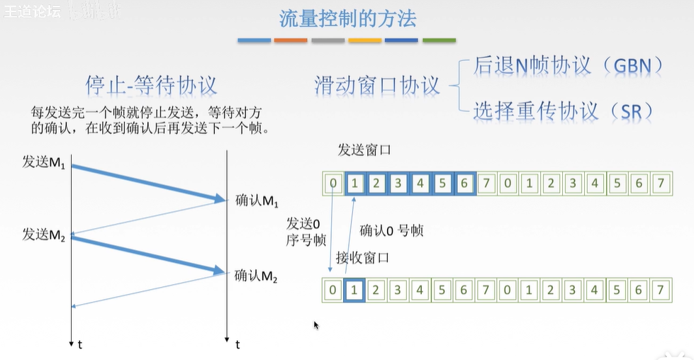

数据链路层的功能：
1. 为网络层提供服务。
2. 链路管理
3. 组帧
4. 流量控制（限制发送方）
5. 差错控制（帧错，位错）

封装成帧 ：在一段数据的前后部分添加首部和尾部。接收端收到后，就能根据首部和尾部标记，识别开始与结束。

帧同步 ：接收方能从二进制比特流中区分出帧的起始和终止

组帧的四种方法： 
1. 字符计数法：首部用一个计数字段标明帧内字符数
2. 字符填充法 ：在数据内的特殊字符前加一个转义字符
3. 零比特填充法
4. 违规编码法

透明传输： 无论传输的数据是什么样的比特组合，都应该能在链路上传输。如果有比特组合与控制信息相同，就要有适当的措施。

## 差错控制
差错从何而来？ 噪声
1. 全局性 线路本身电气特性产生的噪声
2. 局部性 外界影响产生的噪声

差错分为两种：
1. 位错：比特位01出错
2. 帧错：帧丢失、重复、失序

## 流量控制
较高的发送速度与较低的接受能力不匹配，会导致传输出错

数据链路层的流量控制是点到点，而传输层是端到端。
* 数据链路层点到点是指每两个相邻接点，而端到端是指每两台主机之间的。
* 数据链路层接收方收不下就不回复确认。
* 传输层：接收端给发送端一个窗口公告

* 停止等待协议可以看做是收发各一个长度的滑窗
* 滑窗就是可以在等待回应时继续发送
* 链路层的窗口大小是固定值

