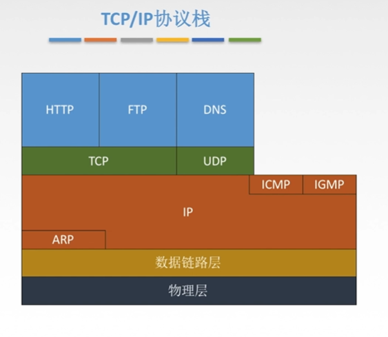
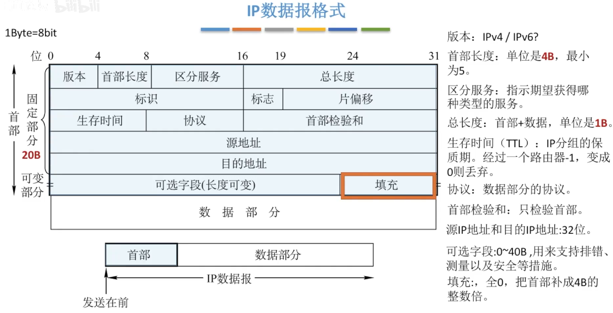
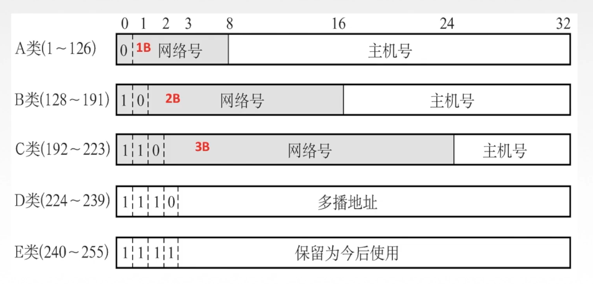
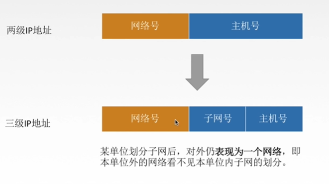
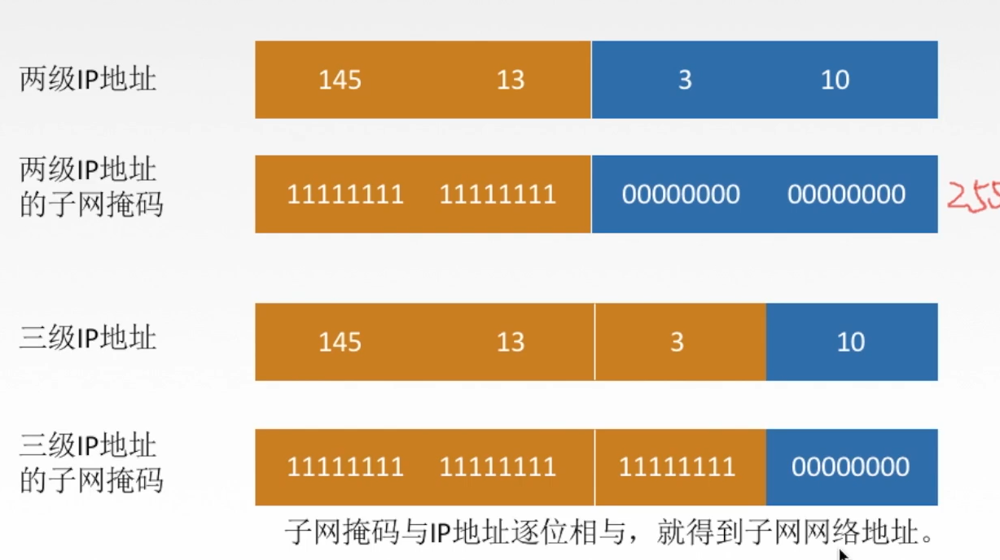
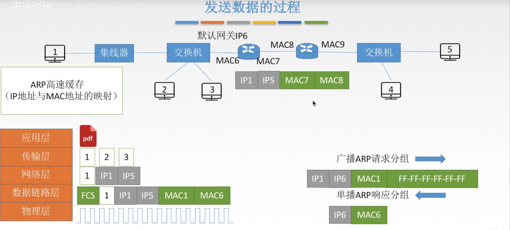
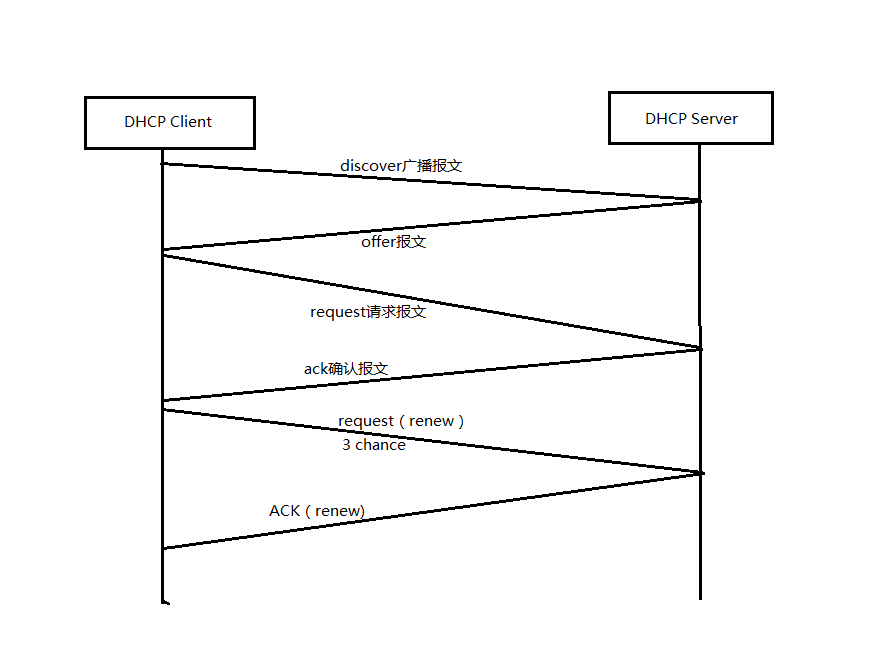

## 网络层

主要任务是把分组从源端传到目的端，为分组交换网上的不同主机提供通讯服务。网络层的单位是数据报

功能：
1. 路由选择与分组转发（最佳路径）
2. 异构网络互联
3. 拥塞控制（开环，闭环）

## 路由算法
1. 静态路由算法：管理员手动配置路由信息

2. 动态路由算法：路由器间彼此交换信息，按路由算法优化出路由算法
    * 链路状态路由算法 OSPF 由所有路由器掌握完整的网络拓扑和链路费用
    * 距离向量路由算法 RIP 路由器只掌握物理相邻的邻居及链路费用
    * 路由更新快，适合大型网络。算法复杂，网络负担大
    
分层次的路由选择协议：
1. 因特网规模巨大
2. 许多单位不想让外界知道自己的路由选择协议

由于以上两个原因，采取：

自治系统AS：在单一技术管理下的一组路由器。一个AS内所有网络都属于一个行政单位来管辖。

* 内部网关协议IGP ： 一个AS内使用RIP,OSPF
* 外部网关协议EGP : AS之间使用BGP

## IP数据报格式

ip数据报的首部分成固定部分和可变部分，后面接着数据部分

ip数据报分片相关参数：
* 标识 ： 同一数据报使用同一标识
* 标志 ： 后两位有意义
  * 中间位DF： DF=1禁止分片，=0允许分片
  * 最低位MF： MF=1表示后面还有分片，=0表示后面没有分片  
* 片偏移 ： 某片在原分组中的位置，单位为8b

### 经过路由协议后，ip数据报发生了什么变化？
首部发生的变化
1. 生存时间(TTL)必定减一，则首部检验和也必定发生变化
2. 标志，片偏移，数据报总长度可能发生变化

1. mac地址

如果是NAT路由器：源ip地址和端口号也会发生变化

## ip地址

ip地址的分类

A类： 10.0.0.0 - 10.255.255.255

B类：172.16.0.0 - 172.31.255.255

C类：192.168.0.0 - 192.168.255.255

## ip数据报的传输方式
三种传输方式
1. 单播：点对点，一对一
2. 广播：点对多点，一对多。发送给子网内所有主机
3. 组播（多播）：点对多点。某些用户需要特定数据时，发送者仅一次发送数据，借助组播路由器和协议再分发。1

## NAT
网络地址转换NAT：在专用网连接到因特网的路由器上安装nat软件就成了NAT路由器。
他至少有一个有效的外部全球ip。

## 子网划分与子网掩码

子网划分：主机号分为子网号和主机号

子网掩码：除了主机号都为1，子网掩码与ip地址逐位相与，就是子网网络地址

数据报仍然先按照网络号找到目的网络，发送到路由器，路由器再按照网络号和子网号找到目的子网：将子网掩码与目标地址逐比特与操作，若结果为某个子网的网络地址，则送到该子网。

## ARP协议

ARP协议：接收来自IP协议的逻辑地址，将其映射为相应的物理地址，然后把物理地址（mac地址）递交给数据链路层。（解决下一跳走哪里）

ARP协议的流程：
* 检查ARP高速缓存，有对应表项则写入mac帧。
    * 如果没有，则用mac地址为FF-FF-FF-FF-FF-FF广播ARP请求分组，同一局域网内都能收到。
* 目的主机收到请求后就会向源主机单播一个ARP响应分组，源主机收到后写入APR缓存

ARP协议的4种典型情况：
1. 主机A发给本网络的主机B：ARP找到主机B的硬件地址
2. 主机A发给另一个网络的主机B：ARP找到本网络上网关的硬件地址
3. 路由器发给本网络的主机A：ARP找到A的硬件地址
4. 路由器发给另一网络的主机B：ARP找到本网络的网关的硬件地址

## DHCP协议
动态主机配置协议（DHCP）：是应用层协议，使用客户、服务器方式，客户端和服务端通过广播方式交互，基于UDP；

DHCP提供即插即用联网的机制。DHCP 配置的内容不仅是 IP 地址，还包括子网掩码、网关 IP 地址。

1. 发现阶段
    * 在DHCP服务配置完成后，DHCP Client启动时，由于没有IP地址，会自动发送以discover的广播报文，源地址为0.0.0.0目的地址为255.255.255.255。网络上的所有支持TCP/IP的主机都会收到该DHCP Discovery报文，但是只有DHCP Server会响应该报文。

2. DHCP Server offer响应阶段
    * DHCP 服务器收到 Discover 报文之后，发送 Offer 报文给客户端，该报文包含了客户端所需要的信息。
    * 客户端可能收到多个 DHCP 服务器提供的信息，因此客户端需要进行选择

3. DHCP Client请求使用阶段
    * 如果客户端选择了某个 DHCP 服务器提供的信息，那么就发送 Request 报文给该 DHCP 服务器。 

4. DHCP Server确认使用阶段（获得IP地址）
    * DHCP 服务器发送 Ack 报文，表示客户端此时可以使用提供给它的信息。DHCP Client即可以将该IP地址与网卡绑定。另外其他DHCP Server都将收回自己之前为DHCP Client提供的IP地址。
    
5. DHCP Client重新登录网络阶段
    * 当DHCP Client重新登录后，发送一个以前的DHCP Server分配的IP地址信息的DHCP Request报文，当DHCP Server收到该请求后，会尝试让DHCP客户端继续使用该IP地址。并回答一个ACK报文。
    * 如果该IP地址无法再次分配给该DHCP Client后，DHCP回复一个NAK报文，当DHCP Client收到该NAK报文后，会重新发送DHCP Discovery报文来重新获取IP地址。

6. DHCP Client续约阶段
    * DHCP获取到的IP地址都有一个租约，租约过期后，DHCP Server将回收该IP地址，所以如果DHCP Client如果想继续使用该IP地址，则必须更新器租约。更新的方式就是，当当前租约期限过了一半后，DHCP Client都会发送DHCP Renew报文来续约租期。

## ipv6与ipv4
1. ipv6地址从32位扩大到128位
2. 删除检验和字段，减少每跳的处理时间
3. ipv6将ipv4的可选字段移出首部，变为扩展首部。
4. ipv6支持即插即用（自动配置），不需要DHCP
5. ipv6的首部长度必须是8b的整数倍。
6. ipv6只能在主机处分片，ipv4可以在主机和路由器分片。

## 路由选择算法（RIP,OSPF,BGP）
### RIP
RIP是应用层协议，使用UDP传送数据。一个RIP报文最多包括25个路由

RIP是一种分布式的基于距离向量的路由选择协议，最大优点简单，只适用于小型网络。

RIP协议要求每一个路由器维护**从它自己到每一个其他目的网络的唯一最佳距离**。RIP允许一条路由最多包含15个路由器，距离16则不可达。

RIP协议和谁交换信息？多久交换一次？交换什么？：
1. 仅和相邻路由器交换信息
2. 路由器交换的信息是自己的路由表
3. 每30秒交换一次路由表信息，然后根据信息更新。如果超过180s没有收到邻居路由器的通告，则判定为邻居没了，并更新自己的路由表。 

距离向量算法：
1. 修改相邻路由器发来的RIP报文中的所有表项
    * 对地址X的相邻路由器发来的RIP报文，修改所有下一跳字段的地址改为X，并将距离+1；
2. 修改后对RIP报文中的每一个项目：
    * 没有上一个路由器，则填入
    * 有则比较距离
3. 若180s还没收到相邻路由器的更新表，则标记为不可达路由器，即距离为16    

RIP特点：网络出现故障，需要较长及时才能讲消息传到所有路由器。

### OSPF
OSPF:开放最短路径优先协议（不受某一厂家控制，而是公开发表的）。

主要特征： 分布式的链路状态协议。

交换过程：
1. 向自治系统内所有路由器发送信息（广播）
2. 发送的信息就是与本路由器相邻的所有路由器的链路状态
3. 只有链路状态发生变化时，才重新广播
4. 最后，所有路由器都能建立一个链路状态数据库，即全网拓扑图。

为了使OSPF能用于规模很大的网络，OSPF再将自治系统划分为若干区域。

### BGP协议
外部网关协议，AS(自治系统)之间使用BGP.

交换过程：
1. 与其他AS的邻站BGP发言人交换信息
2. 交换网络的可达性信息。即达到某个网络要经过的一系列AS
3. 发生变化时更新有变化的部分

特点：
1. BGP支持CIDR（无分类编址），因此路由表包括目的网络前缀，下一跳路由器，以及经过的自治系统序列。
2. BGP刚运行时，BGP的邻站交换的是整个BGP路由表，以后只需要在发生变化时更新变化。节省带宽和性能。

报文分类：
1. OPEN（打开）报文：与相邻的建立联系
2. UPDATE（更新）报文： 通告新路径或撤销路径
3. KEEPALIVE（保活）报文： 无update时周期验证邻站的连通性，也作为open确认
4. NOTIFICATION（通知）报文：报告先前报文的差错，也用于关闭连接

