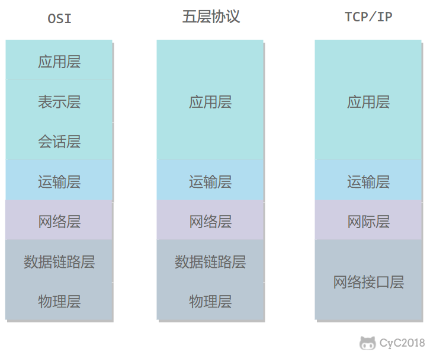
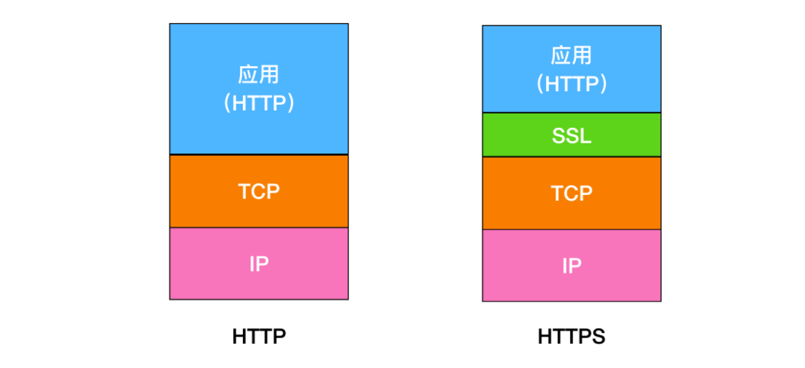

# 网络通讯要素

1.OIS七层模型与TCP/IP四层模型              

网络编程中的主要问题：
> 如何准确定位到网络上的一台或多台主机
> 找到主机后如何通讯

网络编程中的要素：       
> IP和端口号
> 网络通讯协议

# HTTP常见面试题

## HTTP 和 HTTPS 的区别     
HTTP 是一种 超文本传输协议(Hypertext Transfer Protocol)，HTTP 是一个在计算机世界里专门在两点之间传输文字、图片、音频、视频等超文本数据的约定和规范.      
HTTPS 的全称是 Hypertext Transfer Protocol Secure，从名称我们可以看出 HTTPS 要比 HTTPS 多了 secure 安全性这个概念，实际上， HTTPS 并不是一个新的应用层协议，它其实就是 HTTP + TLS/SSL 协议组合而成，而安全性的保证正是 TLS/SSL 所做的工作。    
也就是说，HTTPS 就是身披了一层 SSL 的 HTTP.      

* HTTP 在地址栏上的协议是以 http:// 开头，而 HTTPS 在地址栏上的协议是以 https:// 开头.       * 
* HTTP 的默认端口是 80，而 HTTPS 的默认端口是 443

## HTTP Get 和 Post 区别     
get 方法一般用于请求，比如你输入 www.baidu.com 就是发送了一个 get 请求，它的主要特征是请求服务器返回资源.           
而 post 方法一般用于表单的提交，相当于是把信息提交给服务器，等待服务器作出响应， get 相当于一个是 pull/拉的操作，而 post 相当于是一个 push/推的操作。       
get 方法是不安全的，因为你在发送请求的过程中，你的请求参数会拼在 URL 后面，从而导致容易被攻击者窃取，对你的信息造成破坏和伪造；
* get 请求的 URL 有长度限制，而 post 请求会把参数和值放在消息体中，对数据长度没有要求。       
* get 请求会被浏览器主动 cache，而 post 不会，除非手动设置。
* get 请求在浏览器反复的 回退/前进 操作是无害的，而 post 操作会再次提交表单请求。
* get 请求在发送过程中会产生一个 TCP 数据包；post 在发送过程中会产生两个 TCP 数据包。对于 get 方式的请求，浏览器会把 http header 和 data 一并发送出去，服务器响应 200（返回数据）；而对于 post，浏览器先发送 header，服务器响应 100 continue，浏览器再发送 data，服务器响应 200 ok（返回数据）。       

## 什么是无状态协议，HTTP 是无状态协议吗，怎么解决
无状态协议(Stateless Protocol) 就是指浏览器对于事务的处理没有记忆能力。      
举个例子来说就是比如客户请求获得网页之后关闭浏览器，然后再次启动浏览器，登录该网站，但是服务器并不知道客户关闭了一次浏览器。        
HTTP 就是一种无状态的协议，他对用户的操作没有记忆能力。HTTP使用(Cookie) 的机制。它能够让浏览器具有记忆能力。     

## UDP和TCP的区别
TCP 和 UDP 都位于计算机网络模型中的运输层，它们负责传输应用层产生的数据。       
UDP 的全称是 User Datagram Protocol，用户数据报协议。它不需要所谓的握手操作，从而加快了通信速度，允许网络上的其他主机在接收方同意通信之前进行数据传输。       
TCP 的全称是Transmission Control Protocol ，传输控制协议。它能够帮助你确定计算机连接到 Internet 以及它们之间的数据传输。通过三次握手来建立 TCP 连接，三次握手就是用来启动和确认 TCP 连接的过程。一旦连接建立后，就可以发送数据了，当数据传输完成后，会通过关闭虚拟电路来断开连接。        

| TCP                                                          | UDP                                          |
| ------------------------------------------------------------ | -------------------------------------------- |
| TCP 是面向连接的协议                                         | UDP 是无连接的协议                           |
| TCP 在发送数据前先需要建立连接，然后再发送数据               | UDP 无需建立连接就可以直接发送大量数据       |
| TCP 会按照特定顺序重新排列数据包                             | UDP 数据包没有固定顺序，所有数据包都相互独立 |
| TCP 传输的速度比较慢                                         | UDP 的传输会更快                             |
| TCP 的头部字节有 20 字节                                     | UDP 的头部字节只需要 8 个字节                |
| TCP 是重量级的，在发送任何用户数据之前，TCP需要三次握手建立连接。 | UDP 是轻量级的。没有跟踪连接，消息排序等。   |
| TCP 会进行错误校验，并能够进行错误恢复                       | UDP 也会错误检查，但会丢弃错误的数据包。     |
| TCP 有发送确认                                               | UDP 没有发送确认                             |
| TCP 会使用握手协议，例如 SYN，SYN-ACK，ACK                   | 无握手协议                                   |
| TCP 是可靠的，因为它可以确保将数据传送到路由器。             | 在 UDP 中不能保证将数据传送到目标。          |

## TCP的三次握手
1.客户端向服务端发起连接，发送（SYN = 1，seq（随机生成） = 10000）     
2.服务端响应客户端。发送（SYN = 1，seq（随机） = 20000， ACK = 1， ack = 10001）        
ACK用来确认收到对方的SYN，返回的ack为seq+1。至此，两次握手完成，此时客户端已经可以确定服务端可以收到自己的消息，但是服务端还不确定客户端是否
可以收到自己的消息。
3.客户端响应服务端的SYN，返回（ACK = 1, ack = 20001（服务端发来的的seq + 1））.
到此三次握手完成，服务端与客户端都确认对方可以收到自己的消息。（双工）

## TCP的四次挥手
1.客户端向服务端发起结束请求，发送（FIN = 1 , seq = 25222），此时的seq由之前的tcp报文决定     
2.服务端回应客户端的请求，发送（ACK = 1, ack = 25223（客户端发送的seq + 1）),此时表示服务端收到了客户端的结束通话的请求。       
此时的服务端收到客户端的结束通知并回应，但是服务端端还没有结束，依然可以向客户端发送数据。       
服务端数据发送完毕后，再向客户端发送结束通知，即挥手3.        
3.服务端发送完消息后，向客户端发起结束，发送（FIN = 1 , seq = 10522），seq也是由之前的tcp报文决定。        
4.客户端收到服务端的结束通知后，发送（FIN = 1， ack = 10523（服务端发送的seq + 1）），服务端收到，则最终结束。

## 地址栏输入URL发生了什么
1. 向浏览器输入URL地址
2. 浏览器会根据你输入的URL地址，去查找域名是否被本地DNS缓存，不同浏览器对DNS的设置不同，如果找到，直接返回。
    * 如果浏览器缓存了你想访问的URL地址，那就直接返回ip。
    * 如果没有缓存你的URL地址，浏览器就会发起系统调用来查询本机hosts文件是否有配置ip地址，
    * 如果还找不到，就向网络中发起一个DNS查询
3. 浏览器需要和目标服务器建立 TCP 连接，需要经过三次握手的过程，
4. 在建立连接后，浏览器会向目标服务器发起 HTTP-GET 请求，包括其中的 URL。
    * HTTP 1.1 后默认使用长连接，只需要一次握手即可多次传输数据。
5. 如果目标服务器只是一个简单的页面，就会直接返回。如果重定向，返回的状态码就不是 200 ，而是 301,302 以 3 开头的重定向码
    * 对于某些大型网站的站点，往往不会直接返回主机名所在的页面，而会直接重定向。    
    * 浏览器在获取了重定向响应后，在响应报文中 Location 项找到重定向地址，浏览器重新第一步访问即可。
6. 浏览器重新发送请求，携带新的 URL，返回状态码 200 OK，表示服务器可以响应请求，返回报文。