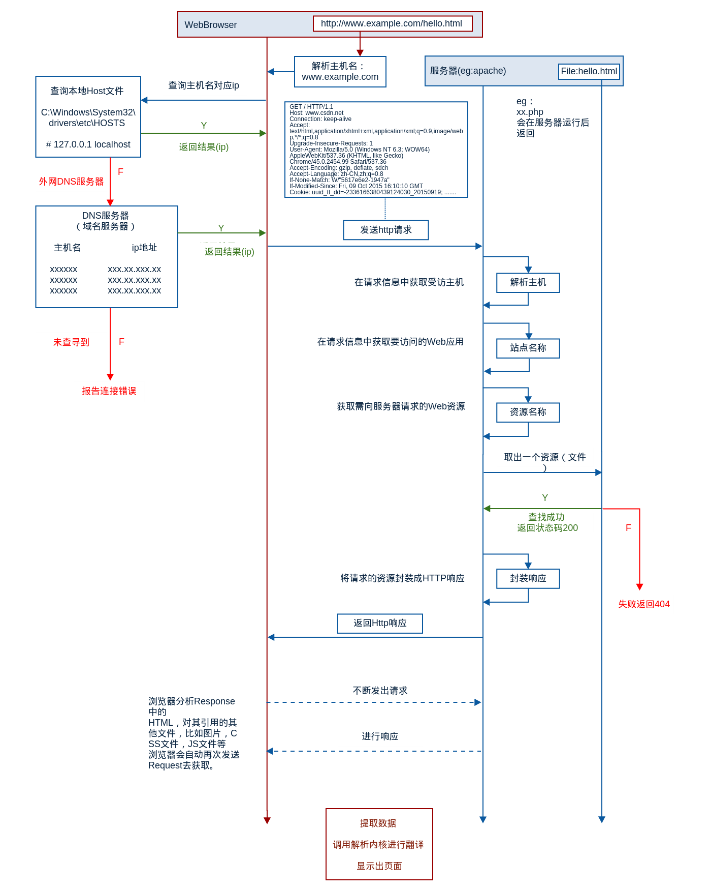

# 网络通讯要素

1.OSI七层，五层协议与TCP/IP四层模型              

五层协议：
* 应用层 ：为特定应用程序提供数据传输服务，例如 HTTP、DNS 等协议。数据单位为报文。
* 传输层 ：为**进程**提供通用数据传输服务，即端到端。由于应用层协议很多，定义通用的传输层协议就可以支持不断增多的应用层协议。运输层包括两种协议： 
    * 传输控制协议 TCP，提供面向连接、可靠的数据传输服务，数据单位为报文段； 
    * 用户数据报协议 UDP，提供无连接、尽最大努力的数据传输服务，数据单位为用户数据报。TCP 主要提供完整性服务，UDP 主要提供及时性服务。
* 网络层 ：为主机提供数据传输服务。而传输层协议是为主机中的进程提供数据传输服务。网络层把传输层传递下来的报文段或者用户数据报封装成分组。
    * 什么是RIP (距离矢量路由协议)?
    * IP地址的分类？
    * 什么叫划分子网？
    * 什么是ARP协议？
    * 什么是NAT (网络地址转换)？
* 数据链路层 ：网络层针对的还是主机之间的数据传输服务，而主机之间可以有很多链路，链路层协议就是为同一链路的主机提供数据传输服务。数据链路层把网络层传下来的分组封装成帧。
* 物理层 ：考虑的是怎样在传输媒体上传输数据比特流，而不是指具体的传输媒体。物理层的作用是尽可能屏蔽传输媒体和通信手段的差异，使数据链路层感觉不到这些差异。

## 计算机网络的性能指标
1. 速率
   * 称为数据率或数据传输率或比特率，单位b/s,kb/s,Mb/s
2. 带宽
   * 带宽原指信号的频带宽度。
   * 计算机网络中表示网络的通信线路的传输能力，指网络设备所支持的最高速度。
3. 吞吐量
    * 表示单位时间内通过某个网络设备的数据量
    
## 网络层
### 什么是RIP (Routing Information Protocol, 距离矢量路由协议)? 算法是什么？

每个路由器维护一张表，记录该路由器到其它网络的”跳数“，路由器到与其直接连接的网络的跳数是1，每多经过一个路由器跳数就加1；更新该表时和相邻路由器交换路由信息；路由器允许一个路径最多包含15个路由器，如果跳数为16，则不可达。交付数据报时优先选取距离最短的路径。

优缺点

- 实现简单，开销小
- 随着网络规模扩大开销也会增大；
- 最大距离为15，限制了网络的规模；
- 当网络出现故障时，要经过较长的时间才能将此信息传递到所有路由器

### ip分类

net-id：网络号
host-id：主机号（主机号的前几位为子网号）

ipv4与ipv6的区别：

### 什么叫划分子网？

从主机号host-id借用若干个比特作为子网号subnet-id；

子网掩码：网络号和子网号都为1，主机号为0；

数据报仍然先按照网络号找到目的网络，发送到路由器，路由器再按照网络号和子网号找到目的子网：将子网掩码与目标地址逐比特与操作，若结果为某个子网的网络地址，则送到该子网。

## 地址栏输入URL发生了什么

1. 向浏览器输入URL地址
2. **DNS解析：** 
    * 浏览器会根据你输入的URL地址，去查找域名是否被本地DNS缓存，不同浏览器对DNS的设置不同，如果找到，直接返回。
    * 如果浏览器缓存了你想访问的URL地址，那就直接返回ip。
    * 如果没有缓存你的URL地址，浏览器就会发起系统调用来查询本机hosts文件是否有配置ip地址，
    * 如果还找不到，就向网络中发起一个DNS查询
3. **TCP连接** 
    * 浏览器需要和目标服务器建立 TCP 连接，需要经过三次握手的过程，
4. **发视http请求**： 浏览器会向目标服务器发起 HTTP-GET 请求，包括其中的 URL。
    * HTTP 1.1 后默认使用长连接，只需要一次握手即可多次传输数据。
5. **服务器处理请求并返回http报文 ：**
    * 如果目标服务器只是一个简单的页面，就会直接返回。
    * 如果重定向，返回的状态码就不是 200 ，而是 301,302 以 3 开头的重定向码
    * 对于某些大型网站的站点，往往不会直接返回主机名所在的页面，而会直接重定向。    
    * 浏览器在获取了重定向响应后，在响应报文中 Location 项找到重定向地址，浏览器重新第一步访问即可。
6. 浏览器解析渲染页面
7. 结束连接

