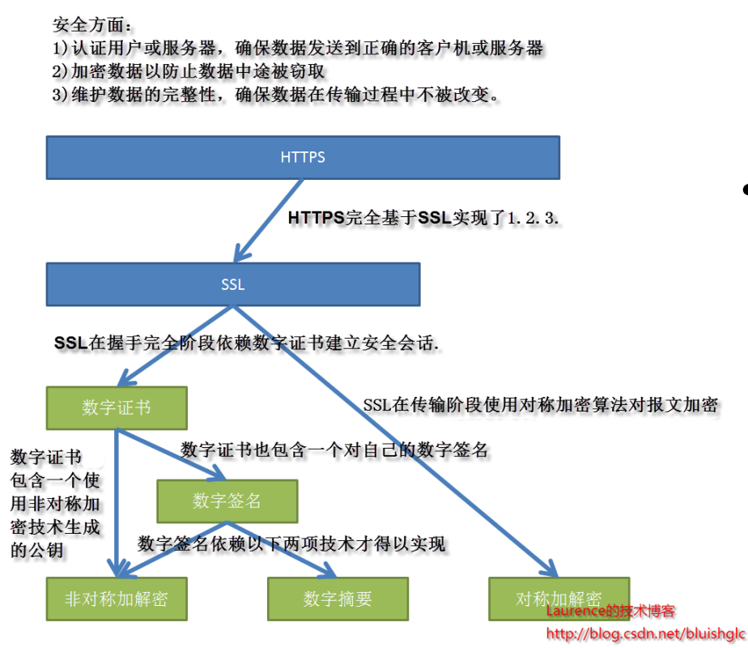

# 网络通讯要素

1.OSI七层，五层协议与TCP/IP四层模型              

五层协议：
* 应用层 ：为特定应用程序提供数据传输服务，例如 HTTP、DNS 等协议。数据单位为报文。
* 传输层 ：为进程提供通用数据传输服务。由于应用层协议很多，定义通用的传输层协议就可以支持不断增多的应用层协议。运输层包括两种协议： 
    * 传输控制协议 TCP，提供面向连接、可靠的数据传输服务，数据单位为报文段； 
    * 用户数据报协议 UDP，提供无连接、尽最大努力的数据传输服务，数据单位为用户数据报。TCP 主要提供完整性服务，UDP 主要提供及时性服务。
* 网络层 ：为主机提供数据传输服务。而传输层协议是为主机中的进程提供数据传输服务。网络层把传输层传递下来的报文段或者用户数据报封装成分组。
* 数据链路层 ：网络层针对的还是主机之间的数据传输服务，而主机之间可以有很多链路，链路层协议就是为同一链路的主机提供数据传输服务。数据链路层把网络层传下来的分组封装成帧。
* 物理层 ：考虑的是怎样在传输媒体上传输数据比特流，而不是指具体的传输媒体。物理层的作用是尽可能屏蔽传输媒体和通信手段的差异，使数据链路层感觉不到这些差异。

# HTTP常见面试题

## HTTP 和 HTTPS 的区别     
HTTP 是一种 超文本传输协议(Hypertext Transfer Protocol)，HTTP 是一个在计算机世界里专门在两点之间传输文字、图片、音频、视频等超文本数据的约定和规范.      
HTTPS 的全称是 Hypertext Transfer Protocol Secure，从名称我们可以看出 HTTPS 要比 HTTPS 多了 secure 安全性这个概念，实际上， HTTPS 并不是一个新的应用层协议，它其实就是 HTTP + TLS/SSL 协议组合而成，而安全性的保证正是 TLS/SSL 所做的工作。    
也就是说，HTTPS 就是身披了一层 SSL 的 HTTP.      

* HTTP 在地址栏上的协议是以 http:// 开头，而 HTTPS 在地址栏上的协议是以 https:// 开头.       * 
* HTTP 的默认端口是 80，而 HTTPS 的默认端口是 443

## https是怎么保证安全的
下面就是https的整个架构，现在的https基本都使用TSL了，因为更加安全，所以下图中的SSL应该换为SSL/TSL。

PS：由于HTTPS的推出受到了很多人的欢迎，在SSL更新到3.0时，IETF对SSL3.0进行了标准化，并添加了少数机制(但是几乎和SSL3.0无差异)，标准化后的IETF更名为TLS1.0(Transport Layer Security 安全传输层协议)，可以说TLS就是SSL的新版本3.1

### 加密
1. 对称密钥加密

对称密钥加密（Symmetric-Key Encryption），加密和解密使用同一密钥。
   
2. 非对称密钥加密
   
非对称密钥加密，又称公开密钥加密（Public-Key Encryption），加密和解密使用不同的密钥。

公开密钥所有人都可以获得，通信发送方获得接收方的公开密钥之后，就可以使用公开密钥进行加密，接收方收到通信内容后使用私有密钥解密。

非对称密钥除了用来加密，还可以用来进行签名。因为私有密钥无法被其他人获取，因此通信发送方使用其私有密钥进行签名，通信接收方使用发送方的公开密钥对签名进行解密，就能判断这个签名是否正确。

* 优点：可以更安全地将公开密钥传输给通信发送方；
* 缺点：运算速度慢。

HTTPS 采用混合的加密机制，正是利用了上面提到的方案：

* 使用非对称密钥加密方式，传输对称密钥加密方式所需要的 Secret Key，从而保证安全性;
* 获取到 Secret Key 后，再使用对称密钥加密方式进行通信，从而保证效率。（下图中的 Session Key 就是 Secret Key）

### 认证
通过使用 证书 来对通信方进行认证。

数字证书认证机构（CA，Certificate Authority）是客户端与服务器双方都可信赖的第三方机构。

服务器的运营人员向 CA 提出公开密钥的申请，CA 在判明提出申请者的身份之后，会对已申请的公开密钥做数字签名，然后分配这个已签名的公开密钥，并将该公开密钥放入公开密钥证书后绑定在一起。

进行 HTTPS 通信时，服务器会把证书发送给客户端。客户端取得其中的公开密钥之后，先使用数字签名进行验证，如果验证通过，就可以开始通信了。

### 完整性
摘要算法
数字摘要是采用单项Hash函数将需要加密的明文“摘要”成一串固定长度（128位）的密文，这一串密文又称为数字指纹，它有固定的长度，而且不同的明文摘要成密文，其结果总是不同的，而同样的明文其摘要必定一致。“数字摘要“是https能确保数据完整性和防篡改的根本原因。

数字签名
数字签名技术就是对“非对称密钥加解密”和“数字摘要“两项技术的应用，它将摘要信息用发送者的私钥加密，与原文一起传送给接收者。接收者只有用发送者的公钥才能解密被加密的摘要信息，然后用HASH函数对收到的原文产生一个摘要信息，与解密的摘要信息对比。如果相同，则说明收到的信息是完整的，在传输过程中没有被修改，否则说明信息被修改过，因此数字签名能够验证信息的完整性。

数字签名的过程如下：
明文 --> hash运算 --> 摘要 --> 私钥加密 --> 数字签名

数字签名有两种功效：
1. 能确定消息确实是由发送方签名并发出来的，因为别人假冒不了发送方的签名。
2. 数字签名能确定消息的完整性。

## HTTP Get 和 Post 区别     
get 方法一般用于**请求**，比如你输入 www.baidu.com 就是发送了一个 get 请求，它的主要特征是请求服务器返回资源.           
而 post 方法一般用于表单的**提交**，相当于是把信息提交给服务器，等待服务器作出响应， get 相当于一个是 pull/拉的操作，而 post 相当于是一个 push/推的操作。       
get 方法是不安全的，因为你在发送请求的过程中，你的请求参数会拼在 URL 后面，从而导致容易被攻击者窃取，对你的信息造成破坏和伪造；
* get 请求的 URL 有长度限制，而 post 请求会把参数和值放在消息体中，对数据长度没有要求。       
* get 请求会被浏览器主动 cache，而 post 不会，除非手动设置。
* get 请求在浏览器反复的 回退/前进 操作是无害的，而 post 操作会再次提交表单请求。
* get 请求在发送过程中会产生一个 TCP 数据包；post 在发送过程中会产生两个 TCP 数据包。对于 get 方式的请求，浏览器会把 http header 和 data 一并发送出去，服务器响应 200（返回数据）；而对于 post，浏览器先发送 header，服务器响应 100 continue，浏览器再发送 data，服务器响应 200 ok（返回数据）。       

## HTTP 状态码
服务器返回的 响应报文 中第一行为状态行，包含了状态码以及原因短语，用来告知客户端请求的结果。
* 1XX ： Informational（信息性状态码）
* 2XX ： Success（成功状态码）
* 3XX ： Redirection（重定向状态码）
* 4XX ： Client Error（客户端错误状态码）
* 5XX ： Server Error（服务器错误状态码）

## 什么是无状态协议，HTTP 是无状态协议吗，怎么解决
无状态协议(Stateless Protocol) 就是指浏览器对于事务的处理没有记忆能力。      
举个例子来说就是比如客户请求获得网页之后关闭浏览器，然后再次启动浏览器，登录该网站，但是服务器并不知道客户关闭了一次浏览器。        
HTTP 就是一种无状态的协议，他对用户的操作没有记忆能力。HTTP使用(Cookie) 的机制。它能够让浏览器具有记忆能力。     

## Cookie的作用是什么?和Session有什么区别？
Cookie 一般用来保存用户信息 比如在 Cookie 中保存已经登录过得用户信息，下次访问网站的时候页面可以自动帮你登录的一些基本信息给填了；

Session 的主要作用就是通过服务端记录用户的状态。 典型的场景是购物车，当你要添加商品到购物车的时候，系统不知道是哪个用户操作的，因为 HTTP 协议是无状态的。服务端给特定的用户创建特定的 Session 之后就可以标识这个用户并且跟踪这个用户了。

总结 ：Cookie 数据保存在客户端(浏览器端)，Session 数据保存在服务器端。

## HTTP 1.0和HTTP 1.1的主要区别是什么?
HTTP1.0最早在网页中使用是在1996年，那个时候只是使用一些较为简单的网页上和网络请求上，而HTTP1.1则在1999年才开始广泛应用于现在的各大浏览器网络请求中，同时HTTP1.1也是当前使用最为广泛的HTTP协议。

1. **长连接** : 在HTTP1.0中，默认使用的是短连接
2. 错误状态响应码 :在HTTP1.1中新增了24个错误状态响应码，
3. 缓存处理 : HTTP1.1提供了更多可供选择的缓存头来控制缓存策略。
4. 带宽优化及网络连接的使用

## UDP和TCP的区别
TCP 和 UDP 都位于计算机网络模型中的运输层，它们负责传输应用层产生的数据。       
UDP 的全称是 User Datagram Protocol，用户数据报协议。它**不需要所谓的握手操作**，从而加快了通信速度，允许网络上的其他主机在接收方同意通信之前进行数据传输。       
TCP 的全称是Transmission Control Protocol ，传输控制协议。它能够帮助你确定计算机连接到 Internet 以及它们之间的数据传输。通过三次握手来建立 TCP 连接，三次握手就是用来启动和确认 TCP 连接的过程。一旦连接建立后，就可以发送数据了，当数据传输完成后，会通过关闭虚拟电路来断开连接。        

| TCP                                                          | UDP                                          |
| ------------------------------------------------------------ | -------------------------------------------- |
| TCP 是面向连接的协议                                         | UDP 是无连接的协议                    |
| TCP 在发送数据前先需要建立连接，然后再发送数据               | UDP 无需建立连接就可以直接发送大量数据         |
| TCP 会按照特定顺序重新排列数据包                             | UDP 数据包没有固定顺序，所有数据包都相互独立 |
| TCP 传输的速度比较慢                                         | UDP 的传输会更快                      |
| TCP 的头部字节有 20 字节                                     | UDP 的头部字节只需要 8 个字节           |
| TCP 是重量级的，在发送任何用户数据之前，TCP需要三次握手建立连接。 | UDP 是轻量级的。没有跟踪连接，消息排序等。    |
| TCP 会进行错误校验，并能够进行错误恢复                       | UDP 也会错误检查，但会丢弃错误的数据包。      |
| TCP 有发送确认                                               | UDP 没有发送确认                      |
| TCP 会使用握手协议，例如 SYN，SYN-ACK，ACK                   | 无握手协议                              |
| TCP 是可靠的，因为它可以确保将数据传送到路由器。             | 在 UDP 中不能保证将数据传送到目标。            |

## TCP的三次握手
1. 客户端向服务端发起连接，发送（SYN = 1，seq（随机生成） = 10000）     
2. 服务端响应客户端。发送（SYN = 1，seq（随机） = 20000， ACK = 1， ack = 10001）        
ACK用来确认收到对方的SYN，返回的ack为seq+1。至此，两次握手完成，此时客户端已经可以确定服务端可以收到自己的消息，但是服务端还不确定客户端是否
可以收到自己的消息。
3. 客户端响应服务端的SYN，返回（ACK = 1, ack = 20001（服务端发来的的seq + 1））.
到此三次握手完成，服务端与客户端都确认对方可以收到自己的消息。（双工）

## TCP的四次挥手
1. 客户端向服务端发起结束请求，发送（FIN = 1 , seq = 25222），此时的seq由之前的tcp报文决定     
2. 服务端回应客户端的请求，发送（ACK = 1, ack = 25223（客户端发送的seq + 1）),此时表示服务端收到了客户端的结束通话的请求。       
此时的服务端收到客户端的结束通知并回应，但是服务端端还没有结束，依然可以向客户端发送数据。       
服务端数据发送完毕后，再向客户端发送结束通知，即挥手3.        
3. 服务端发送完消息后，向客户端发起结束，发送（FIN = 1 , seq = 10522），seq也是由之前的tcp报文决定。        
4. 客户端收到服务端的结束通知后，发送（FIN = 1， ack = 10523（服务端发送的seq + 1）），服务端收到，则最终结束。

## 地址栏输入URL发生了什么
1. 向浏览器输入URL地址
2. **DNS解析：** 
    * 浏览器会根据你输入的URL地址，去查找域名是否被本地DNS缓存，不同浏览器对DNS的设置不同，如果找到，直接返回。
    * 如果浏览器缓存了你想访问的URL地址，那就直接返回ip。
    * 如果没有缓存你的URL地址，浏览器就会发起系统调用来查询本机hosts文件是否有配置ip地址，
    * 如果还找不到，就向网络中发起一个DNS查询
3. **TCP连接** 
    * 浏览器需要和目标服务器建立 TCP 连接，需要经过三次握手的过程，
4. **发视http请求**： 浏览器会向目标服务器发起 HTTP-GET 请求，包括其中的 URL。
    * HTTP 1.1 后默认使用长连接，只需要一次握手即可多次传输数据。
5. **服务器处理请求并返回http报文 ：**
    * 如果目标服务器只是一个简单的页面，就会直接返回。
    * 如果重定向，返回的状态码就不是 200 ，而是 301,302 以 3 开头的重定向码
    * 对于某些大型网站的站点，往往不会直接返回主机名所在的页面，而会直接重定向。    
    * 浏览器在获取了重定向响应后，在响应报文中 Location 项找到重定向地址，浏览器重新第一步访问即可。
6. 浏览器解析渲染页面
7. 结束连接