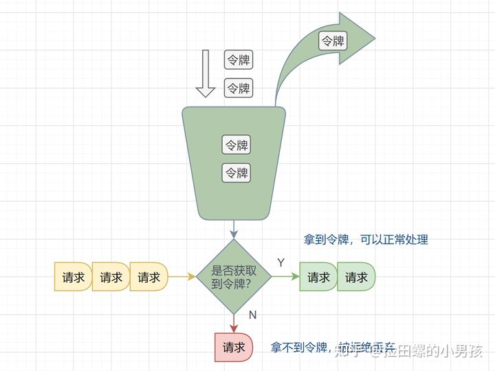

## API网关
API网关是一个服务器，是系统的唯一入口。从面向对象设计的角度看，与外观模式类似。

API网关封装了系统内部架构，为每个客户端提供一个定制的API。它可能还具有其他职责，比如身份验证，监控，负载均很，缓存，请求分片与管理等。

API网关方式的核心要点是，所有的客户端和消费端都通过同一的网关接入微服务，在网关层处理所有的非业务功能。通常，网关也提供REST/HTTP访问的API。

## 为什么要网关？
微服务下一个系统被拆分为多个服务，但是像 安全认证，流量控制，日志，监控等功能是每个服务都需要的，没有网关的话，我们就需要在每个服务中单独实现，这使得我们做了很多重复的事情并且没有一个全局的视图来统一管理这些功能。

综上：一般情况下，网关一般都会提供请求转发、安全认证（身份/权限认证）、流量控制、负载均衡、容灾、日志、监控这些功能。

实际上网关主要做了一件事情：请求过滤 。权限校验、流量控制这些都可以通过过滤器实现，请求转也是通过过滤器实现的。

## 限流的算法有哪些？

1. 固定窗口限流算法

首先维护一个计数器，将单位时间段当做一个窗口，计数器记录这个窗口接收请求的次数。

* 当次数少于限流阀值，就允许访问，并且计数器+1
* 当次数大于限流阀值，就拒绝访问。
* 当前的时间窗口过去之后，计数器清零。

2. 滑动窗口限流算法

滑动窗口限流解决固定窗口临界值的问题。它将单位时间周期分为n个小周期，分别记录每个小周期内接口的访问次数，并且根据时间滑动删除过期的小周期。

3. 漏桶算法
   
漏桶算法面对限流，就更加的柔性，不存在直接的粗暴拒绝。

它的原理很简单，可以认为就是注水漏水的过程。往漏桶中以任意速率流入水，以固定的速率流出水。当水超过桶的容量时，会被溢出，也就是被丢弃。因为桶容量是不变的，保证了整体的速率。

在正常流量的时候，系统按照固定的速率处理请求，是我们想要的。但是面对突发流量的时候，漏桶算法还是循规蹈矩地处理请求，这就不是我们想看到的啦。流量变突发时，我们肯定希望系统尽量快点处理请求，提升用户体验。

4. 令牌桶算法

面对突发流量的时候，我们可以使用令牌桶算法限流。

令牌桶算法原理：

* 有一个令牌管理员，根据限流大小，定速往令牌桶里放令牌。
* 如果令牌数量满了，超过令牌桶容量的限制，那就丢弃。
* 系统在接受到一个用户请求时，都会先去令牌桶要一个令牌。如果拿到令牌，那么就处理这个请求的业务逻辑；
* 如果拿不到令牌，就直接拒绝这个请求。

理解：令牌就是处理的通行证。令牌放的快，则流量最大值就提高。
