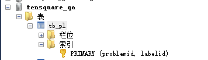

## 分库分表
在这个项目中，对于不同的微服务模块，我们使用了分库分表的设计。在文章，招聘，问答，吐槽等模块，都使用了单独的数据库。

### 为什么要分库分表

分库：一个系统的多张数据表，存储到多个数据库实例中；

分表: 分为水平切分与垂直切分

### 垂直分库垂直分表

垂直分库其实是一种简单逻辑分割。比如我们的数据库中有商品表Products、还有对订单表Orders，还有积分表Scores。接下来我们就可以创建三个数据库，一个数据库存放商品，一个数据库存放订单，一个数据库存放积分。

## 读写分离的情况下如何保持数据一致性
读写分离情况下，每次请求打到这个系统后：

1. 读请求，直接读从库
2. 写请求，先写入主库，然后主库将数据同步到其他从库

在高并发或者网络状况不理想时，写完数据后，主库还没来得及将数据同步到从库，其他读请求去读从库，发现从库中的数据仍然是旧数据。这就是读写分离数据库数据不一致的根本原因。

## 主键，索引
对于招聘项目，我的主键采用的是公共的主键ID，也就是雪花算法得来的id

这里由于问题与他的label（分类），问题与答案都是多对多，所以采用了联合主键。
* 联合主键要同时是两个表的主题组合起来的。这是和复合主键最大的区别!
* 复合主键就是含有一个以上的字段组成,如ID+name,ID+phone等。

当两个数据表形成的是多对多的关系，那么需要通过两个数据表的主键来组成联合主键，就可以确定每个数据表的其中一条记录了
在一个数据表中通过多个字段作为主键来确定一条记录，那么，多个字段组成的就是复合主键

当两个数据表形成的是多对多的关系，那么需要通过两个数据表的主键来组成联合主键，就可以确定每个数据表的其中一条记录了

在一个数据表中通过多个字段作为主键来确定一条记录，那么，多个字段组成的就是复合主键

### 复合主键的弊端？

* 如果有频繁的业务修改,会导致非聚集索引中的主键信息相应修改，而且容易造成表中记录的物理移动。
* 生成有业务含义的字段需要按照一定的规则生成，不可避免使用varchar等字符串类型，影响插入和查询效率。
* 业务规则发生变化，造成的影响容易扩大。

# redis缓存
1. 在文章模块，使用了redis缓存加速搜索。在执行findbyID找文章时，先去缓存里面找，如果没有就去数据库查找并将结果存入缓存。
    * 查不到怎么办（布隆过滤器，返回0两个思路）
    
2. 如何设置缓存时间
3. 缓存同步问题

