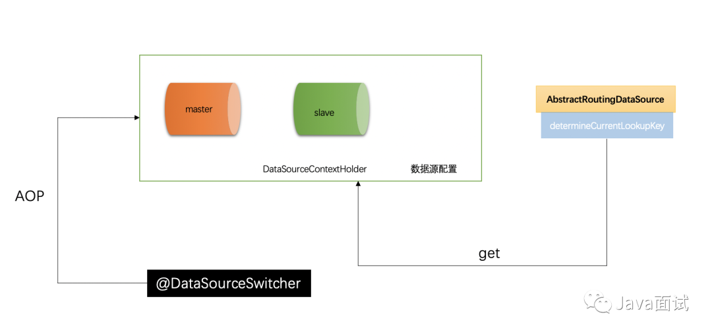
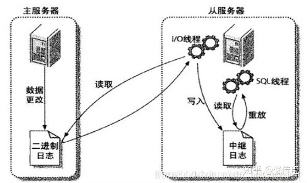

## 读写分离的具体实现

1. 主从数据源的配置
2. 数据源路由的配置
    * Spring 提供了 AbstractRoutingDataSource 根据用户定义的规则选择当前的数据源，作用就是在执行查询之前，设置使用的数据源,实现动态路由的数据源，在每次数据库查询操作前执行它的抽象方法 determineCurrentLookupKey() 决定使用哪个数据源。
3. 数据源上下文环境
    * ThreadLocal将数据源设置到每个线程上下文中
4. 切换注解和 Aop 配置
    * 来定义一个@DataSourceSwitcher 注解,拥有两个属性 1. 当前的数据源 2. 是否清除当前的数据源,并且只能放在方法上
    * 该注解的主要作用就是进行数据源的切换,在 dao 层进行操作数据库的时候,可以在方法上注明表示的是当前使用哪个数据源;
5. 使用在 service 层或者 dao 层,在需要查询的方法上添加@DataSourceSwitcher(DataSourceEnum.SLAVE),它表示该方法下所有的操作都走的是读库;在需要 update 或者 insert 的时候使用@DataSourceSwitcher(DataSourceEnum.MASTER)表示接下来将会走写库。    

## 读写分离的情况下如何保持数据一致性

MySQL之间数据复制的基础是二进制日志文件（binary log file）。一台MySQL数据库一旦启用二进制日志后，其作为master，它的数据库中所有操作都会以“事件”的方式记录在二进制日志中，其他数据库作为slave通过一个I/O线程与主服务器保持通信，并监控master的二进制日志文件的变化，如果发现master二进制日志文件发生变化，则会把变化复制到自己的中继日志（Relay log）中，然后slave的一个SQL线程会把相关的“事件”执行到自己的数据库中，以此实现从数据库和主数据库的一致性，也就实现了主从复制。

简言之可分为下面几个步骤：
1. 主库的更新事件会被写到bin log日志中。
2. 从库启用slave服务，发起连接，连接到主库。
3. 从库创建一个I/O线程，从主库读取bin log日志的内容并写入到relay log日志中。
4. 从库创建一个SQL线程，从relay log里面读取内容，将更新内容写入到从库。

## 利用redis优化点赞功能

问题： 帖子点赞数是在数据库的，一个用户不能重复点赞

* 思路一：利用数据库存储是否对这个点赞
    * 设计数据库时没有考虑，比较复杂
    
* 思路二： 利用redis
    * 当点赞后，在redis中，设置一个帖子id+用户id，并将它给个值1
    * 点赞时判断，如果get(帖子id+用户id)不为null，则返回已经点赞了

