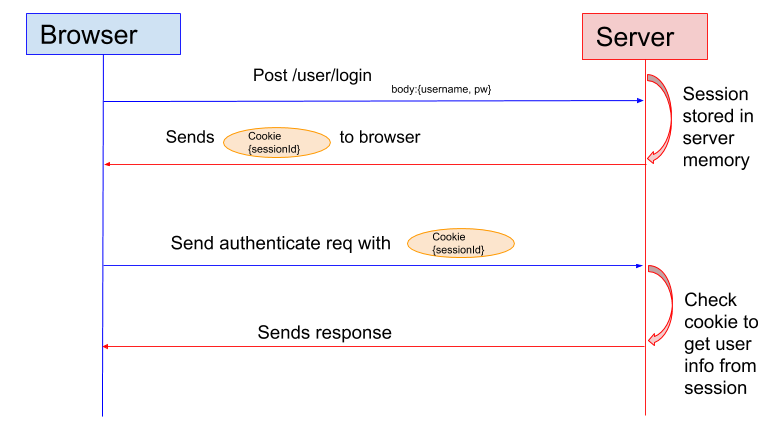
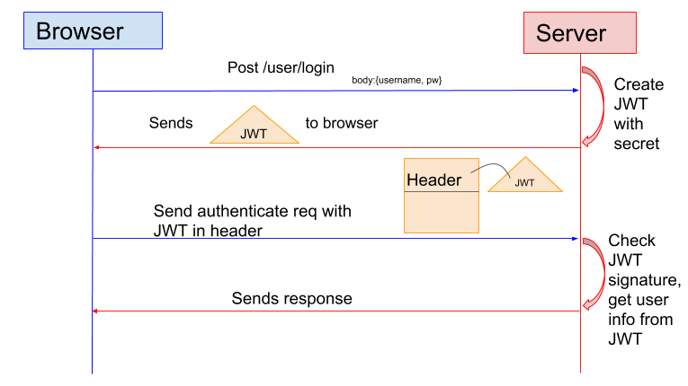

                                         ## cookie和session有什么区别？session如何进行身份验证

Session 的主要作用就是通过服务端记录用户的状态。 典型的场景是购物车，当你要添加商品到购物车的时候，系统不知道是哪个用户操作的，因为 HTTP 协议是无状态的。服务端给特定的用户创建特定的 Session 之后就可以标识这个用户并且跟踪这个用户了。

Cookie 数据保存在客户端(浏览器端)，Session 数据保存在服务器端。相对来说 Session 安全性更高。如果使用 Cookie 的一些敏感信息不要写入 Cookie 中，最好能将 Cookie 信息加密然后使用到的时候再去服务器端解密。

session如何进行身份验证？



1. 用户向服务器发送用户名和密码用于登陆系统。
2. 服务器验证通过后，服务器为用户创建一个 Session，并将 Session信息存储 起来。
3. 服务器向用户返回一个 SessionID，写入用户的 Cookie。
4. 当用户保持登录状态时，Cookie 将与每个后续请求一起被发送出去。
5. 服务器可以将存储在 Cookie 上的 Session ID 与存储在内存中或者数据库中的 Session 信息进行比较，以验证用户的身份，返回给用户客户端响应信息的时候会附带用户当前的状态。

## 什么是 Token?什么是 JWT?如何基于Token进行身份验证？

JWT （JSON Web Token） 就是这种方式的实现，通过这种方式服务器端就不需要保存 Session 数据了，只用在客户端保存服务端返回给客户的 Token 就可以了，扩展性得到提升。

JWT 本质上就一段签名的 JSON 格式的数据。由于它是带有签名的，因此接收者便可以验证它的真实性。

JWT 由 3 部分构成:

Header :描述 JWT 的元数据。定义了生成签名的算法以及 Token 的类型。
Payload（负载）:用来存放实际需要传递的数据
Signature（签名）：服务器通过Payload、Header和一个密钥(secret)使用 Header 里面指定的签名算法（默认是 HMAC SHA256）生成。

在基于 Token 进行身份验证的的应用程序中，服务器通过Payload、Header和一个密钥(secret)创建令牌（Token）并将 Token 发送给客户端，客户端将 Token 保存在 Cookie 或者 localStorage 里面，以后客户端发出的所有请求都会携带这个令牌。你可以把它放在 Cookie 里面自动发送，但是这样不能跨域，所以更好的做法是放在 HTTP Header 的 Authorization字段中： Authorization: Bearer Token。



1. 用户向服务器发送用户名和密码用于登陆系统。
2. 身份验证服务响应并返回了签名的 JWT，上面包含了用户是谁的内容。
3. 用户以后每次向后端发请求都在Header中带上 JWT。
4. 服务端检查 JWT 并从中获取用户相关信息。

## jwt的原理与检验机制
JWT 的原理是，服务器认证以后，生成一个 JSON 对象，发回给用户，就像下面这样。
```json
{
"姓名": "张三",
"角色": "管理员",
"到期时间": "2018年7月1日0点0分"
}
```
以后，用户与服务端通信的时候，都要发回这个 JSON 对象。服务器完全只靠这个对象认定用户身份。为了防止用户篡改数据，服务器在生成这个对象的时候，会加上签名。

服务器就不保存任何 session 数据了，也就是说，服务器变成无状态了，从而比较容易实现扩展。

## 前后端分离下token 的使用

1. 前端向后端传递用户名和密码
2. 后端将接收到的的用户名和密码进行核实
3. 后端核实成功后会，返回给前端一个token（或者直接将token保存在cookie中）；
4. 前端得到token 并对其进行保存
5. 如果前端请求隐私的接口（比如需要登陆后才能查看商品的详细信息），则需要传递保存的token（进行ajax请求时，将信息放在请求头中）
6. 后端对其进行验证，如果token错误，则请求不到数据，返回给前端相应的提示 。如果token验证正确，则获取相应的数据，并返回给前端

## 为什么cookie无法防止CSRF攻击，而token可以

什么是CSRF攻击？

CSRF是跨站点请求伪造(Cross—Site Request Forgery)，存在巨大的危害性。

攻击者盗用了你的身份，以你的名义发送恶意请求，对服务器来说这个请求是完全合法的，但是却完成了攻击者所期望的一个操作，比如转账。

进行Session 认证的时候，我们一般使用 Cookie 来存储 SessionId,当我们登陆后后端生成一个SessionId放在Cookie中返回给客户端，服务端通过Redis或者其他存储工具记录保存着这个Sessionid，
客户端登录以后每次请求都会带上这个SessionId，服务端通过这个SessionId来标示你这个人。如果别人通过 cookie拿到了 SessionId 后就可以代替你的身份访问系统了。

在我们登录成功获得 token 之后，一般会选择存放在 local storage 中。然后我们在前端通过某些方式会给每个发到后端的请求加上这个 token,这样就不会出现 CSRF 漏洞的问题。
因为，即使有个你点击了非法链接发送了请求到服务端，这个非法请求是不会携带 token 的，所以这个请求将是非法的。


