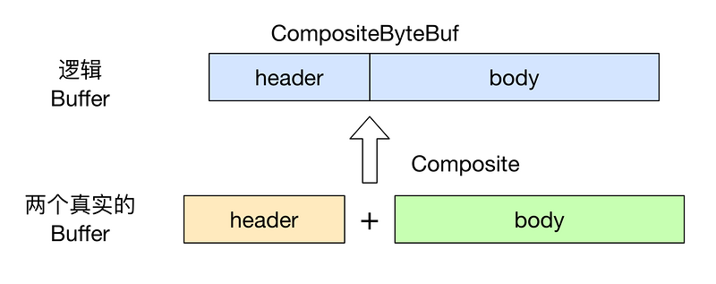

## Netty高性能的实现
1. 基于Reactor模式实现异步非阻塞
2. 无锁化的串行设计
    * Netty的NioEventLoop读取到消息后，直接调用ChannelPipeline。只要用户不切换线程，就会一直调用到用户的Handler。
    * 这种方式避免了多线程操作导致的竞争。
3. 缓冲区的设计
    * 利用Readindex，Writeindex提高效率
4. 零拷贝
5. 内存池循环利用ByteBuf
6. 可配置I/O线程数，TCP连接参数等

### 零拷贝
零拷贝的三个方面：
1. Netty的接收和发送ByteBuffer使用直接内存，使用堆外内存进行socket读写，不需要字节缓冲区的二次拷贝

2. 将多个ByteBuf封装成一个CompositeByteBuf，对外提供统一的接口。
    
    * 将 header 与 body 合并为一个逻辑上的 ByteBuf, 这两个 ByteBuf 在CompositeByteBuf 内部都是单独存在的, CompositeByteBuf 只是逻辑上是一个整体
    
    
   
    * 这种情况下添加ByteBuf不需要内存的拷贝。
    
3.  文件传输的零拷贝
    * Netty 使用了 DefaultFileRegion 来封装一个 FileChannel，然后就可以直接通过它将文件的内容直接写入 Channel 中, 而不需要传统方式：拷贝文件内容到临时 buffer, 然后再将 buffer 写入 Channel.

### 内存池
由于ByteBuf使用了直接内存，所以他的内存分配与回收是个非常耗时的操作。

Netty使用了基于内存池的内存管理，循环利用ByteBuf。

利用setRefCnt方法设置引用计数器，用于对象的垃圾回收。

Netty还提供了缓冲区的内存泄漏保护（自动回收）和缓冲区的溢出保护（扩展缓冲区容量时，先对最大容量进行判断）

## 简单的调优
1. 发送队列容量上限控制
    * NIO消息发送队列ChannelOutBuffer没有设置容量上线，会随着消息的挤压自动扩展。
    * 如果网络对方处理速度慢，或者发送消息过快，都可能导致ChannelOutBuffer内存膨胀，甚至可能内存溢出
    * 通过channelOption设置队列长度
