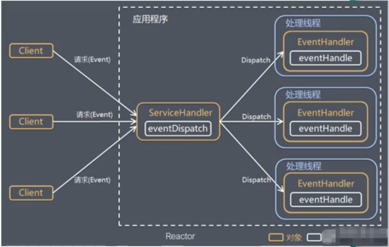
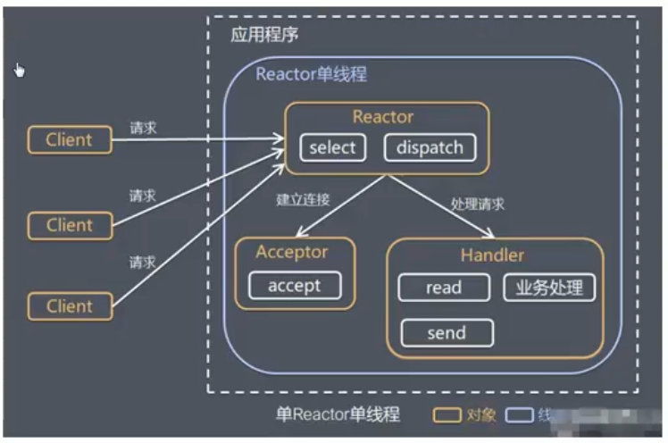
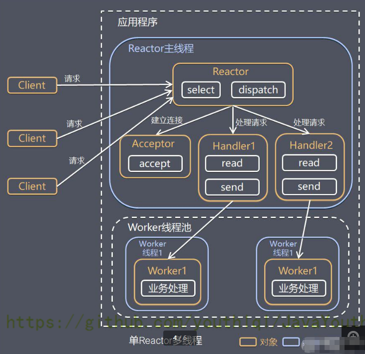
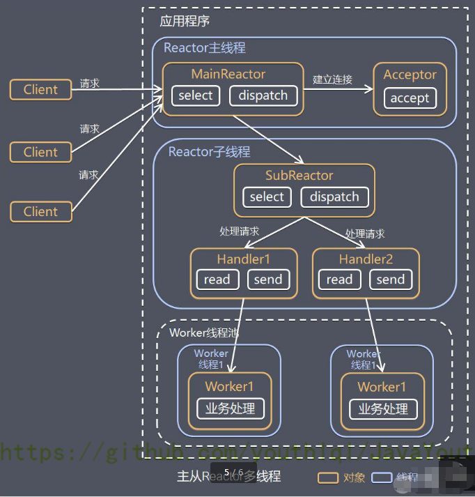
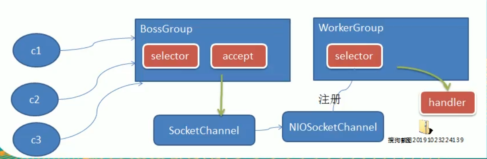
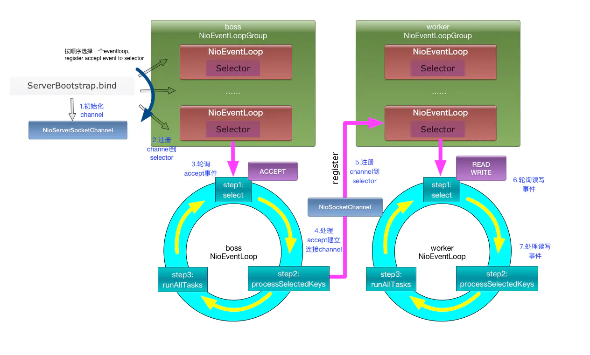

# Netty入门

## Reactor模式
Reactor的数量与处理资源池线程的数量不同，有三种典型实现：
1. 单Reactor单线程
2. 单Reactor多线程
3. 主从Reactor多线程

整体设计理念：I/O复用结合线程池

1. 服务端程序处理传入多个请求，并将他们同步分派到相应的处理线程。
2. 使用IO复用监听事件（Handler），收到事件后分发给各个线程。

### 单Reactor单线程、

结合实例：服务器端用一个线程通过多路复用搞定所有的 IO 操作（包括连接，读、写等），编码简单，清晰明了，
但是如果客户端连接数量较多，将无法支撑。

### 单Reactor多线程

1. Reactor 对象通过 Select 监控客户端请求事件，收到事件后，通过 Dispatch 进行分发
2. 如果是建立连接请求，则由 Acceptor 通过 accept 处理连接请求，然后创建一个 Handler 对象处理完成连接后的各种事件
3. 如果不是连接请求，则由 Reactor 分发调用连接对应的 handler 来处理（也就是说连接已经建立，后续客户端再来请求，那基本就是数据请求了，直接调用之前为这个连接创建好的handler来处理）
4. handler 只负责响应事件，不做具体的业务处理（这样不会使handler阻塞太久），通过 read 读取数据后，会分发给后面的 worker 线程池的某个线程处理业务。【业务处理是最费时的，所以将业务处理交给线程池去执行】
5. worker 线程池会分配独立线程完成真正的业务，并将结果返回给 handler
6. handler 收到响应后，通过 send 将结果返回给 client

* 优点：可以充分的利用多核 cpu 的处理能力
* 缺点：多线程数据共享和访问比较复杂。Reactor 承担所有的事件的监听和响应，它是单线程运行，在高并发场景容易出现性能瓶颈。也就是说Reactor主线程承担了过多的事

### 主从Reactor多线程

1. Reactor 主线程 MainReactor 对象通过 select 监听连接事件，收到事件后，通过 Acceptor 处理连接事件
2. 当 Acceptor 处理连接事件后，MainReactor 将连接分配给 SubReactor
3. subreactor 将连接加入到连接队列进行监听，并创建 handler 进行各种事件处理
4. 当有新事件发生时，subreactor 就会调用对应的 handler 处理
5. handler 通过 read 读取数据，分发给后面的 worker 线程处理
6. worker 线程池分配独立的 worker 线程进行业务处理，并返回结果
7. handler 收到响应的结果后，再通过 send 将结果返回给 client
8. Reactor 主线程可以对应多个 Reactor 子线程，即 MainRecator 可以关联多个 SubReactor

* 优点：父线程与子线程的数据交互简单职责明确，父线程只需要接收新连接，子线程完成后续的业务处理。
* 优点：父线程与子线程的数据交互简单，Reactor 主线程只需要把新连接传给子线程，子线程无需返回数据。
* 缺点：编程复杂度较高

## Netty模型
简易版模型 ：

1. BossGroup 线程维护 Selector，只关注 Accecpt
2. 当接收到 Accept 事件，获取到对应的 SocketChannel，封装成 NIOScoketChannel 并注册到 Worker 线程（事件循环），并进行维护
3. 当 Worker 线程监听到 Selector 中通道发生自己感兴趣的事件后，就进行处理（就由 handler），注意 handler 已经加入到通道

详细版模型：

1. Netty 抽象出两组线程池 ，BossGroup 专门负责接收客户端的连接，WorkerGroup 专门负责网络的读写
2. BossGroup 和 WorkerGroup 类型都是 NioEventLoopGroup
3. NioEventLoopGroup 相当于一个事件循环组，这个组中含有多个事件循环，每一个事件循环是 NioEventLoop
4. NioEventLoop 表示一个不断循环的执行处理任务的线程，每个 NioEventLoop 都有一个 Selector，用于监听绑定在其上的 socket 的网络通讯
5. NioEventLoopGroup 可以有多个线程，即可以含有多个 NioEventLoop
6. 每个 BossGroup下面的NioEventLoop 循环执行的步骤有 3 步
    * 轮询 accept 事件
    * 处理 accept 事件，与 client 建立连接，生成 NioScocketChannel，并将其注册到某个 workerGroup NIOEventLoop 上的 Selector
    * 继续处理任务队列的任务，即 runAllTasks
7. 每个 WorkerGroup NIOEventLoop 循环执行的步骤
    * 轮询 read，write 事件
    * 处理 I/O 事件，即 read，write 事件，在对应 NioScocketChannel 处理
    * 处理任务队列的任务，即 runAllTasks
8. 每个 Worker NIOEventLoop 处理业务时，会使用 pipeline（管道），pipeline 中包含了 channel（通道），即通过 pipeline 可以获取到对应通道，管道中维护了很多的处理器。（这个点目前只是简单的讲，后面重点说）

