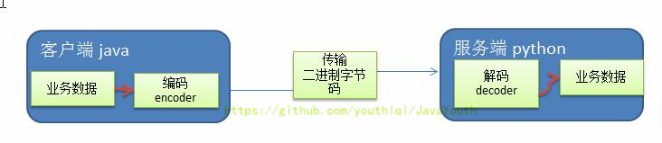
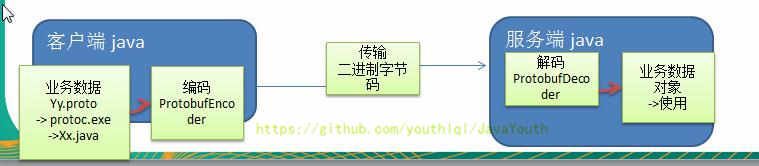
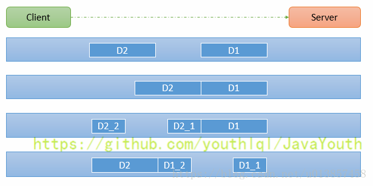

## netty解码与编码
1. 编写网络应用程序时，因为数据在网络中传输的都是二进制字节码数据，在发送数据时就需要编码，接收数据时就需要解码[示意图]
2. codec（编解码器）的组成部分有两个：decoder（解码器）和 encoder（编码器）。encoder 负责把业务数据转换成字节码数据，decoder 负责把字节码数据转换成业务数据

Netty 本身的编码解码的机制和问题分析：
1. Netty 自身提供了一些 codec(编解码器)
2. Netty 提供的编码器
    * StringEncoder：对字符串数据进行编码。
    * ObjectEncoder：对Java对象进行编码。
3. Netty 提供的解码器
    * StringDecoder,对字符串数据进行解码
    * ObjectDecoder，对 Java 对象进行解码
4. Netty 本身自带的 ObjectDecoder 和 ObjectEncoder 可以用来实现 POJO 对象或各种业务对象的编码和解码，底层使用的仍是Java序列化技术,而Java序列化技术本身效率就不高，存在如下问题
    * 无法跨语言
    * 序列化后的体积太大，是二进制编码的5倍多。
    * 序列化性能太低
5. 引出新的解决方案 : Google 的 Protobuf

## protobuf

1. Protobuf 是 Google 发布的开源项目，全称 Google Protocol Buffers，是一种轻便高效的结构化数据存储格式，可以用于结构化数据串行化，或者说序列化。它很适合做数据存储或 RPC（远程过程调用 remote procedure call）数据交换格式。目前很多公司 从http + json 转向tcp + protobuf，效率会更高。
2. 参考文档：https://developers.google.com/protocol-buffers/docs/proto 语言指南
3. Protobuf 是以 message 的方式来管理数据的.
4. 支持跨平台、跨语言，即（客户端和服务器端可以是不同的语言编写的）（支持目前绝大多数语言，例如 C++、C#、Java、python 等）
5. 高性能，高可靠性
6. 使用 protobuf 编译器能自动生成代码，Protobuf 是将类的定义使用 .proto 文件进行描述。说明，在 idea 中编写 .proto 文件时，会自动提示是否下载 .ptoto 编写插件.可以让语法高亮。
7. 然后通过 protoc.exe 编译器根据 .proto 自动生成 .java 文件

## TCP粘包

由于不可能知道远程节点是否会一次性发送一个完整的信息，tcp 有可能出现粘包拆包的问题，这个类会对入站数据进行缓冲，直到它准备好被处理.

1. TCP 是面向连接的，面向流的，提供高可靠性服务。收发两端（客户端和服务器端）都要有一一成对的 socket，因此，发送端为了将多个发给接收端的包，更有效的发给对方，使用了优化方法（Nagle 算法），将多次间隔较小且数据量小的数据，合并成一个大的数据块，
然后进行封包。这样做虽然提高了效率，但是接收端就难于分辨出完整的数据包了，因为面向流的通信是无消息保护边界的

2. 由于 TCP 无消息保护边界,需要在接收端处理消息边界问题，也就是我们所说的粘包、拆包问题

假设客户端分别发送了两个数据包 D1 和 D2 给服务端，由于服务端一次读取到字节数是不确定的，故可能存在以下四种情况：
1. 服务端分两次读取到了两个独立的数据包，分别是 D1 和 D2，没有粘包和拆包
2. 服务端一次接受到了两个数据包，D1 和 D2 粘合在一起，称之为 TCP 粘包
3. 服务端分两次读取到了数据包，第一次读取到了完整的 D1 包和 D2 包的部分内容，第二次读取到了 D2 包的剩余内容，这称之为 TCP 拆包
4. 服务端分两次读取到了数据包，第一次读取到了 D1 包的部分内容 D1_1，第二次读取到了 D1 包的剩余部分内容 D1_2 和完整的 D2 包。

TCP 粘包和拆包解决方案：
* 常用方案：使用自定义协议+编解码器来解决
* 关键就是要解决服务器端每次读取数据长度的问题，这个问题解决，就不会出现服务器多读或少读数据的问题，从而避免的 TCP 粘包、拆包。

