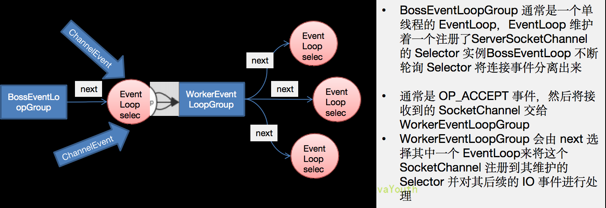

# Netty核心组件

## Bootstrap、ServerBootstrap
Bootstrap 意思是引导，一个 Netty 应用通常由一个 Bootstrap 开始，主要作用是配置整个 Netty 程序，串联各个组件，
Netty 中 Bootstrap 类是客户端程序的启动引导类，ServerBootstrap 是服务端启动引导类。

常见的方法有:
* public ServerBootstrap group(EventLoopGroup parentGroup, EventLoopGroup childGroup)，该方法用于服务器端，用来设置两个 EventLoop
* public B group(EventLoopGroup group)，该方法用于客户端，用来设置一个 EventLoop
* public B channel(Class<? extends C> channelClass)，该方法用来设置一个服务器端的通道实现
* public <T> B option(ChannelOption<T> option, T value)，用来给 ServerChannel 添加配置
    * ChannelOption.SO_BACKLOG ：对应TCP/IP协议listen函数中的backlog
    * ChannelOption.SO_KEEPALIVE ：一直保持连接状态
* public <T> ServerBootstrap childOption(ChannelOption<T> childOption, T value)，用来给接收到的通道添加配置
* public ServerBootstrap childHandler(ChannelHandler childHandler)，该方法用来设置业务处理类（自定义服务器的handler）
* public ChannelFuture bind(int inetPort)，该方法用于服务器端，用来设置占用的端口号
* public ChannelFuture connect(String inetHost, int inetPort)，该方法用于客户端，用来连接服务器端

```java
//创建bossGroup和BossGroup
//NioEventGroup()默认是cpu核心数两倍。
NioEventLoopGroup bossgroup = new NioEventLoopGroup();
NioEventLoopGroup workerGroup = new NioEventLoopGroup();

//创建服务器的启动对象，配置参数
ServerBootstrap bootstrap = new ServerBootstrap();

//用链式编程来进行设置
bootstrap.group(bossgroup, workerGroup)//设置两个线程组
        .channel(NioServerSocketChannel.class)//使用NioSocketChannel作为服务器通道
        .option(ChannelOption.SO_BACKLOG, 128)//设置队列得到连接个数
        .childOption(ChannelOption.SO_KEEPALIVE, true)//设置活动连接状态
        .childHandler(new ChannelInitializer<SocketChannel>() {//创建一个通道测试对象（匿名对象）
        // 给pipline设置处理器
        @Override
        protected void initChannel(SocketChannel socketChannel) throws Exception {
            socketChannel.pipeline().addLast(new nettyserverhandler());
            }
        });//给我们的workerGoup的EventLoop对应的管道设置处理器
```

## Future、ChannelFuture
Netty 中所有的 IO 操作都是异步的，不能立刻得知消息是否被正确处理。但是可以过一会等它执行完成或者直接注册一个监听，具体的实现就是通过 Future 和 ChannelFutures，他们可以注册一个监听，当操作执行成功或失败时监听会自动触发注册的监听事件

常见的方法有:
* Channel channel()，返回当前正在进行 IO 操作的通道
* ChannelFuture sync()，等待异步操作执行完毕

## Channel
1. Netty 网络通信的组件，能够用于执行网络 I/O 操作。
2. 通过 Channel 可获得当前网络连接的通道的状态
3. 通过 Channel 可获得网络连接的配置参数（例如接收缓冲区大小）
4. Channel 提供异步的网络 I/O 操作(如建立连接，读写，绑定端口)，异步调用意味着任何 I/O 调用都将立即返回，并且不保证在调用结束时所请求的 I/O 操作已完成
5. 调用立即返回一个 ChannelFuture 实例，通过注册监听器到 ChannelFuture 上，可以 I/O 操作成功、失败或取消时回调通知调用方
6. 支持关联 I/O 操作与对应的处理程序
7. 不同协议、不同的阻塞类型的连接都有不同的 Channel 类型与之对应，常用的 Channel 类型：
    * NioSocketChannel，异步的客户端 TCP Socket 连接。
    * NioServerSocketChannel，异步的服务器端 TCP Socket 连接。
    * NioDatagramChannel，异步的 UDP 连接。
    * NioSctpChannel，异步的客户端 Sctp 连接。
    * NioSctpServerChannel，异步的 Sctp 服务器端连接，这些通道涵盖了 UDP 和 TCP 网络 IO 以及文件 IO。

## Selector
1. Netty 基于 Selector 对象实现 I/O 多路复用，通过 Selector 一个线程可以监听多个连接的 Channel 事件。
2. 当向一个 Selector 中注册 Channel 后，Selector 内部的机制就可以自动不断地查询（Select）这些注册的 Channel 是否有已就绪的 I/O 事件（例如可读，可写，网络连接完成等），这样程序就可以很简单地使用一个线程高效地管理多个 Channel

## ChannelHandler 及其实现类
在自定义handler的时候会extends（继承）ChannelHandler类

```java
public class nettyserverhandler extends ChannelInboundHandlerAdapter{}
```

1. ChannelHandler 是一个接口，处理 I/O 事件或拦截 I/O 操作，并将其转发到其 ChannelPipeline（业务处理链）中的下一个处理程序。
2. ChannelHandler 本身并没有提供很多方法，因为这个接口有许多的方法需要实现，方便使用期间，可以继承它的子类
3. ChannelHandler 及其实现类一览图


4. 我们经常需要自定义一个 Handler 类去继承 ChannelInboundHandlerAdapter，然后通过重写相应方法实现业务逻辑。

## PipeLine 和 ChannelPipeline
ChannelPipeline提供了ChannelHandler链的容器。以客户端应用程序为例，如果时间的运动方向是从客户端到服务端，称为出站。
即客户端发送给服务端的数据会通过pipeline中的一系列ChannelOutboundHandler，并被这些Handler处理，反之称为入站。

* 服务端发数据给客户端：服务端--->出站--->Socket通道--->入站--->客户端
* 客户端发数据给服务端：客户端--->出站--->Socket通道--->入站--->服务端

1. ChannelPipeline 是一个 Handler 的集合，它负责处理和拦截 inbound 或者 outbound 的事件和操作，相当于一个贯穿 Netty 的链。
   （也可以这样理解：ChannelPipeline 是保存 ChannelHandler 的 List，用于处理或拦截 Channel 的入站事件和出站操作）
2. ChannelPipeline 实现了一种高级形式的拦截过滤器模式，使用户可以完全控制事件的处理方式，以及 Channel 中各个的 ChannelHandler 如何相互交互
3. 在 Netty 中每个 Channel 都有且仅有一个 ChannelPipeline 与之对应，它们的组成关系如下
    * 一个channel包含一个channelpipeline，channelpipeline又维护了一个ChannelHandlerContext（每一个关联着一个ChannelHandler）组成的双向链表
    * 入站出站事件在一个双向链表中，入站事件会从head向后传递到最后一个handler，出站会从tail传递到最前一个handler，两种类型handler互不干扰。
    


4. 常用方法 ChannelPipeline addFirst(ChannelHandler... handlers)，把一个业务处理类（handler）添加到链中的第一个位置ChannelPipeline addLast(ChannelHandler... handlers)，把一个业务处理类（handler）添加到链中的最后一个位置

* TestServerInitializer和HttpServerCodec这些东西本身也是handler
* 一般来说事件从客户端往服务器走我们称为出站，反之则是入站。

## EventLoopGroup 和其实现类 NioEventLoopGroup
1. EventLoopGroup 是一组 EventLoop 的抽象，Netty 为了更好的利用多核 CPU 资源，一般会有多个 EventLoop 同时工作，每个 EventLoop 维护着一个 Selector 实例。
2. EventLoopGroup 提供 next 接口，可以从组里面按照一定规则获取其中一个 EventLoop 来处理任务。在 Netty 服务器端编程中，我们一般都需要提供两个 EventLoopGroup，例如：BossEventLoopGroup 和 WorkerEventLoopGroup。
3. 通常一个服务端口即一个 ServerSocketChannel 对应一个 Selector 和一个 EventLoop 线程。BossEventLoop 负责接收客户端的连接并将 SocketChannel 交给 WorkerEventLoopGroup 来进行 IO 处理.
   常用方法 public NioEventLoopGroup()，构造方法 public Future<?> shutdownGracefully()，断开连接，关闭线程



## Unpooled

Netty 提供一个专门用来操作缓冲区（即 Netty 的数据容器）的工具类


Netty中的bytebuf不用项Nio一样用flip()方法来控制读写。他通过WriteIndex和ReadIndex两个指针来控制读写。
* writeindex到最大值之间是可写范围.
* readindex到writeindex之间是可读范围。
* 0-readindex就是已经读取的区域。


copiedBuffer简单测试：
```java
public class NettyByteBuf02 {
    
    public static void main(String[] args) {
        //创建ByteBuf
        ByteBuf byteBuf = Unpooled.copiedBuffer("hello,world!", Charset.forName("utf-8"));
        //使用相关的方法
        if (byteBuf.hasArray()) { // true

            byte[] content = byteBuf.array();

            //将 content 转成字符串
            System.out.println(new String(content, Charset.forName("utf-8")));

            System.out.println("byteBuf=" + byteBuf);

            System.out.println(byteBuf.arrayOffset()); // 0
            System.out.println(byteBuf.readerIndex()); // 0
            System.out.println(byteBuf.writerIndex()); // 12
            System.out.println(byteBuf.capacity()); // 36

            //System.out.println(byteBuf.readByte()); //
            System.out.println(byteBuf.getByte(0)); // 104  h的asic码

            int len = byteBuf.readableBytes(); //可读的字节数  12
            System.out.println("len=" + len);

            //使用for取出各个字节
            for (int i = 0; i < len; i++) {
                System.out.println((char) byteBuf.getByte(i));
            }

            //按照某个范围读取
            System.out.println(byteBuf.getCharSequence(0, 4, Charset.forName("utf-8")));//hell
            System.out.println(byteBuf.getCharSequence(4, 6, Charset.forName("utf-8")));//o,worl
        }
    }
}
```

## Netty心跳检测机制

何为心跳:

所谓心跳, 即在 TCP 长连接中, 客户端和服务器之间定期发送的一种特殊的数据包, 通知对方自己还在线, 以确保 TCP 连接的有效性.

注：心跳包还有另一个作用，经常被忽略，即：一个连接如果长时间不用，防火墙或者路由器就会断开该连接。

通过IdleStateHandler实现:

在channel链中加入了IdleSateHandler，第一个参数是5，单位是秒，那么这样做的意思就是：在服务器端会每隔5秒来检查一下channelRead方法被调用的情况，如果在5秒内该链上的channelRead方法都没有被触发，就会调用userEventTriggered方法

server：
```java
  serverBootstrap.childHandler(new ChannelInitializer<SocketChannel>() {

                @Override
                protected void initChannel(SocketChannel ch) throws Exception {
                    ChannelPipeline pipeline = ch.pipeline();
                    //加入一个netty 提供 IdleStateHandler
                    /*
                    说明
                    1. IdleStateHandler 是netty 提供的处理空闲状态的处理器
                    2. long readerIdleTime : 表示多长时间没有读, 就会发送一个心跳检测包检测是否连接
                    3. long writerIdleTime : 表示多长时间没有写, 就会发送一个心跳检测包检测是否连接
                    4. long allIdleTime : 表示多长时间没有读写, 就会发送一个心跳检测包检测是否连接
                    5. 文档说明
                    triggers an {@link IdleStateEvent} when a {@link Channel} has not performed
                   read, write, or both operation for a while.
                    6. 当 IdleStateEvent 触发后 , 就会传递给管道 的下一个handler去处理，通过调用(触发)
                   下一个handler 的 userEventTiggered , 在该方法中去处理 IdleStateEvent(读空闲，写空闲，读写空闲)
                    7.handlerRemoved有时候是无法感知连接断掉，所以还是需要心跳包的检测来判断连接是否还有效
                     */
                    pipeline.addLast(new IdleStateHandler(3,5,7, TimeUnit.SECONDS));
                    //加入一个对空闲检测进一步处理的handler(自定义)
                    pipeline.addLast(new MyServerHandler());
                }
            });
```

serverhandler：
```java
public class MyServerHandler extends ChannelInboundHandlerAdapter {
    /**
     * @param ctx 上下文
     * @param evt 事件
     */
    @Override
    public void userEventTriggered(ChannelHandlerContext ctx, Object evt) throws Exception {
        if(evt instanceof IdleStateEvent) {
            //将  evt 向下转型 IdleStateEvent
            IdleStateEvent event = (IdleStateEvent) evt;
            String eventType = null;
            switch (event.state()) {
                case READER_IDLE:
                  eventType = "读空闲";
                  break;
                case WRITER_IDLE:
                    eventType = "写空闲";
                    break;
                case ALL_IDLE:
                    eventType = "读写空闲";
                    break;
            }
            System.out.println(ctx.channel().remoteAddress() + "--超时时间--" + eventType);
            System.out.println("服务器做相应处理..");
            //如果发生空闲，我们关闭通道
           // ctx.channel().close();
        }
    }
}
```

## WebSocket实现长链接

WebSocket 是 HTML5 开始提供的一种在单个 TCP 连接上进行全双工通讯的协议。
WebSocket 使得客户端和服务器之间的数据交换变得更加简单，允许服务端主动向客户端推送数据。

通过HttpObjectAggregator ,WebSocketServerProtocolHandler来实现

```java
        serverBootstrap.childHandler(new ChannelInitializer<SocketChannel>() {
                @Override
                protected void initChannel(SocketChannel ch) throws Exception {
                    ChannelPipeline pipeline = ch.pipeline();

                    //因为基于http协议，使用http的编码和解码器
                    pipeline.addLast(new HttpServerCodec());
                    //http是以块方式写，添加ChunkedWriteHandler处理器
                    pipeline.addLast(new ChunkedWriteHandler());

                    /*
                    说明
                    1. http数据在传输过程中是分段, HttpObjectAggregator ，就是可以将多个段聚合
                    2. 这就就是为什么，当浏览器发送大量数据时，就会发出多次http请求
                     */
                    pipeline.addLast(new HttpObjectAggregator(8192));
                    
                    /*
                    说明
                    1. 对应websocket ，它的数据是以 帧(frame) 形式传递
                    2. 可以看到WebSocketFrame 下面有六个子类
                    3. 浏览器请求时 ws://localhost:7000/hello 表示请求的uri
                    4. WebSocketServerProtocolHandler 核心功能是将 http协议升级为 ws协议 , 保持长连接
                    5. 是通过一个 状态码 101
                     */
                    pipeline.addLast(new WebSocketServerProtocolHandler("/hello"));

                    //自定义的handler ，处理业务逻辑
                    pipeline.addLast(new MyTextWebSocketFrameHandler());
                }
```


