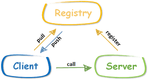

## RPC 基本介绍
1. RPC（Remote Procedure Call）—远程过程调用，是一个计算机通信协议。该协议允许运行于一台计算机的程序调用另一台计算机的子程序，而程序员无需额外地为这个交互作用编程
2. 两个或多个应用程序都分布在不同的服务器上，它们之间的调用都像是本地方法调用一样。

简单的RPC调用流程

1. 服务消费方（client）以本地调用方式调用服务
2. client stub 接收到调用后负责将方法、参数等封装成能够进行网络传输的消息体
3. client stub 将消息进行编码并发送到服务端
4. server stub 收到消息后进行解码
5. server stub 根据解码结果调用本地的服务
6. 本地服务执行并将结果返回给 server stub
7. server stub 将返回导入结果进行编码并发送至消费方
8. client stub 接收到消息并进行解码
9. 服务消费方（client）得到结果

小结：RPC 的目标就是将 2 - 8 这些步骤都封装起来，用户无需关心这些细节，可以像调用本地方法一样即可完成远程服务调用

初始不使用注册中心，直接给发送的消息加一个消息头，服务器解析消息头找到对应的服务.

加入注册中心的RPC框架：

## 注册中心

### 什么是注册中心？

注册中心可以说是微服务架构中的“通讯录”，它记录了服务和服务地址的映射关系。在分布式架构中，服务会注册到这里，当服务需要调用其它服务时，就到这里找到服务的地址，进行调用。

简单理解就是：在没有注册中心时候，服务间调用需要知道被当服务调方的具体地址（写死的 ip:port）。 更换部署地址，就不得不修改调用当中指定的地址。
而有了注册中心之后，每个服务在调用别人的时候只需要知道服务名称（软编码）就好，地址都会通过注册中心根据服务名称获取到具体的服务地址进行调用。

总结：服务注册中心的作用就是「服务的注册」和「服务的发现」。

### 为什么需要注册中心

1. 服务管理
2. 服务之间的自动发现
3. 服务的依赖关系管理

## CAP理论

分布式系统不可能同时满足CAP，最多只能同时满足其中两项。
* 一致性（C：Consistency）
    * 一致性指的是多个数据副本是否能保持一致的特性，在一致性的条件下，系统在执行数据更新操作之后能够从一致性状态转移到另一个一致性状态。
    * 对系统的一个数据更新成功之后，如果所有用户都能够读取到最新的值，该系统就被认为具有强一致性。  
* 可用性（A：Availability）
    * 可用性指分布式系统在面对各种异常时可以提供正常服务的能力，可以用系统可用时间占总时间的比值来衡量，4 个 9 的可用性表示系统 99.99% 的时间是可用的。
    * 在可用性条件下，要求系统提供的服务一直处于可用的状态，对于用户的每一个操作请求总是能够在有限的时间内返回结果。
* 分区容忍性（P：Partition Tolerance）
    * 网络分区指分布式系统中的节点被划分为多个区域，每个区域内部可以通信，但是区域之间无法通信。
    * 在分区容忍性条件下，分布式系统在遇到任何网络分区故障的时候，仍然需要能对外提供一致性和可用性的服务，除非是整个网络环境都发生了故障。

常用两种策略：
* 保证一致性（CP），不能访问未同步完成的节点，也就失去了部分可用性；
* 保证可用性（AP），允许读取所有节点的数据，但是数据可能不一致。

