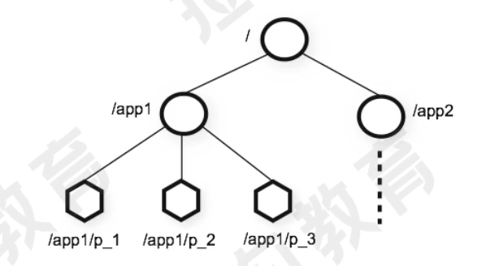
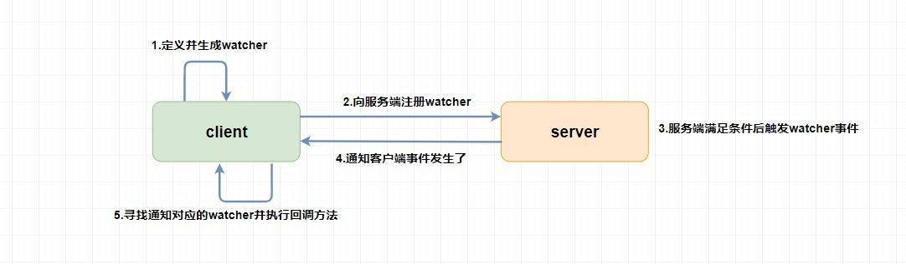
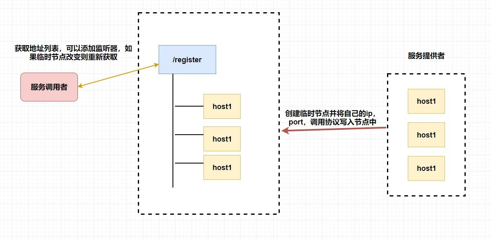

## zookeeper概念
zookeeper是一个树型目录服务、

zk的数据信息都保存在一个个数据节点上，这些节点被称为znode。znode是zookeeper中最小的数据单位。

## znode类型
* 持久节点：一旦创建就一直存在，直到将其删除。
* 持久顺序节点：一个父节点可以为其子节点 维护一个创建的先后顺序 ，这个顺序体现在 节点名称 上，是节点名称后自动添加一个由 10 位数字组成的数字串，从 0 开始计数。
* 临时节点：临时节点的生命周期是与 客户端会话 绑定的，会话消失则节点消失 。临时节点 只能做叶子节点 ，不能创建子节点。
* 临时顺序节点：父节点可以创建一个维持了顺序的临时节点(和前面的持久顺序性节点一样)。
 
## watch机制
Watcher 为事件监听器，是 zk 非常重要的一个特性，很多功能都依赖于它，它有点类似于订阅的方式，即客户端向服务端 注册 指定的 watcher ，当服务端符合了 watcher 的某些事件或要求则会 向客户端发送事件通知 ，客户端收到通知后找到自己定义的 Watcher 然后 执行相应的回调方法 。

## 注册中心

让服务提供者 在 zookeeper 中创建一个临时节点并且将自己的 ip、port、调用方式 写入节点，当 服务消费者 需要进行调用的时候会 通过注册中心找到相应的服务的地址列表(IP端口什么的) ，并缓存到本地(方便以后调用)，当消费者调用服务时，不会再去请求注册中心，而是直接通过负载均衡算法从地址列表中取一个服务提供者的服务器调用服务。

当服务提供者的某台服务器宕机或下线时，相应的地址会从服务提供者地址列表中移除。同时，注册中心会将新的服务地址列表发送给服务消费者的机器并缓存在消费者本机。

