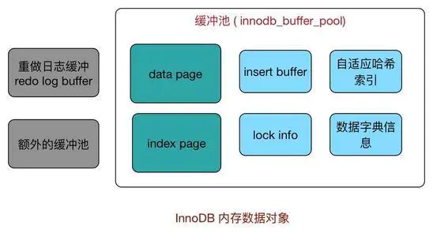

## 缓冲池
应用系统分层架构，为了加速数据访问，会把最常访问的数据放在缓存(cache)里，避免每次都去访问数据库。操作系统会有缓冲池(buffer pool)机制，避免每次访问磁盘，以加速数据的访问。
MySQL作为一个存储系统，同样具有缓冲池机制，以避免每次查询数据都进行磁盘IO。

* 缓冲池简单来说就是一块内存区域，通过内存的速度来弥补磁盘速度较慢对数据库性能的影响。

在数据库当中读取页的操作，首先将从磁盘读到的页存放在缓存池中。下一次再读相同的页时，首先判断该页是不是在缓冲池中。若在，直接读取。否则，读取磁盘上的页。

对于数据库中页的修改操作，则首先修改缓存池中的页，然后再以一定的频率刷新到磁盘上。需要注意的是，缓冲池刷新回磁盘并不是每次页发生更新时触发，而是通过一种称为Checkpoint的机制刷新回磁盘。

* 缓冲池还包括索引页、数据页、undo页、自适应哈希索引（adaptive hash index）、InnoDB存储的锁信息（lock info）等等
* 不能简单地认为，缓冲池只是缓存索引页和数据页，它们只是占缓冲池很大的一部分。
* InnoDB缓冲池中有Insert Buffer信息固然不错，但是Insert Buffer和数据页一样，也是物理页的一个组成部分。

## Innodb四大特性

### 插入缓存（Insert Buffer）:
Insert  Buffer是物理页 的一个组成部分，而不是缓冲池的一个部分。

只对于非聚集索引（非唯一）的插入和更新有效，对于每一次的插入不是写到索引页中，而是先判断插入的非聚集索引页是否在缓冲池中，如果在则直接插入；若不在，则先放到Insert Buffer 中，再按照一定的频率进行合并操作，再写回disk。这样通常能将多个插入合并到一个操作中，目的还是为了减少随机IO带来性能损耗。

使用插入缓冲的条件：
* 非聚集索引
* 非唯一索引

### changeBuffer
Insert Buffer的升级，InnoDB存储引擎可以对DML操作——INSERT、DELETE、UPDATE都进行缓冲，它们分别时是：Insert Buffer、Delete Buffer、Purge Buffer。

Change Buffer使用的对象：非唯一的辅助索引。

## MySQL常见存储引擎的区别
**InnoDB** 是 MySQL 默认支持的存储引擎，支持**事务、行级锁定和外键。**

在 5.1 版本之前，MyISAM 是 MySQL 的默认存储引擎，MyISAM 并发性比较差，使用的场景比较少，不支持事务操作，不支持外键操作，默认的锁粒度是表级锁，所以并发性能比较差，加锁比较快，锁冲突比较少，不太容易发生死锁的情况。

MyISAM 和 InnoDB 存储引擎的对比：
* InnoDB支持**事务，外键**
* **锁粒度方面**：由于锁粒度不同，InnoDB支持更高的并发；InnoDB 的锁粒度为行锁、MyISAM 的锁粒度为表锁、行锁需要对每一行进行加锁，所以锁的开销更大，但是能解决脏读和不可重复读的问题，相对来说也更容易发生死锁
* **可恢复性**上：由于 InnoDB 是有事务日志的，可以根据日志文件进行恢复。而 MyISAM 则没有事务日志。
* 查询性能上：MyISAM 要优于 InnoDB，因为 InnoDB 在查询过程中，是需要维护数据缓存，而且查询过程是先定位到行所在的数据块，然后在从数据块中定位到要查找的行；而 MyISAM 可以直接定位到数据所在的内存地址，可以直接找到数据。
* 表结构文件上： MyISAM 的表结构文件包括：.frm(表结构定义),.MYI(索引),.MYD(数据)；而 InnoDB 的表数据文件为:.ibd和.frm(表结构定义)；
* InnoDB为聚簇索引，MyISAM为非聚簇索引。
