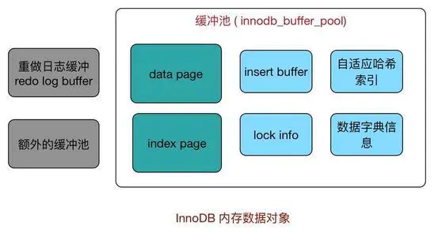
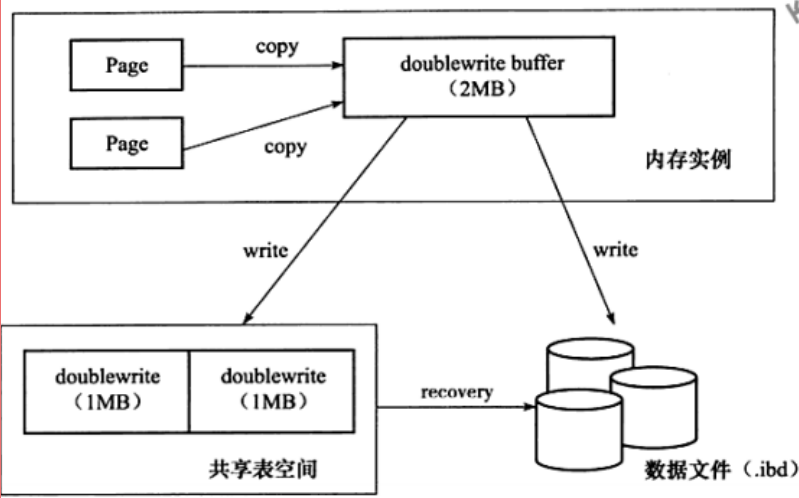
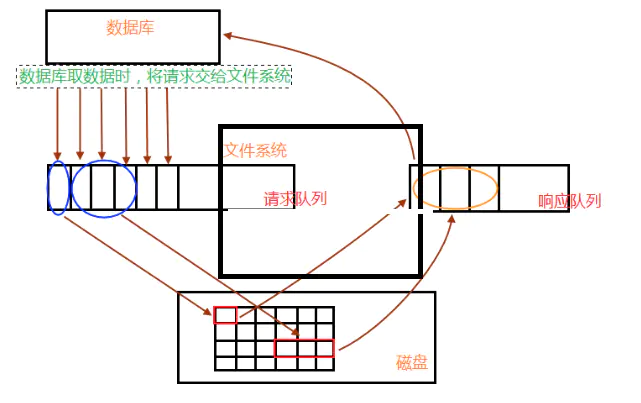

## 缓冲池
应用系统分层架构，为了加速数据访问，会把最常访问的数据放在缓存(cache)里，避免每次都去访问数据库。操作系统会有缓冲池(buffer pool)机制，避免每次访问磁盘，以加速数据的访问。
MySQL作为一个存储系统，同样具有缓冲池机制，以避免每次查询数据都进行磁盘IO。

* 缓冲池简单来说就是一块内存区域，通过内存的速度来弥补磁盘速度较慢对数据库性能的影响。

在数据库当中读取页的操作，首先将从磁盘读到的页存放在缓存池中。下一次再读相同的页时，首先判断该页是不是在缓冲池中。若在，直接读取。否则，读取磁盘上的页。

对于数据库中页的修改操作，则首先修改缓存池中的页，然后再以一定的频率刷新到磁盘上。需要注意的是，缓冲池刷新回磁盘并不是每次页发生更新时触发，而是通过一种称为Checkpoint的机制刷新回磁盘。

* 缓冲池还包括索引页、数据页、undo页、自适应哈希索引（adaptive hash index）、InnoDB存储的锁信息（lock info）等等
* 不能简单地认为，缓冲池只是缓存索引页和数据页，它们只是占缓冲池很大的一部分。
* InnoDB缓冲池中有Insert Buffer信息固然不错，但是Insert Buffer和数据页一样，也是物理页的一个组成部分。

## Innodb四大特性

### 插入缓存（Insert Buffer）:
Insert  Buffer是物理页 的一个组成部分，而不是缓冲池的一个部分。

只对于非聚集索引（非唯一）的插入和更新有效，对于每一次的插入不是写到索引页中，而是先判断插入的非聚集索引页是否在缓冲池中，如果在则直接插入；若不在，则先放到Insert Buffer 中，再按照一定的频率进行合并操作，再写回disk。这样通常能将多个插入合并到一个操作中，目的还是为了减少随机IO带来性能损耗。

使用插入缓冲的条件：
* 非聚集索引
* 非唯一索引

### changeBuffer
Insert Buffer的升级，InnoDB存储引擎可以对DML操作——INSERT、DELETE、UPDATE都进行缓冲，它们分别时是：Insert Buffer、Delete Buffer、Purge Buffer。

Change Buffer使用的对象：非唯一的辅助索引。

InsertBuffer changeBuffer都在一定频率下进行合并，那所谓的频率是什么条件？

1. 辅助索引页被读取到缓冲池中。正常的select先检查Insert Buffer是否有该非聚集索引页存在，若有则合并插入。

2. 辅助索引页没有可用空间。空间小于1/32页的大小，则会强制合并操作。

3. Master Thread 每秒和每10秒的合并操作。

### 二次写double write
Doublewrite缓存是位于系统表空间的存储区域，用来缓存InnoDB的数据页从innodb buffer pool中flush之后并写入到数据文件之前。

对缓冲池的脏页进行刷新时，不是直接写磁盘，而是会通过memcpy()函数将脏页先复制到内存中的doublewrite buffer，之后通过doublewrite 再分两次，每次1M顺序地写入共享表空间的物理磁盘上，在这个过程中，因为doublewrite页是连续的，因此这个过程是顺序写的，开销并不是很大。在完成doublewrite页的写入后，再将doublewrite buffer 中的页写入各个 表空间文件中，此时的写入则是离散的。如果操作系统在将页写入磁盘的过程中发生了崩溃，在恢复过程中，innodb可以从共享表空间中的doublewrite中找到该页的一个副本，将其复制到表空间文件，再应用重做日志。

### 自适应哈希索引
生成hash索引的条件比较苛刻
1. 索引是否被访问了17次
2. 索引中的某个页已经被访问了100次
3. 访问模式必须是一样的。
    * 例如对于（a,b）访问模式情况： where a = xxx where a = xxx and b = xxx

Innodb存储引擎会监控对表上二级索引的查找，如果发现某二级索引被频繁访问，二级索引成为热数据，建立哈希索引可以带来速度的提升

经常访问的二级索引数据会自动被生成到hash索引里面去(最近连续被访问三次的数据)，自适应哈希索引通过缓冲池的B+树构造而来，因此建立的速度很快。

特点
* 无序，没有树高
* 降低对二级索引树的频繁访问资源，索引树高<=4，访问索引：访问树、根节点、叶子节点
* 自适应

缺陷:
* hash自适应索引会占用innodb buffer pool；
* 自适应hash索引只适合搜索等值的查询，如select * from table where index_col='xxx'，而对于其他查找类型，如范围查找，是不能使用的；
* 极端情况下，自适应hash索引才有比较大的意义，可以降低逻辑读。

### 预读
InnoDB在I/O的优化上有个比较重要的特性为预读(Read-Ahead)，它会异步地在缓冲池中提前读取多个预计很快就会用到的数据页。

数据库请求数据时：
1. 将读请求交给文件系统，放入请求队列中
2. 相关进程从请求队列中将读请求取出，根据需求到相关数据区(内存、磁盘)读取数据；
3. 取出的数据，放入响应队列中
4. 进程继续处理请求队列   
    * 判断后面几个数据读请求的数据是否相邻.再根据自身系统IO带宽处理量，进行预读
    * 进行读请求的合并处理，一次性读取多块数据放入响应队列中，
5. 数据库就会从响应队列中将数据取走，完成一次数据读操作过程。

InnoDB使用两种预读算法来提高I/O性能：线性预读（linear read-ahead）和随机预读（randomread-ahead）

把线性预读放到以extent(区，八个连续页面为区，一个页面8kb，一个区64kb)为单位，而随机预读放到以extent中的page为单位。线性预读着眼于将下一个extent提前读取到buffer pool中，而随机预读着眼于将当前extent中的剩余的page提前读取到buffer pool中。

线性预读（linear read-ahead）：

有一个很重要的变量控制是否将下一个extent预读到buffer pool中，通过使用配置参数innodb_read_ahead_threshold（默认为56），可以控制Innodb执行预读操作的时间。如果一个extent中的被顺序读取的page超过或者等于该参数变量时，Innodb将会异步的将下一个extent读取到buffer pool中，值越高，访问模式检查越严格

例如，如果将值设置为48，则InnoDB只有在顺序访问当前extent中的48个pages时才触发线性预读请求，将下一个extent读到内存中。

在没有该变量之前，当访问到extent的最后一个page的时候，Innodb会决定是否将下一个extent放入到buffer pool中。

### 异步IO（Async  IO）
AIO 用户可以连续发送多条IO请求，不需要等待其执行结果，直到所有请求都发送完成了再等待结果。另外可以将多个IO合并成一个IO。
InnoDB提供内核级别的AIO支持，成为Native AIO。启用Native AIO, 恢复速度提升75%。

## MySQL常见存储引擎的区别
**InnoDB** 是 MySQL 默认支持的存储引擎，支持**事务、行级锁定和外键。**

在 5.1 版本之前，MyISAM 是 MySQL 的默认存储引擎，MyISAM 并发性比较差，使用的场景比较少，不支持事务操作，不支持外键操作，默认的锁粒度是表级锁，所以并发性能比较差，加锁比较快，锁冲突比较少，不太容易发生死锁的情况。

MyISAM 和 InnoDB 存储引擎的对比：
* InnoDB支持**事务，外键**
* **锁粒度方面**：由于锁粒度不同，InnoDB支持更高的并发；InnoDB 的锁粒度为行锁、MyISAM 的锁粒度为表锁、行锁需要对每一行进行加锁，所以锁的开销更大，但是能解决脏读和不可重复读的问题，相对来说也更容易发生死锁
* **可恢复性**上：由于 InnoDB 是有事务日志的，可以根据日志文件进行恢复。而 MyISAM 则没有事务日志。
* 查询性能上：MyISAM 要优于 InnoDB，因为 InnoDB 在查询过程中，是需要维护数据缓存，而且查询过程是先定位到行所在的数据块，然后在从数据块中定位到要查找的行；而 MyISAM 可以直接定位到数据所在的内存地址，可以直接找到数据。
* 表结构文件上： MyISAM 的表结构文件包括：.frm(表结构定义),.MYI(索引),.MYD(数据)；而 InnoDB 的表数据文件为:.ibd和.frm(表结构定义)；
* InnoDB为聚簇索引，MyISAM为非聚簇索引。
